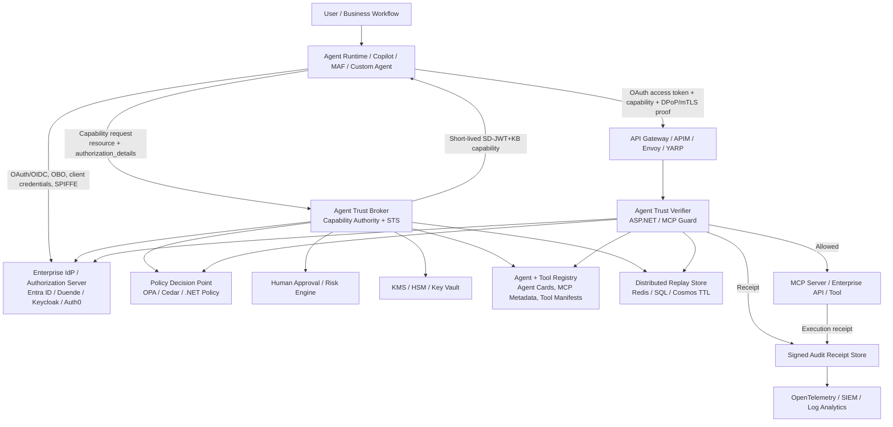
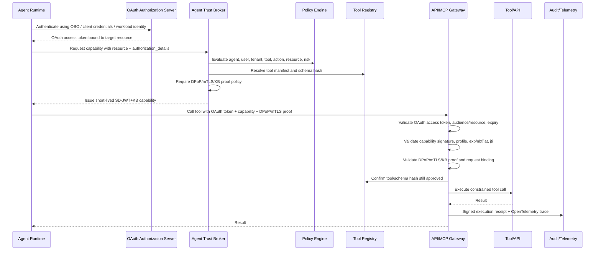
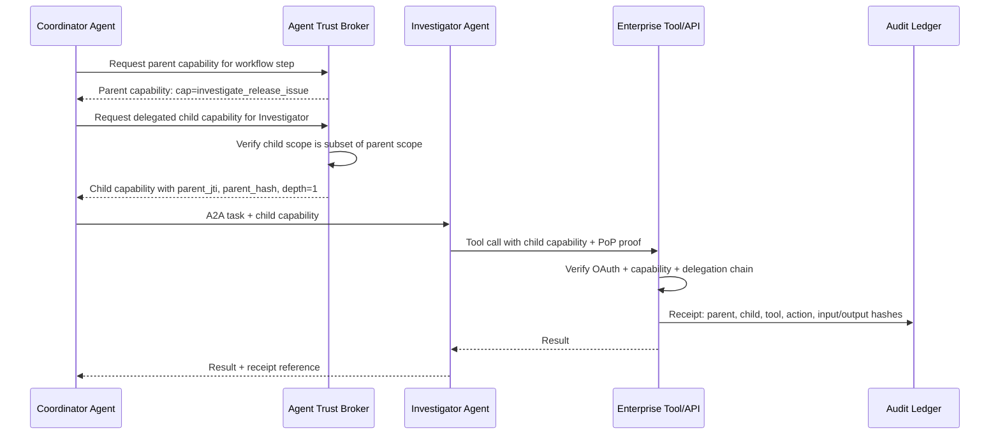
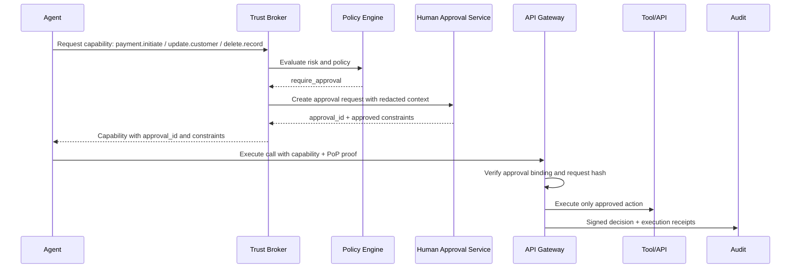
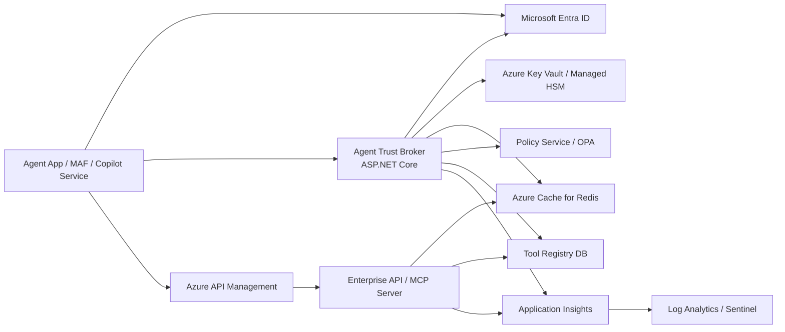

# Agent Trust Enterprise Technical Design Specification

**Repository:** `openwallet-foundation-labs/sd-jwt-dotnet`  
**Target area:** `SdJwt.Net.AgentTrust.*` packages  
**Primary package reviewed:** `src/SdJwt.Net.AgentTrust.Core`  
**Status of this document:** Design proposal for hardening the current preview Agent Trust implementation  
**Audience:** maintainers, security architects, platform engineers, AI agent engineers, identity engineers  
**Date:** 2026-05-10

---

## 1. Executive Summary

The current Agent Trust concept is directionally correct and valuable: it applies SD-JWT selective disclosure and cryptographic verification to AI agent tool governance, scoped delegation, and auditability. The current implementation is suitable as a **preview / proof-of-concept capability-token layer**, but it should not yet be presented as a production-grade enterprise security boundary.

The recommended target design is:

> **Agent Trust should become a standards-aligned execution-time capability proof layer on top of OAuth/OIDC, mTLS/DPoP, MCP authorization, enterprise policy, tool registry attestation, and signed audit receipts.**

This means Agent Trust should **not** replace OAuth, Entra ID, OIDC, mTLS, SPIFFE, API gateways, MCP authorization, or normal API authorization. Instead, it should answer a more specific runtime question:

> **Is this specific agent allowed to perform this specific tool action, against this specific resource, for this workflow step, right now, using this request payload?**

The main architectural change is to move from an inline model where an agent or local runtime can mint a bearer-like capability, to a model where a trusted **Agent Trust Broker / Capability Authority** evaluates policy, binds capability tokens to proof-of-possession and request data, signs using managed key custody, and emits tamper-evident receipts.

---

## 2. Recommended Positioning

### 2.1 Current positioning to keep

Keep the current message:

- Agent Trust is preview.
- Agent Trust is project-defined, not an IETF/OIDF/OWF standard.
- Agent Trust complements OAuth, OIDC, mTLS, SPIFFE/SPIRE, API gateways, and MCP authorization.
- Agent Trust adds per-action, short-lived, auditable capability proof.

### 2.2 Positioning to refine

Avoid wording that makes OAuth look inherently broad or weak. Modern OAuth has Resource Indicators, Rich Authorization Requests, Token Exchange, DPoP, mTLS sender-constrained tokens, Protected Resource Metadata, PAR/JAR, and OAuth Security BCP.

Recommended wording:

> OAuth/OIDC provides the standards-based identity, client authorization, resource binding, token exchange, and protected-resource model. Agent Trust adds per-tool, per-action capability proof, selective disclosure, delegation attenuation, request binding, and signed audit evidence at execution time.

### 2.3 One-line product definition

> **Agent Trust is a .NET-first preview profile for scoped, request-bound, proof-of-possession protected SD-JWT capability tokens used to govern AI agent tool calls, MCP interactions, API execution, and agent-to-agent delegation.**

---

## 3. Design Goals

1. **Least privilege per tool call**  
   Capability tokens should authorize the minimum action required: one tool, one action, one resource scope, one audience, one lifetime, one request shape where possible.

2. **Standards-aligned, not standards-conflicting**  
   Align with SD-JWT RFC 9901, OAuth Security BCP, DPoP, mTLS-bound tokens, OAuth Resource Indicators, OAuth RAR, OAuth Token Exchange, OAuth Protected Resource Metadata, OpenID4VC, and MCP authorization.

3. **Composable with enterprise identity**  
   Integrate with Microsoft Entra ID, workload identity federation, managed identity, OBO, client credentials, SPIFFE/SPIRE, API Management, Envoy/YARP, and enterprise policy engines.

4. **Request-bound authorization**  
   A capability should not merely say `tool=crm` and `action=read`; it should be bound to the actual target API/MCP server, method, route, body hash, MCP tool name, tool schema hash, and arguments hash where applicable.

5. **Proof-of-possession for privileged calls**  
   Bearer capability tokens may be acceptable for local demos, but enterprise cross-boundary calls should require DPoP, mTLS, SD-JWT+KB, or equivalent sender-constrained proof.

6. **Delegation attenuation**  
   Agent-to-agent delegation must never expand authority. Child capabilities must be a subset of the parent capability.

7. **Tamper-evident auditability**  
   Decision and execution receipts should be signed, hash-linked where appropriate, exported to OpenTelemetry/SIEM, and should avoid raw sensitive payloads.

8. **Clear maturity boundaries**  
   Keep examples and docs explicit about demo, pilot, and production-grade controls.

---

## 4. Non-Goals

Agent Trust should not attempt to become:

- A replacement for OAuth/OIDC.
- A replacement for MCP authorization.
- A replacement for mTLS, DPoP, SPIFFE, or workload identity.
- A replacement for API authorization and business authorization.
- A general-purpose wallet protocol.
- A universal AI agent standard.
- A production security boundary without policy, key custody, replay store, sender constraints, tool registry, and audit storage.

---

## 5. Standards and Specifications Baseline

| Area                              | Current standard / spec                                     | Agent Trust design implication                                                                                                                                                 |
| --------------------------------- | ----------------------------------------------------------- | ------------------------------------------------------------------------------------------------------------------------------------------------------------------------------ |
| SD-JWT                            | RFC 9901, Selective Disclosure for JWTs                     | Use SD-JWT for selective disclosure. Use cleartext claims for security-critical authorization data. Use SD-JWT+KB when the verifier requires holder/key binding.               |
| SD-JWT VC                         | IETF OAuth WG draft                                         | Use SD-JWT VC for credentials about agents, tools, organizations, roles, environments, and compliance posture. Do not force every runtime capability token to be an SD-JWT VC. |
| W3C VC 2.0                        | W3C Recommendation                                          | Useful for long-lived credentials and trust metadata. Runtime tool-call capabilities can remain a separate SD-JWT capability profile.                                          |
| OID4VCI                           | OpenID Final Specification, 2025                            | Use for issuance of agent identity credentials, tool attestations, organization credentials, or environment assurance credentials.                                             |
| OID4VP                            | OpenID Final Specification, 2025                            | Use when an agent/wallet presents credentials to a verifier. Useful for credential presentation, not a replacement for runtime API authorization.                              |
| HAIP                              | OpenID4VC High Assurance Interoperability Profile 1.0 Final | Use as guidance for high-assurance credential flows and algorithm/privacy posture.                                                                                             |
| OAuth Security BCP                | RFC 9700                                                    | Use as the baseline OAuth security posture.                                                                                                                                    |
| OAuth Resource Indicators         | RFC 8707                                                    | Bind OAuth access tokens to the intended protected resource using the `resource` parameter.                                                                                    |
| OAuth Protected Resource Metadata | RFC 9728                                                    | Publish protected-resource metadata for APIs/MCP servers, including resource identifier, authorization servers, JWKS, scopes, and supported methods.                           |
| DPoP                              | RFC 9449                                                    | Use for application-level sender-constrained proof. Validate DPoP `htm`, `htu`, `jti`, `iat`, `ath`, signature, and JWK thumbprint binding.                                    |
| OAuth mTLS                        | RFC 8705                                                    | Use for service-to-service and high-trust API calls. Validate `cnf.x5t#S256` against the client certificate used on the TLS connection.                                        |
| OAuth RAR                         | RFC 9396                                                    | Model fine-grained capability requests using `authorization_details`.                                                                                                          |
| OAuth Token Exchange              | RFC 8693                                                    | Use for delegation and downscoping across agents, services, and trust domains.                                                                                                 |
| OAuth Transaction Tokens          | IETF draft, March 2026                                      | Track as future alignment for propagating user/workload/authorization context across service call chains. Do not claim final-standard status yet.                              |
| MCP Authorization                 | MCP 2025-11-25 spec                                         | Treat MCP HTTP servers as OAuth protected resource servers. Validate access tokens, resource/audience, expiry, and do not accept tokens for other resources.                   |
| OWASP MCP Security                | Security guidance                                           | Design controls for tool poisoning, rug pulls, confused deputy, over-scoped tokens, schema integrity, message replay, sandboxing, HITL, and monitoring.                        |
| OWASP LLM Top 10                  | Security guidance                                           | Design controls for prompt injection, excessive agency, sensitive information disclosure, insecure tool use, and supply-chain risks.                                           |

---

## 6. Current Implementation Review

### 6.1 Current package responsibilities

`SdJwt.Net.AgentTrust.Core` currently provides:

- `CapabilityTokenIssuer` for minting SD-JWT capability tokens.
- `CapabilityTokenVerifier` for validating signature, audience, expiry, and replay constraints.
- `CapabilityClaim`, `CapabilityLimits`, and `CapabilityContext` models.
- `SenderConstraint` model for `cnf` claim material.
- `INonceStore` and in-memory replay prevention.
- `IKeyCustodyProvider` abstraction.
- `IJwksKeyResolver` abstraction.
- `AuditReceipt` and receipt writer abstractions.

This is a good preview foundation.

### 6.2 Important current observations

#### Observation 1 — Capability token minting uses direct signing key input

Current `CapabilityTokenIssuer` constructor accepts:

```csharp
SecurityKey signingKey,
string signingAlgorithm,
INonceStore nonceStore
```

This is convenient for samples, but in production it encourages local signing inside the agent/runtime process.

**Design concern:** A compromised agent runtime that can access signing material can mint its own authority.

**Recommendation:** Keep this constructor only for tests/samples, and add a production-grade `ICapabilityAuthority` / `ICapabilityMintingService` backed by `IKeyCustodyProvider` or KMS/HSM.

#### Observation 2 — `cnf` is emitted but not enforced by the core verifier

`SenderConstraint` supports DPoP-style `jkt` and mTLS-style `x5t#S256`. `CapabilityTokenIssuer` can include `cnf` in the token.

However, the current verifier validates token signature, issuer trust, audience, expiry, replay, and deserializes claims. It does not validate:

- DPoP proof JWT.
- DPoP `htm` / `htu` binding.
- DPoP `jti` replay.
- DPoP `iat` freshness.
- DPoP `ath` access-token hash.
- JWK thumbprint match to `cnf.jkt`.
- mTLS client certificate thumbprint match to `cnf.x5t#S256`.

**Design concern:** A token with `cnf` may still behave like a bearer token unless a higher layer enforces proof-of-possession.

**Recommendation:** Add proof validators and make proof-of-possession mandatory for privileged/cross-boundary calls.

#### Observation 3 — Verification disables built-in issuer/audience/lifetime validation and performs manual checks

The current verifier uses token validation parameters with issuer, audience, lifetime, and expiration checks disabled, then performs manual checks afterward.

This is understandable for SD-JWT handling, but the manual profile validation must become stricter.

Missing or weak checks include:

- `typ` / profile validation.
- `alg` allowlist.
- `kid` requirement and key resolution.
- `nbf` validation.
- `iat` max age / freshness validation.
- max token lifetime enforcement.
- request binding validation.
- proof-of-possession validation.
- tool/action/resource matching against expected endpoint.
- tenant boundary validation.
- policy decision binding.
- delegation-chain validation.

#### Observation 4 — `CapabilityClaim` is too coarse for enterprise enforcement

Current model:

```csharp
public record CapabilityClaim
{
    public string Tool { get; set; } = string.Empty;
    public string Action { get; set; } = string.Empty;
    public string? Resource { get; set; }
    public CapabilityLimits? Limits { get; set; }
    public string? Purpose { get; set; }
}
```

This is a good starter model, but enterprise policy needs additional claims such as:

- tool identifier vs tool display name.
- tool instance ID.
- tool version.
- tool manifest hash.
- MCP server canonical URI.
- action taxonomy.
- resource type and resource owner.
- tenant.
- data classification.
- required approval level.
- allowed fields.
- allowed egress.
- max invocations.
- risk level.

#### Observation 5 — Current replay store is token-ID centric

Current `INonceStore` marks `tokenId` as used until expiry.

This is helpful, but production replay prevention should key on:

```text
issuer | audience | tenant | jti | request_hash | proof_jti
```

DPoP also needs its own replay store for the DPoP proof `jti`.

#### Observation 6 — SD-JWT VC token type may be semantically confusing

Current issuer calls `SdIssuer.Issue(..., tokenType: SdJwtConstants.SdJwtVcTypeName)`.

This may be acceptable if the runtime capability is intentionally an SD-JWT VC. However, for an ephemeral execution capability, a dedicated type is clearer.

**Recommendation:** Define an Agent Trust profile type:

```text
typ: agent-cap+sd-jwt
cty: application/agent-capability+json
```

Use SD-JWT VC separately for durable credentials about agents, tools, organizations, or environments.

---

## 7. Target Enterprise Architecture

### 7.1 Conceptual architecture



### 7.2 Layered model

| Layer                     | Responsibility                                         | Example implementation                                                       |
| ------------------------- | ------------------------------------------------------ | ---------------------------------------------------------------------------- |
| Identity layer            | Authenticate user, agent, workload, client, service    | Entra ID, OIDC, OAuth, Managed Identity, SPIFFE, mTLS                        |
| OAuth authorization layer | Issue coarse access token to protected resource        | Entra ID / OAuth AS with Resource Indicators, scopes, OBO/client credentials |
| Policy layer              | Decide whether the exact tool action is allowed        | OPA, Cedar, .NET policy, approval workflow                                   |
| Capability layer          | Mint short-lived SD-JWT capability                     | Agent Trust Broker / Capability Authority                                    |
| Proof layer               | Prove caller possesses sender key                      | DPoP, mTLS, SD-JWT+KB                                                        |
| Request-binding layer     | Bind token to actual operation                         | method, URI, body hash, MCP tool/arguments hash                              |
| Enforcement layer         | Verify and enforce on every inbound call               | APIM, Envoy, ASP.NET Core middleware, MCP guard                              |
| Tool registry layer       | Prevent tool/schema tampering                          | tool manifest, schema hash, MCP server identity, version approval            |
| Audit layer               | Prove decision and execution                           | signed receipts, hash chains, OTel, SIEM                                     |
| Governance layer          | Manage policy, approval, revocation, incident response | policy repo, admin portal, kill switch, dashboards                           |

---

## 8. Runtime Flows

### 8.1 Flow A — Agent calls MCP tool or enterprise API



### 8.2 Flow B — Agent-to-agent delegation



Delegation validation rules:

```text
child.tool_id must equal or be narrower than parent.tool_id
child.action must be allowed by parent.action
child.resource must be equal or narrower than parent.resource
child.constraints must be equal or stricter
child.exp must be <= parent.exp
child.aud must be in parent.allowed_downstream_audiences
child.depth must be <= parent.max_depth
child.tenant must equal parent.tenant
child.policy must be compatible with parent.policy
```

### 8.3 Flow C — Sensitive write action with HITL



---

## 9. Proposed Token Profile

### 9.1 Token type

Use a dedicated Agent Trust token type for runtime capabilities:

```json
{
  "alg": "ES256",
  "kid": "cap-issuer-key-2026-05",
  "typ": "agent-cap+sd-jwt"
}
```

Do not use `sd-jwt-vc` token type unless the object is intentionally an SD-JWT VC.

### 9.2 Mandatory always-disclosed claims

Security-critical claims should not be selectively hidden. They must be available to the verifier for authorization and enforcement.

```json
{
  "iss": "https://trust.example.com",
  "sub": "agent://claims-assistant/prod",
  "aud": "https://mcp.crm.example.com",
  "iat": 1778390000,
  "nbf": 1778390000,
  "exp": 1778390060,
  "jti": "cap_01HX...",
  "cnf": {
    "jkt": "sha256-jwk-thumbprint"
  },
  "act": {
    "sub": "user://12345",
    "tenant": "tenant-a"
  },
  "cap": {
    "type": "agent_tool_call",
    "tool_id": "crm.member.lookup",
    "tool_instance_id": "crm-prod-au",
    "tool_version": "2026.05.1",
    "tool_manifest_hash": "sha256-...",
    "action": "read",
    "resource": "member/12345",
    "purpose": "claims_support",
    "risk": "medium",
    "constraints": {
      "fields": ["name", "policyStatus", "claimStatus"],
      "max_results": 10,
      "max_invocations": 1,
      "max_payload_bytes": 32768,
      "data_classification": "confidential"
    }
  },
  "req": {
    "method": "POST",
    "uri": "https://mcp.crm.example.com/mcp",
    "jsonrpc_method": "tools/call",
    "arguments_hash": "sha256-...",
    "body_hash": "sha256-...",
    "idempotency_key": "idem-123"
  },
  "policy": {
    "decision_id": "dec_123",
    "policy_id": "agent-tool-access",
    "policy_version": "2026.05.10",
    "obligations_hash": "sha256-...",
    "approval_id": "approval_456"
  },
  "delegation": {
    "parent_jti": "cap_parent_123",
    "parent_hash": "sha256-...",
    "depth": 1,
    "max_depth": 2,
    "delegated_by": "agent://coordinator",
    "delegated_to": "agent://investigator"
  },
  "ctx": {
    "traceparent": "00-...",
    "correlation_id": "corr_123",
    "workflow_id": "wf_123",
    "step_id": "investigate-release-failure"
  }
}
```

### 9.3 Selectively disclosable claims

Good candidates for selective disclosure:

- business justification text.
- optional workflow metadata.
- user attributes not needed by the tool.
- organization context not needed for authorization.
- policy explanation details.
- non-security-critical metadata.

Bad candidates for selective disclosure:

- `iss`.
- `sub`.
- `aud`.
- `exp` / `nbf` / `iat`.
- `jti`.
- `cnf`.
- `cap.tool_id`.
- `cap.action`.
- `cap.resource`.
- `cap.constraints` required for enforcement.
- `req.body_hash` / `arguments_hash`.
- `policy.decision_id`.
- delegation attenuation constraints.

### 9.4 Token lifetime policy

| Scenario                           |     Max lifetime | Replay policy                          | Proof policy                       |
| ---------------------------------- | ---------------: | -------------------------------------- | ---------------------------------- |
| Local demo                         |        5 minutes | in-memory acceptable                   | bearer acceptable                  |
| Internal read-only pilot           |       60 seconds | distributed replay store               | DPoP recommended                   |
| Cross-boundary tool call           |    30–60 seconds | distributed replay + DPoP proof replay | DPoP or mTLS required              |
| Sensitive write / delete / payment |       30 seconds | single-use token + idempotency key     | DPoP/mTLS + request binding + HITL |
| A2A delegation                     | <= parent expiry | per-hop replay                         | PoP + child scope attenuation      |

---

## 10. Proposed Core API Changes

### 10.1 Replace direct issuer usage with capability authority

Current sample-friendly class can remain:

```csharp
public class CapabilityTokenIssuer
{
    public CapabilityTokenResult Mint(CapabilityTokenOptions options);
}
```

Add production-facing service:

```csharp
public interface ICapabilityAuthority
{
    Task<CapabilityMintResult> MintAsync(
        CapabilityMintRequest request,
        CancellationToken cancellationToken = default);
}
```

Suggested request model:

```csharp
public sealed record CapabilityMintRequest
{
    public required string SubjectAgent { get; init; }
    public required string Audience { get; init; }
    public required CapabilityRequest Capability { get; init; }
    public required RequestBinding Request { get; init; }
    public required WorkloadIdentityContext Workload { get; init; }
    public UserDelegationContext? User { get; init; }
    public DelegationContext? Delegation { get; init; }
    public SenderConstraintRequirement? SenderConstraint { get; init; }
    public IReadOnlyDictionary<string, object> AdditionalContext { get; init; } =
        new Dictionary<string, object>();
}
```

Suggested output:

```csharp
public sealed record CapabilityMintResult
{
    public required string Token { get; init; }
    public required string TokenId { get; init; }
    public required DateTimeOffset ExpiresAt { get; init; }
    public required string DecisionId { get; init; }
    public required SignedAuditReceipt DecisionReceipt { get; init; }
}
```

### 10.2 Add verification context

Current verification options are too small:

```csharp
public record CapabilityVerificationOptions
{
    public string ExpectedAudience { get; set; }
    public IReadOnlyDictionary<string, SecurityKey> TrustedIssuers { get; set; }
    public bool EnforceReplayPrevention { get; set; }
    public TimeSpan ClockSkewTolerance { get; set; }
}
```

Add:

```csharp
public sealed record AgentTrustVerificationContext
{
    public required string ExpectedAudience { get; init; }
    public required string HttpMethod { get; init; }
    public required Uri RequestUri { get; init; }
    public string? RequestBodyHash { get; init; }
    public string? ExpectedToolId { get; init; }
    public string? ExpectedAction { get; init; }
    public string? ExpectedResource { get; init; }
    public string? TenantId { get; init; }
    public DpopProof? DpopProof { get; init; }
    public X509Certificate2? ClientCertificate { get; init; }
    public string? TraceParent { get; init; }
    public bool RequireSenderConstraint { get; init; }
    public bool RequireRequestBinding { get; init; }
    public bool RequirePolicyDecisionBinding { get; init; }
    public bool RequireToolManifestBinding { get; init; }
}
```

Updated verifier:

```csharp
public interface ICapabilityTokenVerifier
{
    Task<CapabilityVerificationResult> VerifyAsync(
        string presentation,
        AgentTrustVerificationContext context,
        CancellationToken cancellationToken = default);
}
```

### 10.3 Add proof-of-possession validators

```csharp
public interface IDpopProofValidator
{
    Task<ProofValidationResult> ValidateAsync(
        string dpopProofJwt,
        string presentedCapabilityToken,
        AgentTrustVerificationContext context,
        CancellationToken cancellationToken = default);
}

public interface IMtlsSenderConstraintValidator
{
    Task<ProofValidationResult> ValidateAsync(
        X509Certificate2 clientCertificate,
        CapabilityTokenEnvelope token,
        CancellationToken cancellationToken = default);
}

public interface ISdJwtKeyBindingValidator
{
    Task<ProofValidationResult> ValidateAsync(
        string sdJwtPlusKb,
        AgentTrustVerificationContext context,
        CancellationToken cancellationToken = default);
}
```

DPoP validation must check:

```text
proof signature is valid
proof typ is dpop+jwt
proof alg is allowed and not none
jwk is present in header
htm equals actual HTTP method
htu equals actual HTTP URI after canonicalization
iat is recent within allowed skew
jti has not been used before
ath matches hash of presented token where applicable
JWK thumbprint matches capability cnf.jkt
```

mTLS validation must check:

```text
TLS client certificate is present
certificate chain policy passes according to deployment policy
SHA-256 certificate thumbprint equals cnf.x5t#S256
certificate is not expired/revoked according to deployment policy
```

### 10.4 Add request-binding model

```csharp
public sealed record RequestBinding
{
    public required string Method { get; init; }
    public required Uri Uri { get; init; }
    public string? BodyHash { get; init; }
    public string? ArgumentsHash { get; init; }
    public string? JsonRpcMethod { get; init; }
    public string? IdempotencyKey { get; init; }
    public string? ContentType { get; init; }
}
```

Request-binding rules:

- Unsafe methods (`POST`, `PUT`, `PATCH`, `DELETE`) should require a body hash or arguments hash unless explicitly exempted.
- MCP `tools/call` should require `tool_id`, `tool_schema_hash`, and `arguments_hash`.
- Sensitive actions should require idempotency key.
- Request hash should be calculated over canonicalized payload.

### 10.5 Add tool registry abstraction

```csharp
public interface IToolRegistry
{
    Task<ToolRegistration?> ResolveAsync(
        string toolId,
        string? version,
        CancellationToken cancellationToken = default);
}

public sealed record ToolRegistration
{
    public required string ToolId { get; init; }
    public required string Version { get; init; }
    public required string ManifestHash { get; init; }
    public required string SchemaHash { get; init; }
    public required Uri CanonicalResourceUri { get; init; }
    public required string Publisher { get; init; }
    public required string RiskTier { get; init; }
    public IReadOnlySet<string> AllowedActions { get; init; } = new HashSet<string>();
    public IReadOnlySet<string> RequiredScopes { get; init; } = new HashSet<string>();
    public bool RequiresHumanApproval { get; init; }
}
```

### 10.6 Add signed receipt support

Current `AuditReceipt` is a useful model. Extend it with signing and chaining.

```csharp
public interface IReceiptSigner
{
    Task<SignedAuditReceipt> SignAsync(
        AuditReceipt receipt,
        CancellationToken cancellationToken = default);
}

public sealed record SignedAuditReceipt
{
    public required string ReceiptId { get; init; }
    public required AuditReceipt Payload { get; init; }
    public required string PayloadHash { get; init; }
    public string? PreviousReceiptHash { get; init; }
    public required string Signature { get; init; }
    public required string SigningKeyId { get; init; }
}
```

Add two receipt types:

```text
DecisionReceipt
- emitted by Trust Broker after policy decision
- includes policy ID/version, constraints, approval ID, token hash

ExecutionReceipt
- emitted by API/MCP guard after execution
- includes request hash, response hash, result classification, latency, decision, tool/action
```

---

## 11. Policy Model

### 11.1 Policy input

```json
{
  "agent": {
    "id": "agent://claims-assistant/prod",
    "assurance_level": "managed",
    "environment": "prod"
  },
  "user": {
    "subject": "user://12345",
    "tenant": "tenant-a",
    "roles": ["claims_officer"]
  },
  "tool": {
    "id": "crm.member.lookup",
    "version": "2026.05.1",
    "manifest_hash": "sha256-...",
    "risk": "medium"
  },
  "request": {
    "action": "read",
    "resource": "member/12345",
    "method": "POST",
    "body_hash": "sha256-..."
  },
  "context": {
    "workflow_id": "wf_123",
    "step_id": "investigate_claim_status",
    "purpose": "claims_support",
    "traceparent": "00-..."
  }
}
```

### 11.2 Policy output

```json
{
  "decision": "allow",
  "decision_id": "dec_123",
  "policy_id": "agent-tool-access",
  "policy_version": "2026.05.10",
  "max_lifetime_seconds": 60,
  "required_proof": "dpop",
  "constraints": {
    "max_results": 10,
    "fields": ["name", "policyStatus", "claimStatus"],
    "max_payload_bytes": 32768
  },
  "obligations": {
    "write_receipt": true,
    "redact_output": true,
    "require_output_hash": true
  }
}
```

### 11.3 Policy outcomes

| Outcome            | Meaning                                                       |
| ------------------ | ------------------------------------------------------------- |
| `allow`            | Mint capability with constraints.                             |
| `deny`             | Do not mint token. Emit deny receipt.                         |
| `require_approval` | Create approval challenge. Mint only after external approval. |
| `step_up`          | Require stronger identity/authentication/proof.               |
| `quarantine`       | Block agent/tool pending investigation.                       |

---

## 12. MCP-Specific Design

### 12.1 MCP server as OAuth protected resource

For HTTP-based MCP, treat the MCP server as an OAuth protected resource server. It should expose or align with:

```text
/.well-known/oauth-protected-resource
```

The protected resource metadata should declare:

- resource identifier.
- authorization server(s).
- supported scopes.
- JWKS URI where applicable.
- supported bearer methods.
- capability profile metadata extension, if introduced.

### 12.2 MCP call binding

For MCP `tools/call`, Agent Trust should bind capability to:

```json
{
  "mcp": {
    "server_id": "mcp://crm-prod",
    "server_resource": "https://mcp.crm.example.com",
    "jsonrpc_method": "tools/call",
    "tool_name": "member.lookup",
    "tool_id": "crm.member.lookup",
    "tool_version": "2026.05.1",
    "tool_schema_hash": "sha256-...",
    "arguments_hash": "sha256-..."
  }
}
```

### 12.3 MCP tool registry controls

Required controls:

- approved MCP server allowlist.
- tool manifest signing or hash pinning.
- schema hash pinning.
- separate risk tier for each tool.
- human approval requirement for destructive/sensitive tools.
- no automatic trust of tool descriptions returned at runtime.
- output validation before tool responses enter the LLM context.
- per-server isolation to avoid tool shadowing and cross-origin escalation.

### 12.4 MCP interceptor behavior

Client-side interceptor:

```text
1. Resolve target MCP server and tool registration.
2. Hash arguments and schema.
3. Request capability from Trust Broker.
4. Attach OAuth access token and capability proof.
5. Attach DPoP proof if required.
6. Emit outbound telemetry.
```

Server-side guard:

```text
1. Validate OAuth access token and resource/audience.
2. Validate capability SD-JWT and proof-of-possession.
3. Validate MCP tool ID, schema hash, arguments hash.
4. Re-check registry and local policy.
5. Enforce constraints before execution.
6. Validate/sanitize output before returning to agent.
7. Emit signed execution receipt.
```

---

## 13. ASP.NET Core / API Gateway Design

### 13.1 Header strategy

Do not overload `Authorization` for both OAuth access token and capability token.

Recommended headers:

```http
Authorization: Bearer <oauth_access_token>
DPoP: <dpop_proof_jwt>
X-Agent-Capability: <sd_jwt_capability_or_sd_jwt_kb>
X-Correlation-ID: <correlation-id>
traceparent: <w3c-traceparent>
```

For mTLS:

```text
TLS client certificate is provided by the connection or by trusted gateway forwarding headers.
Forwarded certificate headers must only be accepted from trusted gateways.
```

### 13.2 ASP.NET Core middleware order

```text
UseForwardedHeaders / mTLS certificate extraction
UseAuthentication                 // OAuth/OIDC access token
UseAuthorization                  // coarse API policy
UseAgentTrustVerification          // capability + PoP + request binding
UseEndpoint / Minimal API / MVC
UseAgentTrustReceiptWriter         // execution receipt
```

### 13.3 Attribute-based enforcement

```csharp
[RequireAgentCapability(
    ToolId = "crm.member.lookup",
    Action = "read",
    RequireProof = ProofRequirement.DPoP,
    RequireRequestBinding = true,
    RequirePolicyBinding = true)]
public async Task<IResult> LookupMember(...)
```

### 13.4 APIM / gateway integration

Azure API Management can perform coarse checks:

- validate OAuth JWT issuer/audience/scopes.
- require capability header for agent-enabled endpoints.
- pass DPoP header and client certificate information to backend.
- inject correlation headers.
- block missing headers.

The backend verifier should still perform cryptographic capability validation unless a trusted sidecar/gateway performs full validation and signs/verifiably forwards the result.

---

## 14. Azure / Microsoft Enterprise Architecture

| Concern                    | Azure-aligned implementation                                                                                 |
| -------------------------- | ------------------------------------------------------------------------------------------------------------ |
| User identity              | Microsoft Entra ID, OAuth/OIDC, OBO                                                                          |
| Agent/workload identity    | Managed Identity, workload identity federation, GitHub OIDC, AKS workload identity, SPIFFE where appropriate |
| OAuth authorization server | Entra ID for normal APIs; Duende/Keycloak/Auth0/custom STS where RAR/token exchange/custom claims are needed |
| API gateway                | Azure API Management for centralized policy; Envoy/YARP for sidecar/service mesh patterns                    |
| Capability authority       | ASP.NET Core service using `SdJwt.Net.AgentTrust.*`                                                          |
| Key custody                | Azure Key Vault / Managed HSM signing keys; no raw private key in agent runtime                              |
| Policy                     | OPA, Cedar, .NET policy service, or hybrid policy service                                                    |
| Replay store               | Azure Cache for Redis, SQL unique constraint with TTL cleanup, Cosmos DB TTL                                 |
| Tool registry              | SQL/PostgreSQL/Cosmos + signed manifests + approval workflow                                                 |
| Audit                      | Log Analytics, Application Insights, immutable Blob Storage, Microsoft Sentinel                              |
| Observability              | OpenTelemetry traces, metrics, logs                                                                          |
| MCP                        | Official MCP C# SDK + Agent Trust MCP guard/interceptor                                                      |
| A2A                        | A2A endpoints protected by OAuth + delegated capability chain                                                |

### 14.1 Azure deployment view



---

## 15. Security Requirements

### 15.1 Token validation requirements

Verifier must validate:

```text
signature
issuer allowlist
kid and JWKS resolution
algorithm allowlist
typ/profile
audience/resource
exp
nbf
iat freshness
max token lifetime
jti replay
cnf presence when required
DPoP or mTLS proof when required
request binding
body/arguments hash
tool ID/action/resource
tool manifest/schema hash
tenant boundary
policy decision binding
delegation chain and attenuation
required disclosures
```

### 15.2 Algorithm policy

Production should prefer asymmetric algorithms:

```text
Recommended: ES256, PS256, EdDSA where supported by platform/profile
Avoid for production cross-service trust: HS256 shared secrets
Reject: none, weak RSA key sizes, unexpected algorithms
```

### 15.3 Key custody requirements

- Signing keys must be held by trusted capability authority, not agent runtime.
- Production signing should use Key Vault, Managed HSM, HSM, or equivalent.
- Key IDs must be present and resolvable.
- JWKS should support rotation and cache control.
- Verifier must fail closed for unknown issuer/kid unless explicitly configured otherwise.

### 15.4 Replay prevention requirements

Use distributed atomic store:

```text
Redis SET NX EX
SQL unique key on replay key + expiry cleanup
Cosmos DB unique key + TTL
```

Replay key:

```text
issuer | audience | tenant | jti | request_hash
```

DPoP proof replay key:

```text
proof_jti | proof_jwk_thumbprint | htm | htu
```

### 15.5 Request hash canonicalization

Define canonicalization rules before hashing:

- JSON canonicalization for JSON bodies.
- stable property ordering.
- normalized Unicode.
- normalized URI path and query rules.
- exclusion/inclusion rules for headers.
- binary payload hash rules.

Without canonicalization, request binding will be brittle.

---

## 16. Threat Model and Control Mapping

| Threat                                           | Control                                                                                                       |
| ------------------------------------------------ | ------------------------------------------------------------------------------------------------------------- |
| Prompt injection triggers unauthorized tool call | Policy before minting, tool registry, HITL for sensitive actions, server-side enforcement                     |
| Stolen capability token                          | Short TTL, DPoP/mTLS/KB proof, request binding, replay store                                                  |
| Confused deputy                                  | OAuth resource indicators, audience binding, per-tool capability, user/workload context, no token passthrough |
| Tool poisoning                                   | registry, manifest/schema hash, output validation, trusted MCP server allowlist                               |
| Rug-pull tool update                             | schema/manifest pinning and re-approval on change                                                             |
| Over-scoped OAuth token                          | OAuth least privilege + Agent Trust per-action guard                                                          |
| Agent self-mints authority                       | broker-based minting, KMS/HSM, no signing key in agent runtime                                                |
| Multi-agent privilege escalation                 | delegation attenuation and parent-child validation                                                            |
| Replay within token lifetime                     | token `jti` replay store + DPoP proof replay store                                                            |
| Cross-tenant access                              | tenant claim binding and tenant policy enforcement                                                            |
| Weak auditability                                | signed decision/execution receipts, trace correlation, immutable storage                                      |
| Sensitive data leakage in logs                   | hash payloads, redact receipts, avoid raw prompts/results                                                     |
| Gateway bypass                                   | backend verifier or signed gateway validation result                                                          |
| Algorithm confusion                              | strict algorithm allowlist, kid validation, key use validation                                                |
| Time-based attacks                               | nbf/iat/exp/max-lifetime/skew validation                                                                      |

---

## 17. Package-Level Change Proposal

### 17.1 `SdJwt.Net.AgentTrust.Core`

Add:

- `ICapabilityAuthority`
- `CapabilityMintRequest`
- `AgentTrustVerificationContext`
- `RequestBinding`
- `PolicyDecisionBinding`
- `DelegationBinding`
- `IToolRegistry`
- `IDpopProofValidator`
- `IMtlsSenderConstraintValidator`
- `ISdJwtKeyBindingValidator`
- `IReceiptSigner`
- `IReplayStore` replacing or extending `INonceStore`
- strict profile validator
- dedicated token type constants

Keep:

- `CapabilityTokenIssuer` for low-level minting and tests.
- `CapabilityTokenVerifier` as low-level verifier, but add strict options and context-based overload.
- Existing models with backward-compatible extension.

Deprecate or mark sample-only:

- symmetric-key quick-start as production pattern.
- bearer-only production examples.
- direct agent-side minting language.

### 17.2 `SdJwt.Net.AgentTrust.Policy`

Add:

- policy decision result with constraints and obligations.
- policy version and decision ID.
- delegation attenuation evaluator.
- action taxonomy.
- risk tier rules.
- approval requirement support.

### 17.3 `SdJwt.Net.AgentTrust.AspNetCore`

Add:

- middleware that accepts OAuth + capability + DPoP/mTLS.
- body hash computation and buffering strategy.
- endpoint metadata / attributes.
- failure-to-HTTP mapping.
- structured problem details.
- receipt emission hooks.

### 17.4 `SdJwt.Net.AgentTrust.Mcp`

Add:

- MCP tool call canonicalization.
- tool schema hash extraction.
- arguments hash binding.
- server guard validation.
- client interceptor capability request.
- output validation hooks.

### 17.5 `SdJwt.Net.AgentTrust.A2A`

Add:

- parent-child token hash binding.
- max depth enforcement.
- downstream audience allowlist.
- capability subset evaluator.
- per-hop receipt model.

### 17.6 `SdJwt.Net.AgentTrust.OpenTelemetry`

Add semantic attributes:

```text
agent_trust.decision
agent_trust.reason_code
agent_trust.token_id_hash
agent_trust.issuer
agent_trust.audience
agent_trust.agent_id
agent_trust.tool_id
agent_trust.action
agent_trust.policy_id
agent_trust.policy_version
agent_trust.delegation_depth
agent_trust.proof_type
agent_trust.request_hash_present
agent_trust.replay_result
```

Avoid recording raw token values, raw prompts, raw request bodies, or raw outputs.

---

## 18. Verification Failure Model

Use consistent error codes:

| Error code                 | HTTP | Meaning                              |
| -------------------------- | ---: | ------------------------------------ |
| `missing_capability`       |  401 | Capability token missing             |
| `invalid_token`            |  401 | Malformed token                      |
| `untrusted_issuer`         |  401 | Issuer not trusted                   |
| `invalid_signature`        |  401 | Signature invalid                    |
| `invalid_profile`          |  401 | Wrong `typ` or profile               |
| `invalid_audience`         |  401 | Audience/resource mismatch           |
| `token_expired`            |  401 | Expired token                        |
| `token_not_yet_valid`      |  401 | `nbf` in future                      |
| `token_too_old`            |  401 | `iat` outside freshness window       |
| `replay_detected`          |  401 | Token or proof replay                |
| `missing_sender_proof`     |  401 | Required DPoP/mTLS/KB missing        |
| `invalid_sender_proof`     |  401 | Sender proof invalid                 |
| `request_binding_mismatch` |  403 | Method/URI/body/tool args mismatch   |
| `tool_manifest_mismatch`   |  403 | Tool schema/manifest changed         |
| `capability_denied`        |  403 | Tool/action/resource not allowed     |
| `delegation_expanded`      |  403 | Child token exceeds parent authority |
| `approval_required`        |  403 | HITL required before execution       |
| `policy_denied`            |  403 | PDP denied request                   |
| `tenant_mismatch`          |  403 | Tenant isolation violation           |

---

## 19. Testing and Conformance Plan

### 19.1 Unit tests

Add tests for:

```text
reject missing iss/aud/jti/exp/nbf/iat/cap/ctx
reject wrong typ
reject unknown alg
reject unknown kid
reject expired token
reject token before nbf
reject stale iat
reject token lifetime over maximum
reject wrong audience
reject wrong issuer
reject replayed jti
reject missing cnf when proof required
reject cnf.jkt without matching DPoP proof
reject DPoP htm mismatch
reject DPoP htu mismatch
reject replayed DPoP jti
reject stale DPoP iat
reject invalid DPoP signature
reject mTLS cert thumbprint mismatch
reject request body hash mismatch
reject MCP arguments hash mismatch
reject tool schema hash mismatch
reject child delegation with expanded action/resource/audience/lifetime
```

### 19.2 Integration tests

Add end-to-end tests for:

- ASP.NET Core API with OAuth token + capability token + DPoP proof.
- MCP client interceptor + server guard.
- distributed replay store using Redis test container.
- signed receipts persisted to test sink.
- policy deny and approval-required flows.
- A2A delegation chain with parent-child validation.

### 19.3 Negative security tests

Add adversarial tests for:

- prompt injection attempting unauthorized tool call.
- captured token replay.
- token audience confusion.
- DPoP proof for one URI reused on another URI.
- tool schema rug-pull.
- child agent escalation.
- cross-tenant resource access.
- gateway bypass.

### 19.4 Documentation tests

- All quick starts must compile.
- Demo samples must state which controls are demo-only.
- Production examples must not use symmetric keys as the default.
- Production examples must show DPoP/mTLS and distributed replay store.

---

## 20. Migration Plan

### Phase 0 — Documentation boundary fix

- Update docs to say Agent Trust is an execution-time capability overlay.
- Clarify demo vs pilot vs production controls.
- Avoid presenting inline minting as production architecture.
- Add standards alignment table.

### Phase 1 — Core hardening

- Add dedicated `agent-cap+sd-jwt` token type.
- Add `nbf`, `iat` freshness, max lifetime validation.
- Add algorithm/kid/profile validation.
- Add request-binding model.
- Add proof validator interfaces.
- Add distributed replay store abstraction.

### Phase 2 — Broker model

- Add `ICapabilityAuthority`.
- Integrate key custody provider.
- Add policy decision binding.
- Emit signed decision receipts.
- Provide sample broker service.

### Phase 3 — DPoP/mTLS production path

- Implement DPoP proof validation.
- Implement mTLS certificate-bound capability validation.
- Add ASP.NET Core middleware examples.
- Add APIM/YARP guidance.

### Phase 4 — MCP hardening

- Add tool registry.
- Add tool manifest/schema hash binding.
- Add MCP arguments hash canonicalization.
- Add MCP server guard and client interceptor production examples.

### Phase 5 — A2A delegation hardening

- Add delegation chain model.
- Add parent-child attenuation validation.
- Add per-hop signed receipts.
- Add A2A demo with non-expansion tests.

### Phase 6 — Governance and audit

- Add signed receipt ledger.
- Add OTel semantic conventions.
- Add SIEM dashboard examples.
- Add revocation / kill switch guidance.
- Add red-team test suite.

---

## 21. Proposed Repository Documentation Updates

### 21.1 Update `docs/concepts/agent-trust-profile.md`

Add:

- standards-aligned architecture section.
- dedicated token profile section.
- proof-of-possession requirement matrix.
- request-binding section.
- tool registry section.
- production readiness checklist.

Revise:

- OAuth comparison to include RAR, Token Exchange, DPoP, mTLS, Resource Indicators.
- `cnf` from optional metadata to enforcement requirement for privileged calls.

### 21.2 Update `docs/concepts/agent-trust-kits.md`

Add:

- Trust Broker / Capability Authority as a first-class package architecture concept.
- Clear split between SDK-only demo mode and broker-mediated production mode.
- Production flow diagrams.

Revise:

- Inline minting language. Keep as demo/local pattern only.
- Header examples to avoid replacing OAuth `Authorization` header.

### 21.3 Add new proposal document

Recommended path:

```text
docs/proposals/agent-trust-enterprise-profile.md
```

This generated spec can be used as that initial proposal.

### 21.4 Add implementation issue list

Create issues:

1. Add `agent-cap+sd-jwt` token profile constants.
2. Add `AgentTrustVerificationContext`.
3. Add `RequestBinding` and request hash validation.
4. Add `IDpopProofValidator`.
5. Add `IMtlsSenderConstraintValidator`.
6. Add `ICapabilityAuthority` broker abstraction.
7. Add policy decision binding claims.
8. Add tool registry abstraction.
9. Add signed receipts.
10. Add delegation attenuation validator.
11. Add distributed replay store provider.
12. Update docs and examples for production posture.

---

## 22. Production Readiness Checklist

Before claiming production readiness, require:

- [ ] Asymmetric signing by default.
- [ ] KMS/HSM-backed key custody sample.
- [ ] Strict issuer/kid/JWKS resolution.
- [ ] Dedicated token profile validation.
- [ ] `exp`, `nbf`, `iat`, max lifetime checks.
- [ ] DPoP validation.
- [ ] mTLS certificate binding validation.
- [ ] SD-JWT+KB validation path where applicable.
- [ ] Request binding for unsafe methods.
- [ ] MCP tool schema/arguments hash binding.
- [ ] Distributed replay store.
- [ ] Tool registry.
- [ ] Policy decision binding.
- [ ] Delegation attenuation validation.
- [ ] Signed receipts.
- [ ] OTel/SIEM examples.
- [ ] Security negative tests.
- [ ] Threat model doc.
- [ ] Clear operational guidance.

---

## 23. Final Architecture Decision

The recommended design is:

```text
OAuth/OIDC/Entra/SPIFFE = Who is calling?
Resource Indicators / MCP metadata = Which protected resource is intended?
RAR / policy = What permission is requested?
Token Exchange = How authority is delegated/downscoped?
SD-JWT+KB capability = What exact action is allowed now?
DPoP/mTLS = Does the caller hold the sender key?
Request binding = Is this the exact approved request?
Tool registry = Is this the approved tool/schema?
Verifier middleware = Enforce every request.
Signed receipts = Prove what happened.
```

This preserves the project differentiator — **SD-JWT capability tokens for AI agent trust** — while grounding the design in current enterprise identity and API security standards.

---

## 24. Reference Sources

### Repository sources reviewed

- `src/SdJwt.Net.AgentTrust.Core/README.md`
- `src/SdJwt.Net.AgentTrust.Core/CapabilityTokenIssuer.cs`
- `src/SdJwt.Net.AgentTrust.Core/CapabilityTokenVerifier.cs`
- `src/SdJwt.Net.AgentTrust.Core/CapabilityClaim.cs`
- `src/SdJwt.Net.AgentTrust.Core/CapabilityLimits.cs`
- `src/SdJwt.Net.AgentTrust.Core/CapabilityContext.cs`
- `src/SdJwt.Net.AgentTrust.Core/CapabilityTokenOptions.cs`
- `src/SdJwt.Net.AgentTrust.Core/SenderConstraint.cs`
- `src/SdJwt.Net.AgentTrust.Core/CapabilityVerificationOptions.cs`
- `src/SdJwt.Net.AgentTrust.Core/INonceStore.cs`
- `src/SdJwt.Net.AgentTrust.Core/IKeyCustodyProvider.cs`
- `src/SdJwt.Net.AgentTrust.Core/IJwksKeyResolver.cs`
- `src/SdJwt.Net.AgentTrust.Core/AuditReceipt.cs`
- `docs/concepts/agent-trust-profile.md`
- `docs/concepts/agent-trust-kits.md`

### External standards and guidance

- RFC 9901 — Selective Disclosure for JSON Web Tokens: https://datatracker.ietf.org/doc/html/rfc9901
- RFC 9700 — Best Current Practice for OAuth 2.0 Security: https://www.rfc-editor.org/rfc/rfc9700.html
- RFC 9449 — OAuth 2.0 Demonstrating Proof of Possession: https://www.rfc-editor.org/rfc/rfc9449.html
- RFC 8705 — OAuth 2.0 Mutual-TLS Client Authentication and Certificate-Bound Access Tokens: https://www.rfc-editor.org/rfc/rfc8705.html
- RFC 8707 — Resource Indicators for OAuth 2.0: https://datatracker.ietf.org/doc/html/rfc8707
- RFC 9396 — OAuth 2.0 Rich Authorization Requests: https://www.rfc-editor.org/rfc/rfc9396
- RFC 8693 — OAuth 2.0 Token Exchange: https://www.rfc-editor.org/rfc/rfc8693
- RFC 9728 — OAuth 2.0 Protected Resource Metadata: https://www.rfc-editor.org/rfc/rfc9728
- OpenID for Verifiable Credential Issuance 1.0: https://openid.net/specs/openid-4-verifiable-credential-issuance-1_0-final.html
- OpenID for Verifiable Presentations 1.0: https://openid.net/specs/openid-4-verifiable-presentations-1_0.html
- OpenID4VC High Assurance Interoperability Profile 1.0: https://openid.net/specs/openid4vc-high-assurance-interoperability-profile-1_0-final.html
- MCP Authorization Specification 2025-11-25: https://modelcontextprotocol.io/specification/2025-11-25/basic/authorization
- OWASP MCP Security Cheat Sheet: https://cheatsheetseries.owasp.org/cheatsheets/MCP_Security_Cheat_Sheet.html
- OAuth Transaction Tokens draft: https://www.ietf.org/archive/id/draft-ietf-oauth-transaction-tokens-08.html

---

## Appendix A — Suggested Minimal Code Change Sequence

A practical implementation sequence that avoids overhauling everything at once:

1. Add new models without breaking current API:

   - `RequestBinding`
   - `AgentTrustVerificationContext`
   - `PolicyDecisionBinding`
   - `ToolBinding`
   - `DelegationBinding`

2. Add strict verifier overload:

```csharp
Task<CapabilityVerificationResult> VerifyAsync(
    string token,
    AgentTrustVerificationContext context,
    CancellationToken cancellationToken = default);
```

3. Add token profile constants:

```csharp
public static class AgentTrustTokenTypes
{
    public const string CapabilitySdJwt = "agent-cap+sd-jwt";
    public const string CapabilityContentType = "application/agent-capability+json";
}
```

4. Add DPoP interface but initially ship with clear `NotSupported` implementation if needed.

5. Add a `ProductionReadinessMode` option:

```csharp
public enum AgentTrustSecurityMode
{
    Demo,
    Pilot,
    Production
}
```

In production mode, fail closed unless:

```text
asymmetric key
strict profile
proof-of-possession
request binding
distributed replay store
```

6. Update docs to say current quick start is demo mode only.

---

## Appendix B — Recommended Production Defaults

```json
{
  "AgentTrust": {
    "SecurityMode": "Production",
    "AllowedAlgorithms": ["ES256", "PS256"],
    "RequireKid": true,
    "RequireNbf": true,
    "RequireIat": true,
    "MaxTokenLifetimeSeconds": 60,
    "MaxIatAgeSeconds": 120,
    "ClockSkewSeconds": 15,
    "RequireSenderConstraint": true,
    "RequireRequestBindingForUnsafeMethods": true,
    "RequirePolicyDecisionBinding": true,
    "RequireToolManifestBinding": true,
    "ReplayStore": "Redis",
    "ReceiptSigning": true,
    "EmitOpenTelemetry": true
  }
}
```

---

## Appendix C — Example OpenTelemetry Attributes

```text
agent_trust.result = allow | deny
agent_trust.reason_code = policy_denied | invalid_sender_proof | replay_detected
agent_trust.token_id_hash = sha256(...)
agent_trust.issuer = https://trust.example.com
agent_trust.audience = https://mcp.crm.example.com
agent_trust.agent_id = agent://claims-assistant/prod
agent_trust.tool_id = crm.member.lookup
agent_trust.action = read
agent_trust.policy_id = agent-tool-access
agent_trust.policy_version = 2026.05.10
agent_trust.delegation_depth = 1
agent_trust.proof_type = dpop | mtls | kb | bearer
agent_trust.request_hash_present = true
agent_trust.replay_result = accepted | replayed
```
