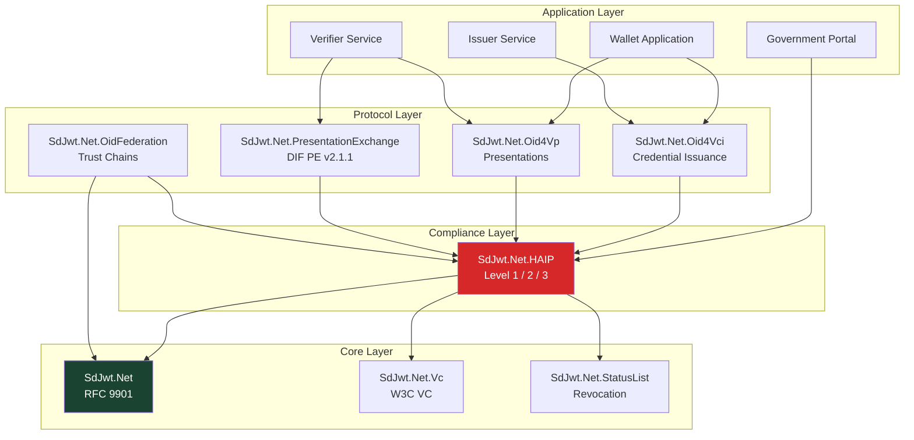

# SD-JWT .NET Ecosystem

[](https://www.nuget.org/packages/SdJwt.Net/)
[](https://github.com/openwallet-foundation-labs/sd-jwt-dotnet/actions)
[](https://opensource.org/licenses/Apache-2.0)

A comprehensive, production-ready .NET ecosystem for **Selective Disclosure JSON Web Tokens (SD-JWTs)** and the complete verifiable credential stack. This project provides enterprise-grade implementations of cutting-edge identity and credential standards with enhanced security, performance optimization, and multi-platform support.

## Quick Start

```bash
# Core SD-JWT functionality
dotnet add package SdJwt.Net

# Verifiable Credentials
dotnet add package SdJwt.Net.Vc

# Try comprehensive samples
git clone https://github.com/openwallet-foundation-labs/sd-jwt-dotnet.git
cd sd-jwt-dotnet/samples/SdJwt.Net.Samples
dotnet run
```

## Package Ecosystem

### **Core**

| Package | Version | Specification | Status |
|---------|---------|---------------|---------|
| **[SdJwt.Net](src/SdJwt.Net/README.md)** | 1.0.0.0 | [RFC 9901](https://datatracker.ietf.org/doc/rfc9901/) | **Stable** |

**Core SD-JWT functionality with RFC 9901 compliance, JWS JSON Serialization, and enterprise security.**

### **Verifiable Credential Stack**

| Package | Version | Specification | Status |
|---------|---------|---------------|---------|
| **[SdJwt.Net.Vc](src/SdJwt.Net.Vc/README.md)** | 1.0.0 | [draft-ietf-oauth-sd-jwt-vc-13](https://datatracker.ietf.org/doc/draft-ietf-oauth-sd-jwt-vc/) | **Draft-13** |
| **[SdJwt.Net.StatusList](src/SdJwt.Net.StatusList/README.md)** | 1.0.0 | [draft-ietf-oauth-status-list-13](https://datatracker.ietf.org/doc/draft-ietf-oauth-status-list/) | **Draft-13** |

**Complete verifiable credential lifecycle with revocation, suspension, and status management.**

### **OpenID Identity Protocols**

| Package | Version | Specification | Status |
|---------|---------|---------------|---------|
| **[SdJwt.Net.Oid4Vci](src/SdJwt.Net.Oid4Vci/README.md)** | 1.0.0 | [OpenID4VCI 1.0](https://openid.net/specs/openid-4-verifiable-credential-issuance-1_0.html) | **Stable** |
| **[SdJwt.Net.Oid4Vp](src/SdJwt.Net.Oid4Vp/README.md)** | 1.0.0 | [OpenID4VP 1.0](https://openid.net/specs/openid-4-verifiable-presentations-1_0.html) | **Stable** |

**Complete credential issuance and presentation verification protocols.**

### **Advanced Trust & Security**

| Package | Version | Specification | Status |
|---------|---------|---------------|---------|
| **[SdJwt.Net.OidFederation](src/SdJwt.Net.OidFederation/README.md)** | 1.0.0 | [OpenID Federation 1.0](https://openid.net/specs/openid-federation-1_0.html) | **Stable** |
| **[SdJwt.Net.PresentationExchange](src/SdJwt.Net.PresentationExchange/README.md)** | 1.0.0 | [DIF PEX v2.1.1](https://identity.foundation/presentation-exchange/spec/v2.1.1/) | **Stable** |
| **[SdJwt.Net.HAIP](src/SdJwt.Net.HAIP/README.md)** | 1.0.0 | [HAIP 1.0](https://openid.net/specs/openid4vc-high-assurance-interoperability-profile-sd-jwt-vc-1_0.html) | **Draft** |

**Enterprise federation, trust management, intelligent credential selection, and high assurance compliance.**

## Key Features

### Enterprise Security

- **RFC 9901 Compliant**: Full implementation with security hardening
- **HAIP Support**: High Assurance Interoperability Profile for government and enterprise
- **Algorithm Enforcement**: Blocks weak algorithms (MD5, SHA-1), enforces SHA-2 family
- **Attack Prevention**: Protection against timing attacks, replay attacks, signature tampering
- **Zero-Trust Architecture**: Cryptographic verification at every layer

### High Performance

- **Multi-Platform Optimized**: .NET 8, 9, and .NET Standard 2.1
- **Modern Cryptography**: Platform-specific optimizations (SHA256.HashData() on .NET 6+)
- **Scalable Operations**: 1,000+ ops/sec for issuance, 10,000+ ops/sec for status checks
- **Memory Efficient**: Optimized allocation patterns for high-throughput scenarios

### Standards Compliant

- **IETF Standards**: RFC 9901, draft-13 specifications
- **OpenID Foundation**: Complete protocol implementations
- **W3C Alignment**: Verifiable Credentials data model compatibility
- **DIF Integration**: Presentation Exchange v2.1.1 support
- **HAIP Compliance**: High assurance security profiles

### Developer Experience

- **Comprehensive Samples**: 12+ example implementations covering all use cases
- **Fluent APIs**: Intuitive, discoverable interfaces
- **Rich Documentation**: Detailed guides with security considerations
- **Production Ready**: Battle-tested with 200+ comprehensive tests

## Use Cases

### Government & Civic (HAIP Level 3 - Sovereign)

```csharp
// Digital identity for citizens accessing government services
var citizenCredential = await governmentIssuer.IssueDigitalIdAsync(citizen);
var ageProof = citizen.CreateAgeVerificationPresentation(minimumAge: 18);
await servicePortal.VerifyAndGrantAccessAsync(ageProof);
```

### Education & Credentials

```csharp
// University issues degree, student presents to employer
var degree = await university.IssueDegreeCredentialAsync(graduate);
var jobPresentation = graduate.CreateProfessionalPresentation(
    disclosure => disclosure.ClaimName is "degree" or "gpa" or "honors");
await employer.VerifyQualificationsAsync(jobPresentation);
```

### Healthcare & Privacy

```csharp
// Patient shares medical data with specialist
var medicalRecord = await hospital.IssueMedicalCredentialAsync(patient);
var specialistPresentation = patient.CreateSelectiveMedicalPresentation(
    shareConditions: ["allergies", "current_medications"],
    protectInfo: ["full_history", "mental_health"]);
await specialist.ProcessPatientDataAsync(specialistPresentation);
```

### Financial Services (HAIP Level 2 - Very High)

```csharp
// Privacy-preserving loan application with HAIP compliance
var employmentCredential = await employer.IssueEmploymentVerificationAsync(applicant);
var incomePresentation = applicant.CreateIncomeVerificationPresentation(
    disclose: ["employment_status", "salary_range"],
    protect: ["exact_salary", "performance_reviews"]);
await bank.ProcessLoanApplicationAsync(incomePresentation);
```

## Architecture Overview



## Quick Examples

### **Basic SD-JWT**

```csharp
using SdJwt.Net.Issuer;

// Create issuer
var issuer = new SdIssuer(signingKey, SecurityAlgorithms.EcdsaSha256);

// Issue with selective disclosure
var credential = issuer.Issue(claims, new SdIssuanceOptions
{
    DisclosureStructure = new { email = true, address = new { city = true } }
});

// Holder creates presentation
var holder = new SdJwtHolder(credential.Issuance);
var presentation = holder.CreatePresentation(
    disclosure => disclosure.ClaimName == "email");
```

### **HAIP-Compliant Verifiable Credentials**

```csharp
using SdJwt.Net.Vc.Issuer;
using SdJwt.Net.HAIP;

// Government issuer with Level 3 compliance
var haipValidator = new HaipCryptoValidator(HaipLevel.Level3_Sovereign, logger);
var keyValidation = haipValidator.ValidateKeyCompliance(signingKey, "ES512");

if (keyValidation.IsCompliant)
{
    var vcIssuer = new SdJwtVcIssuer(issuerKey, algorithm);
    var credential = vcIssuer.Issue("https://gov.example/national-id", vcPayload, options);
}
```

### **Status Management**

```csharp
using SdJwt.Net.StatusList.Issuer;

// Create status list
var statusManager = new StatusListManager(statusKey, algorithm);
var statusList = await statusManager.CreateStatusListTokenAsync(
    statusListUrl, credentialStatuses);

// Check credential status
var statusVerifier = new StatusListVerifier(httpClient);
var isValid = await statusVerifier.CheckStatusAsync(statusClaim, keyResolver);

// Verify presentation with expected nonce
var result = await verifier.VerifyAsync(presentation, validationParams, kbParams, "expected-nonce");
```

## Security Features

### Cryptographic Security

- **Approved**: SHA-256, SHA-384, SHA-512, ECDSA P-256/384/521
- **Blocked**: MD5, SHA-1 (automatically rejected)
- **Enhanced**: Constant-time operations, secure random generation

### **HAIP Compliance Levels**

- **Level 1 (High)**: ES256+, PS256+, proof of possession
- **Level 2 (Very High)**: ES384+, PS384+, wallet attestation, DPoP
- **Level 3 (Sovereign)**: ES512+, PS512+, HSM backing, qualified signatures

### **Attack Prevention**

- **Signature Tampering**: Cryptographic detection and prevention
- **Replay Attacks**: Nonce and timestamp validation
- **Timing Attacks**: Constant-time comparison operations  
- **Key Confusion**: Strong key binding validation

### **Privacy Protection**

- **Selective Disclosure**: Granular claim-level privacy control
- **Zero-Knowledge Patterns**: Prove properties without revealing data
- **Context Isolation**: Audience-specific presentations
- **Correlation Resistance**: Multiple unlinkable presentations

## Platform Support

### **Supported Frameworks**

- **.NET 8.0** - Full support with modern optimizations
- **.NET 9.0** - Latest features and optimal performance  
- **.NET 10.0** - Future-ready with conditional support when SDK is available
- **.NET Standard 2.1** - Backward compatibility for legacy systems

### **Supported Platforms**

- **Windows** (x64, x86, ARM64)
- **Linux** (x64, ARM64)
- **macOS** (x64, Apple Silicon)
- **Container Ready** (Docker, Kubernetes)
- **Cloud Native** (Azure, AWS, GCP)

## Performance Benchmarks

| Operation | Throughput | Latency | Memory |
|-----------|------------|---------|--------|
| **SD-JWT Issuance** | 1,000+ ops/sec | < 1ms | ~2KB |
| **Presentation Creation** | 2,000+ ops/sec | < 0.5ms | ~1KB |
| **Verification** | 1,500+ ops/sec | < 0.7ms | ~1.5KB |
| **Status List Check** | 10,000+ ops/sec | < 0.1ms | ~512B |
| **HAIP Validation** | 800+ ops/sec | < 1.2ms | ~3KB |

Benchmarks measured on .NET 9, x64, with P-256 ECDSA

## Documentation

### **Getting Started**

- [Comprehensive Samples](samples/SdJwt.Net.Samples/README.md) - Real-world examples and tutorials
- [Developer Guide](docs/developer-guide.md) - Detailed ecosystem guide
- [Architecture Design](docs/architecture-design.md) - System architecture and design principles
- [Package Documentation](src/SdJwt.Net/README.md) - Core package API reference

### **Standards Implementation**

- [Verifiable Credentials](src/SdJwt.Net.Vc/README.md) - SD-JWT VC specification
- [Status Lists](src/SdJwt.Net.StatusList/README.md) - Credential lifecycle management
- [OpenID4VCI](src/SdJwt.Net.Oid4Vci/README.md) - Credential issuance protocols
- [OpenID4VP](src/SdJwt.Net.Oid4Vp/README.md) - Presentation protocols

### **Advanced Features**

- [OpenID Federation](src/SdJwt.Net.OidFederation/README.md) - Trust chain management
- [Presentation Exchange](src/SdJwt.Net.PresentationExchange/README.md) - Credential selection
- [HAIP Compliance](src/SdJwt.Net.HAIP/README.md) - High assurance security profiles

## Installation

### **Core Package**

```bash
dotnet add package SdJwt.Net
```

### **Complete Ecosystem**

```bash
# Full verifiable credential stack
dotnet add package SdJwt.Net
dotnet add package SdJwt.Net.Vc  
dotnet add package SdJwt.Net.StatusList

# OpenID protocols
dotnet add package SdJwt.Net.Oid4Vci
dotnet add package SdJwt.Net.Oid4Vp

# Advanced features
dotnet add package SdJwt.Net.OidFederation
dotnet add package SdJwt.Net.PresentationExchange
dotnet add package SdJwt.Net.HAIP
```

### **Try Comprehensive Examples**

```bash
git clone https://github.com/openwallet-foundation-labs/sd-jwt-dotnet.git
cd sd-jwt-dotnet/samples/SdJwt.Net.Samples
dotnet run
```

## Contributing

We welcome contributions! Please see the [CONTRIBUTING.md](CONTRIBUTING.md) file for detailed guidelines and instructions.

## Community & Support

### Getting Help

- **Documentation**: Comprehensive guides and API reference
- **Discussions**: [GitHub Discussions](https://github.com/openwallet-foundation-labs/sd-jwt-dotnet/discussions) for community questions
- **Issues**: [GitHub Issues](https://github.com/openwallet-foundation-labs/sd-jwt-dotnet/issues) for bug reports
- **Security**: Report security issues to [tldinteractive@gmail.com](mailto:tldinteractive@gmail.com) or see [SECURITY.md](SECURITY.md)

### **Community**

- **Open Wallet Foundation**: Part of the [OpenWallet Foundation](https://openwallet.foundation/) ecosystem
- **Standards Participation**: Active in IETF OAuth WG, OpenID Foundation, DIF
- **Industry Collaboration**: Working with implementers across industries

## License

Licensed under the **Apache License 2.0** - see the [LICENSE](LICENSE.txt) file for details.

This permissive license allows commercial use, modification, distribution, and private use while providing license and copyright notice requirements.

## Acknowledgments

This project builds upon the excellent work of the global identity standards community:

- **[IETF OAuth Working Group](https://datatracker.ietf.org/wg/oauth/)** - SD-JWT and Status List specifications
- **[OpenID Foundation](https://openid.net/)** - OpenID4VCI, OpenID4VP, Federation, and HAIP standards  
- **[DIF](https://identity.foundation/)** - Presentation Exchange specification
- **[W3C](https://www.w3.org/)** - Verifiable Credentials data model
- **[Open Wallet Foundation](https://openwallet.foundation/)** - Digital identity standards advancement

### **Special Thanks**

- All specification editors and contributors
- Early adopters and feedback providers
- Security researchers and auditors
- The broader .NET and identity communities

---
