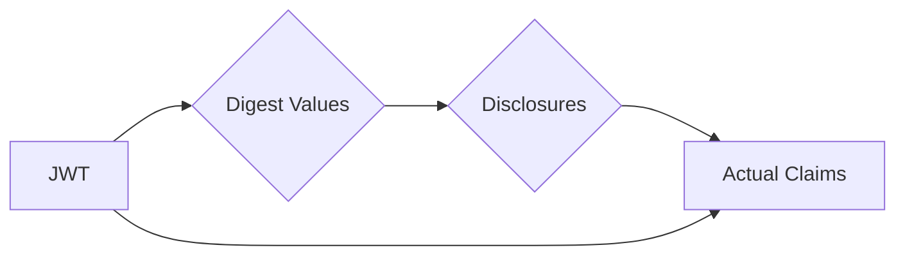

# SD-JWT-DotNet

> ⚠️ **Project Archived – No Longer Maintained**  
>  
> This project has been archived and is no longer actively maintained. The decision to discontinue maintenance was made during the [TAC meeting on Feb 19, 2025](https://tac.openwallet.foundation/meetings/2025/2025-02-19/#meeting-minutes).
>  
> If you are interested in taking over and reactivating the project, we encourage you to reach out to the [TAC](https://tac.openwallet.foundation/) to discuss possibilities for its future development.
>  
> For any questions or further details, please contact the [TAC](https://tac.openwallet.foundation/).


## Overview

This is the reference implementation of [IETF SD-JWT specification](https://datatracker.ietf.org/doc/draft-ietf-oauth-selective-disclosure-jwt/) written in .Net 6,7 and 8.

### Features

- Create a Disclosure.
- Parse a Disclosure from Base64Url
- Create an SD-JWT.
- Parse an SD-JWT.
- Create a Dictionary instance that contains the "\_sd" array.
- Create a Dictionary instance that represents a selectively-disclosable
  array element.
- Encode a map or a list recursively.
- Decode a map or a list recursively.
- Support Decoy
- Support Algorithm SHA-1, MD5, SHA-256 , SHA-384 and SHA-512
- Support .Net 6 and 7

### Roadmap

- Abstract issuer, holder and verifier interfaces
- Support Algorithm SHA3-256, SHA3-384, and SHA3-512
- Support .Net 8
- Remove base64url dependencies

## Quickstart Guide

### Prerequisites

- Install .Net 6/7
- Visual Studio 2022 Community version
- Visual Studio Code with C# Dev Kit

### Installation

#### Window users

```
PM > Install-Package Owf.Sd.Jwt
```

#### Mac/Linux users

```
dot net add package Owf.Sd.Jwt
```

## Concepts

### Disclosure

In the context of the Selective Disclosure for JWTs (SD-JWT) specification, a disclosure is a cryptographic construction that enables the selective revelation of individual elements within a JSON object used as the payload of a JSON Web Signature (JWS) structure. It serves as a critical component of the SD-JWT mechanism, allowing parties to selectively disclose specific claims or portions of claims while maintaining the overall integrity and authenticity of the JWT.

A disclosure consists of three primary components:

- Salt: A random value generated by the issuer to ensure uniqueness and prevent replay attacks. The SD-JWT specification recommends that a salt have 128-bit or higher entropy and be base64url-encoded.

- Claim Name: The name of the claim or array element to be disclosed.

- Claim Value: The value of the claim or array element to be disclosed, transformed using a cryptographic hash function.

By combining these components, the issuer can create disclosures for specific claims or array elements within the JWT payload. These disclosures are then embedded within the SD-JWT, enabling the controlled revelation of sensitive information.

Disclosable claims can be categorized into two types:

- Object Properties: Claims that represent individual key-value pairs within the JSON object.
- Array Elements: Claims that represent elements within a JSON array.

#### Code examples

Disclosure for object properties

```csharp
// Code Snippet 1: Create a Disclosure instance with salt, claimName and claimValue

// Parameters
var salt = "_26bc4LT-ac6q2KI6cBW5es";
var claimName = "family_name";
var claimValue = "Möbius";

// Create a Disclosure instance with salt, claimName and claimValue
var disclosure = Disclosure.Create(salt, claimName, claimValue);

// Get the string representation of the Disclosure.
// var disclosureString = disclosure.ToString();
var disclosureBase64Url = disclosure.GetBase64Url();
```


```csharp
// Code Snippet 2: Create a Disclosure instance with claimName and claimValue. A salt will be generated automatically.

// Parameters
var claimName = "family_name";
var claimValue = "Möbius";

// Create a Disclosure instance with claimName and claimValue
// A salt will be generated automatically
var disclosure = Disclosure.Create(claimName, claimValue);

// Get the string representation of the Disclosure.
// var disclosureString = disclosure.ToString();
var disclosureBase64Url = disclosure.GetBase64Url();

```

```csharp
// Code Snippet 3: Create a Disclosure from the Base64Url string representation

// Parameters
var base64UrlDisclosure = "WyJfMjZiYzRMVC1hYzZxMktJNmNCVzVlcyIsICJmYW1pbHlfbmFtZSIsICJNw7ZiaXVzIl0";

// Create a Disclosure instance from base64Url
var disclosure = Disclosure.CreateFromBase64Url(base64UrlDisclosure);
```
Disclosure for array elements

When there is an array like below,

```json
{
  "array": [ "element0", "element1" ]
}
```

a Disclosure for the whole array can be created as follows.

```C#
// Code Snippet 4: Create a Disclosure for array elements
var array = new List<string>() {
   "element0", "element1"
};
var disclosure = Disclosure.Create("array", array);
```
a Disclosure can be created for each array element

```C#
// Code Snippet 5: Create a Disclosure for array elements

// A Disclosures for array elements do not require a
// claim name.
var disclosure = Disclosure.Create("element0");

// If a salt needs to be specified explicitly, the 3-argument constructor
// should be used with 'claimName' null.
var salt = "_26bc4LT-ac6q2KI6cBW5es";
var disclosure1 =  Disclosure.Create(salt, null, "element1");
```

An array element can be made selectively-disclosable by replacing it with a JSON object that has a sole key-value pair whose key is ... (literally three dots) and whose value is the digest of the disclosure that corresponds to the array element. Below is an example.

```json
{
  "array": [ "element0", {"...": "11sTIzcE9RxK90IvzjPpWe_s7iQm1Da-AUk_VT45DMo"} ]
}
```

#### Code examples

Create a Dictionary instance that represents a selectively-disclosable array element
```C#
var elements = disclosure.ToArrayElement();
```
### Disclosure Digest

In the Selective Disclosure for JWTs (SD-JWT) specification, the primary purpose of the disclosure digest is to provide a means of verifying the integrity and authenticity of the disclosed information without requiring access to the full JWT payload. This is particularly useful in scenarios where the full JWT payload may contain sensitive or confidential information that should not be exposed to unauthorized parties.

The fundamental concept of selectively disclosing claims in a JWT involves removing specific claims from the JWT and replacing them with their corresponding digest values. These digest values are then transmitted alongside the JWT. Since the original claims cannot be directly inferred from their digest counterparts, a recipient cannot solely rely on the JWT to determine the actual claim values. Instead, they must receive the corresponding disclosures along with the JWT to ascertain the actual claim values.

This diagram illustrates the flow of information in the selective disclosure process for JWTs



1. The JWT contains the original claims.
2. The digest values of the claims are extracted from the JWT.
3. The disclosures which contain the actual claim values, are sent separately from the JWT.
4. The recipient can obtain the actual claims by combining the digest values and the corresponding disclosures.

When a digest value of Disclosure is embedded in a JSON object, it is listed as an element in the "\_sd" array. The name of the array, i.e., "\_sd", is defined in the SD-JWT specification for the purpose.

For example, a "family_name" claim in a JSON object like below

```json
{
  "family_name": "Möbius"
}
```

will be replaced with a digest value like below

```json
{
  "_sd": ["TZjouOTrBKEwUNjNDs9yeMzBoQn8FFLPaJjRRmAtwrM"]
}
```

Compute a Disclosure digest using default algorithm SHA-256

```C#
// Code Snippet 5: Disclosure digest with default algorithm SHA-256

var digest = disclosure.Digest();
```

Compute a Disclosure digest using other algorithms such SHA-512 or MD5

```C#
// Code Snippet 6: Disclosure digest with other supported algorithms

// SupportHashAlgorithm.MD5
// SupportHashAlgorithm.SHA384
var digest = disclosure.Digest(SupportHashAlgorithm.SHA512);
```

## Join the community

- Connect and get latest updates: [Discord](https://discord.gg)
- Get help, request features and report bugs: [Github Discussions](https://)

## License

Apache License, Version 2.0

## Credits

Thanks to Takahiko Kawasaki to create the original [source code](https://github.com/authlete/sd-jwt) in Java version.
