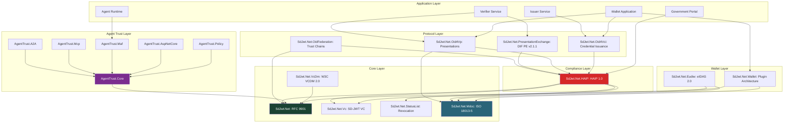

# SD-JWT .NET Ecosystem


[](https://www.nuget.org/packages/SdJwt.Net/)
[](https://github.com/openwallet-foundation-labs/sd-jwt-dotnet/actions/workflows/ci-validation.yml)
[](https://opensource.org/licenses/Apache-2.0)

Standards-aligned .NET libraries, protocol components, and trust infrastructure for **Selective Disclosure JSON Web Tokens (SD-JWTs)**, verifiable credentials, and regulated digital identity workflows.

This project provides reusable building blocks for issuers, verifiers, wallet frameworks, enterprise APIs, and trust systems. It is not a full wallet application or end-user mobile app. Instead, it provides the standards and protocol infrastructure that wallet frameworks, identity platforms, and enterprise systems can build on.

For package maturity classifications, see [MATURITY.md](MATURITY.md).

## Quick Start

```bash
# Core SD-JWT functionality
dotnet add package SdJwt.Net

# Verifiable Credentials
dotnet add package SdJwt.Net.Vc

# Try the samples
git clone https://github.com/openwallet-foundation-labs/sd-jwt-dotnet.git
cd sd-jwt-dotnet/samples/SdJwt.Net.Samples
dotnet run
```

## Package Ecosystem

### **Core**

| Package                                  | Release        | Specification                                         | Status     |
| ---------------------------------------- | -------------- | ----------------------------------------------------- | ---------- |
| **[SdJwt.Net](src/SdJwt.Net/README.md)** | NuGet (MinVer) | [RFC 9901](https://datatracker.ietf.org/doc/rfc9901/) | **Stable** |

### **Verifiable Credential Stack**

| Package                                                        | Release        | Specification                                                                                     | Status            |
| -------------------------------------------------------------- | -------------- | ------------------------------------------------------------------------------------------------- | ----------------- |
| **[SdJwt.Net.Vc](src/SdJwt.Net.Vc/README.md)**                 | NuGet (MinVer) | [draft-ietf-oauth-sd-jwt-vc-16](https://datatracker.ietf.org/doc/draft-ietf-oauth-sd-jwt-vc/)     | **Spec-Tracking** |
| **[SdJwt.Net.StatusList](src/SdJwt.Net.StatusList/README.md)** | NuGet (MinVer) | [draft-ietf-oauth-status-list-20](https://datatracker.ietf.org/doc/draft-ietf-oauth-status-list/) | **Spec-Tracking** |
| **[SdJwt.Net.VcDm](src/SdJwt.Net.VcDm/README.md)**             | NuGet (MinVer) | [W3C VCDM 2.0](https://www.w3.org/TR/vc-data-model-2.0/)                                          | **Stable**        |

### **OpenID Identity Protocols**

| Package                                                  | Release        | Specification                                                                               | Status            |
| -------------------------------------------------------- | -------------- | ------------------------------------------------------------------------------------------- | ----------------- |
| **[SdJwt.Net.Oid4Vci](src/SdJwt.Net.Oid4Vci/README.md)** | NuGet (MinVer) | [OpenID4VCI 1.0](https://openid.net/specs/openid-4-verifiable-credential-issuance-1_0.html) | **Stable**        |
| **[SdJwt.Net.Oid4Vp](src/SdJwt.Net.Oid4Vp/README.md)**   | NuGet (MinVer) | [OpenID4VP 1.0](https://openid.net/specs/openid-4-verifiable-presentations-1_0.html)        | **Stable**        |
| **[SdJwt.Net.SiopV2](src/SdJwt.Net.SiopV2/README.md)**   | NuGet (MinVer) | [SIOPv2 draft-13](https://openid.net/specs/openid-connect-self-issued-v2-1_0.html)          | **Spec-Tracking** |

### **Advanced Trust & Security**

| Package                                                                            | Release        | Specification                                                                                             | Status      |
| ---------------------------------------------------------------------------------- | -------------- | --------------------------------------------------------------------------------------------------------- | ----------- |
| **[SdJwt.Net.OidFederation](src/SdJwt.Net.OidFederation/README.md)**               | NuGet (MinVer) | [OpenID Federation 1.0](https://openid.net/specs/openid-federation-1_0.html)                              | **Stable**  |
| **[SdJwt.Net.PresentationExchange](src/SdJwt.Net.PresentationExchange/README.md)** | NuGet (MinVer) | [DIF PEX v2.1.1](https://identity.foundation/presentation-exchange/spec/v2.1.1/)                          | **Stable**  |
| **[SdJwt.Net.HAIP](src/SdJwt.Net.HAIP/README.md)**                                 | NuGet (MinVer) | [HAIP 1.0](https://openid.net/specs/openid4vc-high-assurance-interoperability-profile-sd-jwt-vc-1_0.html) | **Profile** |

### **ISO Credential Formats**

| Package                                            | Release        | Specification                                              | Status     |
| -------------------------------------------------- | -------------- | ---------------------------------------------------------- | ---------- |
| **[SdJwt.Net.Mdoc](src/SdJwt.Net.Mdoc/README.md)** | NuGet (MinVer) | [ISO 18013-5](https://www.iso.org/standard/69084.html) mDL | **Stable** |

### **Reference Infrastructure**

| Package                                                | Release        | Specification                                                          | Status        |
| ------------------------------------------------------ | -------------- | ---------------------------------------------------------------------- | ------------- |
| **[SdJwt.Net.Wallet](src/SdJwt.Net.Wallet/README.md)** | NuGet (MinVer) | Generic wallet with plugin architecture                                | **Reference** |
| **[SdJwt.Net.Eudiw](src/SdJwt.Net.Eudiw/README.md)**   | NuGet (MinVer) | [eIDAS 2.0](https://eur-lex.europa.eu/eli/reg/2024/1183) EU Wallet ARF | **Reference** |

Not a standalone wallet product. Provides wallet infrastructure primitives and an EUDIW compliance reference that wallet frameworks can build on.

### **Agent Trust Kits**

| Package                                                                                    | Release        | Specification / Design Source                | Status      |
| ------------------------------------------------------------------------------------------ | -------------- | -------------------------------------------- | ----------- |
| **[SdJwt.Net.AgentTrust.Core](src/SdJwt.Net.AgentTrust.Core/README.md)**                   | NuGet (MinVer) | Capability SD-JWT profile (project proposal) | **Preview** |
| **[SdJwt.Net.AgentTrust.Policy](src/SdJwt.Net.AgentTrust.Policy/README.md)**               | NuGet (MinVer) | Rule-based policy and delegation model       | **Preview** |
| **[SdJwt.Net.AgentTrust.AspNetCore](src/SdJwt.Net.AgentTrust.AspNetCore/README.md)**       | NuGet (MinVer) | ASP.NET Core middleware integration          | **Preview** |
| **[SdJwt.Net.AgentTrust.Maf](src/SdJwt.Net.AgentTrust.Maf/README.md)**                     | NuGet (MinVer) | MAF/MCP middleware and adapter integration   | **Preview** |
| **[SdJwt.Net.AgentTrust.OpenTelemetry](src/SdJwt.Net.AgentTrust.OpenTelemetry/README.md)** | NuGet (MinVer) | Agent trust metrics and telemetry            | **Preview** |
| **[SdJwt.Net.AgentTrust.Policy.Opa](src/SdJwt.Net.AgentTrust.Policy.Opa/README.md)**       | NuGet (MinVer) | OPA external policy engine integration       | **Preview** |
| **[SdJwt.Net.AgentTrust.Mcp](src/SdJwt.Net.AgentTrust.Mcp/README.md)**                     | NuGet (MinVer) | MCP trust interceptor and guard              | **Preview** |
| **[SdJwt.Net.AgentTrust.A2A](src/SdJwt.Net.AgentTrust.A2A/README.md)**                     | NuGet (MinVer) | Agent-to-agent delegation chains             | **Preview** |

## Key Features

### Enterprise Security

- **RFC 9901 Compliant**: Full implementation with security hardening
- **HAIP Support**: High Assurance Interoperability Profile for government and enterprise
- **Algorithm Enforcement**: Blocks weak algorithms (MD5, SHA-1), enforces SHA-2 family
- **Attack Prevention**: Protection against timing attacks, replay attacks, signature tampering
- **Verify-First Design**: All tokens and claims are cryptographically verified before use

### High Performance

- **Multi-Target**: .NET 8, 9, 10 and .NET Standard 2.1
- **Platform-Aware Crypto**: Uses SHA256.HashData() on .NET 6+ where available
- **Batch Throughput**: Designed for high-volume issuance and verification
- **Low Allocation**: Reduced allocations for high-volume scenarios

### Standards Compliant

- **IETF Standards**: RFC 9901 and SD-JWT VC draft-16
- **OpenID Foundation**: OpenID4VCI, OpenID4VP, Federation, HAIP
- **W3C**: Verifiable Credentials data model compatibility
- **DIF**: Presentation Exchange v2.1.1
- **HAIP**: High assurance security profiles (Levels 1-3)

### Developer Experience

- **Samples**: Console tutorials organized by skill level and use case
- **Fluent APIs**: Chainable builder interfaces
- **Documentation**: Guides, deep dives, and security reference
- **Tested**: 2,500+ xUnit tests across the implemented packages

## Ecosystem Architecture

The SD-JWT .NET Ecosystem is organized into four logical layers:

```text
+-----------------------------------------------------------------+
| Enterprise Applications                                         |
| ASP.NET Core APIs, identity platforms, wallet frameworks,       |
| regulated workflows, AI agent systems                           |
+-------------------------------+---------------------------------+
                                |
+-------------------------------v---------------------------------+
| Reference Infrastructure                                        |
| Wallet primitives, EUDIW compliance, issuer reference server    |
+-------------------------------+---------------------------------+
                                |
+-------------------------------v---------------------------------+
| Protocol Components                                             |
| OID4VCI, OID4VP, Presentation Exchange, OpenID Federation, HAIP |
+-------------------------------+---------------------------------+
                                |
+-------------------------------v---------------------------------+
| Standard Libraries                                              |
| SD-JWT (RFC 9901), SD-JWT VC, Status List, mdoc (ISO 18013-5)  |
+-----------------------------------------------------------------+
```

See [MATURITY.md](MATURITY.md) for the maturity classification of each package.

## Use Cases

Use-case documentation lives under [docs/use-cases](docs/use-cases/README.md). The repository also includes runnable console examples under [samples/SdJwt.Net.Samples](samples/SdJwt.Net.Samples/README.md).

## Architecture Overview


```mermaid
graph TB
    subgraph ApplicationLayer[Application Layer]
        WalletApp[Wallet Application]
        IssuerApp[Issuer Service]
        VerifierApp[Verifier Service]
        GovApp[Government Portal]
        AgentRuntime[Agent Runtime]
    end

    subgraph ProtocolLayer[Protocol Layer]
        OID4VCI[SdJwt.Net.Oid4Vci: Credential Issuance]
        OID4VP[SdJwt.Net.Oid4Vp: Presentations]
        PEx[SdJwt.Net.PresentationExchange: DIF PE v2.1.1]
        OidFed[SdJwt.Net.OidFederation: Trust Chains]
    end

    subgraph WalletLayer[Wallet Layer]
        Wallet[SdJwt.Net.Wallet: Plugin Architecture]
        Eudiw[SdJwt.Net.Eudiw: eIDAS 2.0]
    end

    subgraph AgentTrustLayer[Agent Trust Layer]
        ATCore[AgentTrust.Core]
        ATPolicy[AgentTrust.Policy]
        ATAsp[AgentTrust.AspNetCore]
        ATMaf[AgentTrust.Maf]
        ATMcp[AgentTrust.Mcp]
        ATA2A[AgentTrust.A2A]
    end

    subgraph ComplianceLayer[Compliance Layer]
        HAIP[SdJwt.Net.HAIP: HAIP 1.0]
    end

    subgraph CoreLayer[Core Layer]
        Core[SdJwt.Net: RFC 9901]
        Vc[SdJwt.Net.Vc: SD-JWT VC]
        VcDm[SdJwt.Net.VcDm: W3C VCDM 2.0]
        Status[SdJwt.Net.StatusList: Revocation]
        Mdoc[SdJwt.Net.Mdoc: ISO 18013-5]
    end

    WalletApp --> Wallet
    WalletApp --> OID4VP
    WalletApp --> OID4VCI
    IssuerApp --> OID4VCI
    VerifierApp --> OID4VP
    VerifierApp --> PEx
    GovApp --> HAIP
    AgentRuntime --> ATMaf

    OID4VCI --> HAIP
    OID4VP --> HAIP
    PEx --> HAIP
    OidFed --> HAIP

    Wallet --> Core
    Wallet --> Mdoc
    Eudiw --> Mdoc
    Eudiw --> Vc
    VcDm --> Core

    ATCore --> Core
    ATPolicy --> ATCore
    ATAsp --> ATCore
    ATMaf --> ATCore
    ATMcp --> ATCore
    ATA2A --> ATCore

    HAIP --> Core
    HAIP --> Vc
    HAIP --> Status
    HAIP --> Mdoc
    OidFed --> Core
    OID4VP --> Mdoc

    style HAIP fill:#d62828,color:#fff
    style Core fill:#1b4332,color:#fff
    style Mdoc fill:#2a6478,color:#fff
    style ATCore fill:#7b2d8e,color:#fff
```

## Quick Examples

### **Basic SD-JWT**

```csharp
using SdJwt.Net.Issuer;

// Create issuer
var issuer = new SdIssuer(signingKey, SecurityAlgorithms.EcdsaSha256);

// Issue with selective disclosure
var credential = issuer.Issue(claims, new SdIssuanceOptions
{
    DisclosureStructure = new { email = true, address = new { city = true } }
});

// Holder creates presentation
var holder = new SdJwtHolder(credential.Issuance);
var presentation = holder.CreatePresentation(
    disclosure => disclosure.ClaimName == "email");
```

### **HAIP-Compliant Verifiable Credentials**

```csharp
using SdJwt.Net.Vc.Issuer;
using SdJwt.Net.HAIP;

// Government issuer with Level 3 compliance
var haipValidator = new HaipCryptoValidator(HaipLevel.Level3_Sovereign, logger);
var keyValidation = haipValidator.ValidateKeyCompliance(signingKey, "ES512");

if (keyValidation.IsCompliant)
{
    var vcIssuer = new SdJwtVcIssuer(issuerKey, algorithm);
    var credential = vcIssuer.Issue("https://gov.example/national-id", vcPayload, options);
}
```

### **Status Management**

```csharp
using SdJwt.Net.StatusList.Issuer;

// Create status list
var statusManager = new StatusListManager(statusKey, algorithm);
var statusValues = new byte[] { 0, 1, 2 }; // valid, invalid, suspended
var statusList = await statusManager.CreateStatusListTokenAsync(
    statusListUrl, statusValues, bits: 2);

// Check credential status
var statusVerifier = new StatusListVerifier(httpClient);
var statusResult = await statusVerifier.CheckStatusAsync(statusClaim, keyResolver);
var isValid = statusResult.IsValid;

// Verify presentation with expected nonce
var result = await verifier.VerifyAsync(presentation, validationParams, kbParams, "expected-nonce");
```

## Security Features

### Cryptographic Security

- **Approved**: SHA-256, SHA-384, SHA-512, ECDSA P-256/384/521
- **Blocked**: MD5, SHA-1 (automatically rejected)
- **Enforced**: Constant-time operations, secure random generation

### **HAIP Compliance Levels**

- **Level 1 (High)**: ES256+, PS256+, proof of possession
- **Level 2 (Very High)**: ES384+, PS384+, wallet attestation, DPoP
- **Level 3 (Sovereign)**: ES512+, PS512+, HSM backing, qualified signatures

### **Attack Prevention**

- **Signature Tampering**: Cryptographic detection and prevention
- **Replay Attacks**: Nonce and timestamp validation
- **Timing Attacks**: Constant-time comparison operations
- **Key Confusion**: Strong key binding validation

### **Privacy Protection**

- **Selective Disclosure**: Granular claim-level privacy control
- **Zero-Knowledge Patterns**: Prove properties without revealing data
- **Context Isolation**: Audience-specific presentations
- **Correlation Resistance**: Multiple unlinkable presentations

## Platform Support

### **Supported Frameworks**

- **.NET 8.0** - Full support
- **.NET 9.0** - Full support
- **.NET 10.0** - Full support
- **.NET Standard 2.1** - Backward compatibility for legacy systems

### **Supported Platforms**

- **Windows** (x64, x86, ARM64)
- **Linux** (x64, ARM64)
- **macOS** (x64, Apple Silicon)
- **Container Ready** (Docker, Kubernetes)
- **Cloud Native** (Azure, AWS, GCP)

## Performance Benchmarks

Performance is measured with a real BenchmarkDotNet harness in [`benchmarks/SdJwt.Net.Benchmarks`](benchmarks/SdJwt.Net.Benchmarks).

Run benchmarks locally:

```pwsh
dotnet run --configuration Release --project benchmarks/SdJwt.Net.Benchmarks/SdJwt.Net.Benchmarks.csproj -- --job short --warmupCount 1 --iterationCount 3 --exporters markdown json
```

Benchmark results are generated in:

- `benchmarks/SdJwt.Net.Benchmarks/BenchmarkDotNet.Artifacts/results/`

The CI `performance-benchmarks` job executes the same harness and uploads result artifacts for each run.

## Documentation

### **Getting Started**

- [Documentation Portal](docs/README.md) - Main entry point to all documentation
- [15-Minute Quickstart](docs/getting-started/quickstart.md) - Tutorial to get up and running quickly
- [Ecosystem Architecture](docs/concepts/ecosystem-architecture.md) - Deep dive into system architecture
- [Interactive Samples](samples/SdJwt.Net.Samples/README.md) - Console tutorials and use cases
- [Package Documentation](src/SdJwt.Net/README.md) - Core package API reference

### **Standards Implementation**

- [Verifiable Credentials](src/SdJwt.Net.Vc/README.md) - SD-JWT VC specification
- [Status Lists](src/SdJwt.Net.StatusList/README.md) - Credential lifecycle management
- [OpenID4VCI](src/SdJwt.Net.Oid4Vci/README.md) - Credential issuance protocols
- [OpenID4VP](src/SdJwt.Net.Oid4Vp/README.md) - Presentation protocols
- [SIOPv2](src/SdJwt.Net.SiopV2/README.md) - Subject-signed ID Tokens for combined OpenID4VP responses
- [mdoc/mDL](src/SdJwt.Net.Mdoc/README.md) - ISO 18013-5 mobile documents
- [W3C VCDM](src/SdJwt.Net.VcDm/README.md) - Verifiable Credentials Data Model 2.0 data models

### **Advanced Features**

- [OpenID Federation](src/SdJwt.Net.OidFederation/README.md) - Trust chain management
- [Presentation Exchange](src/SdJwt.Net.PresentationExchange/README.md) - Credential selection
- [HAIP Compliance](src/SdJwt.Net.HAIP/README.md) - High assurance security profiles
- [Agent Trust Core](src/SdJwt.Net.AgentTrust.Core/README.md) - Capability token minting and verification
- [Agent Trust Policy](src/SdJwt.Net.AgentTrust.Policy/README.md) - Rule and delegation engine
- [Agent Trust ASP.NET Core](src/SdJwt.Net.AgentTrust.AspNetCore/README.md) - Inbound token verification middleware
- [Agent Trust MAF](src/SdJwt.Net.AgentTrust.Maf/README.md) - Outbound token propagation for tool calls
- [Agent Trust OpenTelemetry](src/SdJwt.Net.AgentTrust.OpenTelemetry/README.md) - Metrics and telemetry
- [Agent Trust OPA](src/SdJwt.Net.AgentTrust.Policy.Opa/README.md) - External policy engine via OPA
- [Agent Trust MCP](src/SdJwt.Net.AgentTrust.Mcp/README.md) - MCP trust interceptor and guard
- [Agent Trust A2A](src/SdJwt.Net.AgentTrust.A2A/README.md) - Agent-to-agent delegation chains
- [Agent Trust Guide](docs/guides/agent-trust-integration.md) - End-to-end integration walkthrough
- [Agent Trust Concepts](docs/concepts/agent-trust-kits-deep-dive.md) - Architecture and flow model

### **Enterprise Planning**

- [Enterprise Roadmap](docs/ENTERPRISE_ROADMAP.md) - Strategic roadmap with ISO mDL/mdoc, DC API, eIDAS 2.0

## Installation

### **Core Package**

```bash
dotnet add package SdJwt.Net
```

### **Full Ecosystem**

```bash
# Verifiable credential stack
dotnet add package SdJwt.Net
dotnet add package SdJwt.Net.Vc
dotnet add package SdJwt.Net.VcDm
dotnet add package SdJwt.Net.StatusList

# OpenID protocols
dotnet add package SdJwt.Net.Oid4Vci
dotnet add package SdJwt.Net.Oid4Vp
dotnet add package SdJwt.Net.SiopV2

# Advanced features
dotnet add package SdJwt.Net.OidFederation
dotnet add package SdJwt.Net.PresentationExchange
dotnet add package SdJwt.Net.HAIP

# ISO credential formats
dotnet add package SdJwt.Net.Mdoc

# Agent trust kits
dotnet add package SdJwt.Net.AgentTrust.Core
dotnet add package SdJwt.Net.AgentTrust.Policy
dotnet add package SdJwt.Net.AgentTrust.AspNetCore
dotnet add package SdJwt.Net.AgentTrust.Maf
dotnet add package SdJwt.Net.AgentTrust.OpenTelemetry
dotnet add package SdJwt.Net.AgentTrust.Policy.Opa
dotnet add package SdJwt.Net.AgentTrust.Mcp
dotnet add package SdJwt.Net.AgentTrust.A2A

# Wallet infrastructure
dotnet add package SdJwt.Net.Wallet
dotnet add package SdJwt.Net.Eudiw
```

### **Try the Examples**

```bash
git clone https://github.com/openwallet-foundation-labs/sd-jwt-dotnet.git
cd sd-jwt-dotnet/samples/SdJwt.Net.Samples
dotnet run
```

## Contributing

We welcome contributions! Please see the [CONTRIBUTING.md](CONTRIBUTING.md) file for detailed guidelines and instructions.

## Community & Support

### Getting Help

- **Documentation**: [docs/](docs/README.md) - Guides and API reference
- **Discussions**: [GitHub Discussions](https://github.com/openwallet-foundation-labs/sd-jwt-dotnet/discussions) for community questions
- **Issues**: [GitHub Issues](https://github.com/openwallet-foundation-labs/sd-jwt-dotnet/issues) for bug reports
- **Security**: Report security issues to [tldinteractive@gmail.com](mailto:tldinteractive@gmail.com) or see [SECURITY.md](SECURITY.md)

### **Community**

- **Open Wallet Foundation**: Part of the [OpenWallet Foundation](https://openwallet.foundation/) ecosystem
- **Standards Participation**: Active in IETF OAuth WG, OpenID Foundation, DIF

## License

Licensed under the **Apache License 2.0** - see the [LICENSE](LICENSE.txt) file for details.

This permissive license allows commercial use, modification, distribution, and private use while providing license and copyright notice requirements.

## Acknowledgments

This project builds on work from the identity standards community:

- **[IETF OAuth Working Group](https://datatracker.ietf.org/wg/oauth/)** - SD-JWT and Status List specifications
- **[OpenID Foundation](https://openid.net/)** - OpenID4VCI, OpenID4VP, Federation, and HAIP standards
- **[DIF](https://identity.foundation/)** - Presentation Exchange specification
- **[W3C](https://www.w3.org/)** - Verifiable Credentials data model
- **[Open Wallet Foundation](https://openwallet.foundation/)** - Digital identity standards advancement

### **Special Thanks**

- All specification editors and contributors
- Early adopters and feedback providers
- Security researchers and auditors
- The broader .NET and identity communities

---
