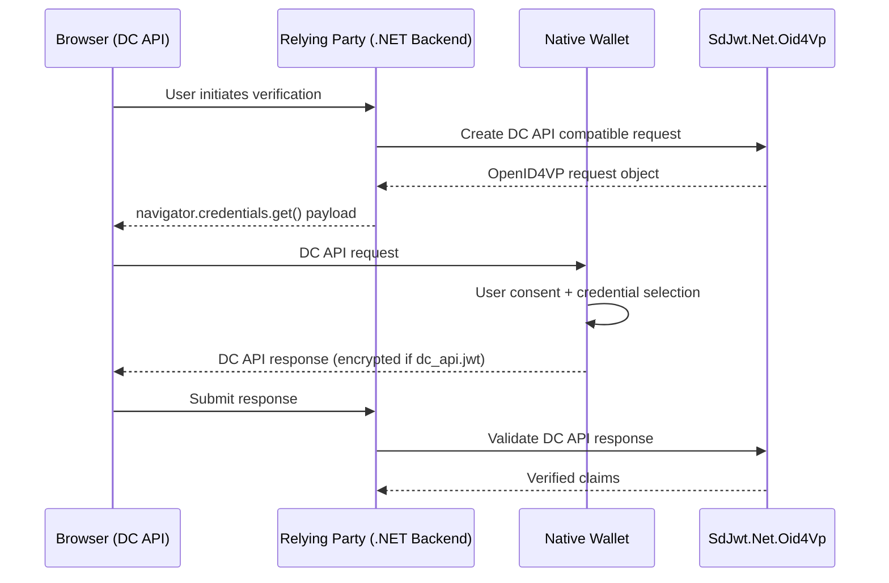
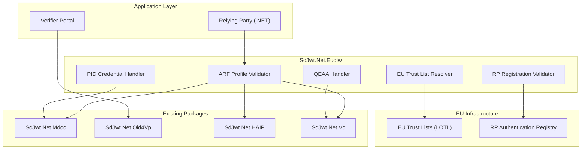

# Enterprise Roadmap

## Document Information

| Field        | Value      |
| ------------ | ---------- |
| Version      | 1.0.0      |
| Last Updated | 2026-02-28 |
| Status       | Active     |

## Executive Summary

The SD-JWT .NET ecosystem provides a production-ready, enterprise-grade implementation of the complete OpenID4VC stack for JWT-based verifiable credentials. This roadmap outlines the current state, validates enterprise readiness, and defines the strategic path to achieve full credential format coverage including ISO mDL/mdoc support.

## Current State Assessment

### Implementation Status

All core specifications are fully implemented with comprehensive test coverage:

| Package                          | Specification     | Version   | Status   | Test Coverage |
| -------------------------------- | ----------------- | --------- | -------- | ------------- |
| `SdJwt.Net`                      | RFC 9901 (SD-JWT) | Final     | Complete | 1483 tests    |
| `SdJwt.Net.Vc`                   | SD-JWT VC         | draft-15  | Complete | Included      |
| `SdJwt.Net.StatusList`           | Token Status List | draft-18  | Complete | Included      |
| `SdJwt.Net.Oid4Vci`              | OpenID4VCI        | 1.0 Final | Complete | Included      |
| `SdJwt.Net.Oid4Vp`               | OpenID4VP         | 1.0       | Complete | Included      |
| `SdJwt.Net.PresentationExchange` | DIF PEX           | v2.1.1    | Complete | Included      |
| `SdJwt.Net.OidFederation`        | OpenID Federation | 1.0       | Complete | Included      |
| `SdJwt.Net.HAIP`                 | HAIP Profile      | 1.0       | Complete | Included      |

### Enterprise Readiness Checklist

| Category       | Requirement                          | Status | Evidence                                                  |
| -------------- | ------------------------------------ | ------ | --------------------------------------------------------- |
| **Security**   | No weak cryptography (MD5/SHA-1)     | Pass   | HAIP validator blocks, tests verify rejection             |
| **Security**   | Constant-time comparisons            | Pass   | `CryptographicOperations.FixedTimeEquals` used throughout |
| **Security**   | CSPRNG for random generation         | Pass   | `RandomNumberGenerator` used for all entropy              |
| **Security**   | Replay attack prevention             | Pass   | Nonce and `iat` freshness validation enforced             |
| **Compliance** | RFC 9901 conformance                 | Pass   | Gap analysis completed, all issues remediated             |
| **Compliance** | SD-JWT VC draft-15 conformance       | Pass   | Gap analysis completed, all issues remediated             |
| **Compliance** | OpenID4VC suite conformance          | Pass   | Gap analysis completed, all issues remediated             |
| **Quality**    | Zero compiler warnings               | Pass   | `TreatWarningsAsErrors=true` enforced                     |
| **Quality**    | XML documentation on all public APIs | Pass   | `GenerateDocumentationFile=true`                          |
| **Quality**    | Comprehensive test suite             | Pass   | 1483 tests, all passing                                   |
| **Quality**    | Multi-framework support              | Pass   | .NET 8.0, 9.0, 10.0, netstandard2.1                       |
| **Operations** | CI/CD pipeline                       | Pass   | GitHub Actions with quality gates                         |
| **Operations** | Automated releases                   | Pass   | Release Please with draft review                          |
| **Operations** | NuGet publishing                     | Pass   | Trusted Publishing (OIDC)                                 |

### Gap Analysis Reports

Detailed remediation work is documented in:

- [RFC 9901 Gap Analysis](../reports/rfc9901-gap-analysis.md)
- [SD-JWT VC Draft-15 Gap Analysis](../reports/sd-jwt-vc-draft-15-gap-analysis.md)
- [OpenID4VC Suite Gap Analysis](../reports/openid4vc-suite-gap-analysis.md)

## Strategic Roadmap

### Phase 1: Foundation Hardening (Q1-Q2 2026) - COMPLETE

**Objective**: Ensure all JWT-based credential flows are production-ready.

| Deliverable                          | Status   | Notes                                              |
| ------------------------------------ | -------- | -------------------------------------------------- |
| RFC 9901 strict compliance           | Complete | All MUST requirements implemented                  |
| SD-JWT VC draft-15 alignment         | Complete | Type/integrity metadata validation                 |
| Status List draft-18 support         | Complete | Multi-bit values, freshness validation             |
| OpenID4VCI 1.0 Final implementation  | Complete | Proof validation, batch credentials, notifications |
| OpenID4VP 1.0 implementation         | Complete | JAR, transaction data binding, KB validation       |
| DIF PEX v2.1.1 implementation        | Complete | Submission requirements, predicate filters         |
| OpenID Federation 1.0 implementation | Complete | Trust chain resolution, metadata policies          |
| HAIP 1.0 compliance                  | Complete | Level 1/2/3 validation, wallet attestation         |

### Phase 2: ISO mDL/mdoc Support (Q2-Q3 2026) - COMPLETE

**Objective**: Add support for ISO 18013-5 mobile document credentials.

**Detailed Proposal**: See [mdoc Library Proposal](proposals/mdoc-library-proposal.md) for comprehensive design.

**Implementation Documentation**:

- [mdoc Deep Dive](concepts/mdoc-deep-dive.md) - Technical concepts
- [mdoc Identity Verification Use Case](use-cases/mdoc-identity-verification.md) - Real-world scenarios
- Tutorials: [Beginner](tutorials/beginner/05-hello-mdoc.md) | [Intermediate](tutorials/intermediate/06-mdoc-issuance.md) | [Advanced](tutorials/advanced/05-mdoc-integration.md)

**Package**: `SdJwt.Net.Mdoc`

| Component                    | Description                                      | Status   |
| ---------------------------- | ------------------------------------------------ | -------- |
| CBOR serialization           | ISO 18013-5 CBOR data structures via PeterO.Cbor | Complete |
| COSE cryptography            | COSE_Sign1 operations (RFC 8152)                 | Complete |
| Mobile Security Object (MSO) | Issuer-signed credential structure               | Complete |
| DeviceResponse handling      | Presentation format for mdoc                     | Complete |
| SessionTranscript            | CBOR-encoded session binding                     | Complete |
| OpenID4VPHandover            | OID4VP integration (redirect + DC API)           | Complete |
| mdoc verifier                | MdocVerifier for document validation             | Complete |
| mdoc issuer                  | MdocIssuerBuilder fluent API                     | Complete |
| mDL namespace support        | org.iso.18013.5.1 standard elements              | Complete |
| ICoseCryptoProvider          | Pluggable cryptographic abstraction              | Complete |
| mdoc credential issuance     | Extend OID4VCI for `mso_mdoc`                    | High     |
| mDL namespace support        | org.iso.18013.5.1 standard elements              | High     |
| ICoseCryptoProvider          | Pluggable cryptographic abstraction              | High     |

**Architecture Highlights**:

- Pluggable `ICoseCryptoProvider` interface for platform-specific crypto
- Full HAIP compliance (ES256, SHA-256, x509 chain validation)
- Integration with existing `MdocVerifier` for unified verification
- Fluent `MdocIssuerBuilder` API consistent with `SdIssuer` patterns
- SessionTranscript support for both redirect and DC API flows

**Dependencies**:

- `PeterO.Cbor` v4.5.3 (mature, full RFC 8949 compliance, Apache 2.0)
- `SdJwt.Net` (core library integration)

**Test Coverage**: 150 unit tests covering all components

### Phase 3: W3C Digital Credentials API Integration (Q3 2026) - PLANNED

**Objective**: Enable browser-based wallet interactions via the Digital Credentials API.

**Justification**:

- W3C specification reaching Candidate Recommendation
- Enables web applications to request credentials without custom protocols
- Chrome, Edge, and Safari implementing native support
- Critical for consumer-facing wallet applications

**Package**: Extend `SdJwt.Net.Oid4Vp`

#### Solution Design

##### Architecture Overview



##### Component Design

| Component          | Class/Interface          | Description                                             |
| ------------------ | ------------------------ | ------------------------------------------------------- |
| Request Builder    | `DcApiRequestBuilder`    | Creates DC API compatible authorization requests        |
| Response Parser    | `DcApiResponseParser`    | Parses DC API response envelope                         |
| Encryption Handler | `DcApiJwtHandler`        | Handles `dc_api.jwt` encrypted responses                |
| Origin Validator   | `DcApiOriginValidator`   | Validates browser origin against client_id              |
| Handover Builder   | `OpenId4VpDcApiHandover` | Creates DC API session transcript (already implemented) |

##### Request Object Format

```json
{
  "protocol": "openid4vp",
  "request": {
    "client_id": "https://verifier.example.com",
    "client_id_scheme": "web-origin",
    "response_type": "vp_token",
    "response_mode": "dc_api",
    "nonce": "n-0S6_WzA2Mj",
    "presentation_definition": { ... }
  }
}
```

##### Response Modes

| Mode         | Description        | Implementation                     |
| ------------ | ------------------ | ---------------------------------- |
| `dc_api`     | Plain response     | Direct VP token in response        |
| `dc_api.jwt` | Encrypted response | JWE-encrypted response for privacy |

##### API Design

```csharp
// Request creation
var dcRequest = new DcApiRequestBuilder()
    .WithClientId("https://verifier.example.com")
    .WithNonce(GenerateNonce())
    .WithPresentationDefinition(presentationDefinition)
    .WithResponseMode(DcApiResponseMode.DcApi)
    .Build();

// JavaScript payload for navigator.credentials.get()
string jsPayload = dcRequest.ToNavigatorCredentialsPayload();

// Response validation
var validator = new DcApiResponseValidator(options);
var result = await validator.ValidateAsync(
    dcResponse,
    expectedOrigin: "https://verifier.example.com",
    expectedNonce: nonce);

// Access verified claims
if (result.IsValid)
{
    var claims = result.VerifiedCredentials;
}
```

##### Security Considerations

1. **Origin Validation**: Must validate browser origin matches `client_id`
2. **Nonce Binding**: DC API nonce hashed in session transcript
3. **Encrypted Responses**: Support `dc_api.jwt` for sensitive credentials
4. **CORS Headers**: Backend must return appropriate CORS headers

##### Browser Integration Sample

```javascript
// Frontend JavaScript
const dcRequest = await fetch("/api/dc-request").then((r) => r.json());

const credential = await navigator.credentials.get({
  digital: {
    providers: [
      {
        protocol: "openid4vp",
        request: dcRequest,
      },
    ],
  },
});

// Submit to backend
const result = await fetch("/api/verify", {
  method: "POST",
  body: JSON.stringify(credential),
});
```

| Component                   | Description                        | Priority |
| --------------------------- | ---------------------------------- | -------- |
| `DcApiRequestBuilder`       | DC API compatible request builder  | High     |
| `DcApiResponseValidator`    | Response parsing and validation    | High     |
| `dc_api` response mode      | Support `response_mode=dc_api`     | High     |
| `dc_api.jwt` response mode  | Encrypted response support         | High     |
| Origin validation           | Browser origin vs client_id        | High     |
| Browser integration samples | JavaScript + .NET backend examples | Medium   |

**Estimated Effort**: 4-6 weeks

### Phase 4: eIDAS 2.0 / EUDIW Profile (Q3-Q4 2026) - PLANNED

**Objective**: Provide ready-to-use configuration for EU Digital Identity Wallet compliance.

**Justification**:

- EU Regulation 2024/1183 mandates EUDIW adoption by 2026
- Enterprises operating in EU must comply with eIDAS 2.0
- EUDIW Architecture Reference Framework (ARF) defines specific requirements
- Builds on existing HAIP foundation with EU-specific constraints

**Package**: `SdJwt.Net.Eudiw` (new)

#### Solution Design

##### Architecture Overview



##### EU Trust Framework Integration

The EUDIW ecosystem uses a hierarchical trust model based on the List of Trusted Lists (LOTL):

```csharp
public interface IEuTrustListResolver
{
    /// <summary>
    /// Resolves and validates issuer trust from EU Trust Lists.
    /// </summary>
    Task<TrustValidationResult> ValidateIssuerAsync(
        X509Certificate2 issuerCert,
        string credentialType,
        CancellationToken cancellationToken = default);

    /// <summary>
    /// Gets the current List of Trusted Lists.
    /// </summary>
    Task<ListOfTrustedLists> GetLotlAsync(
        CancellationToken cancellationToken = default);

    /// <summary>
    /// Gets trusted service providers for a specific member state.
    /// </summary>
    Task<IReadOnlyList<TrustedServiceProvider>> GetTrustedProvidersAsync(
        string memberStateCode,
        CancellationToken cancellationToken = default);
}
```

##### ARF Profile Validator

The ARF defines specific requirements for SD-JWT VC and mdoc credentials:

```csharp
public class ArfProfileValidator
{
    /// <summary>
    /// Validates a credential against EUDIW ARF requirements.
    /// </summary>
    public ArfValidationResult ValidateCredential(
        object credential, // SD-JWT VC or mdoc
        ArfCredentialType credentialType)
    {
        // Validate format compliance
        // Validate cryptographic algorithms (HAIP Level 2 minimum)
        // Validate issuer trust
        // Validate credential type-specific requirements
    }
}

public enum ArfCredentialType
{
    /// <summary>Person Identification Data</summary>
    PID,
    /// <summary>Mobile Driving License</summary>
    MDL,
    /// <summary>Qualified Electronic Attestation of Attributes</summary>
    QEAA,
    /// <summary>Electronic Attestation of Attributes</summary>
    EAA
}
```

##### Person Identification Data (PID) Handler

```csharp
public class PidCredentialHandler
{
    private const string PidDocType = "eu.europa.ec.eudi.pid.1";
    private const string PidNamespace = "eu.europa.ec.eudi.pid.1";

    /// <summary>
    /// Validates and extracts PID claims from an mdoc credential.
    /// </summary>
    public PidValidationResult ValidatePid(Document pidDocument)
    {
        // Validate DocType
        if (pidDocument.DocType != PidDocType)
            return PidValidationResult.InvalidDocType();

        // Extract mandatory claims
        var claims = ExtractPidClaims(pidDocument);

        // Validate mandatory fields present
        ValidateMandatoryFields(claims);

        return new PidValidationResult
        {
            IsValid = true,
            FamilyName = claims.FamilyName,
            GivenName = claims.GivenName,
            BirthDate = claims.BirthDate,
            IssuingCountry = claims.IssuingCountry,
            // ... other PID claims
        };
    }
}

/// <summary>
/// PID mandatory claims per ARF specification.
/// </summary>
public class PidClaims
{
    public string FamilyName { get; set; }
    public string GivenName { get; set; }
    public DateTime BirthDate { get; set; }
    public bool? AgeOver18 { get; set; }
    public bool? AgeOver21 { get; set; }
    public string IssuingCountry { get; set; }
    public string IssuingAuthority { get; set; }
    public DateTime IssuanceDate { get; set; }
    public DateTime ExpiryDate { get; set; }
    // Optional: resident_address, nationality, etc.
}
```

##### Qualified Electronic Attestation of Attributes (QEAA)

```csharp
public class QeaaHandler
{
    /// <summary>
    /// Validates a Qualified Electronic Attestation of Attributes.
    /// </summary>
    public QeaaValidationResult ValidateQeaa(
        string sdJwtVc,
        IEuTrustListResolver trustResolver)
    {
        // Parse SD-JWT VC
        // Validate issuer is a Qualified Trust Service Provider (QTSP)
        // Validate signature with qualified certificate
        // Validate attestation claims
    }

    /// <summary>
    /// Checks if the issuer is a registered QTSP.
    /// </summary>
    public async Task<bool> IsQualifiedProviderAsync(
        string issuerUrl,
        IEuTrustListResolver trustResolver)
    {
        var providers = await trustResolver.GetTrustedProvidersAsync("*");
        return providers.Any(p =>
            p.ServiceType == TrustServiceType.QualifiedAttestation &&
            p.ServiceEndpoint == issuerUrl);
    }
}
```

##### Relying Party Registration Validation

```csharp
public class RpRegistrationValidator
{
    /// <summary>
    /// Validates that a relying party is registered in the EU RP registry.
    /// </summary>
    public async Task<RpValidationResult> ValidateRpAsync(
        string rpClientId,
        string[] requestedCredentialTypes)
    {
        // Fetch RP registration from registry
        var registration = await _rpRegistry.GetRegistrationAsync(rpClientId);

        if (registration == null)
            return RpValidationResult.NotRegistered();

        // Validate RP is authorized for requested credential types
        var authorized = requestedCredentialTypes.All(ct =>
            registration.AuthorizedCredentialTypes.Contains(ct));

        if (!authorized)
            return RpValidationResult.NotAuthorizedForCredentialTypes();

        // Validate RP status (active, suspended, revoked)
        if (registration.Status != RpStatus.Active)
            return RpValidationResult.Inactive(registration.Status);

        return RpValidationResult.Valid(registration);
    }
}
```

##### Complete Verification Flow

```csharp
public class EudiwVerificationService
{
    private readonly ArfProfileValidator _arfValidator;
    private readonly IEuTrustListResolver _trustResolver;
    private readonly RpRegistrationValidator _rpValidator;
    private readonly PidCredentialHandler _pidHandler;
    private readonly MdocVerifier _mdocVerifier;

    public async Task<EudiwVerificationResult> VerifyPresentationAsync(
        DeviceResponse presentation,
        string rpClientId,
        string expectedNonce)
    {
        // 1. Validate RP is registered
        var rpResult = await _rpValidator.ValidateRpAsync(
            rpClientId,
            presentation.Documents.Select(d => d.DocType).ToArray());

        if (!rpResult.IsValid)
            return EudiwVerificationResult.RpNotAuthorized(rpResult);

        // 2. Verify each credential
        var credentialResults = new List<CredentialVerificationResult>();

        foreach (var doc in presentation.Documents)
        {
            // 2a. Verify mdoc structure and signature
            var mdocResult = _mdocVerifier.Verify(doc, new MdocVerificationOptions
            {
                ValidateExpiry = true
            });

            if (!mdocResult.IsValid)
            {
                credentialResults.Add(CredentialVerificationResult.Failed(
                    doc.DocType, mdocResult.Error));
                continue;
            }

            // 2b. Validate ARF compliance
            var arfResult = _arfValidator.ValidateCredential(
                doc,
                MapDocTypeToArfType(doc.DocType));

            if (!arfResult.IsCompliant)
            {
                credentialResults.Add(CredentialVerificationResult.NonCompliant(
                    doc.DocType, arfResult.Violations));
                continue;
            }

            // 2c. Validate issuer trust
            var issuerCert = ExtractIssuerCertificate(doc);
            var trustResult = await _trustResolver.ValidateIssuerAsync(
                issuerCert,
                doc.DocType);

            if (!trustResult.IsTrusted)
            {
                credentialResults.Add(CredentialVerificationResult.UntrustedIssuer(
                    doc.DocType, trustResult.Reason));
                continue;
            }

            // 2d. Extract verified claims
            var claims = ExtractClaims(doc);
            credentialResults.Add(CredentialVerificationResult.Success(
                doc.DocType,
                claims,
                trustResult.IssuerInfo));
        }

        return new EudiwVerificationResult
        {
            Success = credentialResults.All(r => r.IsValid),
            RpValidation = rpResult,
            Credentials = credentialResults,
            Timestamp = DateTimeOffset.UtcNow
        };
    }
}
```

| Component                    | Description                       | Priority |
| ---------------------------- | --------------------------------- | -------- |
| `ArfProfileValidator`        | Enforce ARF-specific requirements | High     |
| `IEuTrustListResolver`       | EU trust list validation          | High     |
| `PidCredentialHandler`       | PID credential processing         | High     |
| `QeaaHandler`                | QEAA handling                     | Medium   |
| `RpRegistrationValidator`    | EU RP registration validation     | Medium   |
| EU credential type constants | PID, mDL namespace definitions    | High     |

**Dependencies**:

- Phase 2 (mdoc support) - Complete
- EU trust list infrastructure access

**Estimated Effort**: 6-8 weeks

### Phase 5: Token Introspection Enhancement (Q4 2026) - PLANNED

**Objective**: Add real-time token status checking via OAuth 2.0 Token Introspection.

**Justification**:

- Some enterprises prefer real-time status over cached status lists
- Complements existing Status List support
- Required for high-frequency, low-latency verification scenarios
- Supports hybrid status checking strategies

**Package**: Extend `SdJwt.Net.StatusList`

| Component                     | Description                         | Priority |
| ----------------------------- | ----------------------------------- | -------- |
| Introspection endpoint client | OAuth 2.0 introspection request     | Medium   |
| Response parsing              | Active/inactive status handling     | Medium   |
| Hybrid status strategy        | Combine status list + introspection | Medium   |
| Caching policies              | Optimize introspection calls        | Low      |

**Estimated Effort**: 2-3 weeks

## Prioritization Matrix

| Phase   | Priority      | Business Impact                         | Regulatory Driver     | Dependencies |
| ------- | ------------- | --------------------------------------- | --------------------- | ------------ |
| Phase 1 | P0 (Complete) | Foundation for all VC use cases         | RFC/OpenID compliance | None         |
| Phase 2 | P0 (Complete) | Government ID, travel, age verification | ISO 18013-5, EUDIW    | None         |
| Phase 3 | P1            | Consumer web applications               | W3C standardization   | None         |
| Phase 4 | P1            | EU market access                        | eIDAS 2.0             | Phase 2      |
| Phase 5 | P2            | Real-time verification optimization     | None                  | None         |

## Governance

### Versioning

This project follows [Semantic Versioning 2.0.0](https://semver.org/):

- **Major**: Breaking API changes
- **Minor**: New features, backward compatible
- **Patch**: Bug fixes, backward compatible

Version management is automated via MinVer with Git tags.

### Release Process

1. Contributors submit PRs with [Conventional Commits](https://www.conventionalcommits.org/)
2. Release Please generates draft release PR with changelog
3. Maintainers review and merge release PR
4. NuGet packages published automatically via Trusted Publishing

### Contribution Guidelines

See [CONTRIBUTING.md](../CONTRIBUTING.md) for detailed guidelines.

## Risk Assessment

| Risk                       | Likelihood | Impact | Mitigation                                           |
| -------------------------- | ---------- | ------ | ---------------------------------------------------- |
| CBOR library compatibility | Low        | High   | Evaluate multiple libraries, create abstraction      |
| EU trust list availability | Medium     | Medium | Implement fallback mechanisms                        |
| DC API spec changes        | Medium     | Low    | Track W3C working group, abstract integration        |
| Breaking spec changes      | Low        | High   | Version-specific implementations, deprecation policy |

## Success Metrics

| Metric             | Target                     | Measurement              |
| ------------------ | -------------------------- | ------------------------ |
| Test coverage      | Maintain 1400+ tests       | CI pipeline              |
| Build status       | Zero warnings              | `TreatWarningsAsErrors`  |
| Documentation      | All public APIs documented | CS1591 warnings = 0      |
| Release cadence    | Monthly minor releases     | Release Please analytics |
| Community adoption | NuGet download growth      | NuGet statistics         |

## Appendix: Specification References

| Specification     | Location                                                                                                                    | Version   |
| ----------------- | --------------------------------------------------------------------------------------------------------------------------- | --------- |
| RFC 9901 (SD-JWT) | [specs/rfc9901.txt](../specs/rfc9901.txt)                                                                                   | Final     |
| SD-JWT VC         | [specs/draft-ietf-oauth-sd-jwt-vc-15.txt](../specs/draft-ietf-oauth-sd-jwt-vc-15.txt)                                       | draft-15  |
| Token Status List | [specs/draft-ietf-oauth-status-list-18.txt](../specs/draft-ietf-oauth-status-list-18.txt)                                   | draft-18  |
| OpenID4VCI        | [specs/openid-4-verifiable-credential-issuance-1_0-final.md](../specs/openid-4-verifiable-credential-issuance-1_0-final.md) | 1.0 Final |
| OpenID4VP         | [specs/openid-4-verifiable-presentations-1_0.md](../specs/openid-4-verifiable-presentations-1_0.md)                         | 1.0       |
| DIF PEX           | [specs/presentation-exchange 2.1.1.md](../specs/presentation-exchange%202.1.1.md)                                           | v2.1.1    |
| OpenID Federation | [specs/openid-federation-1_0.txt](../specs/openid-federation-1_0.txt)                                                       | 1.0       |
| HAIP              | [specs/openid4vc-haip-1_0.txt](../specs/openid4vc-haip-1_0.txt)                                                             | 1.0       |
| ISO 18013-5       | External (ISO purchase required)                                                                                            | 2021      |
| eIDAS 2.0         | External (EU Official Journal)                                                                                              | 2024/1183 |
