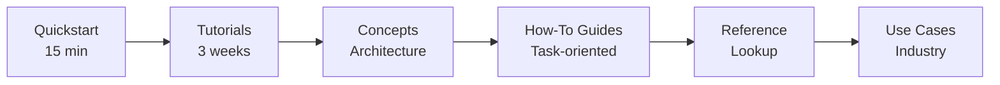

# SD-JWT .NET Documentation

A .NET ecosystem for **Selective Disclosure JSON Web Tokens**, verifiable credentials, wallet interoperability, and delegated agent trust. 21 NuGet packages plus an ASP.NET Core issuer reference server. 2,500+ xUnit tests. RFC 9901, OpenID4VC, SIOPv2, W3C VCDM 2.0, ISO 18013-5, eIDAS 2.0, and preview Agent Trust extensions.

---

## Who this is for

| You Are                                     | Start Here                                                                    | Goal                                                      |
| ------------------------------------------- | ----------------------------------------------------------------------------- | --------------------------------------------------------- |
| **Decision Maker** evaluating adoption      | [Capability Matrix](reference/capabilities.md)                                | Understand ecosystem coverage and roadmap                 |
| **Architect** designing a credential system | [Ecosystem Architecture](concepts/ecosystem-architecture.md)                  | Design issuer, verifier, wallet, and trust infrastructure |
| **Developer** building an integration       | [15-Minute Quickstart](getting-started/quickstart.md)                         | Issue, present, and verify your first SD-JWT              |
| **Security Engineer** reviewing the stack   | [HAIP Compliance](concepts/haip.md)                                           | Validate cryptographic and policy controls                |
| **Operations** preparing for production     | [Deployment Patterns](concepts/ecosystem-architecture.md#deployment-patterns) | Plan infrastructure and key management                    |

---

## Choose Your Path

### I need core SD-JWT

- [15-Minute Quickstart](getting-started/quickstart.md)
- [SD-JWT](concepts/sd-jwt.md)
- [Core Package README](../src/SdJwt.Net/README.md)

### I am building issuer, verifier, or wallet infrastructure

- [Ecosystem Architecture](concepts/ecosystem-architecture.md)
- [OpenID4VCI](concepts/openid4vci.md)
- [OpenID4VP](concepts/openid4vp.md)
- [Presentation Exchange](concepts/presentation-exchange.md)
- [mdoc](concepts/mdoc.md)
- [HAIP](concepts/haip.md)
- [EUDIW / ARF Reference Infrastructure](concepts/eudiw.md)

### I am securing AI agents or enterprise tool calls

- [Agent Trust Profile](concepts/agent-trust-profile.md)
- [Agent Trust Kits](concepts/agent-trust-kits.md)
- [Agent Trust Integration Guide](guides/agent-trust-integration.md)
- [MCP Trust Demo](examples/mcp-trust-demo.md)

---

## Why SD-JWT .NET?

| Pillar                         | What It Means                                                                                                      |
| ------------------------------ | ------------------------------------------------------------------------------------------------------------------ |
| **Standards-Aligned Coverage** | RFC 9901, OpenID4VCI/VP 1.0, DIF PEX v2.1.1, OpenID Federation 1.0, HAIP 1.0, ISO 18013-5, plus tracked drafts     |
| **Enterprise Security**        | HAIP Final flow/profile validation, algorithm enforcement, constant-time operations, replay prevention, zero-trust |
| **Maturity-Labeled Packages**  | Stable, Spec-Tracking, Profile, Reference, and Preview classifications in [MATURITY.md](../MATURITY.md)            |
| **Full Credential Lifecycle**  | Issuance, presentation, revocation, trust resolution, status checking, wallet storage                              |

---

## Learning path

### Week 1: Fundamentals

1. [15-Minute Quickstart](getting-started/quickstart.md) - Build Issuer + Wallet + Verifier
2. [Running the Samples](getting-started/running-the-samples.md) - Explore the interactive CLI
3. [SD-JWT](concepts/sd-jwt.md) - How selective disclosure works

### Week 2: Standards & protocols

1. [Beginner → Advanced Tutorials](tutorials/README.md) - 19 hands-on tutorials
2. [Ecosystem Architecture](concepts/ecosystem-architecture.md) - Package map and deployment patterns
3. [OpenID4VCI](concepts/openid4vci.md) + [OpenID4VP](concepts/openid4vp.md) - Issuance and presentation protocols

### Week 3: Production

1. [HAIP Compliance](concepts/haip.md) - HAIP Final flows, credential profiles, and policy enforcement
2. [How-To Guides](guides/issuing-credentials.md) - Task-oriented implementation guides
3. [Use Cases](use-cases/README.md) - Industry scenarios with working examples

---

## Documentation map

| Section                                                          | Purpose                                         | Start With                                                     |
| ---------------------------------------------------------------- | ----------------------------------------------- | -------------------------------------------------------------- |
| [`getting-started/`](getting-started/quickstart.md)              | First-run tutorials and environment setup       | [quickstart.md](getting-started/quickstart.md)                 |
| [`concepts/`](concepts/README.md)                                | Architecture, design, and protocol explanations | [Concepts Index](concepts/README.md)                           |
| [`tutorials/`](tutorials/README.md)                              | Step-by-step tutorials (beginner → advanced)    | [Tutorials Index](tutorials/README.md)                         |
| [`guides/`](guides/issuing-credentials.md)                       | Task-oriented implementation guides             | [Issuing Credentials](guides/issuing-credentials.md)           |
| [`use-cases/`](use-cases/README.md)                              | Industry use cases with reference architectures | [Use Cases Index](use-cases/README.md)                         |
| [`examples/`](examples/README.md)                                | End-to-end integration examples                 | [Examples Index](examples/README.md)                           |
| [`reference/`](reference/README.md)                              | Capabilities, standards, platform support       | [Reference Index](reference/README.md)                         |
| [`reference/security.md`](reference/security.md)                 | Security model and deployment guidance          | [Security Model](reference/security.md)                        |
| [`reference/platform-support.md`](reference/platform-support.md) | Target frameworks, platforms, and benchmarks    | [Platform Support](reference/platform-support.md)              |
| [`reference/standards-status.md`](reference/standards-status.md) | Specification status and package maturity       | [Standards and Maturity Status](reference/standards-status.md) |
| [`proposals/`](proposals/)                                       | Design proposals for planned features           | Listed below                                                   |

---

## Ecosystem packages

### Core

| Package                                                         | Specification              | Status        |
| --------------------------------------------------------------- | -------------------------- | ------------- |
| [`SdJwt.Net`](../src/SdJwt.Net/README.md)                       | RFC 9901 (SD-JWT)          | Stable        |
| [`SdJwt.Net.Vc`](../src/SdJwt.Net.Vc/README.md)                 | SD-JWT VC draft-16         | Spec-Tracking |
| [`SdJwt.Net.StatusList`](../src/SdJwt.Net.StatusList/README.md) | Token Status List draft-20 | Spec-Tracking |
| [`SdJwt.Net.VcDm`](../src/SdJwt.Net.VcDm/README.md)             | W3C VCDM 2.0               | Stable        |

### Protocols

| Package                                                                             | Specification          | Status        |
| ----------------------------------------------------------------------------------- | ---------------------- | ------------- |
| [`SdJwt.Net.Oid4Vci`](../src/SdJwt.Net.Oid4Vci/README.md)                           | OpenID4VCI 1.0 Final   | Stable        |
| [`SdJwt.Net.Oid4Vp`](../src/SdJwt.Net.Oid4Vp/README.md)                             | OpenID4VP 1.0 + DC API | Stable        |
| [`SdJwt.Net.SiopV2`](../src/SdJwt.Net.SiopV2/README.md)                             | SIOPv2 draft 13        | Spec-Tracking |
| [`SdJwt.Net.PresentationExchange`](../src/SdJwt.Net.PresentationExchange/README.md) | DIF PEX v2.1.1         | Stable        |
| [`SdJwt.Net.OidFederation`](../src/SdJwt.Net.OidFederation/README.md)               | OpenID Federation 1.0  | Stable        |

### Profiles and formats

| Package                                             | Specification   | Status  |
| --------------------------------------------------- | --------------- | ------- |
| [`SdJwt.Net.HAIP`](../src/SdJwt.Net.HAIP/README.md) | HAIP 1.0 Final  | Profile |
| [`SdJwt.Net.Mdoc`](../src/SdJwt.Net.Mdoc/README.md) | ISO 18013-5 mDL | Stable  |

### Reference infrastructure

| Package                                                 | Purpose                         | Status    |
| ------------------------------------------------------- | ------------------------------- | --------- |
| [`SdJwt.Net.Wallet`](../src/SdJwt.Net.Wallet/README.md) | Holder-side reference framework | Reference |
| [`SdJwt.Net.Eudiw`](../src/SdJwt.Net.Eudiw/README.md)   | EUDIW / ARF reference helpers   | Reference |

### Agent trust

| Package                                                                                     | Purpose                         | Status  |
| ------------------------------------------------------------------------------------------- | ------------------------------- | ------- |
| [`SdJwt.Net.AgentTrust.Core`](../src/SdJwt.Net.AgentTrust.Core/README.md)                   | Capability token mint/verify    | Preview |
| [`SdJwt.Net.AgentTrust.Policy`](../src/SdJwt.Net.AgentTrust.Policy/README.md)               | Rule-based policy engine        | Preview |
| [`SdJwt.Net.AgentTrust.AspNetCore`](../src/SdJwt.Net.AgentTrust.AspNetCore/README.md)       | Inbound verification middleware | Preview |
| [`SdJwt.Net.AgentTrust.Maf`](../src/SdJwt.Net.AgentTrust.Maf/README.md)                     | MAF/MCP outbound propagation    | Preview |
| [`SdJwt.Net.AgentTrust.OpenTelemetry`](../src/SdJwt.Net.AgentTrust.OpenTelemetry/README.md) | Metrics and telemetry receipts  | Preview |
| [`SdJwt.Net.AgentTrust.Policy.Opa`](../src/SdJwt.Net.AgentTrust.Policy.Opa/README.md)       | OPA external policy engine      | Preview |
| [`SdJwt.Net.AgentTrust.Mcp`](../src/SdJwt.Net.AgentTrust.Mcp/README.md)                     | MCP trust interceptor/guard     | Preview |
| [`SdJwt.Net.AgentTrust.A2A`](../src/SdJwt.Net.AgentTrust.A2A/README.md)                     | Agent-to-agent delegation       | Preview |

---

## Enterprise planning

- [Capability Matrix](reference/capabilities.md) - Full feature assessment
- [Enterprise Roadmap](ENTERPRISE_ROADMAP.md) - Strategic phases and timeline
- [Proposals](proposals/) - Design proposals for planned features

---

## Source repository

This documentation is part of the [SD-JWT .NET](https://github.com/openwallet-foundation-labs/sd-jwt-dotnet) open source project, maintained under the [OpenWallet Foundation Labs](https://github.com/openwallet-foundation-labs) umbrella.

- **GitHub**: [openwallet-foundation-labs/sd-jwt-dotnet](https://github.com/openwallet-foundation-labs/sd-jwt-dotnet)
- **Issues**: [GitHub Issues](https://github.com/openwallet-foundation-labs/sd-jwt-dotnet/issues)
- **Discussions**: [GitHub Discussions](https://github.com/openwallet-foundation-labs/sd-jwt-dotnet/discussions)
- **NuGet**: [SdJwt.Net](https://www.nuget.org/packages/SdJwt.Net/)
