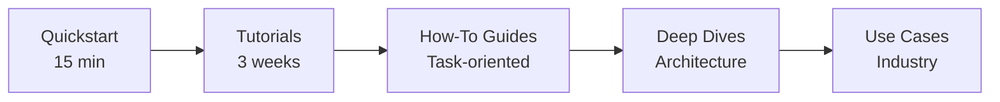

# SD-JWT .NET Documentation

A .NET ecosystem for **Selective Disclosure JSON Web Tokens** and the OpenID for Verifiable Credentials stack. 20 packages. 2,600+ tests. RFC 9901, OpenID4VC, ISO 18013-5, eIDAS 2.0.

---

## Who This Is For

| You Are                                     | Start Here                                                                    | Goal                                                      |
| ------------------------------------------- | ----------------------------------------------------------------------------- | --------------------------------------------------------- |
| **Decision Maker** evaluating adoption      | [Capability Matrix](capabilities.md)                                          | Understand ecosystem coverage and roadmap                 |
| **Architect** designing a credential system | [Ecosystem Architecture](concepts/ecosystem-architecture.md)                  | Design issuer, verifier, wallet, and trust infrastructure |
| **Developer** building an integration       | [15-Minute Quickstart](getting-started/quickstart.md)                         | Issue, present, and verify your first SD-JWT              |
| **Security Engineer** reviewing the stack   | [HAIP Compliance](concepts/haip-deep-dive.md)                                 | Validate cryptographic and policy controls                |
| **Operations** preparing for production     | [Deployment Patterns](concepts/ecosystem-architecture.md#deployment-patterns) | Plan infrastructure and key management                    |

---

## Why SD-JWT .NET

| Pillar                        | What It Means                                                                                   |
| ----------------------------- | ----------------------------------------------------------------------------------------------- |
| **Standards Complete**        | RFC 9901, OpenID4VCI/VP 1.0, DIF PEX v2.1.1, OpenID Federation 1.0, HAIP 1.0, ISO 18013-5       |
| **Enterprise Security**       | HAIP Levels 1-3, algorithm enforcement, constant-time operations, replay prevention, zero-trust |
| **Production Ready**          | 2,600+ tests, zero warnings, multi-framework (.NET 8/9/10, netstandard2.1), NuGet publishing    |
| **Full Credential Lifecycle** | Issuance, presentation, revocation, trust resolution, status checking, wallet storage           |

---

## Learning Path

### Week 1: Fundamentals

1. [15-Minute Quickstart](getting-started/quickstart.md) - Build Issuer + Wallet + Verifier
2. [Running the Samples](getting-started/running-the-samples.md) - Explore the interactive CLI
3. [SD-JWT Deep Dive](concepts/sd-jwt-deep-dive.md) - How selective disclosure works

### Week 2: Standards & Protocols

1. [Beginner → Advanced Tutorials](tutorials/README.md) - 19 hands-on tutorials
2. [Ecosystem Architecture](concepts/ecosystem-architecture.md) - Package map and deployment patterns
3. [OpenID4VCI](concepts/openid4vci-deep-dive.md) + [OpenID4VP](concepts/openid4vp-deep-dive.md) - Issuance and presentation protocols

### Week 3: Production

1. [HAIP Compliance](concepts/haip-deep-dive.md) - Security levels and policy enforcement
2. [How-To Guides](guides/issuing-credentials.md) - Task-oriented implementation guides
3. [Use Cases](use-cases/README.md) - Industry scenarios with working examples

---

## Documentation Map

| Section                                             | Purpose                                         | Start With                                           |
| --------------------------------------------------- | ----------------------------------------------- | ---------------------------------------------------- |
| [`getting-started/`](getting-started/quickstart.md) | First-run tutorials and environment setup       | [quickstart.md](getting-started/quickstart.md)       |
| [`concepts/`](concepts/README.md)                   | Architecture, design, and protocol deep dives   | [Concepts Index](concepts/README.md)                 |
| [`tutorials/`](tutorials/README.md)                 | Step-by-step tutorials (beginner → advanced)    | [Tutorials Index](tutorials/README.md)               |
| [`guides/`](guides/issuing-credentials.md)          | Task-oriented implementation guides             | [Issuing Credentials](guides/issuing-credentials.md) |
| [`use-cases/`](use-cases/README.md)                 | Industry use cases with reference architectures | [Use Cases Index](use-cases/README.md)               |
| [`examples/`](examples/README.md)                   | End-to-end integration examples                 | [Examples Index](examples/README.md)                 |
| [`proposals/`](proposals/)                          | Design proposals for planned features           | Listed below                                         |

---

## Ecosystem Packages

### Core

| Package                                                         | Specification              | Status |
| --------------------------------------------------------------- | -------------------------- | ------ |
| [`SdJwt.Net`](../src/SdJwt.Net/README.md)                       | RFC 9901 (SD-JWT)          | Stable |
| [`SdJwt.Net.Vc`](../src/SdJwt.Net.Vc/README.md)                 | SD-JWT VC draft-15         | Stable |
| [`SdJwt.Net.StatusList`](../src/SdJwt.Net.StatusList/README.md) | Token Status List draft-18 | Stable |

### Protocols

| Package                                                                             | Specification          | Status |
| ----------------------------------------------------------------------------------- | ---------------------- | ------ |
| [`SdJwt.Net.Oid4Vci`](../src/SdJwt.Net.Oid4Vci/README.md)                           | OpenID4VCI 1.0 Final   | Stable |
| [`SdJwt.Net.Oid4Vp`](../src/SdJwt.Net.Oid4Vp/README.md)                             | OpenID4VP 1.0 + DC API | Stable |
| [`SdJwt.Net.PresentationExchange`](../src/SdJwt.Net.PresentationExchange/README.md) | DIF PEX v2.1.1         | Stable |
| [`SdJwt.Net.OidFederation`](../src/SdJwt.Net.OidFederation/README.md)               | OpenID Federation 1.0  | Stable |

### Compliance & Formats

| Package                                                 | Specification           | Status |
| ------------------------------------------------------- | ----------------------- | ------ |
| [`SdJwt.Net.HAIP`](../src/SdJwt.Net.HAIP/README.md)     | HAIP 1.0                | Stable |
| [`SdJwt.Net.Mdoc`](../src/SdJwt.Net.Mdoc/README.md)     | ISO 18013-5 mDL         | Stable |
| [`SdJwt.Net.Wallet`](../src/SdJwt.Net.Wallet/README.md) | Generic Wallet (plugin) | Stable |
| [`SdJwt.Net.Eudiw`](../src/SdJwt.Net.Eudiw/README.md)   | eIDAS 2.0 EU Wallet ARF | Stable |

### Agent Trust

| Package                                                                                     | Purpose                         | Status  |
| ------------------------------------------------------------------------------------------- | ------------------------------- | ------- |
| [`SdJwt.Net.AgentTrust.Core`](../src/SdJwt.Net.AgentTrust.Core/README.md)                   | Capability token mint/verify    | Preview |
| [`SdJwt.Net.AgentTrust.Policy`](../src/SdJwt.Net.AgentTrust.Policy/README.md)               | Rule-based policy engine        | Preview |
| [`SdJwt.Net.AgentTrust.AspNetCore`](../src/SdJwt.Net.AgentTrust.AspNetCore/README.md)       | Inbound verification middleware | Preview |
| [`SdJwt.Net.AgentTrust.Maf`](../src/SdJwt.Net.AgentTrust.Maf/README.md)                     | MAF/MCP outbound propagation    | Preview |
| [`SdJwt.Net.AgentTrust.OpenTelemetry`](../src/SdJwt.Net.AgentTrust.OpenTelemetry/README.md) | Metrics and telemetry receipts  | Preview |
| [`SdJwt.Net.AgentTrust.Policy.Opa`](../src/SdJwt.Net.AgentTrust.Policy.Opa/README.md)       | OPA external policy engine      | Preview |
| [`SdJwt.Net.AgentTrust.Mcp`](../src/SdJwt.Net.AgentTrust.Mcp/README.md)                     | MCP trust interceptor/guard     | Preview |
| [`SdJwt.Net.AgentTrust.A2A`](../src/SdJwt.Net.AgentTrust.A2A/README.md)                     | Agent-to-agent delegation       | Preview |

---

## Enterprise Planning

- [Capability Matrix](capabilities.md) - Full feature assessment
- [Enterprise Roadmap](ENTERPRISE_ROADMAP.md) - Strategic phases and timeline
- [Proposals](proposals/) - Design proposals for planned features

---

## Source Repository

This documentation is part of the [SD-JWT .NET](https://github.com/openwallet-foundation-labs/sd-jwt-dotnet) open source project, maintained under the [OpenWallet Foundation Labs](https://github.com/openwallet-foundation-labs) umbrella.

- **GitHub**: [openwallet-foundation-labs/sd-jwt-dotnet](https://github.com/openwallet-foundation-labs/sd-jwt-dotnet)
- **Issues**: [GitHub Issues](https://github.com/openwallet-foundation-labs/sd-jwt-dotnet/issues)
- **Discussions**: [GitHub Discussions](https://github.com/openwallet-foundation-labs/sd-jwt-dotnet/discussions)
- **NuGet**: [SdJwt.Net](https://www.nuget.org/packages/SdJwt.Net/)
