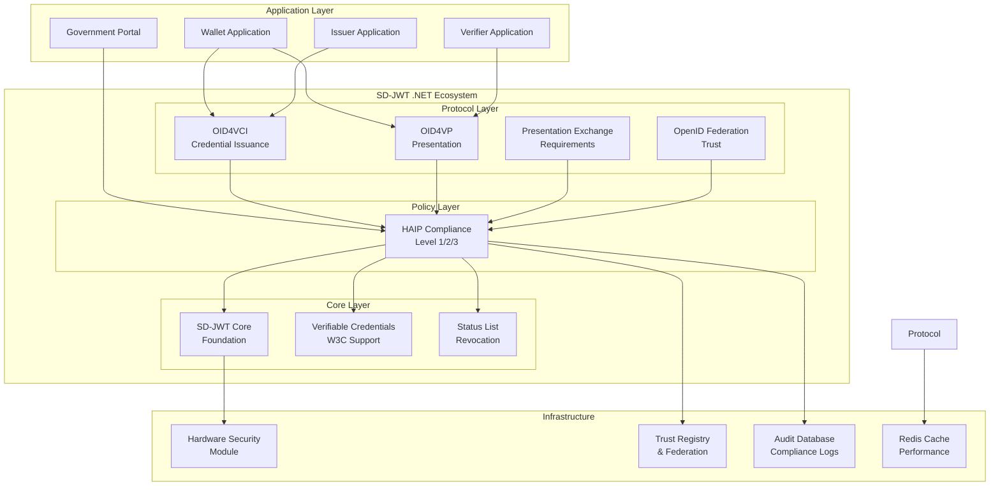
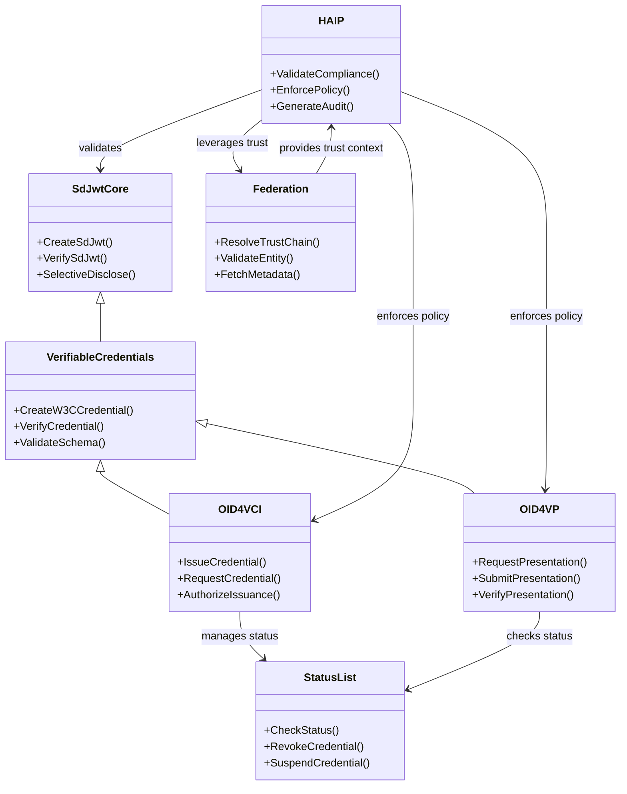
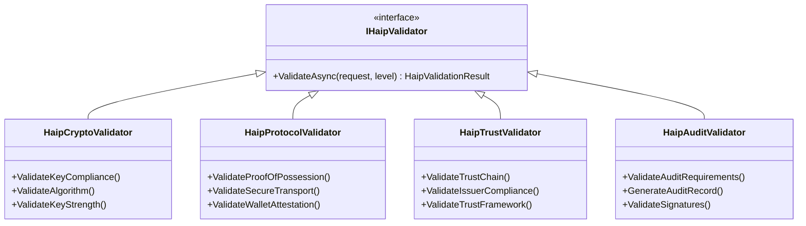
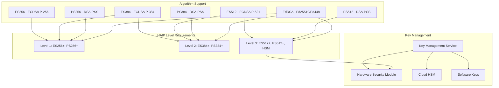
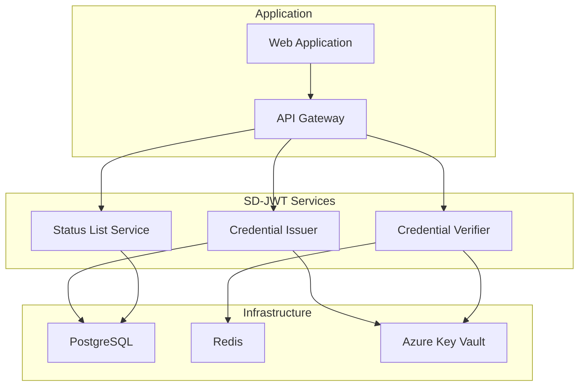
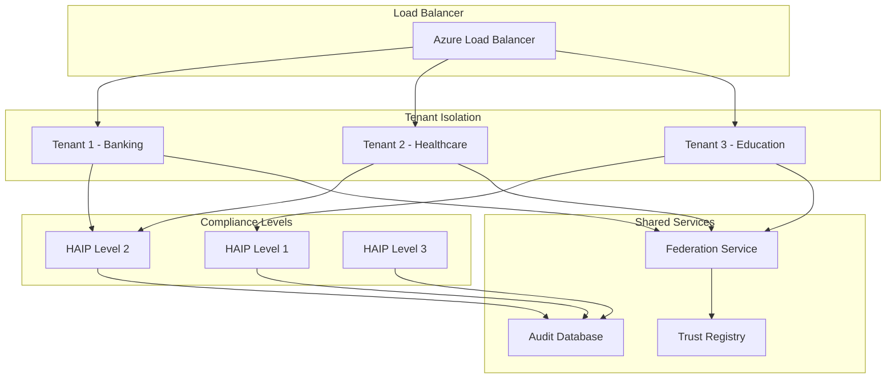
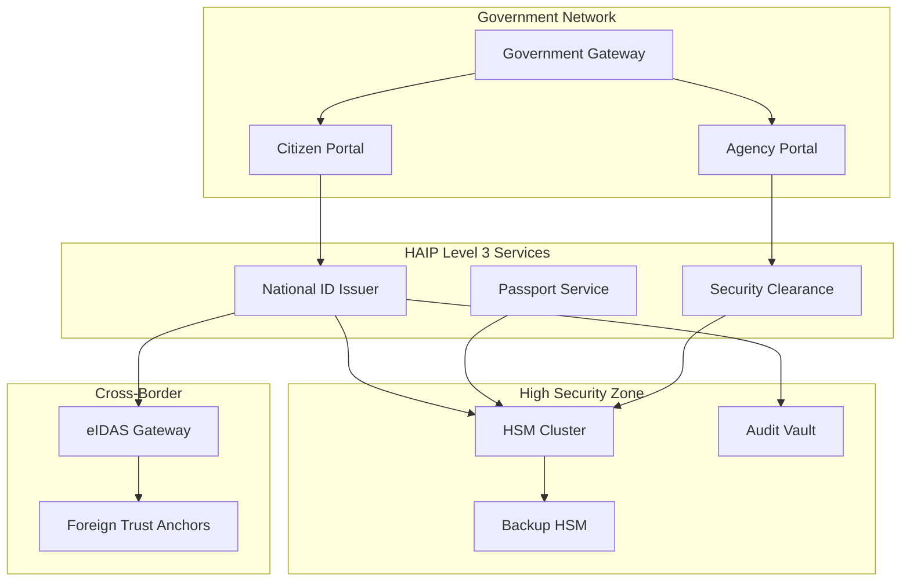

# SD-JWT .NET Ecosystem Architecture Design

## Executive Summary

The SD-JWT .NET ecosystem provides a comprehensive, modular implementation of the OpenID4VC (OpenID for Verifiable Credentials) specification suite, with a unique focus on high-assurance security through the HAIP (High Assurance Interoperability Profile) framework. This document outlines the complete architecture, design principles, and integration patterns that make this ecosystem suitable for everything from educational credentials to sovereign government identity systems.

## Table of Contents

- [Executive Summary](#executive-summary)
- [Architecture Overview](#architecture-overview)
- [Design Principles](#design-principles)
- [Core Ecosystem Components](#core-ecosystem-components)
- [HAIP Policy Layer Architecture](#haip-policy-layer-architecture)
- [Integration Patterns](#integration-patterns)
- [Security Architecture](#security-architecture)
- [Deployment Architectures](#deployment-architectures)
- [Trust Infrastructure](#trust-infrastructure)
- [Compliance and Regulatory Framework](#compliance-and-regulatory-framework)
- [Performance and Scalability](#performance-and-scalability)
- [Extension Points](#extension-points)
- [Future Roadmap](#future-roadmap)

## Architecture Overview

### High-Level System Architecture



### Ecosystem Component Relationships



## Design Principles

### 1. Modular Architecture

Each package serves a specific purpose and can be used independently or in combination:

```csharp
// Use core SD-JWT without protocols
services.AddSdJwt();

// Add specific protocols as needed
services.AddOid4Vci();  // For issuing
services.AddOid4Vp();   // For verification

// Add compliance layer when needed
services.AddHaip(HaipLevel.Level2_VeryHigh);
```

### 2. Policy-Driven Security

HAIP acts as a configurable policy layer that enforces security requirements:

```csharp
// Policy automatically applied across all operations
services.AddSdJwtEcosystem(config =>
{
    config.UseHaipProfile(HaipLevel.Level2_VeryHigh);
    // All operations now enforce Level 2 requirements:
    // - ES384+ algorithms only
    // - Wallet attestation required
    // - DPoP tokens required
    // - Enhanced audit logging
});
```

### 3. Non-Intrusive Integration

HAIP and other components integrate without requiring changes to existing code:

```csharp
// Existing code continues to work
var credential = await issuer.CreateCredentialAsync(request);

// HAIP validation happens transparently
// - Algorithm validation
// - Protocol security checks
// - Audit trail generation
// - Compliance reporting
```

### 4. Progressive Security

Three HAIP levels provide appropriate security for different use cases:

```csharp
public enum HaipLevel
{
    Level1_High,        // Education, standard business
    Level2_VeryHigh,    // Financial, healthcare
    Level3_Sovereign    // Government, critical infrastructure
}
```

### 5. Standards Compliance

Implements current and emerging standards:

- **IETF RFC 7519**: JSON Web Token (JWT)
- **IETF Draft**: Selective Disclosure for JWTs (SD-JWT)
- **OpenID4VC**: Credential issuance and presentation
- **W3C VC**: Verifiable Credentials Data Model
- **DIF PE**: Presentation Exchange v2.0
- **OpenID Federation**: Trust infrastructure

## Core Ecosystem Components

### SdJwt.Net - Foundation Layer

**Purpose**: Core SD-JWT implementation with selective disclosure capabilities

**Key Features**:

```csharp
// Selective disclosure creation
var builder = new SdJwtBuilder()
    .WithClaim("name", "John Doe")                    // Always visible
    .WithSelectiveDisclosureClaim("email", "john@example.com")  // Selectively disclosable
    .WithSelectiveDisclosureClaim("age", 30);

var sdJwt = await builder.CreateSdJwtAsync(signingKey);

// Selective disclosure presentation
var presentation = SdJwtPresentation.Parse(sdJwt)
    .RevealClaim("email")      // Choose what to reveal
    .HideClaim("age")          // Keep private
    .AddKeyBinding("audience"); // Prove possession

var presentationJwt = presentation.ToString();
```

**Architecture**:

- **SdJwtBuilder**: Fluent API for SD-JWT creation
- **SdJwtVerifier**: Signature and structure validation
- **SdJwtPresentation**: Selective disclosure control
- **SaltGenerator**: Cryptographic salt generation
- **ClaimProcessor**: Selective disclosure claim processing

### SdJwt.Net.Vc - W3C Compliance Layer

**Purpose**: W3C Verifiable Credentials compliance on top of SD-JWT

**Key Features**:

```csharp
// W3C VC-compliant SD-JWT
var vcBuilder = new VerifiableCredentialBuilder()
    .WithType("UniversityDegreeCredential")
    .WithIssuer("https://university.example.edu")
    .WithSubject("did:example:student123")
    .WithCredentialSubject("degree", degreeInfo)
    .WithSelectiveCredentialSubject("gpa", 3.8);   // Selectively disclosable

var verifiableCredential = await vcBuilder.CreateAsync(signingKey);
```

**W3C Compliance Features**:

- Standard VC structure (`@context`, `type`, `issuer`, etc.)
- Credential subject with selective disclosure
- Issuance and expiration date handling
- Proof format compliance
- Schema validation support

### SdJwt.Net.Oid4Vci - Credential Issuance Protocol

**Purpose**: Complete OpenID4VCI implementation for credential issuance

**Issuer Implementation**:

```csharp
// Configure OID4VCI issuer
services.AddSdJwtIssuer(options =>
{
    options.IssuerUrl = "https://issuer.example.com";
    options.SupportedCredentialTypes = new[] 
    { 
        "UniversityDegreeCredential",
        "EmployeeIdCredential" 
    };
    options.SupportedFormats = new[] { "vc+sd-jwt" };
    
    // Authorization server integration
    options.AuthorizationServer = "https://auth.example.com";
    options.TokenEndpoint = "https://auth.example.com/token";
});

// Automatic endpoints
app.MapOid4VciEndpoints();  // /.well-known/openid-credential-issuer, /credential, etc.
```

**Client (Wallet) Implementation**:

```csharp
// OID4VCI client for wallets
var client = new Oid4VciClient("https://issuer.example.com");

// Discover issuer capabilities
var metadata = await client.GetIssuerMetadataAsync();

// Authorization flow
var authUrl = await client.GetAuthorizationUrlAsync(new AuthorizationRequest
{
    CredentialType = "UniversityDegreeCredential",
    RedirectUri = "https://wallet.app/callback"
});

// Exchange authorization code for credential
var tokenResponse = await client.ExchangeAuthorizationCodeAsync(code);
var credential = await client.RequestCredentialAsync(tokenResponse.AccessToken);
```

### SdJwt.Net.Oid4Vp - Presentation Protocol

**Purpose**: OpenID4VP implementation for credential presentation and verification

**Verifier Implementation**:

```csharp
// Configure OID4VP verifier
services.AddSdJwtVerifier(options =>
{
    options.VerifierUrl = "https://verifier.example.com";
    options.SupportedVpFormats = new[] { "vc+sd-jwt" };
    options.RequiredClientAuthentication = true;
});

// Create presentation request
var presentationRequest = new PresentationRequestBuilder()
    .WithPresentationDefinition(presentationDefinition)
    .WithAudience("https://verifier.example.com")
    .WithNonce(GenerateNonce())
    .Build();

var requestUri = await verifier.CreatePresentationRequestAsync(presentationRequest);
```

**Wallet Implementation**:

```csharp
// Parse presentation request
var request = await wallet.ParsePresentationRequestAsync(requestUri);

// Find matching credentials
var matches = await wallet.FindMatchingCredentialsAsync(
    request.PresentationDefinition);

// Create presentation with selective disclosure
var presentation = await wallet.CreatePresentationAsync(new PresentationOptions
{
    Credentials = matches,
    RevealedClaims = userSelectedClaims,  // User choice
    Audience = request.ClientId,
    Nonce = request.Nonce
});

// Submit presentation
await wallet.SubmitPresentationAsync(presentation);
```

### SdJwt.Net.PresentationExchange - Requirements Engine

**Purpose**: DIF Presentation Exchange v2.0 implementation for complex credential requirements

**Key Features**:

```csharp
// Define complex presentation requirements
var presentationDefinition = new PresentationDefinition
{
    Id = "employment_verification",
    InputDescriptors = new[]
    {
        new InputDescriptor
        {
            Id = "university_degree",
            Constraints = new Constraints
            {
                Fields = new[]
                {
                    new Field
                    {
                        Path = new[] { "$.vc.credentialSubject.degree.type" },
                        Filter = new
                        {
                            type = "string",
                            @enum = new[] { "BachelorDegree", "MasterDegree", "PhD" }
                        }
                    }
                }
            }
        },
        new InputDescriptor
        {
            Id = "employment_history",
            Constraints = new Constraints
            {
                Fields = new[]
                {
                    new Field
                    {
                        Path = new[] { "$.vc.credentialSubject.experience.years" },
                        Filter = new
                        {
                            type = "number",
                            minimum = 2
                        }
                    }
                }
            }
        }
    }
};

// Evaluate presentation against requirements
var evaluator = new PresentationExchangeEvaluator();
var result = await evaluator.EvaluateAsync(presentation, presentationDefinition);

if (result.IsValid)
{
    var matchedCredentials = result.Matches;
    // Process verified credentials
}
```

### SdJwt.Net.StatusList - Revocation Management

**Purpose**: Credential status management with privacy-preserving status lists

**Key Features**:

```csharp
// Configure status list service
services.AddSdJwtStatusList(options =>
{
    options.BaseUrl = "https://status.example.com";
    options.StatusListSize = 131072;  // 128KB bitfield
    options.RefreshInterval = TimeSpan.FromHours(1);
});

// Issue credential with status
var credential = await issuer.CreateCredentialAsync(request);
var statusEntry = await statusList.AddCredentialAsync(credential.Id);

credential.AddStatusListEntry(statusEntry);

// Revoke credential
await statusList.RevokeCredentialAsync(credential.Id, "user_request");

// Check status during verification
var status = await statusList.CheckStatusAsync(credential.StatusListUrl, credential.StatusIndex);
if (status.IsRevoked)
{
    throw new CredentialRevokedException("Credential has been revoked");
}
```

### SdJwt.Net.OidFederation - Trust Infrastructure

**Purpose**: OpenID Federation implementation for scalable trust management

**Key Features**:

```csharp
// Configure federation entity
services.AddOpenIdFederation(options =>
{
    options.EntityId = "https://bank.example.com";
    options.TrustAnchors = new[]
    {
        "https://financial-federation.gov",
        "https://trust.eudi.europa.eu"
    };
    options.FederationEndpoint = "/.well-known/openid_federation";
});

// Automatic trust chain resolution
var federationService = serviceProvider.GetService<IFederationService>();
var trustChain = await federationService.ResolveTrustChainAsync("https://other-bank.com");

if (trustChain.IsValid)
{
    var metadata = trustChain.LeafEntity.Metadata;
    // Use trusted entity metadata
}
```

## HAIP Policy Layer Architecture

### Policy Engine Design

HAIP implements a pluggable policy engine that validates requests against compliance requirements:

```csharp
public class HaipPolicyEngine
{
    private readonly IEnumerable<IHaipValidator> _validators;
    
    public async Task<HaipComplianceResult> ValidateAsync(
        object request, 
        HaipLevel requiredLevel)
    {
        var violations = new List<HaipViolation>();
        var auditSteps = new List<AuditStep>();
        
        foreach (var validator in _validators)
        {
            var result = await validator.ValidateAsync(request, requiredLevel);
            violations.AddRange(result.Violations);
            auditSteps.AddRange(result.AuditSteps);
        }
        
        return new HaipComplianceResult
        {
            IsCompliant = violations.Count == 0,
            AchievedLevel = CalculateAchievedLevel(violations),
            Violations = violations,
            AuditTrail = new HaipAuditTrail { Steps = auditSteps }
        };
    }
}
```

### Validator Architecture



### Progressive Compliance Model

```csharp
public static class HaipRequirements
{
    public static readonly Dictionary<HaipLevel, HaipLevelRequirements> LevelRequirements = 
        new Dictionary<HaipLevel, HaipLevelRequirements>
        {
            [HaipLevel.Level1_High] = new HaipLevelRequirements
            {
                AllowedAlgorithms = new[] { "ES256", "ES384", "PS256", "PS384", "EdDSA" },
                MinimumKeySize = new Dictionary<string, int>
                {
                    ["EC"] = 256,
                    ["RSA"] = 2048
                },
                RequireProofOfPossession = true,
                RequireSecureTransport = true,
                RequireWalletAttestation = false,
                RequireHsmBacking = false
            },
            
            [HaipLevel.Level2_VeryHigh] = new HaipLevelRequirements
            {
                AllowedAlgorithms = new[] { "ES384", "ES512", "PS384", "PS512", "EdDSA" },
                MinimumKeySize = new Dictionary<string, int>
                {
                    ["EC"] = 384,
                    ["RSA"] = 3072
                },
                RequireProofOfPossession = true,
                RequireSecureTransport = true,
                RequireWalletAttestation = true,
                RequireDPoP = true,
                RequirePAR = true,
                RequireHsmBacking = false
            },
            
            [HaipLevel.Level3_Sovereign] = new HaipLevelRequirements
            {
                AllowedAlgorithms = new[] { "ES512", "PS512", "EdDSA" },
                MinimumKeySize = new Dictionary<string, int>
                {
                    ["EC"] = 521,
                    ["RSA"] = 4096
                },
                RequireProofOfPossession = true,
                RequireSecureTransport = true,
                RequireWalletAttestation = true,
                RequireDPoP = true,
                RequirePAR = true,
                RequireHsmBacking = true,
                RequireQualifiedSignatures = true,
                RequireEnhancedDeviceAttestation = true
            }
        };
}
```

## Integration Patterns

### 1. Layered Integration

```csharp
// Application layer decides compliance level
public class CredentialController : ControllerBase
{
    [HttpPost("university-degree")]
    public async Task<IActionResult> IssueUniversityDegree(DegreeRequest request)
    {
        // Level 1 appropriate for education
        return await IssueCredentialWithCompliance(request, HaipLevel.Level1_High);
    }
    
    [HttpPost("banking-kyc")]
    public async Task<IActionResult> IssueBankingKyc(KycRequest request)
    {
        // Level 2 required for financial services
        return await IssueCredentialWithCompliance(request, HaipLevel.Level2_VeryHigh);
    }
    
    [HttpPost("national-id")]
    public async Task<IActionResult> IssueNationalId(NationalIdRequest request)
    {
        // Level 3 required for government
        return await IssueCredentialWithCompliance(request, HaipLevel.Level3_Sovereign);
    }
}
```

### 2. Configuration-Driven Integration

```csharp
// Environment-specific compliance levels
public class Startup
{
    public void ConfigureServices(IServiceCollection services)
    {
        var haipLevel = Configuration.GetValue<HaipLevel>("Haip:RequiredLevel");
        
        services.AddSdJwtEcosystem(options =>
        {
            options.UseHaipProfile(haipLevel, haipConfig =>
            {
                // Load configuration from appsettings.json
                Configuration.GetSection("Haip").Bind(haipConfig);
            });
        });
    }
}
```

### 3. Middleware Integration

```csharp
// HAIP enforcement as middleware
public class HaipEnforcementMiddleware
{
    private readonly RequestDelegate _next;
    private readonly IHaipPolicyEngine _policyEngine;
    
    public async Task InvokeAsync(HttpContext context)
    {
        if (IsCredentialEndpoint(context.Request.Path))
        {
            var request = await ReadRequestAsync(context);
            var requiredLevel = DetermineRequiredLevel(context);
            
            var complianceResult = await _policyEngine.ValidateAsync(request, requiredLevel);
            
            if (!complianceResult.IsCompliant)
            {
                await WriteComplianceErrorAsync(context, complianceResult);
                return;
            }
            
            // Add compliance information to context
            context.Items["HaipCompliance"] = complianceResult;
        }
        
        await _next(context);
    }
}
```

### 4. Dependency Injection Integration

```csharp
// Automatic HAIP validation through DI
public class CredentialIssuerService
{
    private readonly ISdJwtIssuerService _issuer;
    private readonly IHaipPolicyEngine _haipEngine;  // Automatically injected
    
    public async Task<CredentialResponse> IssueCredentialAsync(CredentialRequest request)
    {
        // HAIP validation happens automatically via decorators/interceptors
        var credential = await _issuer.CreateCredentialAsync(request);
        
        return new CredentialResponse
        {
            Credential = credential.SdJwt,
            ComplianceLevel = credential.ComplianceLevel
        };
    }
}
```

## Security Architecture

### Cryptographic Architecture



### Trust Architecture

```csharp
// Multi-layered trust validation
public class TrustValidationService
{
    public async Task<TrustValidationResult> ValidateAsync(string entityId, HaipLevel requiredLevel)
    {
        var validationLayers = new ITrustValidationLayer[]
        {
            new CertificateChainValidator(),      // X.509 certificate validation
            new FederationTrustValidator(),       // OpenID Federation trust chains
            new HaipComplianceValidator(),        // HAIP compliance validation
            new RegulatoryComplianceValidator(),  // Regulatory framework validation
            new ReputationValidator()             // Reputation and blacklist checks
        };
        
        var results = new List<LayerValidationResult>();
        
        foreach (var layer in validationLayers)
        {
            var layerResult = await layer.ValidateAsync(entityId, requiredLevel);
            results.Add(layerResult);
            
            if (!layerResult.IsValid && layer.IsRequired)
            {
                break;  // Fail fast for required layers
            }
        }
        
        return new TrustValidationResult
        {
            IsValid = results.All(r => r.IsValid || !r.IsRequired),
            LayerResults = results,
            OverallTrustScore = CalculateTrustScore(results)
        };
    }
}
```

### Audit and Compliance Architecture

```csharp
// Comprehensive audit trail
public class HaipAuditService
{
    public async Task<AuditRecord> CreateAuditRecordAsync(
        HaipComplianceResult complianceResult,
        OperationContext context)
    {
        var auditRecord = new AuditRecord
        {
            AuditId = Guid.NewGuid(),
            Timestamp = DateTimeOffset.UtcNow,
            Operation = context.Operation,
            Subject = context.Subject,
            ComplianceLevel = complianceResult.AchievedLevel,
            
            SecurityContext = new SecurityContext
            {
                Algorithm = context.Algorithm,
                KeyId = context.KeyId,
                IpAddress = context.IpAddress,
                UserAgent = context.UserAgent
            },
            
            ComplianceAssessment = new ComplianceAssessment
            {
                IsCompliant = complianceResult.IsCompliant,
                Violations = complianceResult.Violations,
                RegulatoryFrameworks = GetApplicableFrameworks(context),
                DataProtectionAssessment = CreateDataProtectionAssessment(context)
            },
            
            AuditTrail = complianceResult.AuditTrail
        };
        
        // Digital signature for Level 2+ compliance
        if (complianceResult.AchievedLevel >= HaipLevel.Level2_VeryHigh)
        {
            auditRecord.Signature = await _auditSigner.SignAuditRecordAsync(auditRecord);
        }
        
        await _auditStore.SaveAsync(auditRecord);
        return auditRecord;
    }
}
```

## Deployment Architectures

### 1. Simple Single-Tenant Deployment



### 2. Multi-Tenant Enterprise Deployment



### 3. Government/Sovereign Deployment



### 4. Cloud-Native Kubernetes Deployment

```yaml
# kubernetes-deployment.yaml
apiVersion: v1
kind: Namespace
metadata:
  name: sdjwt-ecosystem
---
apiVersion: apps/v1
kind: Deployment
metadata:
  name: credential-issuer
  namespace: sdjwt-ecosystem
spec:
  replicas: 3
  selector:
    matchLabels:
      app: credential-issuer
  template:
    metadata:
      labels:
        app: credential-issuer
    spec:
      containers:
      - name: issuer
        image: myregistry/sdjwt-issuer:latest
        ports:
        - containerPort: 80
        env:
        - name: HAIP_LEVEL
          value: "Level2_VeryHigh"
        - name: CONNECTION_STRING
          valueFrom:
            secretKeyRef:
              name: database-secret
              key: connection-string
        - name: HSM_ENDPOINT
          valueFrom:
            configMapKeyRef:
              name: hsm-config
              key: endpoint
        volumeMounts:
        - name: signing-keys
          mountPath: /var/secrets/keys
          readOnly: true
        livenessProbe:
          httpGet:
            path: /health
            port: 80
          initialDelaySeconds: 30
          periodSeconds: 10
        readinessProbe:
          httpGet:
            path: /health/ready
            port: 80
          initialDelaySeconds: 5
          periodSeconds: 5
      volumes:
      - name: signing-keys
        secret:
          secretName: signing-keys
---
apiVersion: v1
kind: Service
metadata:
  name: credential-issuer-service
  namespace: sdjwt-ecosystem
spec:
  selector:
    app: credential-issuer
  ports:
  - protocol: TCP
    port: 80
    targetPort: 80
  type: ClusterIP
---
apiVersion: networking.k8s.io/v1
kind: Ingress
metadata:
  name: credential-issuer-ingress
  namespace: sdjwt-ecosystem
  annotations:
    kubernetes.io/ingress.class: nginx
    cert-manager.io/cluster-issuer: letsencrypt-prod
    nginx.ingress.kubernetes.io/ssl-protocols: "TLSv1.2 TLSv1.3"
spec:
  tls:
  - hosts:
    - credentials.example.com
    secretName: credentials-tls
  rules:
  - host: credentials.example.com
    http:
      paths:
      - path: /
        pathType: Prefix
        backend:
          service:
            name: credential-issuer-service
            port:
              number: 80
```

## Trust Infrastructure

### OpenID Federation Architecture

```csharp
// Federation-based trust resolution
public class FederationTrustResolver
{
    public async Task<TrustChain> ResolveTrustChainAsync(string entityId)
    {
        var trustChain = new List<EntityStatement>();
        var currentEntity = entityId;
        
        while (currentEntity != null)
        {
            var entityStatement = await FetchEntityStatementAsync(currentEntity);
            trustChain.Add(entityStatement);
            
            // Check if we've reached a trust anchor
            if (_trustAnchors.Contains(entityStatement.Issuer))
            {
                break;
            }
            
            currentEntity = entityStatement.AuthorityHints?.FirstOrDefault();
        }
        
        return new TrustChain
        {
            EntityId = entityId,
            Chain = trustChain,
            IsValid = ValidateChain(trustChain),
            TrustAnchor = trustChain.LastOrDefault()?.Issuer
        };
    }
    
    private bool ValidateChain(List<EntityStatement> chain)
    {
        for (int i = 0; i < chain.Count - 1; i++)
        {
            var statement = chain[i];
            var issuerStatement = chain[i + 1];
            
            // Validate signature using issuer's public key
            if (!ValidateSignature(statement, issuerStatement.Jwks))
            {
                return false;
            }
            
            // Check validity period
            if (statement.ExpiresAt < DateTimeOffset.UtcNow)
            {
                return false;
            }
        }
        
        return true;
    }
}
```

### Trust Framework Integration

```csharp
// Multiple trust framework support
public class MultiTrustFrameworkValidator
{
    private readonly Dictionary<string, ITrustFrameworkValidator> _validators;
    
    public MultiTrustFrameworkValidator()
    {
        _validators = new Dictionary<string, ITrustFrameworkValidator>
        {
            ["https://eidas.europa.eu"] = new EidasTrustValidator(),
            ["https://trust.gov.us"] = new UsFederalTrustValidator(),
            ["https://financial-federation.org"] = new FinancialFederationValidator(),
            ["https://academic-trust.org"] = new AcademicTrustValidator()
        };
    }
    
    public async Task<TrustFrameworkResult> ValidateAsync(
        string entityId, 
        IEnumerable<string> trustFrameworks)
    {
        var results = new List<FrameworkValidationResult>();
        
        foreach (var framework in trustFrameworks)
        {
            if (_validators.TryGetValue(framework, out var validator))
            {
                var result = await validator.ValidateEntityAsync(entityId);
                results.Add(new FrameworkValidationResult
                {
                    Framework = framework,
                    IsValid = result.IsValid,
                    ComplianceLevel = result.ComplianceLevel,
                    CertificationLevel = result.CertificationLevel
                });
            }
        }
        
        return new TrustFrameworkResult
        {
            EntityId = entityId,
            FrameworkResults = results,
            OverallValid = results.Any(r => r.IsValid),
            HighestComplianceLevel = results.Where(r => r.IsValid)
                                           .Max(r => r.ComplianceLevel)
        };
    }
}
```

## Compliance and Regulatory Framework

### eIDAS Integration

```csharp
// eIDAS regulation compliance
public class EidasComplianceValidator : IComplianceFrameworkValidator
{
    public async Task<ComplianceResult> ValidateAsync(CredentialRequest request, HaipLevel level)
    {
        var violations = new List<ComplianceViolation>();
        
        // Article 45e compliance for European Digital Identity Wallets
        if (level >= HaipLevel.Level2_VeryHigh)
        {
            // Level of Assurance validation
            var loaResult = await ValidateLevelOfAssuranceAsync(request);
            if (!loaResult.IsValid)
            {
                violations.Add(new ComplianceViolation
                {
                    Type = "eIDAS_LoA_Insufficient",
                    Description = "Level of Assurance does not meet eIDAS Very High requirements",
                    Article = "eIDAS Article 8",
                    Recommendation = "Implement eIDAS Very High Level of Assurance"
                });
            }
            
            // Qualified Trust Service Provider validation
            var qtspResult = await ValidateQualifiedTrustServiceProviderAsync(request.Issuer);
            if (!qtspResult.IsValid)
            {
                violations.Add(new ComplianceViolation
                {
                    Type = "eIDAS_QTSP_Required",
                    Description = "Issuer must be a Qualified Trust Service Provider",
                    Article = "eIDAS Article 20",
                    Recommendation = "Obtain QTSP status from an EU conformity assessment body"
                });
            }
        }
        
        return new ComplianceResult
        {
            Framework = "eIDAS",
            IsCompliant = violations.Count == 0,
            Violations = violations
        };
    }
}
```

### GDPR Privacy Compliance

```csharp
// GDPR data protection compliance
public class GdprComplianceValidator : IComplianceFrameworkValidator
{
    public async Task<ComplianceResult> ValidateAsync(CredentialRequest request, HaipLevel level)
    {
        var violations = new List<ComplianceViolation>();
        
        // Data minimization principle (Article 5(1)(c))
        var personalDataClaims = IdentifyPersonalDataClaims(request.Claims);
        if (personalDataClaims.Any(c => !IsNecessaryForPurpose(c, request.Purpose)))
        {
            violations.Add(new ComplianceViolation
            {
                Type = "GDPR_Data_Minimization",
                Description = "Credential contains personal data not necessary for the stated purpose",
                Article = "GDPR Article 5(1)(c)",
                Recommendation = "Remove unnecessary personal data or move to selective disclosure"
            });
        }
        
        // Purpose limitation (Article 5(1)(b))
        if (string.IsNullOrEmpty(request.Purpose))
        {
            violations.Add(new ComplianceViolation
            {
                Type = "GDPR_Purpose_Missing",
                Description = "No explicit purpose specified for credential issuance",
                Article = "GDPR Article 5(1)(b)",
                Recommendation = "Specify explicit, legitimate purpose for credential"
            });
        }
        
        // Data subject rights validation
        if (!HasDataSubjectRightsSupport(request))
        {
            violations.Add(new ComplianceViolation
            {
                Type = "GDPR_Data_Subject_Rights",
                Description = "No mechanism for data subject rights (access, rectification, erasure)",
                Article = "GDPR Articles 15-20",
                Recommendation = "Implement data subject rights management system"
            });
        }
        
        return new ComplianceResult
        {
            Framework = "GDPR",
            IsCompliant = violations.Count == 0,
            Violations = violations
        };
    }
}
```

### Financial Services Compliance

```csharp
// PCI DSS compliance for financial services
public class PciDssComplianceValidator : IComplianceFrameworkValidator
{
    public async Task<ComplianceResult> ValidateAsync(CredentialRequest request, HaipLevel level)
    {
        var violations = new List<ComplianceViolation>();
        
        // PCI DSS Requirement 3: Protect stored cardholder data
        var cardholderData = IdentifyCardholderData(request.Claims);
        if (cardholderData.Any())
        {
            if (!AllCardholderDataInSelectiveDisclosure(cardholderData, request.SelectiveDisclosureClaims))
            {
                violations.Add(new ComplianceViolation
                {
                    Type = "PCI_DSS_Cardholder_Data_Protection",
                    Description = "Cardholder data must be in selective disclosure for protection",
                    Requirement = "PCI DSS Requirement 3.4",
                    Recommendation = "Move all cardholder data to selective disclosure claims"
                });
            }
        }
        
        // PCI DSS Requirement 8: Strong authentication
        if (level < HaipLevel.Level2_VeryHigh)
        {
            violations.Add(new ComplianceViolation
            {
                Type = "PCI_DSS_Strong_Authentication",
                Description = "Financial credentials require HAIP Level 2+ for strong authentication",
                Requirement = "PCI DSS Requirement 8.2",
                Recommendation = "Upgrade to HAIP Level 2 (Very High Assurance)"
            });
        }
        
        return new ComplianceResult
        {
            Framework = "PCI_DSS",
            IsCompliant = violations.Count == 0,
            Violations = violations
        };
    }
}
```

## Performance and Scalability

### Caching Architecture

```csharp
// Multi-layer caching strategy
public class SdJwtCachingService
{
    private readonly IMemoryCache _l1Cache;        // In-process cache
    private readonly IDistributedCache _l2Cache;   // Redis distributed cache
    private readonly ICdnCache _l3Cache;           // CDN edge cache
    
    public async Task<T> GetOrSetAsync<T>(
        string key,
        Func<Task<T>> factory,
        CachePolicy policy)
    {
        // L1 - Memory cache (fastest)
        if (_l1Cache.TryGetValue(key, out T value))
        {
            return value;
        }
        
        // L2 - Distributed cache
        var distributedValue = await _l2Cache.GetAsync<T>(key);
        if (distributedValue != null)
        {
            // Populate L1
            _l1Cache.Set(key, distributedValue, policy.L1Expiration);
            return distributedValue;
        }
        
        // L3 - CDN cache (for public data)
        if (policy.UseCdn)
        {
            var cdnValue = await _l3Cache.GetAsync<T>(key);
            if (cdnValue != null)
            {
                // Populate L2 and L1
                await _l2Cache.SetAsync(key, cdnValue, policy.L2Expiration);
                _l1Cache.Set(key, cdnValue, policy.L1Expiration);
                return cdnValue;
            }
        }
        
        // Cache miss - execute factory
        var freshValue = await factory();
        
        // Populate all cache layers
        _l1Cache.Set(key, freshValue, policy.L1Expiration);
        await _l2Cache.SetAsync(key, freshValue, policy.L2Expiration);
        
        if (policy.UseCdn)
        {
            await _l3Cache.SetAsync(key, freshValue, policy.CdnExpiration);
        }
        
        return freshValue;
    }
}

// Cache policies by operation type
public static class CachePolicies
{
    public static readonly CachePolicy KeyResolution = new CachePolicy
    {
        L1Expiration = TimeSpan.FromMinutes(15),
        L2Expiration = TimeSpan.FromHours(1),
        CdnExpiration = TimeSpan.FromHours(6),
        UseCdn = true
    };
    
    public static readonly CachePolicy TrustChainValidation = new CachePolicy
    {
        L1Expiration = TimeSpan.FromMinutes(30),
        L2Expiration = TimeSpan.FromHours(2),
        UseCdn = false  // Security-sensitive
    };
    
    public static readonly CachePolicy HaipValidation = new CachePolicy
    {
        L1Expiration = TimeSpan.FromMinutes(5),
        L2Expiration = TimeSpan.FromMinutes(15),
        UseCdn = false  // Compliance-sensitive
    };
}
```

### Async Processing Architecture

```csharp
// High-throughput async processing
public class SdJwtProcessingService
{
    private readonly SemaphoreSlim _concurrencySemaphore;
    private readonly ILogger<SdJwtProcessingService> _logger;
    
    public SdJwtProcessingService(IOptions<ProcessingOptions> options, ILogger<SdJwtProcessingService> logger)
    {
        _concurrencySemaphore = new SemaphoreSlim(options.Value.MaxConcurrency);
        _logger = logger;
    }
    
    public async Task<IEnumerable<ProcessingResult>> ProcessBatchAsync(
        IEnumerable<CredentialRequest> requests,
        CancellationToken cancellationToken = default)
    {
        var batches = requests.Chunk(100);  // Process in batches of 100
        var allResults = new List<ProcessingResult>();
        
        foreach (var batch in batches)
        {
            var batchTasks = batch.Select(async request =>
            {
                await _concurrencySemaphore.WaitAsync(cancellationToken);
                try
                {
                    return await ProcessSingleRequestAsync(request, cancellationToken);
                }
                finally
                {
                    _concurrencySemaphore.Release();
                }
            });
            
            var batchResults = await Task.WhenAll(batchTasks);
            allResults.AddRange(batchResults);
            
            // Optional: yield control between batches for other operations
            if (cancellationToken.IsCancellationRequested)
            {
                break;
            }
        }
        
        return allResults;
    }
    
    private async Task<ProcessingResult> ProcessSingleRequestAsync(
        CredentialRequest request,
        CancellationToken cancellationToken)
    {
        using var activity = ActivitySource.StartActivity("ProcessCredentialRequest");
        activity?.SetTag("credential.type", request.Type);
        activity?.SetTag("credential.subject", request.Subject);
        
        try
        {
            var stopwatch = Stopwatch.StartNew();
            
            // Parallel validation (HAIP + business rules)
            var validationTasks = new Task[]
            {
                ValidateHaipComplianceAsync(request, cancellationToken),
                ValidateBusinessRulesAsync(request, cancellationToken),
                ValidateSchemaAsync(request, cancellationToken)
            };
            
            await Task.WhenAll(validationTasks);
            
            // Sequential operations (require validation results)
            var credential = await CreateCredentialAsync(request, cancellationToken);
            var statusEntry = await AddToStatusListAsync(credential, cancellationToken);
            
            stopwatch.Stop();
            
            _logger.LogInformation("Processed credential {CredentialId} in {Duration}ms",
                credential.Id, stopwatch.ElapsedMilliseconds);
                
            return new ProcessingResult
            {
                Success = true,
                Credential = credential,
                ProcessingTime = stopwatch.Elapsed
            };
        }
        catch (Exception ex)
        {
            _logger.LogError(ex, "Failed to process credential request for {Subject}", request.Subject);
            
            return new ProcessingResult
            {
                Success = false,
                Error = ex.Message
            };
        }
    }
}
```

### Resource Management

```csharp
// Efficient resource management for high-volume scenarios
public class SdJwtResourceManager : IDisposable
{
    private readonly ObjectPool<ECDsa> _ecdsaPool;
    private readonly ObjectPool<RSA> _rsaPool;
    private readonly ObjectPool<byte[]> _bufferPool;
    
    public SdJwtResourceManager()
    {
        // Object pooling for expensive cryptographic operations
        _ecdsaPool = new DefaultObjectPool<ECDsa>(
            new DefaultPooledObjectPolicy<ECDsa>
            {
                Create = () => ECDsa.Create(ECCurve.NamedCurves.nistP256),
                Return = ecdsa => { ecdsa.ImportParameters(ECDsa.Create().ExportParameters(false)); return true; }
            },
            maximumRetained: 50);
            
        _rsaPool = new DefaultObjectPool<RSA>(
            new DefaultPooledObjectPolicy<RSA>
            {
                Create = () => RSA.Create(2048),
                Return = rsa => { rsa.ImportParameters(RSA.Create().ExportParameters(false)); return true; }
            },
            maximumRetained: 20);
            
        // Buffer pooling for JSON processing
        _bufferPool = new DefaultObjectPool<byte[]>(
            new DefaultPooledObjectPolicy<byte[]>
            {
                Create = () => new byte[8192],
                Return = buffer => { Array.Clear(buffer, 0, buffer.Length); return true; }
            },
            maximumRetained: 100);
    }
    
    public async Task<string> CreateSdJwtAsync(CredentialRequest request)
    {
        var ecdsa = _ecdsaPool.Get();
        var buffer = _bufferPool.Get();
        
        try
        {
            // Use pooled resources for SD-JWT creation
            return await CreateSdJwtWithResourcesAsync(request, ecdsa, buffer);
        }
        finally
        {
            _ecdsaPool.Return(ecdsa);
            _bufferPool.Return(buffer);
        }
    }
    
    public void Dispose()
    {
        // Clean up pools
        _ecdsaPool.Dispose();
        _rsaPool.Dispose();
        _bufferPool.Dispose();
    }
}
```

## Extension Points

### Custom HAIP Validators

```csharp
// Custom compliance validator for industry-specific requirements
public class CustomIndustryValidator : IHaipValidator
{
    public async Task<HaipValidationResult> ValidateAsync(object request, HaipLevel requiredLevel)
    {
        var violations = new List<HaipViolation>();
        var auditSteps = new List<AuditStep>();
        
        // Industry-specific validation logic
        if (request is FinancialCredentialRequest financialRequest)
        {
            var antiMoneyLaunderingResult = await ValidateAmlComplianceAsync(financialRequest);
            if (!antiMoneyLaunderingResult.IsCompliant)
            {
                violations.AddRange(antiMoneyLaunderingResult.Violations);
            }
            auditSteps.AddRange(antiMoneyLaunderingResult.AuditSteps);
        }
        
        return new HaipValidationResult
        {
            IsCompliant = violations.Count == 0,
            Violations = violations,
            AuditSteps = auditSteps
        };
    }
}

// Registration of custom validator
services.AddSdJwtHaip(options =>
{
    options.AddCustomValidator<CustomIndustryValidator>();
    options.RequiredLevel = HaipLevel.Level2_VeryHigh;
});
```

### Custom Trust Frameworks

```csharp
// Custom trust framework integration
public class IndustryTrustFramework : ITrustFrameworkValidator
{
    public async Task<TrustValidationResult> ValidateEntityAsync(string entityId)
    {
        // Custom trust validation logic
        var industryRegistration = await _industryRegistry.LookupEntityAsync(entityId);
        var certificationStatus = await _certificationService.GetStatusAsync(entityId);
        
        return new TrustValidationResult
        {
            IsValid = industryRegistration.IsActive && certificationStatus.IsValid,
            ComplianceLevel = DetermineComplianceLevel(certificationStatus),
            CertificationDetails = certificationStatus
        };
    }
}

// Registration
services.AddOpenIdFederation(options =>
{
    options.AddTrustFramework("https://trust.myindustry.org", new IndustryTrustFramework());
});
```

### Custom Credential Types

```csharp
// Custom credential type with specific HAIP requirements
[CredentialType("MyIndustryCredential")]
[RequiredHaipLevel(HaipLevel.Level2_VeryHigh)]
public class MyIndustryCredential : VerifiableCredential
{
    [SelectiveDisclosure]
    public string LicenseNumber { get; set; }
    
    [SelectiveDisclosure]
    public DateTime ExpirationDate { get; set; }
    
    [RequiredClaim]
    public string IssuingAuthority { get; set; }
    
    // Custom validation
    public override async Task<ValidationResult> ValidateAsync(IValidationContext context)
    {
        var baseResult = await base.ValidateAsync(context);
        
        // Industry-specific validation
        var industryValidation = await ValidateIndustrySpecificRulesAsync();
        
        return ValidationResult.Combine(baseResult, industryValidation);
    }
}
```

## Advanced Use Cases

### Enhanced HAIP Features

- **Quantum-Resistant Cryptography**: Support for post-quantum algorithms
- **Enhanced Device Attestation**: Integration with platform attestation services
- **Advanced Trust Metrics**: AI-powered trust scoring
- **Biometric Integration**: FIDO2/WebAuthn integration for Level 3

### Advanced Trust Infrastructure

- **Cross-Border Recognition**: Automatic mutual recognition agreements
- **Real-Time Trust Monitoring**: Continuous trust assessment
- **Trust Analytics**: Trust relationship visualization and analytics
- **Incident Response**: Automated trust revocation and recovery

### AI and Automation

- **Automated Compliance**: AI-powered compliance assessment
- **Predictive Trust**: Machine learning-based trust prediction
- **Intelligent Routing**: Smart credential routing based on trust levels
- **Natural Language Policies**: Natural language policy definition

### Advanced Integration

- **IoT Device Credentials**: Specialized support for IoT devices
- **Blockchain Anchoring**: Optional blockchain trust anchoring
- **Zero-Knowledge Proofs**: Advanced privacy-preserving proofs
- **Quantum Key Distribution**: Integration with quantum networks

### Standards Evolution

- **ISO/IEC 18013-5**: Mobile driving license standard support
- **ISO/IEC 23220-1**: Building framework for identity management
- **NIST SP 800-63**: Digital identity guidelines compliance
- **FIDO Alliance**: Strong authentication standards integration

## Conclusion

The SD-JWT .NET ecosystem represents a comprehensive, production-ready implementation of the OpenID4VC specification suite with unique high-assurance capabilities through HAIP. The modular architecture, progressive security model, and extensive integration capabilities make it suitable for the full spectrum of verifiable credential use cases, from educational certificates to sovereign government identity systems.

The policy-driven approach through HAIP ensures that security requirements are enforced consistently across the entire ecosystem, while the non-intrusive design allows for gradual adoption and upgrade paths. The comprehensive trust infrastructure and regulatory compliance frameworks position this ecosystem as a foundation for large-scale, interoperable verifiable credential deployments.

This architecture design demonstrates how modern software engineering principles can be applied to create secure, scalable, and maintainable systems for high-stakes identity and credential management scenarios, setting a new standard for verifiable credential implementations in the .NET ecosystem.
