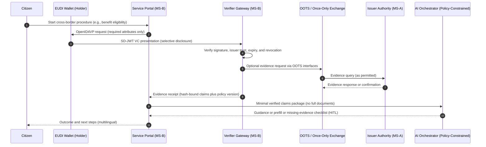
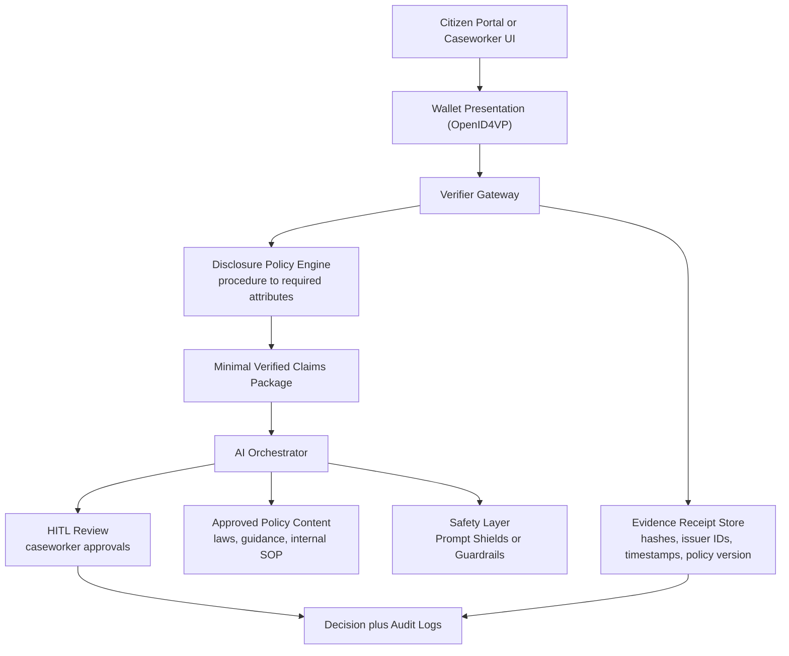

# Cross-Border Government AI in Europe Needs a Trust Layer: SD-JWT, EUDI Wallets, and Minimum Disclosure by Design

## Executive summary

Europe is industrializing cross-border digital public services through the Single Digital Gateway and the Once-Only Technical System (OOTS). The OOTS infrastructure has been live since December 2023 to streamline evidence sharing between competent authorities across EU Member States. At the same time, European public agencies want to use generative AI to improve multilingual support, speed up case processing, and reduce backlogs - but the compliance bar is higher than most industries because the EU AI Act sets a phased timeline and explicit obligations, with many public-sector scenarios treated as high risk by design.

This creates a practical problem: AI needs information, but government services must enforce data minimization, provenance, and auditability. Output guardrails and content safety help reduce harmful outputs and prompt attacks, but they do not solve the core government requirement: cryptographic assurance that the data used to make or support a decision is authentic, minimally disclosed, and traceable.

Selective Disclosure JWTs (SD-JWT) and SD-JWT-based Verifiable Credentials (SD-JWT VC) provide the missing trust primitive. Combined with the European Digital Identity (EUDI) Wallet ecosystem (eIDAS 2.0), they enable a scalable pattern for cross-border government AI:

- Verify once (issuer authenticity and integrity)
- Disclose the minimum (purpose-bound attributes)
- Feed AI only what it is allowed to see (policy-constrained inputs)
- Prove what happened (cryptographic evidence receipts + audit logs)

---

## 1) Why this matters now: Europe is standardizing cross-border evidence exchange

Cross-border public services are not theoretical. Under the Single Digital Gateway framework, the EU is enabling citizens and businesses to complete administrative procedures online across borders. OOTS is the technical system aligned to this, enabling public authorities in different Member States to exchange verified data and documents for procedures in scope of the regulation (notably Article 14 context).

The European Commission has also published evolving OOTS Technical Design Documents, including high-level architecture materials (e.g., March/May 2025 releases), which show OOTS as a set of interoperable components and interfaces rather than a single monolith.

The key implication for AI: if cross-border evidence exchange is being standardized, then the evidence boundary becomes a natural place to enforce "minimum disclosure by design" before any AI system sees the data.

---

## 2) AI is attractive for government, but the regulatory bar is higher

Government service delivery is full of AI-friendly pain points:

- Multilingual citizen journeys that cross agencies and borders
- High volumes of forms, attachments, and evidence checks
- Case backlogs and inconsistent decisions due to manual processing
- Fraud and identity manipulation risks in benefits and border flows
- High training burden for front-line staff due to policy complexity

Generative AI can help, but the EU AI Act sets a staged application timeline. The European Commission notes the AI Act entered into force on 1 August 2024, is fully applicable from 2 August 2026, with earlier and later exceptions (for example, prohibited practices and AI literacy obligations apply from 2 February 2025, GPAI model obligations from 2 August 2025, and some high-risk rules for regulated products extend to 2 August 2027).

So the real question for European governments is not "can we deploy a chatbot?" It is:

- Can we prove the AI only used permitted inputs?
- Can we trace the evidence behind advice or decisions?
- Can we minimize personal data exposure across borders?
- Can we demonstrate compliance and accountability during audits and appeals?

---

## 3) The real gap: "safe output" is not the same as "trusted input"

Most GenAI safety tooling focuses on controlling model behavior:

- Prompt injection and jailbreak detection
- Harmful content filtering
- Redaction of sensitive information
- Policy guardrails for outputs

These are necessary - especially for citizen-facing assistants ingesting untrusted text. For example, Microsoft describes Prompt Shields in Azure AI Content Safety as a unified API to detect and block adversarial user input attacks. AWS describes Amazon Bedrock Guardrails as configurable safeguards to detect and filter undesirable content and protect sensitive information in prompts and responses.

But none of these controls prove:

- Evidence provenance (who issued it, is it authentic?)
- Data minimization (was only the required subset shared?)
- Cryptographic integrity (was it tampered with?)
- Auditability (what exact claims were used for this decision?)

In cross-border government, those are the core requirements. The only scalable approach is to control the information boundary before the model sees anything.

---

## 4) SD-JWT VC: selective disclosure that fits government constraints

SD-JWT enables selective disclosure of claims from a signed JWT. SD-JWT VC standardizes how to express verifiable digital credentials with JSON payloads, with or without selective disclosure, based on SD-JWT.

The practical result is straightforward:

- The issuer signs a credential containing many claims.
- The holder chooses which claims to disclose for a specific procedure.
- The verifier validates the disclosed subset cryptographically.
- The holder does not reveal the rest.

This maps directly onto EUDI Wallet goals: interoperable, privacy-preserving attribute sharing across borders.

It also aligns with OpenID for Verifiable Credentials profiles. For example, the OpenID4VC High Assurance Interoperability Profile (HAIP) defines requirements for interoperability among issuers, wallets, and verifiers where a high level of security and privacy is required, explicitly profiling SD-JWT VC (and ISO mdoc) formats.

---

## 5) Reference diagrams

### Diagram A: Cross-border journey with OOTS + EUDI Wallet + minimum disclosure

What this diagram enforces:

- The wallet decides what is disclosed.
- The verifier validates authenticity before AI sees anything.
- AI receives only a minimal, verified claim set, not "the whole file".
- The evidence receipt supports audit, appeals, and traceability.

### Diagram B: "Minimum Disclosure AI Gateway" pattern (boundary system)

Key idea: treat "what the AI is allowed to know" as a first-class boundary, enforced by credential verification + purpose-bound disclosure rules, then strengthened by model safety controls and human oversight.

---

## 6) End-to-end example: cross-border benefit eligibility (moving country)

This is a realistic EU scenario: a worker moves from Member State A to Member State B and must establish eligibility for a benefit or register dependents.

1) Citizen starts the procedure in MS-B portal

- Clear transparency: what is requested and why (purpose limitation)

1) Portal requests only needed attributes via OpenID4VP

- Identity (or a procedure-specific identifier)
- Residency status
- Employment status
- Family status (only if needed)

1) Wallet discloses selectively using SD-JWT VC

- Citizen shares only necessary claims

1) Verifier validates and stores an evidence receipt

- Signature validation, issuer trust, expiry checks
- Receipt stored with hashes of disclosed claims, timestamps, and policy version

1) AI accelerates the workflow without overexposure

- Prefills forms
- Explains next steps in multiple languages
- Identifies missing evidence and requests only incremental minimum attributes
- Provides policy-aligned guidance from approved sources

1) Human decision and appeal readiness

- Caseworker reviews the recommendation
- Case file includes the evidence receipt, human justification, and constrained AI interaction log

---

## 7) What success looks like (public-sector measurable outcomes)

A credible public-sector case is not about "AI wow." It is about service performance, fraud reduction, and audit outcomes.

This pattern typically targets:

- Reduced average handling time by removing manual evidence validation loops
- Lower rework rates due to missing/incorrect evidence submissions
- Reduced fraud exposure by verifying issuer provenance and integrity
- Better citizen experience through multilingual guidance and fewer repeated submissions
- Stronger audit posture through cryptographic receipts + traceable AI interactions

Crucially, you get these gains without turning your AI into a data vacuum.

---

## Closing

Europe is building a cross-border digital government fabric: once-only evidence exchange, wallet-based identity, and regulated AI. The path to trustworthy government AI is not to give models more data. It is to give them the minimum verifiable data they are allowed to use - and to make that boundary enforceable and auditable.

SD-JWT VC and selective disclosure are not niche crypto features. In European cross-border government, they are the trust layer that makes AI viable at scale.

---

## Public references (URLs)

European Commission / EU policy and programs

- EU AI Act application timeline (European Commission): <https://digital-strategy.ec.europa.eu/en/policies/regulatory-framework-ai>
- OOTS: Implementing the Once-Only Technical System (notes infrastructure live since Dec 2023): <https://ec.europa.eu/digital-building-blocks/sites/spaces/OOTS/pages/592642684/Implementing%2Bthe%2BOOTS>
- OOTS Technical Design Documents (high-level architecture releases): <https://ec.europa.eu/digital-building-blocks/wikis/display/OOTS/Technical%2BDesign%2BDocuments>
- European Digital Identity Wallet Architecture and Reference Framework (library page): <https://digital-strategy.ec.europa.eu/en/library/european-digital-identity-wallet-architecture-and-reference-framework>

Standards and specifications

- IETF SD-JWT VC draft: <https://datatracker.ietf.org/doc/draft-ietf-oauth-sd-jwt-vc/>
- OpenID4VC HAIP (SD-JWT VC profile): <https://openid.net/specs/openid4vc-high-assurance-interoperability-profile-sd-jwt-vc-1_0-00.html>

Cloud safety tooling (complementary controls)

- Microsoft Prompt Shields (Azure AI Content Safety): <https://learn.microsoft.com/en-us/azure/ai-services/content-safety/concepts/jailbreak-detection>
- Amazon Bedrock Guardrails docs: <https://docs.aws.amazon.com/bedrock/latest/userguide/guardrails.html>

---

*Disclaimer: This article is informational and not legal advice. For regulated deployments, validate obligations with your legal/compliance teams and the latest official guidance.*
