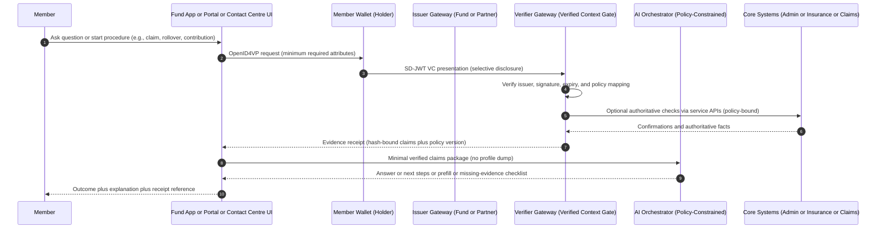
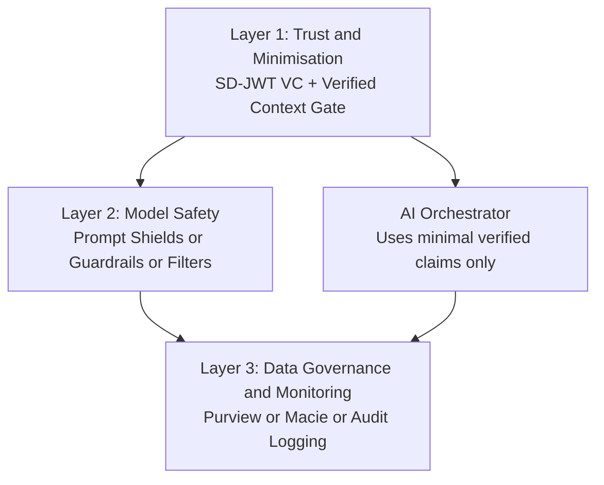
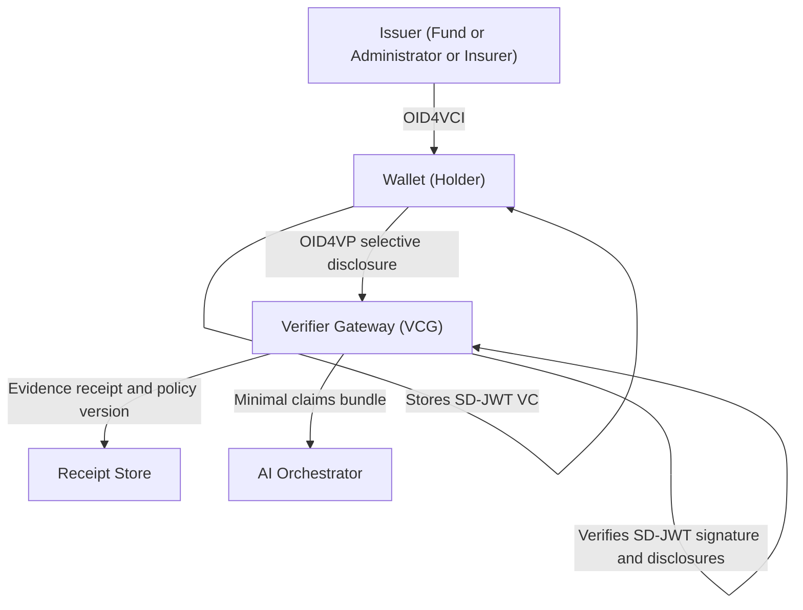

# Making AI Deployable in Superannuation: Why Content Safety Is Not Enough (and Where the SD-JWT Ecosystem Fits)

## Executive summary

Superannuation funds and their partners (administrators, insurers, advice networks, employers) are under pressure to apply generative AI to member servicing and operations. The promise is real: faster resolution, lower cost-to-serve, and improved member experience. But many copilots stall between pilot and production because the blocker is not model capability - it is trust, privacy, and governance.

The recurring failure pattern looks like this:

- Helpful pilots require sending too much member data into the AI layer (the "member profile dump").
- Governance then blocks production because teams cannot justify necessity, control exposure, or prove what the model saw.
- If teams restrict access, copilots rely on unverified member-entered values and become inconsistent and hard to defend in complaints, disputes, or audit.

Microsoft and AWS provide strong safety and guardrail capabilities (to reduce harmful outputs, prompt attacks, and accidental PII leakage). These are necessary, but they do not solve the superannuation adoption paradox:

> How do we ensure the AI uses only the minimum necessary, verified member data - every time - and can we prove it?

This article explains why AI in super often fails to reach production, what safe-content platforms do (and do not) solve, and why SD-JWT and SD-JWT-based Verifiable Credentials (SD-JWT VC) can provide the missing trust layer that makes AI deployable in a high-trust, highly regulated industry.

---

## The burning platform: why urgency is real

### 1) Member service expectations are shifting

Across financial services, "instant answers" are becoming baseline. Large institutions are investing heavily in AI workforce capability and operating model transformation, signaling that AI-enabled service performance is moving from differentiator to expectation.

- Reference: Commonwealth Bank's $90m, three-year Future Workforce Program (24 Feb 2026)
  <https://www.commbank.com.au/articles/newsroom/2026/02/commonwealth-bank-90m-plan-for-ai-ready-workforce.html>

Implication: funds that can safely deploy AI at scale can reduce friction, improve service resilience, and handle peak demand. Funds that cannot will face rising service costs and member dissatisfaction.

### 2) The blast radius is massive in super

APRA reported total superannuation assets of $4,485.5 billion as at 31 December 2025.

- Reference: APRA releases superannuation statistics for December 2025 (26 Feb 2026)
  <https://www.apra.gov.au/news-and-publications/apra-releases-superannuation-statistics-for-december-2025>

Implication: privacy failures, operational errors, or ungoverned AI outcomes can have high-value impact at high volume.

### 3) Cyber and privacy risk remains material

OAIC reported 532 notifiable data breach notifications in the January to June 2025 reporting period.

- Reference: OAIC blog - latest Notifiable Data Breach statistics for January to June 2025 (4 Nov 2025)
  <https://www.oaic.gov.au/news/blog/latest-notifiable-data-breach-statistics-for-january-to-june-2025>

Implication: any architecture that unnecessarily concentrates sensitive member data into new surfaces (prompts, logs, embeddings, transcripts) increases exposure.

### 4) Regulators are watching operational harm

ASIC's Key issues outlook 2026 highlights superannuation trustee operational failures leading to member harm, including delays in processing claims, inadequate support, poor IT infrastructure and cyber resilience, and escalating fraud/scam risk.

- Reference: ASIC Key issues outlook 2026 (Published 27 Jan 2026)
  <https://asic.gov.au/about-asic/news-centre/news-items/key-issues-outlook-2026/>

Implication: "we have a chatbot" is not a strategy. Governance, evidence, and operational controls are.

### 5) Operational resilience and third-party oversight are tightening

APRA CPS 230 Operational Risk Management commences on 1 July 2025, and includes transition arrangements for certain pre-existing service provider contracts (requirements apply from the earlier of contract renewal or 1 July 2026 for those arrangements).

- Reference: APRA Prudential Standard CPS 230 Operational Risk Management (commencement and transition text)
  <https://www.apra.gov.au/sites/default/files/2023-07/Prudential%20Standard%20CPS%20230%20Operational%20Risk%20Management%20-%20clean.pdf>

Implication: many AI deployments depend on material third parties (model providers, platform vendors, contact centres, administrators, data processors). AI is both an operational risk surface and a third-party risk surface.

---

## Why AI copilots fail to reach production in superannuation

Most pilots break when they encounter one of these production realities.

### Failure mode 1: the "member profile dump"

The quickest way to build a helpful copilot is to feed broad profile payloads from existing APIs. In super, those payloads commonly include identity details and sensitive attributes (personal identifiers, beneficiaries, full DOB, addresses) alongside balances, contributions, and insurance details.

Why this fails in production:

- It is difficult to justify "why the AI needed all of this" for a narrow question.
- It increases breach impact and governance burden.
- It creates an approval deadlock with privacy, security, and risk.

### Failure mode 2: unverified member-entered inputs

When profile access is blocked, teams ask members to type values (salary, contributions, balance) or infer them from partial data.

Why this fails in production:

- No proof of origin or integrity.
- Outputs are less repeatable and harder to defend in complaints, disputes, or incident review.
- The system cannot reliably help with edge cases (preservation rules, insurer conditions, eligibility constraints) because it lacks authoritative context.

### Failure mode 3: weak evidence of necessity ("why this data?")

Traditional logging records API calls, not intent-level minimisation decisions. When governance review occurs, teams struggle to prove:

- what the member intent was
- what data was requested
- what data was used
- whether it was the minimum necessary
- whether it was verified and current

In regulated environments, "we filtered outputs" is not enough. You need evidence that the system controlled inputs.

---

## Do Microsoft and AWS safe-content solutions solve this?

They solve a different problem - and they are still important.

### What safe-content / guardrails are designed to do

Safety tooling is primarily designed to:

- detect and block adversarial user input attacks (prompt injection / jailbreak attempts)
- filter harmful content categories and deny unsafe topics
- reduce accidental PII leakage in generated responses
- provide monitoring hooks, policy workflows, and consistent enforcement across models

Examples:

- Microsoft: Prompt Shields in Azure AI Content Safety (a unified API for adversarial input attacks)
  <https://learn.microsoft.com/en-us/azure/ai-services/content-safety/concepts/jailbreak-detection>
- AWS: Amazon Bedrock Guardrails (configurable safeguards for content and sensitive information)
  <https://docs.aws.amazon.com/bedrock/latest/userguide/guardrails.html>

### What these tools help with (and why you still want them)

They are strong second-line controls for:

- harmful or policy-violating outputs (hate, violence, self-harm, etc.)
- prompt injection and jailbreak attempts
- accidental leakage of obvious PII patterns in text
- monitoring and operational safety controls

### What they do not solve (the superannuation adoption paradox)

Safe-content guardrails generally do not provide cryptographic assurance of:

1) Provenance of member facts
   They can mask a TFN pattern, but they cannot prove that "contributions YTD" is authentic and issued by the fund.

2) Intent-based minimisation at the source
   Many controls operate after data has already entered the AI pipeline. Risk teams will still ask: "Why did we send it at all?"

3) Member-controlled selective disclosure
   They do not provide a mechanism for a member to share only the minimum facts needed for a given question with cryptographic proof.

Bottom line: Microsoft/AWS guardrails help you ship a safer conversation. They do not solve the harder production question:

> How do we ensure the AI uses only the minimum necessary, verified member data - every time - and can we prove it?

---

## The missing layer: Verified Context for AI (business-level concept)

To make AI deployable in superannuation, add an explicit governance boundary in front of the model.

Call it a Verified Context Gate (VCG). Its job is to transform an intent (a member procedure) into a minimal, verified, auditable claim bundle the model can rely on.

### Verified Context Gate (VCG)

A VCG enforces, by design:

- Minimum disclosure (data minimisation): request only the smallest required attribute set for the intent.
- Provenance: verify disclosed facts cryptographically against trusted issuers (and optionally cross-check via authoritative service APIs).
- Purpose binding: tie the disclosure to a specific procedure and policy version (why it was needed).
- Evidence receipts: store a tamper-evident record of what was disclosed, when, and under which policy version.
- Fail closed: no verification -> no model call for journeys that require authoritative context.

This reframes AI from "a chatbot that needs data" into "a controlled operating model" that boards and risk teams can approve.

### Why this maps to privacy and prudential expectations

- Privacy (purpose limitation): APP 6 limits use/disclosure to the primary purpose of collection unless an exception applies. A VCG operationalizes "purpose limitation" as a machine-enforceable disclosure policy.
  <https://www.oaic.gov.au/privacy/australian-privacy-principles/australian-privacy-principles-guidelines/chapter-6-app-6-use-or-disclosure-of-personal-information>
- Operational risk (CPS 230): a VCG reduces operational risk by constraining AI behavior to policy-bound inputs and producing evidence artifacts.
  <https://www.apra.gov.au/sites/default/files/2023-07/Prudential%20Standard%20CPS%20230%20Operational%20Risk%20Management%20-%20clean.pdf>
- Information security (CPS 234): minimising sensitive data exposure reduces the likelihood and impact of information security incidents across new AI surfaces.
  <https://www.apra.gov.au/sites/default/files/cps_234_july_2019_for_public_release.pdf>
- Risk management (SPS 220): the VCG provides a structured control that can be assessed, monitored, and evidenced.
  <https://www.apra.gov.au/sites/default/files/sps_220_risk_management_december_2018_1.pdf>
- Member outcomes (SPS 515): the aim is improved outcomes, but within a controlled operating model.
  <https://www.apra.gov.au/strategic-planning-and-member-outcomes>

---

## Where the SD-JWT ecosystem fits (simple explanation)

A VCG needs a practical way to obtain verified, minimal member facts without pulling full profiles into the AI layer.

That is what SD-JWT and SD-JWT VC enable.

### SD-JWT in plain English

SD-JWT (Selective Disclosure for JSON Web Tokens) allows a holder to reveal only selected claims from a signed JWT, while the verifier can validate the disclosed subset cryptographically.

Think: digitally signed member facts, where the member can share only what is required for this intent.

- Reference: RFC 9901 - Selective Disclosure for JSON Web Tokens
  <https://datatracker.ietf.org/doc/rfc9901/>

### SD-JWT VC: the credential format

SD-JWT VC is a credential format for verifiable digital credentials that uses SD-JWT and supports selective disclosure, designed to work with modern OAuth/OpenID issuance and presentation protocols.

- Reference: IETF draft - SD-JWT-based Verifiable Digital Credentials (SD-JWT VC)
  <https://datatracker.ietf.org/doc/draft-ietf-oauth-sd-jwt-vc/>

### The ecosystem part: issuing and presenting those facts

Two OpenID standards provide interoperable issuance and presentation flows:

- OpenID for Verifiable Credential Issuance 1.0 (OID4VCI) - issuance into a wallet/app
  <https://openid.net/specs/openid-4-verifiable-credential-issuance-1_0.html>
- OpenID for Verifiable Presentations 1.0 (OID4VP) - requesting and presenting credentials
  <https://openid.net/specs/openid-4-verifiable-presentations-1_0.html>

High assurance guidance also exists for interoperable deployments across issuers, wallets, and verifiers:

- OpenID4VC High Assurance Interoperability Profile (HAIP)
  <https://openid.net/specs/openid4vc-high-assurance-interoperability-profile-1_0.html>

Executive takeaway: SD-JWT + OID4VCI/OID4VP provide an open-standards path to implement "verified minimal facts" - the trust layer most AI pilots are missing.

---

## Reference diagrams

### Diagram A: Member servicing journey using SD-JWT VC as a Verified Context Gate

### Diagram B: Layered control stack (what each layer prevents)

Interpretation:

- Layer 2 and 3 are necessary but insufficient if Layer 1 is missing.
- Layer 1 is what turns "AI is possible" into "AI is approvable".

### Diagram C: Credential lifecycle (issuance -> storage -> selective disclosure -> verification)

---

## How to make minimisation concrete: "intent -> required claims" policies

The hardest governance question is not "is the model safe?" It is "did we send only what was necessary for this intent?"

A practical way to implement this is to define a disclosure policy per member intent (procedure), expressed as required / optional / forbidden attributes.

Example policy fragments (illustrative):

| Intent (procedure) | Required claims | Optional claims | Forbidden / never send to AI |
|---|---|---|---|
| Claim status and next steps | member_id (pseudonymous), claim_id, claim_state, last_action_date | preferred_language, contact_channel | TFN, full DOB, full address, beneficiary details |
| Contribution verification | member_id, contribution_period, contribution_amount(s), contribution_source | employer_id | TFN, salary history unless required, health/insurance info |
| Insurance cover explanation | member_id, cover_type, cover_amount, waiting_period, exclusions_summary | age_band (not DOB), occupation_class | medical notes, claims history unless explicitly needed |
| Rollover guidance | member_id, product_id, balance_band, preservation_status | eligible_rollover_targets | TFN, transaction history unless required |
| Retirement income stream guidance | member_id, age_band, preservation_status, retirement_phase_flag | balance_band, contribution_cap_band | full DOB, detailed investments unless required |

Key implementation idea: the AI sees bands and flags, not raw identifiers, unless explicitly necessary. The VCG can still verify those bands/flags cryptographically.

---

## Where the business value comes from (beyond a chatbot)

### 1) Cost-to-serve reduction at scale (without unacceptable exposure)

Well-run AI-enabled service programs can reduce cost-to-serve materially by shifting interactions to effective self-service and improving assisted-channel efficiency. McKinsey case material describes transformations with more than 20% reduction in cost-to-serve and 20-30% reduction in incidence ratios on assisted channels in at-scale customer service programs.

- Reference: McKinsey - AI-enabled customer service (27 Mar 2023)
  <https://www.mckinsey.com/capabilities/operations/our-insights/the-next-frontier-of-customer-engagement-ai-enabled-customer-service>
- Reference: McKinsey - Agents for growth (mentions reducing cost to serve by up to 30% in certain contexts)
  <https://www.mckinsey.com/capabilities/growth-marketing-and-sales/our-insights/agents-for-growth-turning-ai-promise-into-impact>

Why VCG matters: in super, the question is not "could we reduce cost?" It is "can we do it with a defensible data model?" Verified minimal facts unlock scale without unacceptable exposure.

### 2) Fewer disputes and better defensibility

When answers are grounded in verified facts and the system can show "what data was used and why," you reduce:

- inconsistencies across channels
- escalations caused by "wrong numbers"
- time spent reconstructing decisions during complaints
- the likelihood that staff override controls "to help the member" by oversharing data

Industry signal: public reporting on complaints continues to emphasize timeliness and transparency in claims processes and disputes (e.g., complaint reporting in 2025 highlighting pressure points in super-related claims handling).

- Reference (reporting on AFCA 2025 complaint data): Financial Standard (26 Feb 2026) / InvestorDaily (26 Feb 2026)
  <https://www.financialstandard.com.au/news/afca-receives-record-complaints-in-2025-179811675>
  <https://www.investordaily.com.au/afca-complaints-hit-record-super-dragged-into-sunlight/>

### 3) Faster time-to-production (less rework with risk/compliance)

The most expensive AI failure mode is late-stage rejection after engineering investment. A VCG front-loads the core approval requirements:

- minimisation policy by intent
- verification before model call
- evidence artifacts that satisfy audit and incident review

### 4) Ecosystem portability and vendor flexibility

Super funds operate in an ecosystem of administrators, insurers, advice networks, employers, and government interfaces. Standards-based credential flows increase portability:

- across channels (web, app, contact centre)
- across vendors (identity, AI, contact centre tooling)
- across partners where appropriate, with explicit policies and issuer trust lists

---

## Control objectives and evidence artifacts (what boards and risk teams can assess)

A VCG-based design is governance-friendly because it produces explicit evidence artifacts.

| Control objective | Mechanism | Evidence artifact |
|---|---|---|
| Data minimisation by purpose | Intent-based disclosure policy | Policy version, required/optional/forbidden claim list |
| Provenance and integrity | SD-JWT VC signature validation + issuer trust list | Verification result, issuer identifier, expiry checks |
| Fail-closed enforcement | Block model call if verification fails | "No-verified-context" event logs |
| Auditability and replay | Evidence receipt store | Receipt: disclosed-claim hashes, timestamps, correlation IDs |
| Operational resilience | Segmented services + degraded-mode behavior | Incident playbooks, resilience tests (CPS 230 alignment) |
| Security posture | Reduce exposure surfaces + security controls | Security test evidence (CPS 234 alignment) |

Note: this does not remove the need for model safety. It makes model safety meaningful by shrinking and controlling what can enter the model.

---

## Conclusion: the decision you are really making

This is not "should we build a chatbot?" It is:

> Do we adopt a control model that makes AI deployable in superannuation - by enforcing minimum, verified member facts - and combine it with modern guardrails and data governance?

Microsoft and AWS guardrails are excellent at making the conversation safer. The SD-JWT ecosystem is how you make the data use defensible.

When those are combined, you get an AI operating model that can scale in a high-trust industry.

---

## Implementation plan

1. Define intent-to-claims policy catalog:
   - Map each member journey to required, optional, and forbidden attributes.
   - Version policies and require policy ID in every verification receipt.
2. Deploy a Verified Context Gate:
   - Enforce SD-JWT VC verification before AI invocation.
   - Fail closed on signature, trust, nonce, or status failure.
3. Integrate model safety and governance layers:
   - Keep guardrails/content safety at AI boundary.
   - Add retention limits, redaction, and incident telemetry for receipts/logs.
4. Operationalize with risk/compliance:
   - Run control testing against CPS 230/CPS 234 and APP 6 objectives.
   - Approve phased rollout by use case risk tier.

## PoC scope (6-8 weeks)

- Build two member journeys end-to-end:
  - `claim_status_and_next_steps`
  - `contribution_verification`
- Implement SD-JWT VC issuance and OID4VP presentation for both.
- Produce evidence artifacts per request:
  - claim hashes disclosed
  - policy version used
  - verification decision and reason code
- Measure:
  - average handling time change
  - escalation/dispute rate change
  - percentage of AI calls with verified minimal context only

---

## Public references (URLs)

Australia: market, regulation, and risk context

- APRA: Superannuation statistics for December 2025
  <https://www.apra.gov.au/news-and-publications/apra-releases-superannuation-statistics-for-december-2025>
- ASIC: Key issues outlook 2026
  <https://asic.gov.au/about-asic/news-centre/news-items/key-issues-outlook-2026/>
- OAIC: Latest Notifiable Data Breach statistics for January to June 2025
  <https://www.oaic.gov.au/news/blog/latest-notifiable-data-breach-statistics-for-january-to-june-2025>
- OAIC: APP guidelines - APP 6 use/disclosure (purpose limitation)
  <https://www.oaic.gov.au/privacy/australian-privacy-principles/australian-privacy-principles-guidelines/chapter-6-app-6-use-or-disclosure-of-personal-information>
- APRA: CPS 230 Operational Risk Management (commencement and transition)
  <https://www.apra.gov.au/sites/default/files/2023-07/Prudential%20Standard%20CPS%20230%20Operational%20Risk%20Management%20-%20clean.pdf>
- APRA: CPS 234 Information Security
  <https://www.apra.gov.au/sites/default/files/cps_234_july_2019_for_public_release.pdf>
- APRA: SPS 220 Risk Management
  <https://www.apra.gov.au/sites/default/files/sps_220_risk_management_december_2018_1.pdf>
- APRA: Strategic Planning and Member Outcomes (SPS 515 landing page)
  <https://www.apra.gov.au/strategic-planning-and-member-outcomes>
- Commonwealth Bank: $90m plan for AI-ready workforce
  <https://www.commbank.com.au/articles/newsroom/2026/02/commonwealth-bank-90m-plan-for-ai-ready-workforce.html>

Standards: selective disclosure credentials and interoperability

- IETF: RFC 9901 - Selective Disclosure for JSON Web Tokens (SD-JWT)
  <https://datatracker.ietf.org/doc/rfc9901/>
- IETF: SD-JWT VC draft
  <https://datatracker.ietf.org/doc/draft-ietf-oauth-sd-jwt-vc/>
- OpenID: OpenID for Verifiable Credential Issuance 1.0
  <https://openid.net/specs/openid-4-verifiable-credential-issuance-1_0.html>
- OpenID: OpenID for Verifiable Presentations 1.0
  <https://openid.net/specs/openid-4-verifiable-presentations-1_0.html>
- OpenID: OpenID4VC High Assurance Interoperability Profile 1.0
  <https://openid.net/specs/openid4vc-high-assurance-interoperability-profile-1_0.html>

Cloud safety tooling (complementary controls)

- Microsoft Learn: Prompt Shields in Azure AI Content Safety
  <https://learn.microsoft.com/en-us/azure/ai-services/content-safety/concepts/jailbreak-detection>
- AWS Docs: Amazon Bedrock Guardrails
  <https://docs.aws.amazon.com/bedrock/latest/userguide/guardrails.html>

ROI signal sources (transferable to high-volume service contexts)

- McKinsey: AI-enabled customer service (cost-to-serve and assisted-channel incidence impacts)
  <https://www.mckinsey.com/capabilities/operations/our-insights/the-next-frontier-of-customer-engagement-ai-enabled-customer-service>
- McKinsey: Agents for growth (mentions reducing cost to serve by up to 30% in certain contexts)
  <https://www.mckinsey.com/capabilities/growth-marketing-and-sales/our-insights/agents-for-growth-turning-ai-promise-into-impact>

Reporting on complaint and claims pressure points (public commentary)

- Financial Standard: AFCA receives record complaints in 2025 (reporting)
  <https://www.financialstandard.com.au/news/afca-receives-record-complaints-in-2025-179811675>
- InvestorDaily: AFCA complaints hit record, super dragged into sunlight (reporting)
  <https://www.investordaily.com.au/afca-complaints-hit-record-super-dragged-into-sunlight/>

Disclaimer: This article is informational and not legal advice. For regulated deployments, validate obligations with legal/compliance teams and the latest official guidance.
