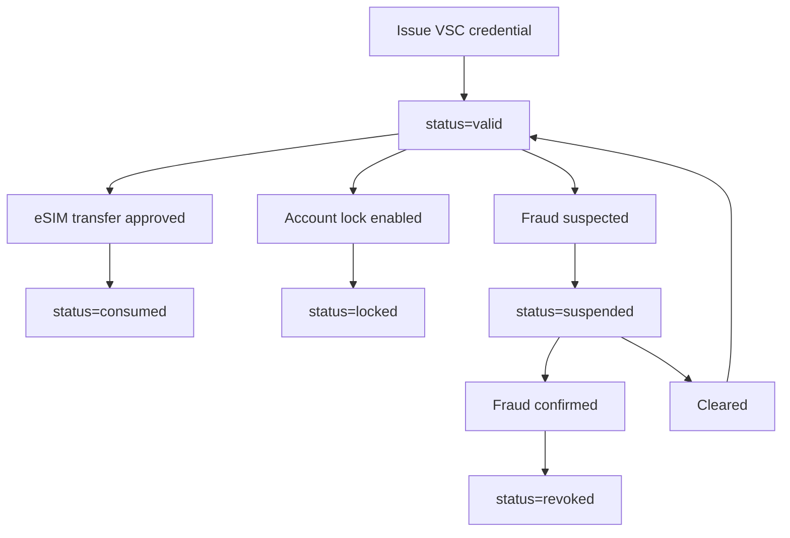
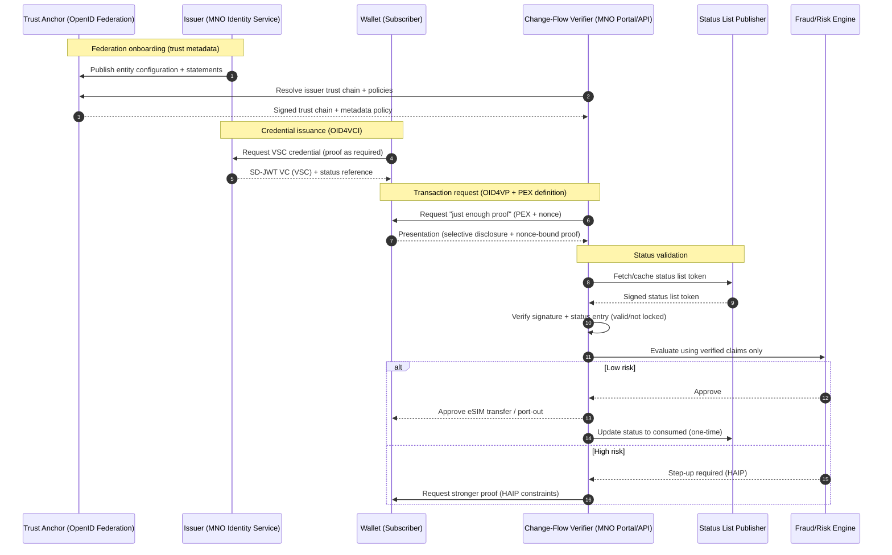

# Telecom Use Case: Fraud-Resistant eSIM Transfer + Number Porting Using SD-JWT VC, HAIP, OpenID Federation, Status Lists, and Presentation Exchange

## Executive summary

SIM swap and port-out fraud has become a structural weakness in telecom authentication. Public reporting highlights rapid growth and material losses, and regulators have responded with baseline requirements for providers to notify customers and improve controls.

This article proposes a concrete telecom blueprint:

**"Verifiable Subscriber Control" for eSIM transfer and number porting**

- Issue a _Verifiable Subscriber Control Credential_ (SD-JWT VC) to the legitimate subscriber (holder).
- Require the subscriber to present only the minimum proofs (Presentation Exchange) to approve eSIM transfer / SIM swap / port-out.
- Validate issuer trust dynamically across carriers using OpenID Federation.
- Prevent replay by enforcing near-real-time status checks (cache/TTL dependent) via Token Status Lists.
- Apply HAIP (high assurance interoperability profile) as a risk-based step-up for high-risk transactions.

This is the missing trust layer that moves the industry from "passwords + SMS OTP" toward cryptographically verifiable, auditable, minimum-disclosure access control for the most abused telecom procedures.

---

## 1) Why this matters: SIM swap and port-out fraud are now systemic

Fraud succeeds because the attacker does not need to compromise the handset - they need to compromise the telecom procedure.

A SIM swap or port-out can allow interception of SMS-based OTPs and reset flows, leading to bank and account takeovers. Industry and government sources describe this as an escalating consumer harm problem and are pushing stronger authentication and notification requirements.

This creates a telecom reality:

- Telecom operators must keep legitimate changes easy (customers still need to move devices and switch carriers).
- But they must also prove they authenticated correctly and minimize account takeover risk.

A high-assurance credential model solves this by separating:

- **Identity and entitlement proof** (cryptographic, selective disclosure)
  from
- **Customer experience** (risk-based step-up, minimal friction for low-risk cases).

---

## 2) The specific telecom procedure to fix: eSIM transfer + number porting

### What is the attack surface?

Three "high-value" procedures are frequently abused:

1. **eSIM profile download / transfer** (device change)
2. **SIM swap** (replacement SIM)
3. **Port-out / number porting** (switch carrier)

They share a common requirement: the provider must confirm the requester is the legitimate account controller.

Today, this is often done with:

- easily stolen biographical data
- weak knowledge-based checks
- SMS OTPs (which are circular in a SIM-swap scenario)
- call-center social engineering

The industry needs a stronger primitive: "prove you are the subscriber controller" without oversharing personal data.

---

## 3) The solution pattern: Verifiable Subscriber Control (VSC)

### Core idea

Create a credential that represents _control of a subscription/account_ and can be presented with minimum disclosure.

At a high level:

- **Issuer**: Mobile Network Operator (MNO) or a regulated identity provider on behalf of the MNO
- **Holder**: Subscriber (wallet in telco app, or external wallet)
- **Verifier**: MNO change-flow (eSIM download approval, SIM swap desk, port-out service)
- **Trust Anchor**: industry federation operator / regulator / consortium (OpenID Federation)
- **Status List Publisher**: MNO fraud/identity service (revocation/suspension/consumed states)

### What SD-JWT VC gives you

- Selective disclosure: reveal only what is needed for the transaction.
- Cryptographic verifiability: the verifier knows the claims are authentic.
- Auditability: store an evidence receipt of what was presented.

### What the "advanced" pieces add (production requirements)

- **Presentation Exchange (PEX)**: structured request language for the verifier to ask for "just enough proof".
- **Token Status Lists**: near-real-time status checks (cache/TTL dependent) to stop replay and enforce policy-mapped states such as lock/suspend/consumed.
- **OpenID Federation**: scalable trust onboarding across multiple carriers/issuers without bespoke key exchange.
- **HAIP**: high assurance profile for risky operations (port-out, high-value account, suspicious signals).

---

## 4) Credential design: VSC (Verifiable Subscriber Control) SD-JWT VC

The credential should minimize PII and maximize security utility.

### Suggested claims (illustrative)

- `vct`: "VerifiableSubscriberControl"
- `iss`: issuer identifier (MNO entity ID)
- `sub`: stable subscriber pseudonymous ID (not MSISDN)
- `acct_ref`: opaque account reference
- `msisdn_hash`: salted hash of MSISDN (optional, for matching)
- `line_type`: prepaid / postpaid (optional)
- `control_level`: "owner" | "delegate" (family plan)
- `risk_profile`: low/medium/high band (optional)
- `kyc_level`: L1/L2/L3 (optional)
- `device_binding`: proof-of-possession key reference or device attestation reference (optional, used for HAIP step-up)
- `status`: status-list reference (critical)
- `exp`: expiry time (keep short; rotate regularly)

### Selective disclosure strategy

For a normal eSIM transfer:

- disclose `acct_ref`, `control_level`, `kyc_level`, `exp`, and required nonce-bound proof
- do NOT disclose name, address, DOB, or email

For a high-risk port-out:

- disclose the above + device binding + step-up credential (e.g., "in-person verification completed") if policy requires

---

## 5) Presentation Exchange (PEX): how the verifier asks for minimum proof

PEX makes the verifier request explicit and auditable.

### Example (human-readable) PEX intent

"I need proof you control account X and line Y, credential must be issued by an MNO trusted under our federation policy, credential must be active (status not suspended/consumed), and the presentation must be nonce-bound. If risk tier is high, require device binding and stronger crypto profile (HAIP)."

This avoids "send us your ID scan" behavior, and replaces it with precise, machine-verifiable requirements.

---

## 6) Status Lists: the anti-replay control that makes this safe

Without status checks, a captured credential could be replayed.

Status Lists expose compact numeric status values. Telecom-specific meanings are application policy mappings layered on top of those values.

Common policy mappings include:

- `valid`: credential is usable
- `invalid`/`revoked`: credential must be rejected
- `suspended`: temporary block during investigation
- `application-specific`: operator-defined states such as `locked` or `consumed`

### Diagram A: Status-driven control

Result: the operator can enforce lock/suspend/one-time flows and reduce replay risk when issuer/verifier policy and refresh SLOs are aligned.

---

## 7) OpenID Federation: scalable trust for porting and multi-operator ecosystems

Porting is inherently multi-party. A gaining provider must trust assertions about the subscriber and line state, but the ecosystem cannot rely on manual onboarding for every carrier pair.

OpenID Federation enables this by standardizing:

- Trust Anchors (federation operators)
- entity statements and metadata publication
- trust chains and metadata policies (accepted algorithms, endpoints, and requirements)

In practice:

- A regulator/consortium acts as Trust Anchor.
- Carriers publish signed entity configurations.
- Verifiers resolve trust chains dynamically and apply policy.
- New entrants can be onboarded without bespoke bilateral key exchange.

This is especially useful for:

- national number portability ecosystems
- MVNO networks
- wholesale roaming hubs
- cross-border carrier relationships

---

## 8) HAIP: risk-based step-up for high-risk port-out and eSIM transfer

HAIP exists to remove interoperability ambiguity and raise assurance where high security and privacy are required.

In telecom, you do not need HAIP for every low-risk change.
You do need it for:

- port-out requests (high fraud payoff)
- eSIM transfer when account risk is elevated
- high-value accounts (VIP, business, admin lines)
- suspicious channels (call center + failed attempts)

Practical approach:

- Default path: minimal SD-JWT VC presentation with PEX constraints.
- Step-up path: require HAIP-compliant proofs (stronger crypto, key binding, wallet attestation) only when risk says so.

---

## 9) End-to-end flow: eSIM transfer / port-out approval

### Diagram B: Federation + OID4VCI/OID4VP + PEX + Status + HAIP

---

## 10) Business outcomes (what telco leadership can measure)

1. Reduced SIM-swap and port-out fraud

- Fraud becomes harder because "account control" is cryptographically verified and status-checked.
- Attackers cannot rely on biographical data and social engineering alone.

1. Better customer experience via risk segmentation

- Low-risk legitimate changes remain fast and mostly self-service.
- High-risk cases step up only when needed.

1. Stronger compliance posture

- Evidence artifacts show what proof was requested (PEX), what was disclosed (SD-JWT), and the status check result.
- This supports incident review and regulator inquiries.

1. Lower cost-to-serve in call centers

- Fewer manual investigations triggered by ambiguous "proofs" (emails, screenshots, KBA).
- More deterministic approvals and denials.

---

## Implementation checklist

- Model a `Verifiable Subscriber Control` credential with minimal, purpose-bound claims.
- Require PEX-driven minimum disclosure for every eSIM transfer and port-out request.
- Enforce status checks and short freshness windows before approval.
- Apply HAIP step-up only when risk signals justify it.
- Capture evidence receipts for regulator and incident-response workflows.
- Test fail-closed behavior for trust, status, and replay-control failures.

---

## 11) How sd-jwt-dotnet maps to this use case (and why it matters for .NET telcos)

The sd-jwt-dotnet README explicitly calls out advanced modules for:

- OpenID Federation
- Presentation Exchange (DIF PE v2.1.1)
- HAIP compliance profiles
- Status List management

Those are exactly the moving parts required to implement this telecom pattern in a standards-first way on the Microsoft stack.

## Public references (URLs)

SIM swap / port-out fraud and regulatory baselines (USA + UK)

- FCC Federal Register: Protecting Consumers from SIM-Swap and Port-Out Fraud (customer notification, account locks, remediation): <https://www.federalregister.gov/documents/2023/12/08/2023-26338/protecting-consumers-from-sim-swap-and-port-out-fraud>
- FCC DA 24-649 (July 5, 2024) order related to compliance timing and enforcement: <https://docs.fcc.gov/public/attachments/DA-24-649A1.pdf>
- Cifas (UK): 1,055% surge in unauthorized SIM swaps; nearly 3,000 cases in 2024: <https://www.cifas.org.uk/newsroom/huge-surge-see-sim-swaps-hit-telco-and-mobile>

Standards (trust, credentials, status, and request semantics)

- SD-JWT (RFC 9901): <https://www.rfc-editor.org/rfc/rfc9901.html>
- SD-JWT VC (IETF OAuth WG): <https://datatracker.ietf.org/doc/draft-ietf-oauth-sd-jwt-vc/>
- Token Status List (IETF OAuth WG): <https://datatracker.ietf.org/doc/draft-ietf-oauth-status-list/>
- OpenID Federation 1.0 (Final): <https://openid.net/specs/openid-federation-1_0.html>
- OpenID Federation 1.0 final approval notice (Feb 17, 2026): <https://openid.net/openid-federation-1-0-final-specification-approved/>
- OpenID4VC High Assurance Interoperability Profile 1.0: <https://openid.net/specs/openid4vc-high-assurance-interoperability-profile-1_0.html>
- Presentation Exchange v2.1.1 (DIF): <https://identity.foundation/presentation-exchange/spec/v2.1.1/>

sd-jwt-dotnet ecosystem

- Repository: <https://github.com/openwallet-foundation-labs/sd-jwt-dotnet>
- Advanced modules listed in README (OidFederation, PresentationExchange, HAIP, StatusList): <https://github.com/openwallet-foundation-labs/sd-jwt-dotnet#advanced-trust--security>

Disclaimer: This article is informational and not legal, regulatory, or fraud-prevention advice. Validate controls with your legal, security, and fraud teams and current local requirements.
