# Concepts & Architecture

## Audience & Purpose

|              |                                                                                        |
| ------------ | -------------------------------------------------------------------------------------- |
| **Audience** | Developers, architects, and security engineers working with the SD-JWT .NET ecosystem  |
| **Purpose**  | Understand the architecture, design decisions, and technical details of each component |
| **Scope**    | All implemented packages and their interactions                                        |
| **Success**  | Reader understands how components fit together and can make informed design decisions  |

---

## Reading Order

Start with the ecosystem architecture, then dive into the specific area you need.

### 1. Ecosystem Overview

| Document                                                            | Topic                                                 | Read Time |
| ------------------------------------------------------------------- | ----------------------------------------------------- | --------- |
| [What This Project Is](what-this-project-is.md)                     | Ecosystem boundary and terminology                    | 10 min    |
| [Ecosystem Architecture](ecosystem-architecture.md)                 | Master architecture, package map, deployment patterns | 20 min    |
| [Selective Disclosure Mechanics](selective-disclosure-mechanics.md) | How salts, hashes, and key binding work               | 10 min    |

### 2. Core Credential Formats

| Document                                                              | Topic                                                       | Read Time |
| --------------------------------------------------------------------- | ----------------------------------------------------------- | --------- |
| [SD-JWT Deep Dive](sd-jwt-deep-dive.md)                               | RFC 9901 token format, issuance, presentation, verification | 25 min    |
| [Verifiable Credential Deep Dive](verifiable-credential-deep-dive.md) | SD-JWT VC profile, claims, lifecycle                        | 15 min    |
| [mdoc Deep Dive](mdoc-deep-dive.md)                                   | ISO 18013-5 CBOR/COSE structures, mDL                       | 20 min    |

### 3. Protocols

| Document                                                              | Topic                        | Read Time |
| --------------------------------------------------------------------- | ---------------------------- | --------- |
| [OpenID4VCI Deep Dive](openid4vci-deep-dive.md)                       | Credential issuance protocol | 20 min    |
| [OpenID4VP Deep Dive](openid4vp-deep-dive.md)                         | Presentation protocol        | 20 min    |
| [Presentation Exchange Deep Dive](presentation-exchange-deep-dive.md) | DIF PEX query language       | 15 min    |
| [DC API Deep Dive](dc-api-deep-dive.md)                               | W3C Digital Credentials API  | 15 min    |

### 4. Trust & Compliance

| Document                                          | Topic                                   | Read Time |
| ------------------------------------------------- | --------------------------------------- | --------- |
| [HAIP Deep Dive](haip-deep-dive.md)               | High Assurance Interoperability Profile | 15 min    |
| [HAIP Compliance](haip-compliance.md)             | Integration guide and policy engine     | 15 min    |
| [Status List Deep Dive](status-list-deep-dive.md) | Revocation, suspension, status checking | 15 min    |

### 5. Wallet & Regional

| Document                                | Topic                                        | Read Time |
| --------------------------------------- | -------------------------------------------- | --------- |
| [Wallet Deep Dive](wallet-deep-dive.md) | Generic wallet architecture and plugin model | 20 min    |
| [EUDIW Deep Dive](eudiw-deep-dive.md)   | EUDIW / ARF reference infrastructure         | 20 min    |

### 6. Agent Trust

| Document                                                     | Topic                                       | Read Time |
| ------------------------------------------------------------ | ------------------------------------------- | --------- |
| [Agent Trust Kits Deep Dive](agent-trust-kits-deep-dive.md)  | Capability tokens, policy engine, M2M trust | 25 min    |
| [Agent Trust Profile](../agent-trust/agent-trust-profile.md) | Preview profile and maturity boundaries     | 15 min    |

---

## Architecture at a Glance

```mermaid
graph TB
    subgraph Application["Application Layer"]
        Issuer["Issuer Service"]
        Verifier["Verifier Service"]
        WalletApp["Wallet App"]
        AgentRuntime["Agent Runtime"]
    end

    subgraph Protocol["Protocol Layer"]
        OID4VCI["SdJwt.Net.Oid4Vci"]
        OID4VP["SdJwt.Net.Oid4Vp"]
        PEX["SdJwt.Net.PresentationExchange"]
        Fed["SdJwt.Net.OidFederation"]
    end

    subgraph Compliance["Compliance Layer"]
        HAIP["SdJwt.Net.HAIP"]
        Eudiw["SdJwt.Net.Eudiw"]
    end

    subgraph Core["Core Layer"]
        SdJwt["SdJwt.Net (RFC 9901)"]
        Vc["SdJwt.Net.Vc"]
        Status["SdJwt.Net.StatusList"]
        Mdoc["SdJwt.Net.Mdoc"]
        Wallet["SdJwt.Net.Wallet"]
    end

    subgraph AgentTrust["Agent Trust Layer"]
        ATCore["AgentTrust.Core"]
        ATPolicy["AgentTrust.Policy"]
        ATAsp["AgentTrust.AspNetCore"]
        ATMaf["AgentTrust.Maf"]
        ATOTel["AgentTrust.OpenTelemetry"]
        ATOpa["AgentTrust.Policy.Opa"]
        ATMcp["AgentTrust.Mcp"]
        ATA2A["AgentTrust.A2A"]
    end

    Issuer --> OID4VCI
    Verifier --> OID4VP
    Verifier --> PEX
    WalletApp --> Wallet
    AgentRuntime --> ATMaf

    OID4VCI --> HAIP
    OID4VP --> HAIP
    Fed --> HAIP

    HAIP --> SdJwt
    HAIP --> Vc
    HAIP --> Status
    HAIP --> Mdoc
    Eudiw --> Mdoc
    Eudiw --> Vc
    Wallet --> SdJwt
    Wallet --> Mdoc

    ATCore --> SdJwt
    ATPolicy --> ATCore
    ATAsp --> ATCore
    ATMaf --> ATCore
    ATOTel --> ATCore
    ATOpa --> ATPolicy
    ATMcp --> ATCore
    ATA2A --> ATCore

    style HAIP fill:#d62828,color:#fff
    style SdJwt fill:#1b4332,color:#fff
    style Mdoc fill:#2a6478,color:#fff
    style ATCore fill:#7b2d8e,color:#fff
```

---

## Related Documentation

- [Capability Matrix](../capabilities.md) - Feature coverage at a glance
- [Tutorials](../tutorials/README.md) - Hands-on learning path
- [How-To Guides](../guides/issuing-credentials.md) - Task-oriented implementation
- [Use Cases](../use-cases/README.md) - Industry scenarios
