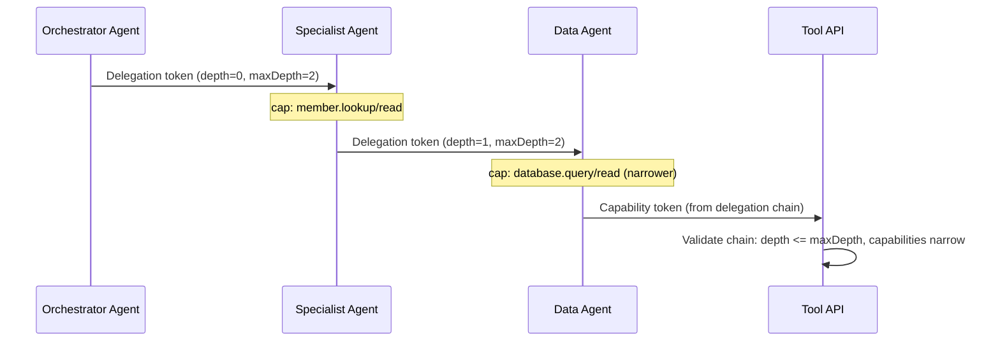

# Agent-to-Agent Delegation

> **Level:** Advanced preview extension

## Simple explanation

When one agent delegates a subtask to another agent, the delegation must be bounded: the sub-agent should not gain more authority than the original caller, and the delegation chain should not go infinitely deep.

## In one sentence

`SdJwt.Net.AgentTrust.A2A` validates and enforces bounded delegation chains where each agent in the chain receives equal or narrower authority than its parent.

## What you will learn

- How delegation chains work in Agent Trust
- How `maxDepth` prevents unbounded delegation
- How capability constraints are inherited and narrowed
- How to validate a chain of delegation tokens

## Why delegation chains matter

Consider an orchestrator agent that delegates a "look up member" task to a specialist agent, which in turn delegates a "query database" subtask to a data agent. Without enforcement:

- The data agent might claim broader authority than the orchestrator intended
- The chain might grow to arbitrary depth, making audit impossible
- There is no cryptographic proof that the original caller authorized the final action

Agent Trust delegation tokens solve this by encoding the chain in the token itself.

## How it works

### Delegation rules

| Rule                 | What it means                                                                                                                      |
| -------------------- | ---------------------------------------------------------------------------------------------------------------------------------- |
| Depth tracking       | Each delegation increments `cap.delegationDepth`. If it exceeds `maxDepth`, the delegation is rejected.                            |
| Capability narrowing | A sub-agent can receive equal or narrower capabilities than its parent. It cannot escalate.                                        |
| Policy check         | Each delegation is evaluated by the policy engine before the token is minted.                                                      |
| Chain validation     | The receiver validates the full chain of delegation tokens, checking signatures, depths, and capability constraints at each level. |

### Delegation token structure

A delegation token extends the standard capability token with:

| Claim                 | Purpose                                                   |
| --------------------- | --------------------------------------------------------- |
| `cap.delegatedBy`     | Identity of the parent agent that created this delegation |
| `cap.delegationDepth` | Current depth in the chain (0 = original caller)          |
| `maxDepth`            | Maximum allowed chain depth                               |

All standard capability token claims (`iss`, `aud`, `exp`, `jti`, `cap`, `ctx`) are also present. The delegation token is a full SD-JWT with its own signature.

|                      |                                                                                                                                                                               |
| -------------------- | ----------------------------------------------------------------------------------------------------------------------------------------------------------------------------- |
| **Audience**         | Architects designing multi-agent delegation topologies with bounded authority.                                                                                                |
| **Purpose**          | Explain how delegation chains work, how `maxDepth` prevents unbounded delegation, and how capabilities narrow at each hop.                                                    |
| **Scope**            | Delegation token structure, chain validation, depth tracking, capability narrowing. Out of scope: single-hop token model (see [Agent Trust Profile](agent-trust-profile.md)). |
| **Success criteria** | Reader can configure `A2ADelegationIssuer` and `DelegationChainValidator` for a multi-agent pipeline with bounded depth and narrowing capabilities.                           |

## Classes

| Class                             | Purpose                                                                       |
| --------------------------------- | ----------------------------------------------------------------------------- |
| `AgentCard`                       | Agent identity card with capabilities, endpoints, trust config                |
| `DelegationChainValidator`        | Validates ordered delegation token chains with max depth                      |
| `A2ADelegationIssuer`             | Mints delegation tokens with policy check and depth control                   |
| `A2ADelegationOptions`            | Delegation configuration: issuer, audience, capability, depth                 |
| `DelegationChainValidationResult` | Typed result with `Valid`/`Invalid` factory methods                           |
| `AttenuationValidator`            | Validates child capabilities are equal or narrower than parent (Section 18.2) |
| `AttenuationValidationResult`     | Typed result with `IsValid` and `Violations` list                             |

### Attenuation rules (Section 18.2)

The `AttenuationValidator` enforces the following narrowing rules when one agent delegates to another:

| Rule               | Enforcement                                                                  |
| ------------------ | ---------------------------------------------------------------------------- |
| Lifetime           | Child lifetime must not exceed parent lifetime                               |
| Tool match         | Child tool must match parent tool                                            |
| Action narrowing   | Parent wildcard (`*`) allows any child action; otherwise must match exactly  |
| Resource narrowing | Exact match, wildcard parent, or prefix narrowing (child starts with parent) |
| Tenant match       | Child tenant must match parent tenant if specified                           |
| Delegation depth   | Child depth must equal parent depth + 1 and not exceed maxDepth              |
| Root issuer        | `rootIssuer` must remain consistent through the chain                        |

## Related concepts

- [Agent Trust Kits](agent-trust-kits.md) - package overview and architecture
- [Agent Trust Profile](agent-trust-profile.md) - capability token model and threat model
- [Agent Trust Operations](agent-trust-ops.md) - deployment modes and operational guidance
