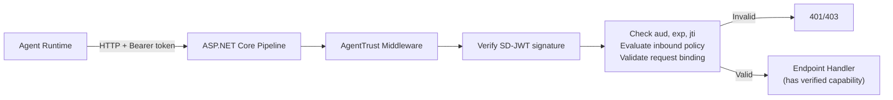
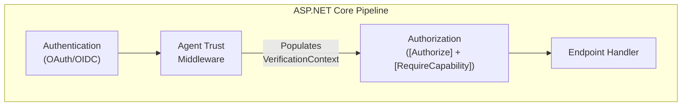

# ASP.NET Core Inbound Verification

> **Level:** Advanced preview extension

## Simple explanation

`SdJwt.Net.AgentTrust.AspNetCore` is middleware that verifies capability tokens on inbound HTTP requests. It sits in the ASP.NET Core pipeline and rejects requests that lack a valid, unexpired, correctly-scoped capability token.

## In one sentence

The middleware extracts an SD-JWT capability token from the `Authorization` header, verifies it, and makes the verified capability available to the endpoint handler.

## What you will learn

- How inbound verification works in the ASP.NET Core pipeline
- What the middleware checks (signature, audience, expiry, replay, capability scope)
- How to configure trusted issuers and audience binding
- How to access the verified capability in endpoint handlers

## Where it fits

## Verification context

The middleware populates an `AgentTrustVerificationContext` containing:

| Property             | Type                     | Description                                       |
| -------------------- | ------------------------ | ------------------------------------------------- |
| `Token`              | `string`                 | Raw SD-JWT token                                  |
| `Capability`         | `CapabilityClaim`        | Verified capability claims (tool, action, limits) |
| `Context`            | `CapabilityContext`      | Correlation metadata                              |
| `Issuer`             | `string`                 | Token issuer identity                             |
| `Audience`           | `string`                 | Expected audience                                 |
| `TokenId`            | `string`                 | Unique token identifier (`jti`)                   |
| `SecurityMode`       | `AgentTrustSecurityMode` | Current security mode (Demo/Pilot/Production)     |
| `RequestBinding`     | `RequestBinding?`        | Bound request details if present                  |
| `ProofMaterial`      | `ProofMaterial?`         | DPoP/mTLS proof material if present               |
| `DelegationEvidence` | `DelegationEvidence?`    | Delegation chain evidence if present              |
| `ActualRequest`      | `HttpRequestBinding?`    | Actual HTTP request for binding validation        |

## What the middleware checks

| Step | Check                                                    | Failure response |
| ---- | -------------------------------------------------------- | ---------------- |
| 1    | `Authorization: Bearer` header present                   | 401 Unauthorized |
| 2    | SD-JWT signature valid against trusted issuer keys       | 401 Unauthorized |
| 3    | `aud` matches this service's configured audience         | 403 Forbidden    |
| 4    | `exp` is still in the future (with clock skew tolerance) | 401 Unauthorized |
| 5    | `jti` not already used (nonce store lookup)              | 403 Forbidden    |
| 6    | Request binding validation (if `req_bind` present)       | 403 Forbidden    |
| 7    | Sender constraint / PoP validation (if `cnf` present)    | 403 Forbidden    |
| 8    | Inbound policy evaluation (if configured)                | 403 Forbidden    |
| 9    | Record `jti` in nonce store                              | (internal)       |
| 10   | Emit audit receipt                                       | (internal)       |

After verification, the middleware populates `HttpContext.Items` with the `AgentTrustVerificationContext`. Endpoint handlers can access `cap.tool`, `cap.action`, `cap.limits`, `ctx` correlation metadata, and delegation evidence.

|                      |                                                                                                                                                                               |
| -------------------- | ----------------------------------------------------------------------------------------------------------------------------------------------------------------------------- |
| **Audience**         | ASP.NET Core developers adding capability-token verification to HTTP APIs.                                                                                                    |
| **Purpose**          | Explain the inbound verification middleware pipeline: what it checks, how it integrates with standard authentication, and how endpoint handlers access verified capabilities. |
| **Scope**            | Middleware configuration, 8-step check table, relationship to `[Authorize]`. Out of scope: MCP interceptors (see [MCP Trust Interceptor](agent-trust-mcp.md)).                |
| **Success criteria** | Reader can add `UseAgentTrustVerification()` to the ASP.NET Core pipeline and access verified capability claims in endpoint handlers.                                         |

## Relationship to standard ASP.NET Core authentication

This middleware does not replace `[Authorize]` or ASP.NET Core Identity. It adds an additional verification layer:

| Layer                   | What it does                     | Standard                             |
| ----------------------- | -------------------------------- | ------------------------------------ |
| Transport               | TLS/mTLS                         | ASP.NET Core Kestrel                 |
| Authentication          | Proves caller identity           | OAuth/OIDC via `AddAuthentication()` |
| Authorization (coarse)  | Checks roles/scopes              | `[Authorize(Roles=...)]`             |
| Capability verification | Verifies per-action SD-JWT token | Agent Trust middleware               |

Use standard authentication to know who is calling. Use capability verification to know what this specific call is authorized to do.

## Related concepts

- [Agent Trust Kits](agent-trust-kits.md) - package overview and architecture
- [Agent Trust Profile](agent-trust-profile.md) - capability token model and threat model
- [MCP Trust Interceptor](agent-trust-mcp.md) - MCP-specific trust interceptor
- [Agent Trust Operations](agent-trust-ops.md) - deployment modes and operational guidance
