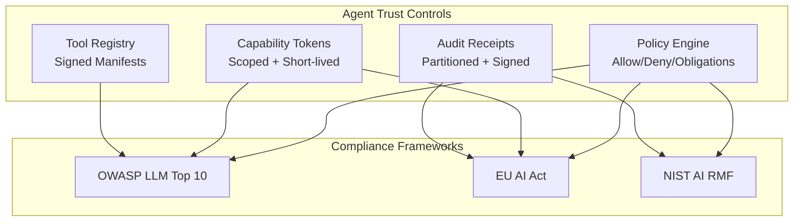

# Agent Trust Governance Alignment

> **Level:** Advanced preview extension

## Simple explanation

This page maps Agent Trust capabilities to industry security frameworks and AI governance regulations. These mappings show how the toolkit's controls align with recognized standards; they do not constitute certification or formal compliance.

|                      |                                                                                                                                               |
| -------------------- | --------------------------------------------------------------------------------------------------------------------------------------------- |
| **Audience**         | Security architects, compliance officers, and governance teams evaluating Agent Trust for regulated environments.                             |
| **Purpose**          | Document how Agent Trust controls map to OWASP LLM Top 10, EU AI Act, and NIST AI RMF requirements.                                           |
| **Scope**            | Framework alignment tables and rationale. Out of scope: threat model (see [Agent Trust Profile](agent-trust-profile.md)), integration how-to. |
| **Success criteria** | Reader can reference specific Agent Trust controls when responding to compliance questionnaires or risk assessments.                          |

## OWASP Top 10 for LLM Applications

| OWASP LLM Risk                    | Agent Trust Control                                                                   |
| --------------------------------- | ------------------------------------------------------------------------------------- |
| LLM01 - Prompt Injection          | Per-action tokens prevent injected prompts from invoking unauthorized tools           |
| LLM02 - Insecure Output Handling  | Request binding (`req_bind`) ties tokens to specific requests, preventing misuse      |
| LLM04 - Model Denial of Service   | Short-lived tokens + rate limiting reduce sustained abuse                             |
| LLM07 - Insufficient AI Alignment | Policy engine enforces explicit rules regardless of LLM output                        |
| LLM08 - Excessive Agency          | Capability scoping + delegation limits + attenuation validation bound agent authority |
| LLM09 - Overreliance              | Audit receipts with obligations support human-reviewable decision trails              |
| LLM10 - Model Theft               | Tool registry with signed manifests prevents tool poisoning and schema tampering      |

## EU AI Act (Regulation 2024/1689)

| Requirement               | Agent Trust Feature                                                                     |
| ------------------------- | --------------------------------------------------------------------------------------- |
| Art. 14 - Human oversight | Audit receipts with correlation IDs + approval evidence support human review            |
| Art. 12 - Record-keeping  | Receipt writer produces append-only, partitioned records per decision                   |
| Art. 9 - Risk management  | Policy engine implements allow/deny rules with obligations and explicit constraints     |
| Art. 15 - Robustness      | Short token lifetimes + replay prevention + request binding reduce attack surface       |
| Art. 13 - Transparency    | Token claims (`cap`, `ctx`, `del`) make agent authority and provenance machine-readable |

These mappings reflect current understanding of the regulation. The EU AI Act implementing rules are still being finalized; verify applicability with legal counsel for your deployment context.

## NIST AI Risk Management Framework (AI RMF 1.0)

| Function    | Agent Trust Mapping                                                                                                                                                     |
| ----------- | ----------------------------------------------------------------------------------------------------------------------------------------------------------------------- |
| **GOVERN**  | Policy rules are version-controlled, deterministic, and testable. Policy decision bindings (`pol_bind`) create an auditable link between decisions and policy versions. |
| **MAP**     | Capability claims make agent authorities explicit and reviewable. Tool registry entries with signed manifests provide provenance for tool schemas.                      |
| **MEASURE** | OpenTelemetry counters and histograms (spec Section 24.1) capture minting, verification, policy evaluation, and replay detection metrics.                               |
| **MANAGE**  | Key rotation + policy updates change trust boundaries without code changes. Security modes (`Demo`/`Pilot`/`Production`) enforce progressive hardening.                 |

## Governance Architecture

## Related concepts

- [Agent Trust Profile](agent-trust-profile.md) - capability token model and threat model
- [Agent Trust Kits](agent-trust-kits.md) - package overview and architecture
- [Agent Trust Operations](agent-trust-ops.md) - deployment modes and operational guidance
