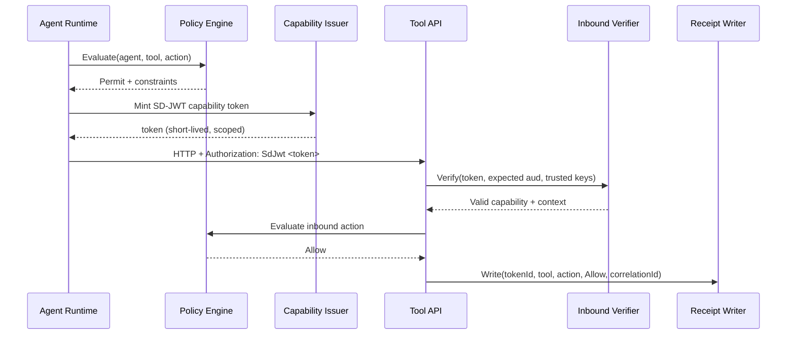
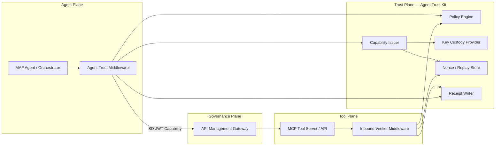

# Agent Trust Kits — Deep Dive

This document explains the purpose, architecture, threat model, and operational guidance for the Agent Trust kits. It is the canonical reference for teams evaluating or adopting Agent Trust in production.

---

## The Problem Today

AI agents are becoming first-class participants in enterprise systems. They call tools, invoke APIs, delegate tasks to other agents, and make decisions that affect real data. But the trust infrastructure behind these interactions has not kept pace.

### Scenario 1 — Prompt Injection with Unrestricted Tool Access

An LLM-powered agent is tricked by adversarial input into calling a tool it was never intended to use. Because the agent holds a long-lived API key with broad scope, the tool server cannot distinguish a legitimate call from a compromised one. The attacker exfiltrates customer data through a legitimate-looking tool invocation.

**Root cause:** The agent's credential authorizes _all_ tools at _all_ times. There is no per-action scoping.

### Scenario 2 — Overprivileged API Keys and Lateral Movement

A development team provisions an agent with a single service account that has access to payments, member lookup, and admin tools. When the agent's environment is compromised, the attacker uses the same credential to move laterally across every tool the agent was configured to reach.

**Root cause:** Static credentials grant standing access rather than just-in-time, scoped authorization.

### Scenario 3 — No Audit Trail for Agent Actions

A regulated enterprise deploys AI agents to process insurance claims. When an auditor asks which agent made a specific decision and what data it accessed, the team cannot answer—tool server logs show only "agent-service-account called /api/claims" with no correlation to the originating workflow, step, or purpose.

**Root cause:** No structured, machine-enforceable provenance travels with each request.

### Scenario 4 — Unbounded Multi-Agent Delegation

An orchestrator agent delegates a task to a specialist agent, which in turn delegates to another. Each agent mints its own tokens, and there is no check on how many levels deep delegation goes or whether the sub-agents have been granted more authority than the original caller.

**Root cause:** No delegation chain enforcement or bounded-authority model.

---

## What Agent Trust Kit Does

Agent Trust Kit extends the SD-JWT .NET ecosystem from **human-held verifiable credentials** to **machine-to-machine (M2M) agent capabilities**. It turns every AI agent action into a verifiable, least-privilege, auditable capability by:

1. **Minting scoped SD-JWT capability tokens** — one per tool call or agent-to-agent interaction, with the minimum claims the receiver needs.
2. **Evaluating policy** — a deterministic policy engine decides allow/deny before any token is minted.
3. **Verifying and enforcing constraints** — the receiving tool or agent validates the token, checks audience, enforces expiry, and prevents replay.
4. **Writing audit receipts** — every allow/deny decision produces a structured, correlatable receipt.

---

## How It Works — Step by Step

Think of a capability token as a **boarding pass** for a specific flight:

| Boarding Pass                       | Capability Token                          |
| ----------------------------------- | ----------------------------------------- |
| Specific passenger                  | Specific agent identity (`iss`)           |
| Specific flight                     | Specific tool + action (`cap`)            |
| Gate + seat                         | Audience (`aud`)                          |
| Boarding time window                | Token expiry (`exp`) — seconds to minutes |
| Barcode                             | Cryptographic signature (SD-JWT)          |
| You cannot board a different flight | Token rejected by a different tool        |

### The Five Steps

**Step 1 — Agent receives a task.** The agent runtime (e.g., Microsoft Agent Framework / MAF) determines it needs to call a tool to complete a task in a workflow.

**Step 2 — Policy evaluation.** Before any token is minted, the Agent Trust middleware asks the policy engine: _"Is this agent allowed to call this tool with this action?"_ If the policy denies, the call never happens.

**Step 3 — Capability token minting.** If the policy permits, the `CapabilityTokenIssuer` creates a short-lived SD-JWT containing:

- `iss` — who is calling (agent identity)
- `aud` — who is being called (tool identity)
- `cap` — what the caller can do (tool, action, optional resource/limits)
- `ctx` — correlation metadata (correlationId, workflowId, stepId)
- `exp` — when this token expires (typically 30–120 seconds)
- `jti` — unique token ID for replay prevention

Only the claims the tool needs are disclosed; the rest are cryptographically hidden via SD-JWT selective disclosure.

**Step 4 — Tool call with token.** The agent sends the HTTP request with the capability token in the `Authorization: SdJwt <token>` header. The tool server's inbound verification middleware:

1. Extracts the token from the header
2. Verifies the SD-JWT signature against trusted issuer keys
3. Validates `aud` matches this tool
4. Checks `exp` is still valid
5. Checks `jti` against the nonce store (replay prevention)
6. Evaluates inbound policy if configured
7. Returns 401/403 or passes the verified capability to the endpoint handler

**Step 5 — Audit receipt.** After the decision (allow or deny), a structured receipt is emitted with the token ID, tool, action, decision, correlation ID, and timestamp. Receipts flow to the logging/observability stack for audit and compliance.

---

## Architecture

### Four Planes

The architecture separates concerns into four planes:

1. **Agent Plane** — MAF orchestrator, skills, tool routing. This is where agent business logic lives.
2. **Trust Plane** — Agent Trust Kit: mint, verify, policy, receipts. This is the security layer.
3. **Tool Plane** — MCP servers, APIs, other agents. These are the protected resources.
4. **Governance Plane** — Optional API Management gateway for centralized policy enforcement.

### How It Maps to Existing SD-JWT .NET

| Agent Trust Kit Component | Reuses From                         | New Logic Added                                       |
| ------------------------- | ----------------------------------- | ----------------------------------------------------- |
| Capability Issuer         | `SdIssuer` (core issuance)          | Capability claim profile, audience scoping            |
| Inbound Verifier          | `SdVerifier` (core verification)    | Capability claim validation, limits enforcement       |
| Policy Engine             | `SdJwt.Net.HAIP` patterns           | M2M policy rules, action-based constraints            |
| Key Custody               | `IKeyManager` (wallet architecture) | Agent identity binding, HSM/KeyVault integration      |
| Nonce/Replay Store        | Nonce validation in OID4VP          | Cache-backed replay prevention for short-lived tokens |
| Receipt Writer            | `ITransactionLogger` (wallet audit) | Append-only audit receipts with correlation tracking  |

---

## Trust Artifacts

### Artifact A — SD-JWT Capability Token (Per Action)

A short-lived SD-JWT whose disclosed claims are the minimum needed by the receiver.

| Claim | Type     | Description                                               |
| ----- | -------- | --------------------------------------------------------- |
| `iss` | Standard | Issuing agent identity                                    |
| `aud` | Standard | Target tool/agent audience                                |
| `iat` | Standard | Issued-at timestamp                                       |
| `exp` | Standard | Short expiry (seconds to minutes)                         |
| `jti` | Standard | Unique token identifier for replay prevention             |
| `cap` | Custom   | Capability object: `{ tool, action, resource?, limits? }` |
| `ctx` | Custom   | Context object: `{ correlationId, workflowId?, stepId? }` |
| `cnf` | Optional | Proof-of-possession key binding (sender constraint)       |

**Why SD-JWT over plain JWT:** Selective disclosure allows the tool server to verify the token's integrity while receiving only the claims it needs to enforce. For example, a tool might need `cap.action` and `cap.limits` but not `ctx.workflowId`—those remain cryptographically hidden.

### Artifact B — Delegation Token (Agent-to-Agent Chain)

Same structure as Artifact A, with additional delegation claims:

- `cap.delegatedBy` — Original agent identity
- `cap.delegationDepth` — Current depth in the delegation chain
- `maxDepth` — Maximum allowed delegation chain depth
- Policy constraints inherited from the parent token

### Artifact C — Audit Receipt (Post-Action)

Signed metadata produced after each allow/deny decision:

- Token `jti`, tool, action, timestamp, decision (allow/deny)
- Correlation ID for end-to-end workflow tracing
- Optional request/response metadata hashes (no PII)
- Evaluation duration for performance monitoring

---

## Package Breakdown

| Package                           | Responsibility                                                         | Dependencies                |
| --------------------------------- | ---------------------------------------------------------------------- | --------------------------- |
| `SdJwt.Net.AgentTrust.Core`       | SD-JWT capability issuance/verification, replay prevention, audit data | `SdJwt.Net`                 |
| `SdJwt.Net.AgentTrust.Policy`     | Rule-based allow/deny engine, delegation checks, constraint builders   | `SdJwt.Net.AgentTrust.Core` |
| `SdJwt.Net.AgentTrust.Maf`        | MAF middleware/interceptors (pre/post tool execution)                  | `Core`, `Policy`, MAF SDK   |
| `SdJwt.Net.AgentTrust.AspNetCore` | ASP.NET Core inbound verification middleware + authorization           | `Core`, `Policy`            |

### Core Classes (Implemented)

| Class                        | Purpose                                                                 |
| ---------------------------- | ----------------------------------------------------------------------- |
| `CapabilityTokenIssuer`      | Mints SD-JWT capability tokens with scoped claims                       |
| `CapabilityTokenVerifier`    | Verifies tokens: signature, expiry, audience, replay, capability claims |
| `CapabilityClaim`            | The `cap` claim: tool, action, resource, limits                         |
| `CapabilityContext`          | The `ctx` claim: correlationId, workflowId, stepId, tenantId            |
| `CapabilityLimits`           | Machine-enforceable limits: maxResults, maxInvocations, maxPayloadBytes |
| `MemoryNonceStore`           | In-process nonce/replay store backed by `IMemoryCache`                  |
| `InMemoryKeyCustodyProvider` | Development key custody; replace with KMS/HSM in production             |
| `LoggingReceiptWriter`       | Receipt writer that emits structured logs via `ILogger`                 |

### Policy Classes (Implemented)

| Class                      | Purpose                                                         |
| -------------------------- | --------------------------------------------------------------- |
| `DefaultPolicyEngine`      | Deterministic first-match rule engine                           |
| `PolicyBuilder`            | Fluent API for constructing allow/deny rules                    |
| `PolicyRule`               | A single allow/deny rule with agent/tool/action patterns        |
| `PolicyConstraintsBuilder` | Builder for per-rule constraints (lifetime, limits, disclosure) |
| `DelegationChain`          | Tracks delegation depth and allowed actions across agent hops   |

---

## Threat Model

### What the Kit Defends Against

| Threat                                                  | Defence                      | Mechanism                                                                 |
| ------------------------------------------------------- | ---------------------------- | ------------------------------------------------------------------------- |
| **Prompt injection leading to unauthorized tool calls** | Per-action scoping           | Each tool call requires a fresh token scoped to exactly one tool + action |
| **Lateral movement via stolen credentials**             | Short-lived tokens           | Tokens expire in 30–120 seconds; no standing access                       |
| **Replay attacks**                                      | Nonce/replay store           | `jti` recorded on first use; second use is rejected                       |
| **Unbounded multi-agent delegation**                    | Delegation chain enforcement | `maxDepth` limits how many hops a delegation can traverse                 |
| **Capability escalation**                               | Policy engine                | Rules evaluated before minting; denied requests never produce a token     |
| **Unaccountable agent actions**                         | Audit receipts               | Every allow/deny decision emits a correlatable receipt with token ID      |
| **Audience confusion**                                  | `aud` binding                | Token is bound to a specific tool/agent identity; rejected by others      |

### What It Does Not Defend Against

| Threat                    | Why                                                                                            | Mitigation                                                                  |
| ------------------------- | ---------------------------------------------------------------------------------------------- | --------------------------------------------------------------------------- |
| Compromised agent runtime | Agent holds the signing key; if the runtime is fully compromised, it can mint arbitrary tokens | Use HSM/KMS for key custody; limit key permissions                          |
| Compromised tool server   | The tool server runs application logic after verification; it can misuse verified claims       | Network segmentation, principle of least privilege at the application layer |
| Insider with key access   | Someone with direct access to signing keys can mint tokens                                     | Multi-party key ceremony, HSM-held keys with audit logging                  |
| Denial of service         | Token minting/verification adds latency                                                        | Optimized for <5ms per mint; cache signing context                          |

---

## Comparison with Alternative Approaches

| Criterion                   | Agent Trust Kit (SD-JWT)               | OAuth2 Client Credentials       | Static API Keys  | mTLS                         | SPIFFE/SPIRE     |
| --------------------------- | -------------------------------------- | ------------------------------- | ---------------- | ---------------------------- | ---------------- |
| **Per-action scoping**      | One token per tool+action              | One token per scope (broad)     | No scoping       | No scoping                   | No scoping       |
| **Selective disclosure**    | Only needed claims visible             | All scopes visible              | N/A              | N/A                          | N/A              |
| **Token lifetime**          | 30–120 seconds                         | Minutes to hours                | Indefinite       | Session-based                | SVIDs: minutes   |
| **Replay prevention**       | Built-in (jti + nonce store)           | Not built-in                    | N/A              | N/A                          | Not built-in     |
| **Delegation chain**        | Bounded depth + action constraints     | Not supported                   | N/A              | N/A                          | Not supported    |
| **Audit trail**             | Per-decision receipts with correlation | Per-request logs (no structure) | Per-request logs | Per-connection logs          | Per-request logs |
| **Blast radius**            | One tool, one action, one minute       | All resources in scope          | All resources    | All endpoints                | All endpoints    |
| **Infrastructure required** | Signing key + nonce store              | Authorization server            | Key distribution | PKI + certificate management | SPIFFE runtime   |

**When to use OAuth2 CC instead:** When the authorization server is already in place and per-action scoping is not required.

**When to use mTLS instead:** When transport-level identity is sufficient and you do not need claim-level authorization.

**When to combine:** Agent Trust Kit sits _above_ transport security. Use mTLS for channel security and Agent Trust Kit for per-action authorization.

---

## Industry and Compliance Alignment

### OWASP Top 10 for LLM Applications

| OWASP LLM Risk                    | Agent Trust Kit Control                                                     |
| --------------------------------- | --------------------------------------------------------------------------- |
| LLM01 — Prompt Injection          | Per-action tokens prevent injected prompts from invoking unauthorized tools |
| LLM04 — Model Denial of Service   | Short-lived tokens + rate limiting reduce sustained abuse                   |
| LLM07 — Insufficient AI Alignment | Policy engine enforces explicit rules regardless of LLM output              |
| LLM08 — Excessive Agency          | Capability scoping + delegation limits bound what agents can do             |
| LLM09 — Overreliance              | Audit receipts ensure human-reviewable decision trails                      |

### EU AI Act (Regulation 2024/1689)

| Requirement               | Agent Trust Kit Feature                                             |
| ------------------------- | ------------------------------------------------------------------- |
| Art. 14 — Human oversight | Audit receipts with correlation IDs enable human review             |
| Art. 12 — Record-keeping  | Receipt writer produces append-only records per decision            |
| Art. 9 — Risk management  | Policy engine implements allow/deny rules with explicit constraints |
| Art. 15 — Robustness      | Short token lifetimes + replay prevention reduce attack surface     |

### NIST AI Risk Management Framework (AI RMF 1.0)

| Function    | Agent Trust Kit Mapping                                                    |
| ----------- | -------------------------------------------------------------------------- |
| **GOVERN**  | Policy rules are version-controlled, deterministic, and testable           |
| **MAP**     | Capability claims make agent authorities explicit and reviewable           |
| **MEASURE** | Receipt writer captures performance (duration) and decision metrics        |
| **MANAGE**  | Key rotation + policy updates change trust boundaries without code changes |

---

## Deployment Modes

### Mode 1 — SDK-Only (Fast Adoption)

Agent references `SdJwt.Net.AgentTrust.Core` + `SdJwt.Net.AgentTrust.Policy`. Tool references `SdJwt.Net.AgentTrust.AspNetCore`. Keys in app configuration.

**Best for:** Development, proof of concept, small-scale deployments.

### Mode 2 — Sidecar Trust Daemon (Enterprise Hardening)

Agent and tool call a localhost sidecar to mint/verify/sign. Sidecar holds keys (or connects to KMS/HSM) and standardizes policy/audit across services.

**Best for:** Containerized environments, Kubernetes, HSM integration.

### Mode 3 — Gateway Enforcement via APIM (Platform Governance)

API Management fronts tool endpoints. Centralized policy, throttling, observability. APIM validates capability tokens at the gateway before forwarding to backend tools.

**Best for:** Enterprise-wide governance, multi-team agent deployments, compliance-heavy environments.

---

## Core Security Properties

1. **Signature validation** — Every capability token is an SD-JWT signed by the issuing agent's key. The receiver cryptographically verifies the signature against whitelisted issuer keys before processing any claims.

2. **Audience binding** — The `aud` claim binds the token to a specific tool or agent endpoint. A token minted for `tool://payments` is rejected by `tool://billing`. This prevents confused-deputy attacks.

3. **Expiry enforcement** — Tokens have lifetimes measured in seconds to minutes (default: 60 seconds). Clock skew tolerance is configurable (default: 30 seconds). There is no reuse window after expiry.

4. **Replay prevention** — The `jti` claim is a unique identifier. The `INonceStore` records it on first use. Any subsequent use of the same `jti` is rejected, even if the token has not yet expired.

5. **Capability-level constraints** — The `cap` claim carries machine-readable limits (`maxResults`, `maxInvocations`, `maxPayloadBytes`). The tool server is expected to enforce these in its application logic.

---

## Operational Guidance

- Keep capability token lifetime short — 30 to 120 seconds for most use cases.
- Use a distributed nonce store (Redis, SQL) in multi-instance deployments; the in-memory store is single-node only.
- Rotate issuer signing keys on a regular cadence and maintain `kid` (Key ID) consistency so receivers can resolve the correct public key.
- Store audit receipts in a centralized, append-only system (not only ephemeral logs). Event streaming (Kafka, Event Hub) or structured databases (Cosmos DB, PostgreSQL) are common sinks.
- Prefer **fail-closed** mode for privileged or write operations: if verification fails or the nonce store is unavailable, deny the request.
- Test policy rules as part of CI/CD — they are deterministic and can be unit tested like application code.
- Configure separate signing keys per agent identity; do not share keys across agents.

---

## Related Documentation

- [Agent Trust Integration Guide](../guides/agent-trust-integration.md) — step-by-step wiring guide
- [Agent Trust Tutorial](../tutorials/intermediate/07-agent-trust-kits.md) — 25-minute hands-on tutorial
- [Agent Trust End-to-End Example](../examples/agent-trust-end-to-end.md) — runnable code sample
- [SD-JWT Deep Dive](sd-jwt-deep-dive.md) — the underlying token format
- [Architecture Guide](architecture.md) — ecosystem-wide architecture reference
