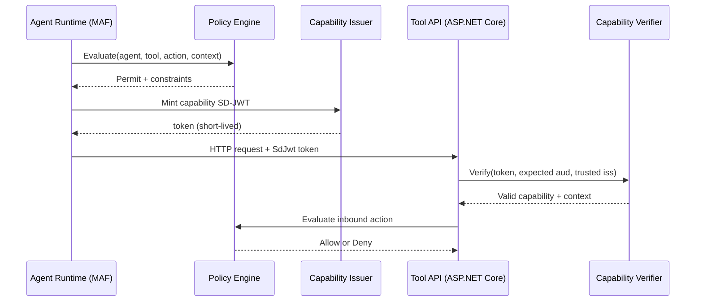

# Agent Trust Kits Deep Dive

This document explains the purpose, architecture, and operational model of the Agent Trust kits:

- `SdJwt.Net.AgentTrust.Core`
- `SdJwt.Net.AgentTrust.Policy`
- `SdJwt.Net.AgentTrust.AspNetCore`
- `SdJwt.Net.AgentTrust.Maf`

---

## Why Agent Trust

Agent systems need bounded authority when calling tools or downstream services. The kits implement this with short-lived SD-JWT capability tokens that carry:

- Who is calling (`iss`)
- Who can accept the token (`aud`)
- What the caller can do (`cap.tool`, `cap.action`, optional limits/resource)
- Correlation context (`ctx`)

This design enables explicit least-privilege authorization without long-lived static credentials.

---

## Package Responsibilities

| Package                           | Responsibility                                            |
| --------------------------------- | --------------------------------------------------------- |
| `SdJwt.Net.AgentTrust.Core`       | Token minting/verification, replay prevention, audit data |
| `SdJwt.Net.AgentTrust.Policy`     | Rule-based allow/deny and delegation checks               |
| `SdJwt.Net.AgentTrust.AspNetCore` | Inbound verification middleware for tool HTTP APIs        |
| `SdJwt.Net.AgentTrust.Maf`        | Outbound token propagation for tool-call middleware       |

---

## End-to-End Flow

---

## Core Security Properties

1. Signature validation against trusted issuer keys.
2. Audience binding to the target tool/service.
3. Expiry enforcement with skew tolerance.
4. Replay prevention with nonce/token-id store.
5. Capability-level constraints (resource and limits).

---

## Policy Model

The default policy engine is deterministic:

1. Sort rules by descending priority.
2. Match wildcard patterns (`*`) for agent/tool/action/resource.
3. First match decides allow or deny.
4. Delegation checks run before rule matching (depth and action bounds).

This makes policy behavior predictable and easy to test.

---

## Operational Guidance

- Keep capability token lifetime short (typically 30-120 seconds).
- Use distributed nonce storage in multi-instance deployments.
- Rotate issuer keys and maintain `kid` hygiene.
- Store receipts in centralized audit systems (not only logs).
- Prefer fail-closed mode for privileged or write operations.

---

## Related Documentation

- [Agent Trust Integration Guide](../guides/agent-trust-integration.md)
- [Intermediate Tutorial: Agent Trust Kits](../tutorials/intermediate/07-agent-trust-kits.md)
- [Agent Trust Examples](../examples/README.md)
