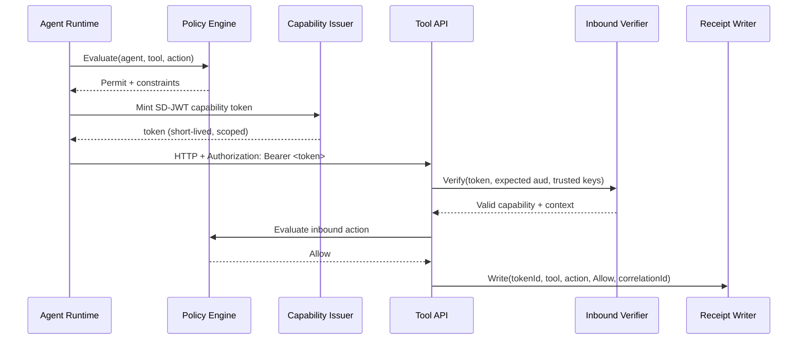
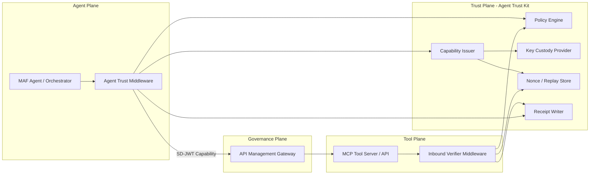

# Agent Trust Kits

> **Level:** Advanced preview architecture

## Simple explanation

Agent Trust Kits are the implementation packages that make the [Agent Trust Profile](agent-trust-profile.md) work in practice.

## What you will learn

- Which packages compose the Agent Trust implementation layer
- How to mint and verify capability tokens with Core
- How Policy, AspNetCore, and Mcp interceptors enforce trust decisions
- How A2A delegation chains work across agents

The profile defines what a capability token looks like. The kits provide:

- **Core** - minting and verifying capability tokens
- **Policy** - rule-based engines that decide whether to allow an action
- **AspNetCore** - middleware that verifies tokens on inbound HTTP requests
- **Mcp** - interceptor for Model Context Protocol tool calls
- **A2A** - agent-to-agent delegation (one agent authorizes another)
- **OpenTelemetry** - metrics and telemetry for trust decisions
- **Maf** - MAF/MCP adapter for agent framework integration
- **Policy.Opa** - external policy evaluation via Open Policy Agent

|                      |                                                                                                                                                                                                                                                        |
| -------------------- | ------------------------------------------------------------------------------------------------------------------------------------------------------------------------------------------------------------------------------------------------------ |
| **Audience**         | Platform engineers, security architects, and developers building AI agent systems that require bounded, auditable tool access.                                                                                                                         |
| **Purpose**          | Explain the preview Agent Trust architecture - capability tokens, policy engines, and MAF/MCP adapters - its threat model, and operational guidance for pilots and controlled adoption.                                                                |
| **Scope**            | Problem statement, architecture layers, capability token structure, policy engine, MAF adapter, threat model, and operational hardening. Out of scope: integration how-to (see [Agent Trust Integration Guide](../guides/agent-trust-integration.md)). |
| **Success criteria** | Reader can explain the Agent Trust security model, design a capability-based policy for their agent fleet, and evaluate the threat model for their deployment scenario.                                                                                |

---

> SD-JWT .NET is a standards-first .NET library ecosystem.
> This document explains the preview `SdJwt.Net.AgentTrust.*` packages within that ecosystem.
> Agent Trust is a project-defined preview profile, not an IETF, OpenID Foundation, or OWF standard.

## Package Role In The Ecosystem

| Field                  | Value                                                                                                      |
| ---------------------- | ---------------------------------------------------------------------------------------------------------- |
| Ecosystem area         | Preview Trust Extensions                                                                                   |
| Package maturity       | Preview                                                                                                    |
| Primary audience       | Platform engineers, security architects, and developers building controlled agent/tool-call pilots         |
| What this package does | Provides scoped capability SD-JWTs, policy checks, MCP/API guards, telemetry, and delegation-chain helpers |
| What it does not do    | Replace OAuth, OIDC, mTLS, SPIFFE/SPIRE, API gateways, MCP authorization, or production security review    |

## Relationship To OAuth, OIDC, mTLS, SPIFFE, And MCP Authorization

Agent Trust does not replace OAuth 2.0, OpenID Connect, mTLS, SPIFFE/SPIRE, API gateways, or MCP authorization.

Use existing identity and transport controls to authenticate workloads and protect channels. Use Agent Trust when you need an additional per-action, short-lived, auditable capability proof that travels with an agent tool call.

In short:

- OAuth/OIDC answers: who is the client and what broad scopes were granted?
- mTLS/SPIFFE answers: which workload or service is connected?
- MCP authorization answers: how does an MCP client access an MCP server?
- Agent Trust answers: is this specific agent allowed to perform this specific tool action for this specific workflow step right now?

---

## The Problem Today

AI agents are becoming first-class participants in enterprise systems. They call tools, invoke APIs, delegate tasks to other agents, and make decisions that affect real data. But the trust infrastructure behind these interactions has not kept pace.

### Scenario 1 - Prompt Injection with Unrestricted Tool Access

An LLM-powered agent is tricked by adversarial input into calling a tool it was never intended to use. Because the agent holds a long-lived API key with broad scope, the tool server cannot distinguish a legitimate call from a compromised one. The attacker exfiltrates customer data through a legitimate-looking tool invocation.

**Root cause:** The agent's credential authorizes _all_ tools at _all_ times. There is no per-action scoping.

### Scenario 2 - Overprivileged API Keys and Lateral Movement

A development team provisions an agent with a single service account that has access to payments, member lookup, and admin tools. When the agent's environment is compromised, the attacker uses the same credential to move laterally across every tool the agent was configured to reach.

**Root cause:** Static credentials grant standing access rather than just-in-time, scoped authorization.

### Scenario 3 - No Audit Trail for Agent Actions

A regulated enterprise deploys AI agents to process insurance claims. When an auditor asks which agent made a specific decision and what data it accessed, the team cannot answer - tool server logs show only "agent-service-account called /api/claims" with no correlation to the originating workflow, step, or purpose.

**Root cause:** No structured, machine-enforceable provenance travels with each request.

### Scenario 4 - Unbounded Multi-Agent Delegation

An orchestrator agent delegates a task to a specialist agent, which in turn delegates to another. Each agent mints its own tokens, and there is no check on how many levels deep delegation goes or whether the sub-agents have been granted more authority than the original caller.

**Root cause:** No delegation chain enforcement or bounded-authority model.

---

## What Agent Trust Kit Does

Agent Trust Kit is a preview extension that applies SD-JWT trust principles to **machine-to-machine (M2M) agent capabilities**. It explores how agent actions can become verifiable, least-privilege, auditable capabilities by:

1. **Minting scoped SD-JWT capability tokens** - one per tool call or agent-to-agent interaction, with the minimum claims the receiver needs.
2. **Evaluating policy** - a deterministic policy engine decides allow/deny before any token is minted.
3. **Verifying and enforcing constraints** - the receiving tool or agent validates the token, checks audience, enforces expiry, and prevents replay.
4. **Writing audit receipts** - every allow/deny decision produces a structured, correlatable receipt.

---

## Terminology - Why "Minting" and Not "Issuing"

Throughout this project, the act of creating a capability token is called **minting** rather than the more familiar OAuth term "issuing." This is a deliberate choice rooted in **capability-based security** literature:

| Term      | Origin                                      | Connotation                                                     |
| --------- | ------------------------------------------- | --------------------------------------------------------------- |
| **Mint**  | Object-capability model, Macaroons, ZCAP-LD | Create a fresh, scoped, ephemeral capability on demand          |
| **Issue** | OAuth 2.0, OpenID4VCI, X.509                | Grant a longer-lived credential from a trusted authority        |
| **Grant** | OAuth 2.0 Authorization Framework           | Authorize a client through a specific flow (code, device, etc.) |

Key differences that make "minting" the right fit for Agent Trust:

- **Ephemeral scope.** A capability token lives for seconds to minutes and authorizes exactly one action. OAuth tokens are typically session-length or longer.
- **Inline creation.** The caller creates the token itself (after policy approval) rather than requesting it from a remote authorization server.
- **No audience negotiation.** The mint operation is unilateral - no round-trip to the resource owner or an authorization endpoint.
- **Capability semantics.** In the object-capability model, "minting a capability" means constructing a transferable proof of authority. The token is the authority - possessing it is sufficient to act.

The `CapabilityTokenIssuer` class name uses "Issuer" for consistency with the SD-JWT ecosystem (where `SdIssuer` is the core primitive), but its primary method is `Mint()` to signal the capability-security intent.

**If you come from the OAuth/OIDC world:** Read "mint" as "issue a short-lived, single-use capability token inline without a token endpoint."

---

## How It Works - Step by Step

Think of a capability token as a **boarding pass** for a specific flight:

| Boarding Pass                       | Capability Token                          |
| ----------------------------------- | ----------------------------------------- |
| Specific passenger                  | Specific agent identity (`iss`)           |
| Specific flight                     | Specific tool + action (`cap`)            |
| Gate + seat                         | Audience (`aud`)                          |
| Boarding time window                | Token expiry (`exp`) - seconds to minutes |
| Barcode                             | Cryptographic signature (SD-JWT)          |
| You cannot board a different flight | Token rejected by a different tool        |

### The Five Steps

**Step 1 - Agent receives a task.** The agent runtime (e.g., Microsoft Agent Framework / MAF) determines it needs to call a tool to complete a task in a workflow.

**Step 2 - Policy evaluation.** Before any token is minted, the Agent Trust middleware asks the policy engine: _"Is this agent allowed to call this tool with this action?"_ If the policy denies, the call never happens.

**Step 3 - Capability token minting.** If the policy permits, the `CapabilityTokenIssuer` creates a short-lived SD-JWT containing:

- `iss` - who is calling (agent identity)
- `aud` - who is being called (tool identity)
- `cap` - what the caller can do (tool, action, optional resource/limits)
- `ctx` - correlation metadata (correlationId, workflowId, stepId)
- `exp` - when this token expires (typically 30-120 seconds)
- `jti` - unique token ID for replay prevention

Only the claims the tool needs are disclosed; the rest are cryptographically hidden via SD-JWT selective disclosure.

**Step 4 - Tool call with token.** The agent sends the HTTP request with the capability token in the `Authorization: Bearer <token>` header. The tool server's inbound verification middleware:

1. Extracts the token from the header
2. Verifies the SD-JWT signature against trusted issuer keys
3. Validates `aud` matches this tool
4. Checks `exp` is still valid
5. Checks `jti` against the nonce store (replay prevention)
6. Evaluates inbound policy if configured
7. Returns 401/403 or passes the verified capability to the endpoint handler

**Step 5 - Audit receipt.** After the decision (allow or deny), a structured receipt is emitted with the token ID, tool, action, decision, correlation ID, and timestamp. Receipts flow to the logging/observability stack for audit and compliance.

---

## Architecture

### Four Planes

The architecture separates concerns into four planes:

1. **Agent Plane** - MAF orchestrator, skills, tool routing. This is where agent business logic lives.
2. **Trust Plane** - Agent Trust Kit: mint, verify, policy, receipts. This is a preview capability and audit layer that complements existing transport and authorization controls.
3. **Tool Plane** - MCP servers, APIs, other agents. These are the protected resources.
4. **Governance Plane** - Optional API Management gateway for centralized policy enforcement.

### How It Maps to Existing SD-JWT .NET

| Agent Trust Kit Component | Reuses From                         | New Logic Added                                       |
| ------------------------- | ----------------------------------- | ----------------------------------------------------- |
| Capability Issuer         | `SdIssuer` (core issuance)          | Capability claim profile, audience scoping            |
| Inbound Verifier          | `SdVerifier` (core verification)    | Capability claim validation, limits enforcement       |
| Policy Engine             | `SdJwt.Net.HAIP` patterns           | M2M policy rules, action-based constraints            |
| Key Custody               | `IKeyManager` (wallet architecture) | Agent identity binding, HSM/KeyVault integration      |
| Nonce/Replay Store        | Nonce validation in OID4VP          | Cache-backed replay prevention for short-lived tokens |
| Receipt Writer            | `ITransactionLogger` (wallet audit) | Append-only audit receipts with correlation tracking  |

---

## Trust Artifacts

### Artifact A - SD-JWT Capability Token (Per Action)

A short-lived SD-JWT whose disclosed claims are the minimum needed by the receiver.

| Claim | Type     | Description                                               |
| ----- | -------- | --------------------------------------------------------- |
| `iss` | Standard | Issuing agent identity                                    |
| `aud` | Standard | Target tool/agent audience                                |
| `iat` | Standard | Issued-at timestamp                                       |
| `exp` | Standard | Short expiry (seconds to minutes)                         |
| `jti` | Standard | Unique token identifier for replay prevention             |
| `cap` | Custom   | Capability object: `{ tool, action, resource?, limits? }` |
| `ctx` | Custom   | Context object: `{ correlationId, workflowId?, stepId? }` |
| `cnf` | Optional | Proof-of-possession key binding (sender constraint)       |

**Why SD-JWT over plain JWT:** Selective disclosure allows the tool server to verify the token's integrity while receiving only the claims it needs to enforce. For example, a tool might need `cap.action` and `cap.limits` but not `ctx.workflowId` - those remain cryptographically hidden.

### Artifact B - Delegation Token (Agent-to-Agent Chain)

Same structure as Artifact A, with additional delegation claims:

- `cap.delegatedBy` - Original agent identity
- `cap.delegationDepth` - Current depth in the delegation chain
- `maxDepth` - Maximum allowed delegation chain depth
- Policy constraints inherited from the parent token

### Artifact C - Audit Receipt (Post-Action)

Signed metadata produced after each allow/deny decision:

- Token `jti`, tool, action, timestamp, decision (allow/deny)
- Correlation ID for end-to-end workflow tracing
- Optional request/response metadata hashes (no PII)
- Evaluation duration for performance monitoring

---

## Package Breakdown

| Package                              | Responsibility                                                         | Dependencies                |
| ------------------------------------ | ---------------------------------------------------------------------- | --------------------------- |
| `SdJwt.Net.AgentTrust.Core`          | SD-JWT capability issuance/verification, replay prevention, audit data | `SdJwt.Net`                 |
| `SdJwt.Net.AgentTrust.Policy`        | Rule-based allow/deny engine, delegation checks, constraint builders   | `SdJwt.Net.AgentTrust.Core` |
| `SdJwt.Net.AgentTrust.Maf`           | MAF middleware/interceptors (pre/post tool execution)                  | `Core`, `Policy`, MAF SDK   |
| `SdJwt.Net.AgentTrust.AspNetCore`    | ASP.NET Core inbound verification middleware + authorization           | `Core`, `Policy`            |
| `SdJwt.Net.AgentTrust.OpenTelemetry` | Counters, histograms, and telemetry receipt writer for agent trust ops | `Core`, OpenTelemetry.Api   |
| `SdJwt.Net.AgentTrust.Policy.Opa`    | Externalize policy evaluation to Open Policy Agent over HTTP           | `Core`, `Policy`            |
| `SdJwt.Net.AgentTrust.Mcp`           | MCP client trust interceptor and server trust guard                    | `Core`, `Policy`            |
| `SdJwt.Net.AgentTrust.A2A`           | Agent-to-agent delegation chain validation and token issuance          | `Core`, `Policy`            |

### Core Classes (Implemented)

See [Agent Trust Operations](agent-trust-ops.md) for the Core, OpenTelemetry, OPA, and Policy class reference.

See [MCP Trust Interceptor](agent-trust-mcp.md) for the MCP client and server trust classes.

See [Agent-to-Agent Delegation](agent-trust-a2a.md) for the delegation chain and A2A classes.

See [ASP.NET Core Middleware](agent-trust-aspnetcore.md) for inbound HTTP verification.

---

## Threat Model

For the full threat model (what Agent Trust defends against and what it does not), see [Agent Trust Profile - Threat Model](agent-trust-profile.md#when-to-use-agent-trust).

---

## Comparison with Alternative Approaches

For a detailed comparison with OAuth2 Client Credentials, static API keys, mTLS, and SPIFFE/SPIRE, see [Agent Trust Profile - How it compares](agent-trust-profile.md).

---

## Industry and Compliance Alignment

For OWASP Top 10 for LLM Applications, EU AI Act, and NIST AI RMF mapping details, see [Agent Trust Governance](agent-trust-governance.md).

---

## Deployment and Operations

See [Agent Trust Operations](agent-trust-ops.md) for deployment modes (SDK-only, sidecar, gateway), operational guidance, key rotation, nonce stores, and telemetry setup.

---

## Related concepts

### Agent Trust sub-pages

- [MCP Trust Interceptor](agent-trust-mcp.md) - client interceptor and server guard for MCP tool calls
- [ASP.NET Core Middleware](agent-trust-aspnetcore.md) - inbound verification middleware for HTTP APIs
- [Agent-to-Agent Delegation](agent-trust-a2a.md) - delegation chains and bounded authority
- [Agent Trust Operations](agent-trust-ops.md) - deployment modes, telemetry, nonce stores, key custody, and operational guidance

### Ecosystem

- [Agent Trust Profile](../concepts/agent-trust-profile.md) - preview profile and maturity boundaries
- [Agent Trust Integration Guide](../guides/agent-trust-integration.md) - step-by-step wiring guide
- [Agent Trust Tutorial](../tutorials/intermediate/07-agent-trust-kits.md) - 25-minute hands-on tutorial
- [Agent Trust End-to-End Example](../examples/agent-trust-end-to-end.md) - runnable code sample
- [What SD-JWT .NET Is - and Is Not](what-this-project-is.md) - ecosystem boundaries and terminology
- [Standards and Maturity Status](../reference/standards-status.md) - package maturity and standards status
- [SD-JWT](sd-jwt.md) - the underlying token format
- [Ecosystem Architecture](ecosystem-architecture.md) - ecosystem-wide architecture reference
