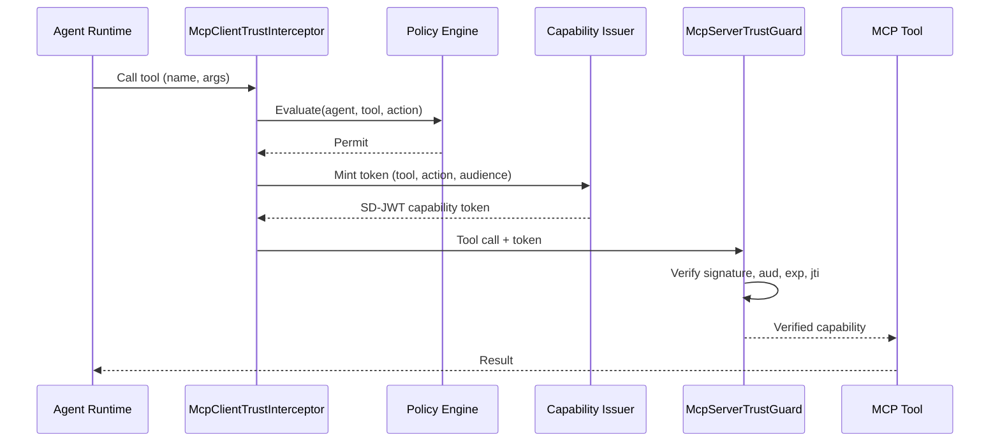
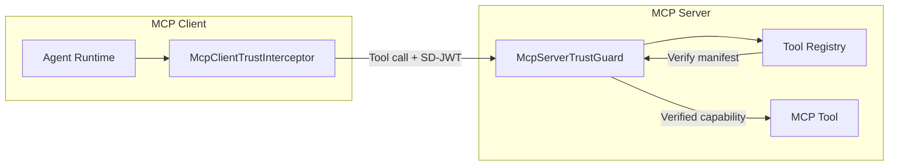

# MCP Trust Interceptor

> **Level:** Advanced preview extension

## Simple explanation

The MCP trust interceptor adds capability-token authorization to Model Context Protocol tool calls. The client side attaches a scoped SD-JWT to each outgoing tool call. The server side verifies the token before executing the tool.

## In one sentence

`SdJwt.Net.AgentTrust.Mcp` ensures every MCP tool call carries a short-lived, per-action capability token that the server verifies before execution.

## What you will learn

- How the client interceptor attaches tokens to outgoing MCP calls
- How the server guard verifies tokens on incoming calls
- How tool trust manifests declare required capabilities
- How to configure audience mapping and trusted issuers

## Why MCP needs per-tool authorization

MCP gives agents access to tools. Without per-tool authorization, an agent with access to one MCP server can call any tool on that server. If the agent is compromised (e.g., via prompt injection), the attacker can invoke any tool the agent can reach.

The MCP trust interceptor constrains this: each tool call requires a fresh capability token scoped to that specific tool and action. A token minted for `member.lookup/read` cannot be used to call `payments.transfer/execute`.

## How it works

### Client side

`McpClientTrustInterceptor` wraps the MCP client. Before each tool call, it:

1. Asks the policy engine whether the call is allowed
2. If permitted, mints a capability token scoped to the tool name and action
3. Attaches the token to the outgoing call metadata

### Server side

`McpServerTrustGuard` wraps the MCP server's tool execution. On each incoming call, it:

1. Extracts the capability token from the call metadata
2. Verifies the SD-JWT signature against trusted issuer keys
3. Validates `aud` matches this MCP server
4. Checks `exp` and `jti` (replay prevention)
5. Compares the token's `cap.tool` against the actual tool being called
6. Passes the verified capability to the tool handler, or rejects the call

### Tool trust manifest

Each MCP tool can declare a `McpToolTrustManifest` that specifies:

- The required capability (tool name, action)
- The expected audience
- Whether sender constraints (DPoP, mTLS) are required
- Tool registry integration via `IToolRegistry` for signed manifest verification

|                      |                                                                                                                                                               |
| -------------------- | ------------------------------------------------------------------------------------------------------------------------------------------------------------- |
| **Audience**         | Platform engineers integrating Agent Trust with MCP tool servers.                                                                                             |
| **Purpose**          | Explain how capability tokens are attached to outgoing MCP tool calls and verified on the server side before execution.                                       |
| **Scope**            | Client interceptor, server guard, tool trust manifests, audience mapping. Out of scope: core token model (see [Agent Trust Profile](agent-trust-profile.md)). |
| **Success criteria** | Reader can wire `McpClientTrustInterceptor` and `McpServerTrustGuard` into an MCP pipeline and configure tool trust manifests.                                |

## Classes

| Class                       | Purpose                                                          |
| --------------------------- | ---------------------------------------------------------------- |
| `McpToolTrustManifest`      | Declares required capabilities and audience for an MCP tool      |
| `McpToolCall`               | Represents a tool invocation with name, arguments, and metadata  |
| `McpToolCallEnvelope`       | Wraps a tool call with capability token and transport metadata   |
| `McpClientTrustInterceptor` | Attaches capability tokens to outgoing MCP tool calls            |
| `McpServerTrustGuard`       | Verifies capability tokens on incoming MCP tool executions       |
| `McpClientTrustOptions`     | Client configuration: agent ID, audience mapping, token lifetime |
| `McpServerTrustOptions`     | Server configuration: audience, trusted issuers                  |

## Related concepts

- [Agent Trust Kits](agent-trust-kits.md) - package overview and architecture
- [Agent Trust Profile](agent-trust-profile.md) - capability token model and threat model
- [Agent Trust Integration Guide](../guides/agent-trust-integration.md) - step-by-step wiring guide
