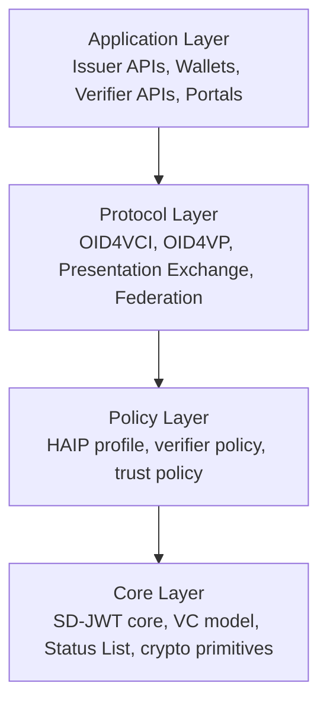
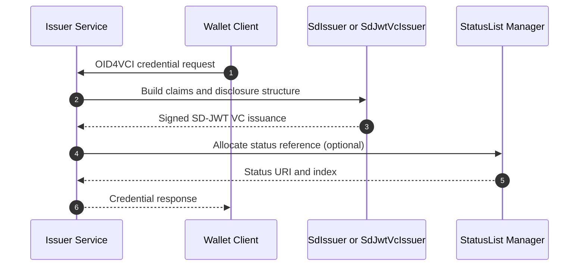
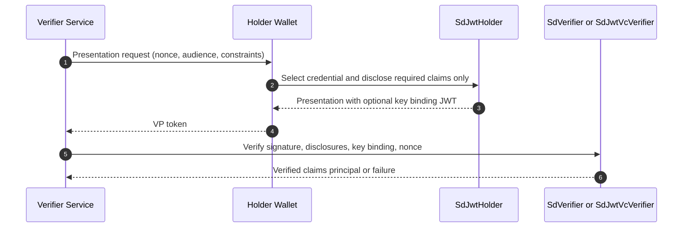
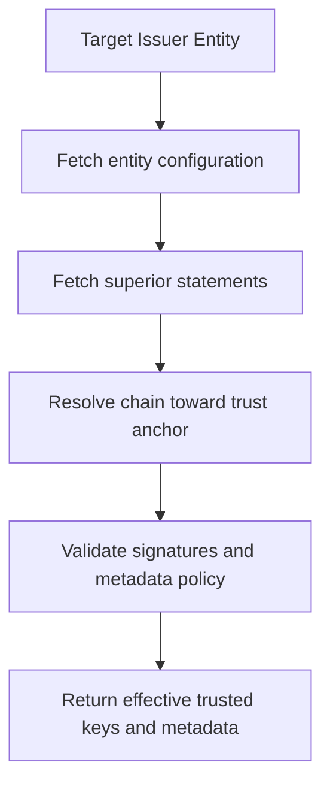
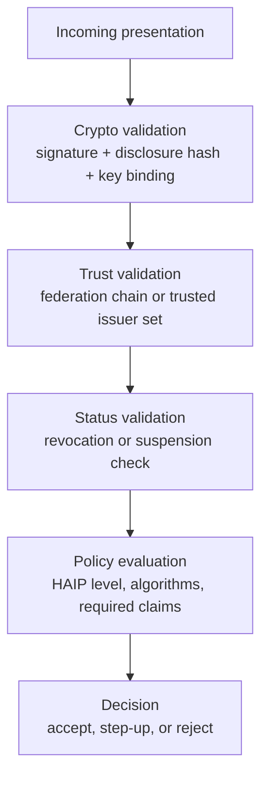
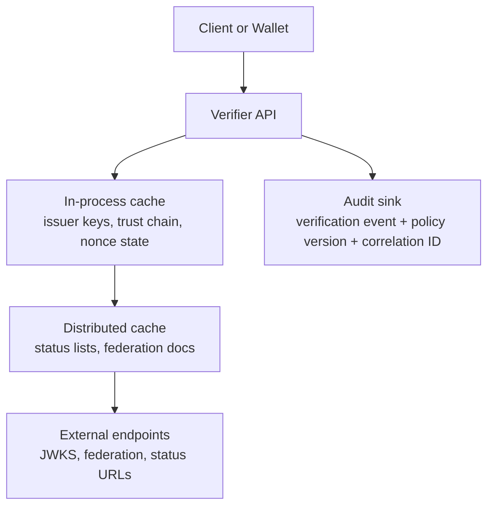

# SD-JWT .NET Ecosystem Architecture

## Executive Summary

`SdJwt.Net` is a modular implementation of selective-disclosure credentials and OpenID4VC protocol flows. The architecture is designed to make three things true at the same time:

1. Privacy by design through selective disclosure and minimal claims.
2. Interoperability through standards-based issuance/presentation/trust protocols.
3. Production assurance through explicit policy, status, and audit controls.

The ecosystem supports simple issuer-verifier integrations and scales to multi-party, high-assurance deployments.

## Architectural Layers

### Layer responsibilities

- `Application Layer`: business workflows, UX, orchestration, observability.
- `Protocol Layer`: interoperable transport and request/response semantics.
- `Policy Layer`: allowed algorithms, trust requirements, key-binding requirements, data minimization constraints.
- `Core Layer`: claim hashing, disclosure processing, signature validation, status semantics.

## Package Map and Role Boundaries

| Package | Primary responsibility | Typical runtime role |
|---|---|---|
| `SdJwt.Net` | Issue/hold/verify SD-JWT payloads | Issuer, Holder, Verifier |
| `SdJwt.Net.Vc` | SD-JWT VC model and VC-oriented verification | Issuer, Verifier |
| `SdJwt.Net.StatusList` | Credential lifecycle status publication/checking | Issuer, Verifier |
| `SdJwt.Net.Oid4Vci` | OpenID4VCI issuance protocol flows | Issuer, Wallet client |
| `SdJwt.Net.Oid4Vp` | OpenID4VP presentation protocol flows | Verifier, Wallet client |
| `SdJwt.Net.PresentationExchange` | Constraint-based request/selection logic | Verifier, Wallet |
| `SdJwt.Net.OidFederation` | Trust chain discovery and validation | Verifier, federation operators |
| `SdJwt.Net.HAIP` | High-assurance policy constraints | Issuer, Verifier |

Design principle: the core cryptographic boundary is independent from transport. You can run core SD-JWT directly in internal services, then layer OID4VCI/OID4VP only where interoperability is required.

## Component Deep Dive

### `SdJwt.Net` (Core SD-JWT)

Purpose:
- Issue, parse, present, and verify RFC 9901 SD-JWT artifacts.
- Enforce disclosure digest integrity and key-binding verification.

Use cases:
- Internal service-to-service selective disclosure.
- Base primitive for VC, OID4VCI, and OID4VP packages.
- Non-VC privacy flows where only SD-JWT is needed.

Primary APIs:
- `SdIssuer`, `SdJwtHolder`, `SdVerifier`, `SdJwtParser`.

### `SdJwt.Net.Vc` (SD-JWT VC Model)

Purpose:
- Add VC-specific claims, VCT handling, and VC-focused verification policy.
- Support type metadata, issuer metadata, and VC verification controls.

Use cases:
- Regulated verifiable credentials (education, finance, identity).
- OID4VP verification that must enforce VC claim semantics.

Primary APIs:
- `SdJwtVcIssuer`, `SdJwtVcVerifier`, metadata resolver/validator components.

### `SdJwt.Net.StatusList` (Lifecycle and Revocation)

Purpose:
- Publish and verify status list tokens for revocation/suspension controls.
- Provide operational tooling for status transitions and cache-aware verification.

Use cases:
- Fraud shutdown and temporary suspension workflows.
- Real-time status checks before authorizing sensitive actions.

Primary APIs:
- `StatusListManager`, `StatusListVerifier`, `StatusType`.

### `SdJwt.Net.Oid4Vci` (Issuance Protocol)

Purpose:
- Model OpenID4VCI credential offer, proof, request, and response payloads.
- Enable protocol-compliant issuance exchanges between issuer and wallet.

Use cases:
- Wallet onboarding via offer URI/QR.
- Pre-authorized issuance for offline or assisted onboarding flows.

Primary APIs:
- `CredentialOffer`, `CredentialRequest`, `CredentialResponse`, proof/grant models.

### `SdJwt.Net.Oid4Vp` (Presentation Protocol)

Purpose:
- Model OpenID4VP authorization request/response and validate VP tokens.
- Enforce nonce/audience/freshness and optional SD-JWT VC checks.

Use cases:
- Web login and API authorization using selective disclosure.
- Cross-device presentation from wallet to verifier portal.

Primary APIs:
- `AuthorizationRequest`, `AuthorizationResponse`, `VpTokenValidator`.

### `SdJwt.Net.PresentationExchange` (Constraint Engine)

Purpose:
- Evaluate credential sets against verifier constraints.
- Generate descriptor mappings and support complex submission requirements.

Use cases:
- Multi-credential policy evaluation for regulated onboarding.
- Minimized disclosure selection from large wallet inventories.

Primary APIs:
- `PresentationExchangeEngine`, `PresentationDefinition`, descriptor and constraint models.

### `SdJwt.Net.OidFederation` (Trust Bootstrap)

Purpose:
- Resolve and validate trust chains against configured trust anchors.
- Apply metadata policy and trust mark constraints to target entities.

Use cases:
- Multi-issuer ecosystems where static allowlists do not scale.
- Dynamic trust onboarding with policy-controlled federation rules.

Primary APIs:
- `TrustChainResolver`, `TrustChainResult`, federation metadata models.

### `SdJwt.Net.HAIP` (Assurance Policy)

Purpose:
- Enforce assurance-level cryptographic and protocol constraints.
- Produce deterministic compliance outcomes for high-assurance deployments.

Use cases:
- Government and regulated industry policy enforcement.
- Step-up decisions when assurance requirements are not met.

Primary APIs:
- `HaipCryptoValidator`, `HaipProtocolValidator`, HAIP model types.

## End-to-End Workflows

### 1) Issuance workflow (core + OID4VCI)

Key controls in this phase:
- disclosure structure definition;
- issuer signing key and algorithm selection;
- status reference inclusion when revocation/suspension must be enforceable.

### 2) Presentation workflow (OID4VP + selective disclosure)

Key controls in this phase:
- nonce and audience binding;
- minimal disclosure by constraint;
- deterministic failure on signature/hash mismatch.

### 3) Trust workflow (OpenID Federation)

Federation is the trust bootstrap for dynamic ecosystems. Instead of hardcoding per-issuer keys, verifiers resolve trust chains to approved anchors and apply metadata policy before token verification.

### 4) Status workflow (credential lifecycle)

Status checks are not optional in abuse-sensitive workflows. Verification should treat status failures as hard failures before business decisioning.

## Policy Enforcement Model (HAIP and verifier policy)

Practical rule order:
1. Cryptographic validity.
2. Trust validity.
3. Lifecycle validity (status).
4. Policy/assurance validity.
5. Business decision.

## Detailed Verification Path

Verifier execution should be explicit and observable:

1. Parse incoming SD-JWT/SD-JWT VC structure.
2. Resolve issuer key material (static set or federation result).
3. Validate JWS signature and standard JWT constraints.
4. Recompute disclosure hashes and compare with `_sd` digests.
5. Validate key binding JWT (`aud`, `nonce`, signing key) when required.
6. Evaluate status reference if present.
7. Apply profile policy (for example HAIP level requirements).
8. Emit structured result (claims, assurance indicators, failure reason).

This makes incident analysis and compliance audits feasible because each failure domain is isolated and logged.

## Deployment Topology and Runtime Concerns

Recommended operational controls:
- bounded cache TTLs for trust and status artifacts;
- correlation IDs across request, verification, and decision logs;
- explicit fail-closed behavior on trust/status resolution errors;
- replay protection store for nonce and challenge state;
- environment-level key management and rotation policy.

## Architecture Decisions That Matter

- Keep claim minimization policy outside prompt templates and inside verifier logic.
- Separate trust resolution from business decisioning so trust failures are unambiguous.
- Treat status as part of verification, not post-processing.
- Version policy and include version in evidence/audit events.
- Prefer deterministic, machine-readable failure reasons over generic unauthorized responses for internal telemetry.

## Related Guides

- [Selective Disclosure Mechanics](selective-disclosure-mechanics.md)
- [HAIP Compliance](haip-compliance.md)
- [How to Verify Presentations](../guides/verifying-presentations.md)
- [How to Manage Credential Revocation](../guides/managing-revocation.md)
- [How to Establish Trust](../guides/establishing-trust.md)
