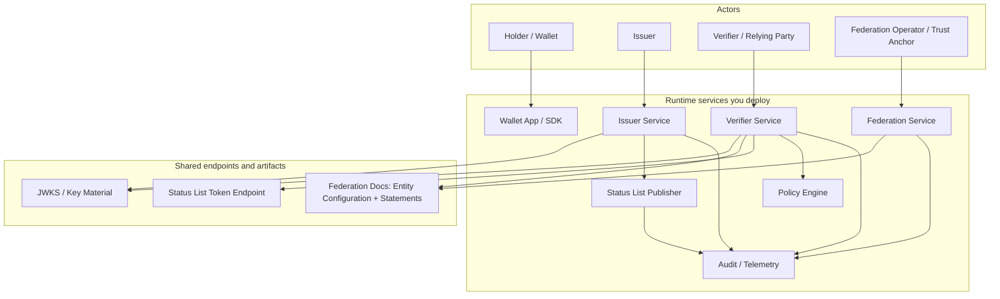
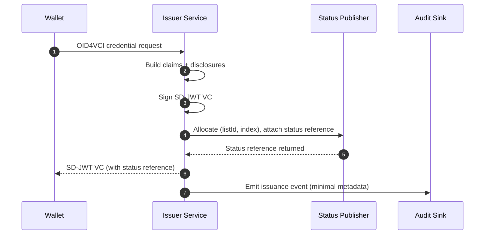
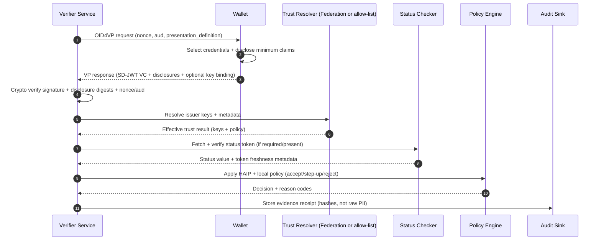
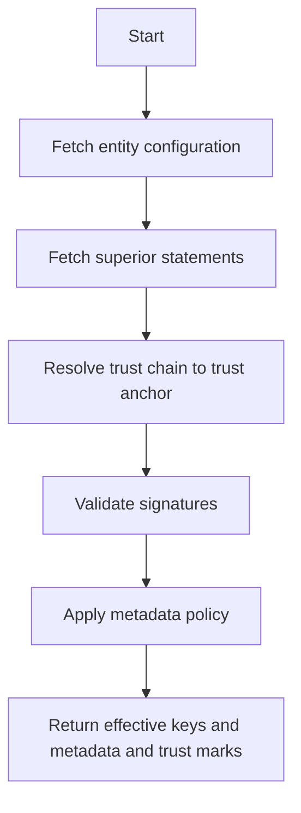
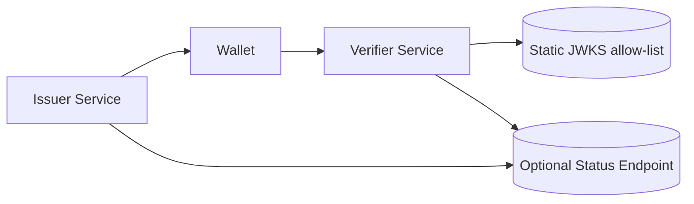
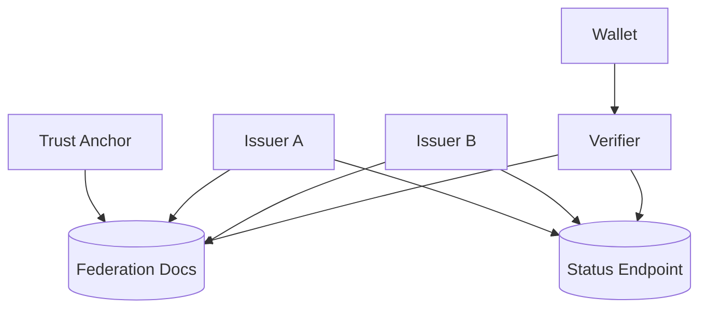
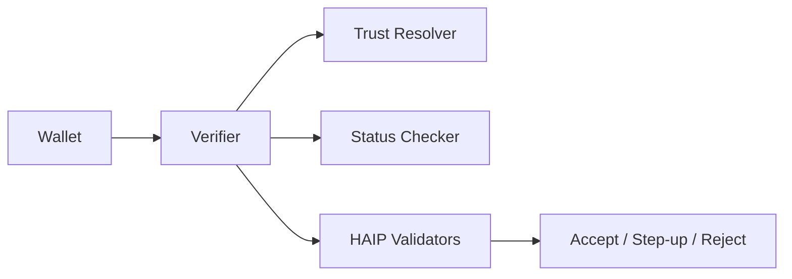

# SD-JWT .NET Ecosystem Architecture (Detailed)

This document provides a practical, deployment-oriented architecture overview of the sd-jwt-dotnet ecosystem: components, responsibilities, interfaces, data flows, trust and status, and the operational controls required for real-world deployments.

It is written for implementers who need to answer:

- What runs where (issuer, wallet, verifier, federation operator)?
- What are the concrete components and their boundaries?
- What data artifacts flow between them?
- How do Federation, Status Lists, Presentation Exchange (PEX), and HAIP fit into a production system?
- What do I need for security, caching, observability, and incident response?

---

## 1. Architecture at a glance

Think of the ecosystem as a set of libraries you embed into a small set of runtime services:

- Issuer service (issuance + signing + status publishing)
- Wallet (storage + presentation + selective disclosure)
- Verifier service (verification + trust resolution + status checks + policy gates)
- Federation operator (optional but important in multi-party ecosystems)

### 1.1 Context diagram

---

## 2. Component catalog (what each component does)

This section is intentionally detailed. Most "architecture docs" fail because they list components without stating:

- responsibility boundaries,
- required inputs/outputs,
- security assumptions,
- scaling and failure modes.

### 2.1 Issuer Service

Purpose

- Issue SD-JWT or SD-JWT VC credentials.
- Optionally allocate status indices and publish Status List Tokens.
- Expose issuer metadata required by wallet/verifier interoperability (OID4VCI metadata, keys, endpoints).

Key responsibilities

- Claims modeling: build the credential payload and decide which fields are selectively disclosable.
- Disclosure construction: compute digests and disclosures consistently.
- Signing: produce JWS using issuer signing key (HSM recommended for high assurance).
- Credential lifecycle: issue, renew, suspend/revoke (via status) where needed.
- Evidence: emit issuance events for audits (without storing raw PII unnecessarily).

Interfaces

- OID4VCI endpoints (typical):
  - /.well-known/openid-credential-issuer (metadata)
  - /credential (credential issuance)
  - /credential_offer (offer flow, if used)
  - /jwks.json (issuer keys)
- Optional internal endpoints:
  - /admin/rotate-keys
  - /admin/rebuild-status-list
  - /admin/publish-status-list

Data stores

- Issuance registry: issued credential IDs and minimal issuance metadata (timestamps, type, subject pseudonymous ID).
- Status index mapping (if using status lists): maps credential ID -> (status list ID, index).
- Key registry: active keys, previous keys, and rotation schedule.

Scaling

- Stateless issuance API behind a load balancer is typical.
- If status publishing is enabled, keep that as a distinct service or background worker to isolate load and permissions.

Failure modes

- Clock skew: exp/iat issues and nonce windows.
- Key rotation mistakes: overlapping kids, breaking verifiers.
- Status publication delay: verifiers may accept stale status until TTL expires (bounded by ttl/exp).

### 2.2 Status List Publisher Service

Purpose

- Publish Token Status Lists (Status List Tokens) that represent lifecycle state for many credentials compactly.

Key responsibilities

- Maintain a status list (bitstring or equivalent encoding) per list ID.
- Sign the Status List Token (separate key from credential signing is recommended).
- Publish to a cacheable endpoint (CDN-friendly).
- Support high-frequency updates for incident response (revocation waves, lock/suspend states).

Interfaces

- Public:
  - /status/{listId} -> Status List Token (JWT)
- Internal:
  - /admin/update-index (set one index)
  - /admin/batch-update (set N indices)
  - /admin/publish (force publish + CDN purge)

Data stores

- Status list store: listId -> encoded list payload (and metadata).
- Index allocation store: listId -> next index.
- Optional change log: who changed what and why (incident correlation).

Scaling

- Read traffic is high; use CDN.
- Write traffic is lower but must be reliable; use queue + worker for bursts.
- Publish frequency and token TTL should match your risk posture.

Failure modes

- Stale caches: always design bounded staleness using ttl/exp and purge on incidents.
- Incorrect index mapping: breaks revocation semantics.
- Signing key compromise: treat status keys as high value; isolate in separate HSM and admin plane.

### 2.3 Wallet (Holder App / SDK)

Purpose

- Store credentials securely.
- Construct presentations with selective disclosure.
- Satisfy verifier constraints (PEX) and protocol requirements (OID4VP).
- Provide user consent UX for disclosure.

Key responsibilities

- Credential storage: encrypted at rest, with OS keystore/secure enclave where possible.
- Disclosure selection: choose minimal claims consistent with verifier request.
- Presentation construction:
  - attach disclosures,
  - attach optional key binding proof,
  - bind to verifier nonce/audience as required.
- UX: show user what is being requested and what will be shared.

Interfaces

- External (device UX):
  - deep links / app-to-app calls
  - QR flows
- Protocol:
  - OID4VP response to verifier challenge

Data stores

- Local credential store: SD-JWT VCs and metadata.
- Consent log (optional): what was shared, when, for transparency.

Scaling

- Wallet is user-side; scaling is about UX performance and cryptographic efficiency.

Failure modes

- Over-disclosure due to poor UX or ambiguous requests.
- Inconsistent PEX support across wallets (use profiles to reduce variance).
- Key binding misuse or missing checks.

### 2.4 Verifier Service (Relying Party)

Purpose

- Accept and verify presentations.
- Resolve issuer trust (static allow-list or OpenID Federation chain).
- Validate status list tokens.
- Apply HAIP and local verifier policy.
- Output deterministic decisions (accept / step-up / reject) with auditable evidence artifacts.

Key responsibilities

- Protocol handling:
  - generate OID4VP requests (nonce, audience, response mode).
  - validate OID4VP responses.
- Crypto verification:
  - signature validation,
  - disclosure digest matching,
  - key binding validation (if required).
- Trust resolution:
  - static trusted issuers and keys, OR
  - federation chain resolution with metadata policy.
- Status enforcement:
  - fetch status token (with bounded caching),
  - validate status signature,
  - evaluate credential status values per policy.
- Policy gates:
  - HAIP constraints (when selected).
  - domain rules (minimization per intent, risk-based step-up).

Interfaces

- /present (start flow, returns OID4VP request)
- /callback (receive VP response)
- /verify (API-only verification, for server-to-server)
- /admin/trust (manage allow-lists or federation policies)
- /admin/cache (purge trust/status caches)

Data stores

- Trust cache: resolved issuer keys and metadata, bounded TTL.
- Status cache: latest status tokens, bounded TTL.
- Evidence store: receipts of verification decisions (prefer hashed disclosed-claim set, not raw PII).

Scaling

- Stateless verification nodes + shared caches.
- Expect verification to be CPU bound (signature checks, digest computations).

Failure modes

- Cache staleness causing exposure windows on incidents.
- Non-deterministic policy handling (unclear accept/deny rules).
- Partial failures (federation resolution errors, status endpoint down). Define fail-closed/step-up behavior.

### 2.5 Trust Resolver (OpenID Federation Service)

Purpose

- Provide scalable, standards-based trust establishment across many issuers and verifiers.

Key responsibilities

- Publish entity configuration and entity statements.
- Provide trust anchors and/or intermediaries.
- Apply metadata policies (algorithm requirements, endpoint restrictions, trust marks).
- Allow rapid containment actions in incident response (remove subordinate, change metadata policy, rotate keys).

Interfaces

- Standard federation documents:
  - entity configuration
  - entity statements (subordinate statements)
- Admin APIs:
  - /admin/policy (update metadata policy)
  - /admin/remove-entity (sever trust relationship)
  - /admin/rebuild (republish signed statements)

Data stores

- Registry of entities (issuers/verifiers/wallet providers).
- Policy store (metadata policy, trust mark requirements).
- Signing keys for federation statements (separate from credential signing keys).

Scaling

- Document hosting + CDN is common.
- Resolution is performed by verifiers, but you may also provide resolver services to simplify deployment.

Failure modes

- Misconfigured policy that blocks legitimate entities.
- Slow propagation due to caching (bounded by statement lifetimes + CDN purge discipline).

### 2.6 Policy Engine (HAIP + verifier policy)

Purpose

- Make verification decisions deterministic and explainable by separating:
  - cryptographic verification,
  - trust validation,
  - lifecycle validation,
  - assurance profile validation,
  - business decision rules.

Key responsibilities

- Evaluate HAIP constraints (when selected).
- Evaluate local policies:
  - required claim presence,
  - acceptable issuers,
  - status requirements,
  - freshness requirements (ttl/exp),
  - step-up triggers (risk engine signals).
- Output structured decision + reason codes.

Interfaces

- /policy/evaluate (internal API or library call)
- policy versioning and rollout mechanisms

Failure modes

- Policy drift (prod does not match documented policy).
- Unclear step-up path causing poor UX.

### 2.7 Audit / Telemetry Sink

Purpose

- Provide traceability and evidence without over-retaining PII.

Key responsibilities

- Capture event streams from issuer/verifier/status/federation.
- Correlate by correlation ID and credential type.
- Store evidence receipts for audits and incident review.

Recommended evidence receipt fields

- correlation_id
- request_policy_version
- issuer identifier(s)
- trust resolution result (anchor, chain hash, policy version)
- status check result (listId, index, value, token exp/ttl, token hash)
- disclosed claim digest set (hash only)
- decision and reason codes
- timestamps and service instance identifiers

---

## 3. Core artifacts (what flows through the system)

### 3.1 SD-JWT and SD-JWT VC

- Signed payload (JWT) plus disclosure digests and disclosures.
- Supports selective disclosure: wallets reveal only chosen claims.

### 3.2 Key Binding JWT (optional)

- Binds a presentation to a holder key and the verifier request context (nonce/audience).
- Used for replay resistance and holder binding (policy dependent).

### 3.3 Status List Token

- A signed token representing lifecycle state of many credentials compactly.
- Verifier policy determines required checks and handling of failures (fail closed vs step-up).

### 3.4 Federation documents

- Entity configuration and entity statements establishing trust chains and metadata policies.

### 3.5 Presentation Exchange artifacts (PEX)

- Presentation definitions (what verifier requires).
- Presentation submissions (what wallet presented to satisfy constraints).

### 3.6 Evidence receipts (internal)

- Not part of the protocol, but critical for regulated deployments.

---

## 4. End-to-end flows (detailed)

### 4.1 Issuance flow (OID4VCI) with status allocation

### 4.2 Presentation flow (OID4VP + PEX) with deterministic verification order

### 4.3 Federation resolution (what a verifier must do)

### 4.4 Status checks (freshness and caching)

Verifier cache rules should be explicit and tested:

- Cache Status List Tokens with bounded TTL.
- Enforce freshness by reading token metadata (exp/ttl) and failing when stale.
- Purge CDN on incidents and publish updated tokens promptly.

---

## 5. Deployment topologies

### 5.1 Minimal (single issuer and verifier, no federation)

Use when:

- One ecosystem owner controls issuer/verifier.
- Onboarding is manual and stable.

### 5.2 Multi-party ecosystem (federation + status + PEX)

Use when:

- Multiple issuers and verifiers need scalable onboarding.
- Revocation/suspension is required.

### 5.3 High assurance (HAIP + risk-based step-up)

Use when:

- Certain transactions require stronger proofs and tighter interoperability.

---

## 6. Security and operational checklist (what reviewers will ask)

### 6.1 Key management

- HSM-backed keys for credential signing when required.
- Separate keys for credential signing, federation statement signing, and status token signing.
- Key rotation with overlap windows and kid discipline.
- Audit all administrative key operations.

### 6.2 Freshness and replay protection

- Verify nonce and audience binding for OID4VP responses.
- For high-risk flows, require short-lived challenges and bounded cache freshness.
- Use holder binding (key binding) where policy requires it.

### 6.3 Cache discipline

- Explicit TTLs for federation documents and status tokens.
- CDN purge hooks for incident response.
- Decide and document fail-closed vs step-up behavior per transaction class.

### 6.4 Observability

Emit structured events at each stage:

- crypto verification outcome
- trust resolution outcome
- status check outcome (including exp/ttl and token hash)
- policy outcome (HAIP checks, required claims met)
- final decision outcome with reason codes

### 6.5 Incident response (must be designed, not implied)

- Ability to sever federation trust relationships quickly.
- Ability to revoke/suspend credentials at scale via status list updates.
- Ability to rotate keys and republish metadata and federation statements.
- Evidence receipts for post-incident analysis.

---

## 7. Extensibility points (how you adapt to your domain)

Common enterprise customization areas:

- Claim modeling and minimization policies ("intent -> required claims")
- Issuer onboarding rules (federation policy and trust marks)
- Status semantics (valid/suspended/revoked/consumed and what each means)
- Presentation Exchange definitions and constraints
- Decision logic (risk-based step-up, multi-factor proofs)
- Evidence receipt schema and retention policies

---

## 8. Related documentation

- [Selective Disclosure Mechanics](selective-disclosure-mechanics.md)
- [HAIP Compliance](haip-compliance.md)
- [How to Issue Verifiable Credentials](../guides/issuing-credentials.md)
- [How to Verify Presentations](../guides/verifying-presentations.md)
- [How to Manage Credential Revocation](../guides/managing-revocation.md)
- [How to Establish Trust](../guides/establishing-trust.md)
- [Automated Incident Response](../articles/incident-response.md)
- [Documentation Portal](../README.md)
