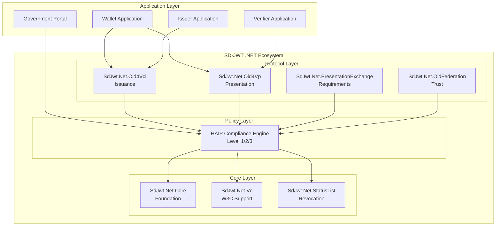
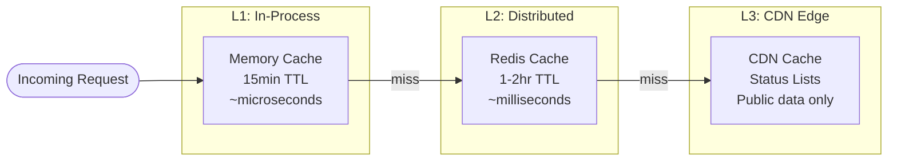

# SD-JWT .NET Ecosystem Architecture

## Executive Summary

The `SdJwt.Net` ecosystem provides a comprehensive, modular implementation of the OpenID4VC (OpenID for Verifiable Credentials) specification suite. It is built natively for .NET, focusing on high-assurance security through the HAIP (High Assurance Interoperability Profile) framework.

This architecture supports everything from simple educational credentials to Level 3 Sovereign government identity systems secured by Post-Quantum Cryptography.

## High-Level System Architecture

The ecosystem is divided into three distinct conceptual layers:

1. **Protocol Layer:** How systems communicate (OID4VCI, OID4VP, Federation).
2. **Policy Layer:** How security is enforced (HAIP Compliance Engine).
3. **Core Layer:** How data is structured and signed (SD-JWT, W3C VC, Status Lists).



## Core Design Principles

### 1. Modular Architecture

Each NuGet package serves a specific purpose. You only pull in what you need. A backend issuing W3C credentials via custom REST APIs only needs `SdJwt.Net.Vc`, while a full OpenID provider would pull in `SdJwt.Net.Oid4Vci`.

### 2. Policy-Driven Security (HAIP)

Security is not left up to individual developers remembering to check algorithms or validate trust chains in their controllers. The HAIP Compliance Engine acts as a configurable policy layer that intercepts requests.

```csharp
// Policy automatically applied via middleware/interceptors
services.AddSdJwtEcosystem(config =>
{
    config.UseHaipProfile(HaipLevel.Level2_VeryHigh);
    // Automatically enforces:
    // - ES384+ algorithms only
    // - Wallet attestation required
    // - DPoP tokens required
});
```

*(Read more in the [HAIP Compliance Concept Guide](haip-compliance.md))*

### 3. Standards Compliance First

The ecosystem strictly adheres to the latest working drafts and RFCs:

* **IETF RFC 9901**: Selective Disclosure for JWTs (SD-JWT)
* **OpenID4VCI**: Credential Issuance
* **OpenID4VP**: Credential Presentation
* **W3C VC**: Verifiable Credentials Data Model v2.0
* **DIF PE**: Presentation Exchange v2.0
* **OpenID Federation**: 1.0 Trust infrastructure

## Component Deep Dive

### SdJwt.Net (The Foundation)

Implements the core RFC 9901 specifications. It provides the `SdJwtBuilder` for generating the complex nested hashes and salts required for selective disclosure, and `SdJwtVerifier` for checking signatures and matching disclosure hashes.
*(Read more in the [Selective Disclosure Mechanics Guide](selective-disclosure-mechanics.md))*

### SdJwt.Net.Vc (W3C Compliance)

Wraps the core library to enforce the strict JSON schema requirements of the W3C Verifiable Credentials data model (ensuring `@context`, `type`, `issuer`, and `credentialSubject` are properly formatted).

### SdJwt.Net.Oid4Vci (Issuance)

Implements the OAuth 2.0 extension flows required for a Wallet to request credentials from an Issuer, including `.well-known` discovery, PAR (Pushed Authorization Requests), and DPoP (Demonstrating Proof-of-Possession).

### SdJwt.Net.Oid4Vp & PresentationExchange (Verification)

Allows Verifiers to request specific data points from a Wallet. The `PresentationExchangeEvaluator` parses complex JSON path constraints (e.g., "User must be over 18 AND have a valid driver's license").

### SdJwt.Net.OidFederation (Trust)

In zero-trust environments, how does a Verifier know an Issuer is real? This package implements Trust Chains. Entity Statements are resolved recursively up to a trusted Root Authority (like an eIDAS Trust Anchor or a National Government).

### SdJwt.Net.StatusList (Revocation)

Verifiable Credentials cannot be "un-issued" once stored in a user's wallet. This package implements highly compressed bitstrings (often hosted on a CDN) that allow Verifiers to instantly check if a credential index has been revoked by the issuer, without sacrificing privacy.

## Deployment Topologies

The ecosystem is designed to scale from single monoliths to massive multi-tenant Sovereign gateways.

### Cloud-Native Scalability

Because SD-JWT operations are highly CPU-intensive (thousands of SHA-256 hashes for large disclosures) and require rapid trust resolution, the architecture supports multi-layer caching.



By utilizing `ObjectPools` for ECDSA/RSA cryptographic providers and heavy memory caching for resolved Federation Trust Chains, the .NET implementation is designed for maximum throughput.
