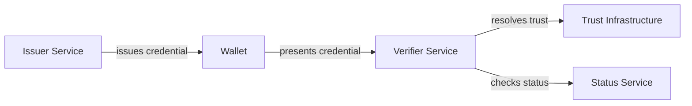
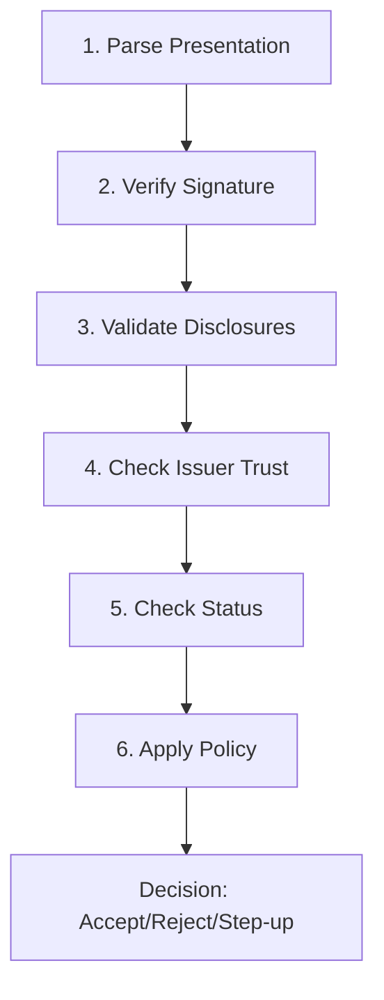
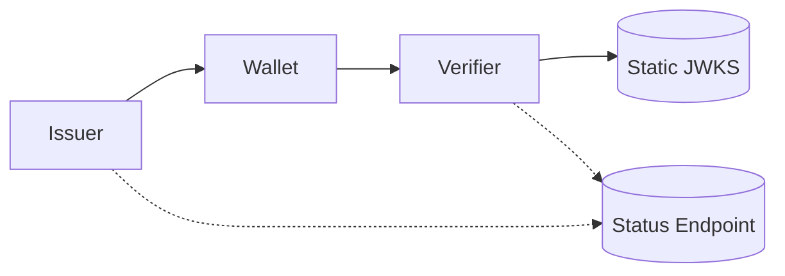
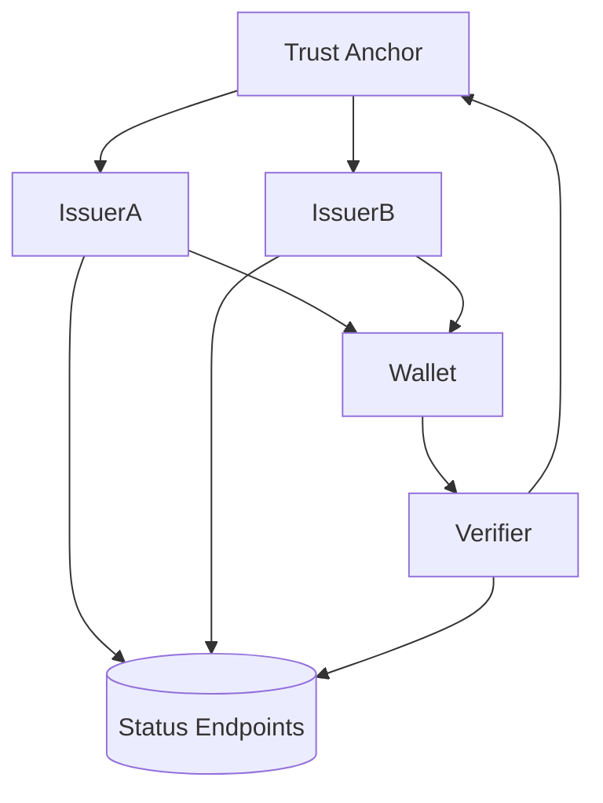
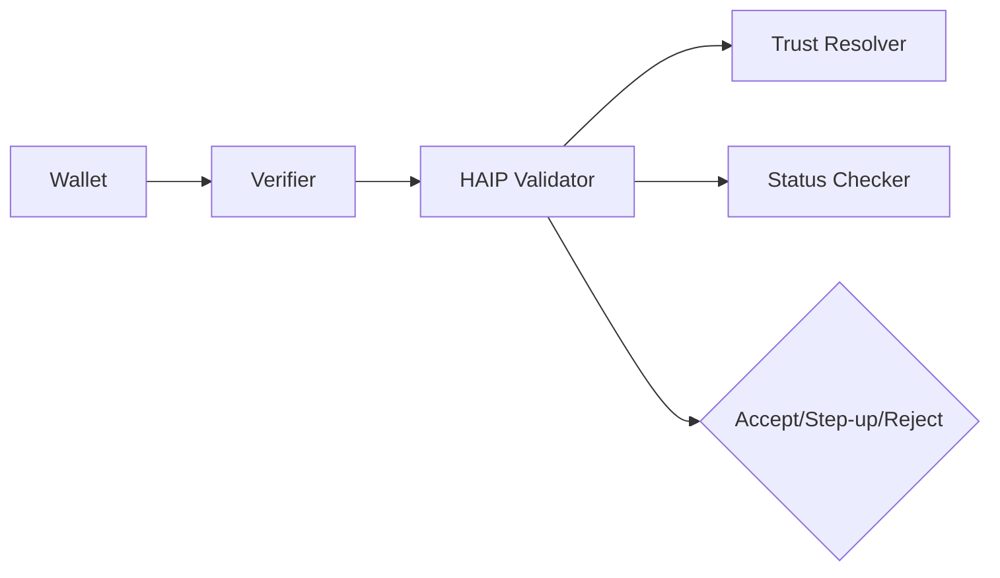

# SD-JWT .NET Architecture Guide

This guide helps enterprise teams design and deploy credential systems using the SD-JWT .NET ecosystem.

---

## Who Should Read This

| You Are | Start With |
|---------|------------|
| Technical lead evaluating the ecosystem | [System Overview](#system-overview) |
| Developer building an issuer service | [Building an Issuer](#building-an-issuer) |
| Developer building a verifier service | [Building a Verifier](#building-a-verifier) |
| Platform/DevOps engineer | [Deployment Patterns](#deployment-patterns) |
| Security reviewer | [Security Checklist](#security-checklist) |

---

## System Overview

An SD-JWT credential system has four core roles:



| Role | What It Does | SD-JWT .NET Package |
|------|--------------|---------------------|
| **Issuer** | Creates and signs credentials | `SdJwt.Net`, `SdJwt.Net.Vc`, `SdJwt.Net.Oid4Vci` |
| **Wallet** | Stores credentials, creates presentations | `SdJwt.Net` (holder APIs) |
| **Verifier** | Validates presentations, enforces policy | `SdJwt.Net`, `SdJwt.Net.Oid4Vp`, `SdJwt.Net.PresentationExchange` |
| **Trust** | Establishes issuer authenticity | `SdJwt.Net.OidFederation` |
| **Status** | Tracks credential lifecycle (revocation) | `SdJwt.Net.StatusList` |

### Package Selection Guide

Choose packages based on your requirements:

| Requirement | Packages to Install |
|-------------|---------------------|
| Basic SD-JWT issuance and verification | `SdJwt.Net` |
| W3C Verifiable Credentials format | `SdJwt.Net`, `SdJwt.Net.Vc` |
| OID4VCI credential issuance protocol | `SdJwt.Net.Oid4Vci` |
| OID4VP presentation protocol | `SdJwt.Net.Oid4Vp` |
| Query credentials by constraints | `SdJwt.Net.PresentationExchange` |
| Credential revocation/suspension | `SdJwt.Net.StatusList` |
| Multi-issuer trust management | `SdJwt.Net.OidFederation` |
| High-assurance security policy | `SdJwt.Net.HAIP` |

---

## Building an Issuer

An issuer service creates credentials containing claims about a subject.

### Key Decisions

| Decision | Options | Guidance |
|----------|---------|----------|
| Which claims are selectively disclosable? | Any PII or sensitive data | Minimize always-visible claims |
| Do you need revocation? | Yes for long-lived credentials | Use `SdJwt.Net.StatusList` |
| Which protocol? | OID4VCI or direct API | OID4VCI for wallet interoperability |
| Key storage | Software, HSM, cloud KMS | HSM for production |

### Minimal Issuer Setup

```csharp
using System.Security.Cryptography;
using Microsoft.IdentityModel.Tokens;
using SdJwt.Net.Issuer;

// 1. Create signing key (use HSM in production)
using var ecdsa = ECDsa.Create(ECCurve.NamedCurves.nistP256);
var signingKey = new ECDsaSecurityKey(ecdsa) { KeyId = "issuer-key-1" };

// 2. Create issuer
var issuer = new SdIssuer(signingKey, SecurityAlgorithms.EcdsaSha256);

// 3. Define claims with selective disclosure
var claims = new Dictionary<string, object>
{
    ["iss"] = "https://issuer.example.com",
    ["sub"] = "user-123",
    ["given_name"] = "Jane",    // Will be selectively disclosable
    ["family_name"] = "Doe",    // Will be selectively disclosable
    ["degree"] = "Computer Science"
};

var options = new SdIssuanceOptions
{
    DisclosureStructure = new { given_name = true, family_name = true }
};

// 4. Issue credential
var result = issuer.Issue(claims, options);
string credential = result.Issuance;  // Send this to the wallet
```

### Adding Revocation Support

```csharp
using SdJwt.Net.StatusList;

// Allocate a status index for this credential
var statusManager = new StatusListManager(statusSigningKey, "ES256");
var (listUri, index) = await statusManager.AllocateIndexAsync();

// Include status reference in credential claims
claims["status"] = new
{
    status_list = new { uri = listUri, idx = index }
};

// Later: revoke the credential
await statusManager.SetStatusAsync(listUri, index, StatusValue.Revoked);
await statusManager.PublishAsync();  // Push to CDN/endpoint
```

### Issuer Endpoints

| Endpoint | Purpose | Package |
|----------|---------|---------|
| `/.well-known/openid-credential-issuer` | OID4VCI metadata | `SdJwt.Net.Oid4Vci` |
| `/credential` | Issue credentials | `SdJwt.Net.Oid4Vci` |
| `/.well-known/jwks.json` | Public keys | Standard JWKS |
| `/status/{listId}` | Status list tokens | `SdJwt.Net.StatusList` |

---

## Building a Verifier

A verifier service validates presentations and makes trust decisions.

### Verification Pipeline

Every verifier must implement these steps in order:



### Key Decisions

| Decision | Options | Guidance |
|----------|---------|----------|
| Trust model | Static allow-list or Federation | Federation for 3+ issuers |
| Status check failure | Reject or step-up | Reject for high-risk flows |
| Cache TTL | Minutes to hours | Shorter for high-risk |
| HAIP level | None, Level 1, 2, or 3 | Level 2 for most production |

### Minimal Verifier Setup

```csharp
using SdJwt.Net.Verifier;
using SdJwt.Net.Oid4Vp;

// 1. Create verifier with trusted issuer keys
var trustedKeys = new Dictionary<string, SecurityKey>
{
    ["https://issuer.example.com"] = issuerPublicKey
};

var verifier = new SdVerifier();

// 2. Verify presentation
var result = await verifier.VerifyAsync(
    presentationToken,
    new VerificationOptions
    {
        TrustedIssuers = trustedKeys,
        ExpectedAudience = "https://verifier.example.com",
        ExpectedNonce = sessionNonce
    });

if (!result.IsValid)
{
    return Reject(result.ErrorCode);
}

// 3. Access disclosed claims
var givenName = result.DisclosedClaims["given_name"];
```

### Adding Status Checks

```csharp
using SdJwt.Net.StatusList;

var statusValidator = new StatusListValidator(httpClient);

// Check status if credential has status reference
if (result.StatusReference != null)
{
    var statusResult = await statusValidator.ValidateAsync(result.StatusReference);
    
    if (statusResult.Status != CredentialStatus.Valid)
    {
        return Reject($"credential_{statusResult.Status}");
    }
}
```

### Adding Federation Trust

```csharp
using SdJwt.Net.OidFederation;

var trustResolver = new TrustChainResolver(
    trustAnchors: new[] { "https://federation.example.com" },
    httpClient: httpClient);

var trustResult = await trustResolver.ResolveAsync(result.Issuer);

if (!trustResult.IsValid)
{
    return Reject("issuer_not_trusted");
}

// Use resolved keys for signature verification
var resolvedKeys = trustResult.EffectiveKeys;
```

### Verifier Endpoints

| Endpoint | Purpose | Package |
|----------|---------|---------|
| `/present` | Start OID4VP flow | `SdJwt.Net.Oid4Vp` |
| `/callback` | Receive VP response | `SdJwt.Net.Oid4Vp` |
| `/verify` | Direct API verification | `SdJwt.Net` |

---

## Deployment Patterns

### Pattern 1: Single Ecosystem (Simplest)

One organization controls issuer and verifier. No federation needed.



**When to use**: Internal credentials, single-tenant SaaS, pilot projects.

**Packages**: `SdJwt.Net`, `SdJwt.Net.Vc`, optionally `SdJwt.Net.StatusList`.

### Pattern 2: Multi-Issuer with Federation

Multiple issuers need interoperability. Federation provides scalable trust.



**When to use**: Industry consortiums, government ecosystems, marketplaces.

**Packages**: All packages, especially `SdJwt.Net.OidFederation`.

### Pattern 3: High Assurance (HAIP)

Regulated flows requiring cryptographic policy enforcement.



**When to use**: Financial services, healthcare, government identity.

**Packages**: All packages, with `SdJwt.Net.HAIP` as policy gate.

---

## Security Checklist

### Key Management

| Requirement | Implementation |
|-------------|----------------|
| Separate keys per function | Credential signing, status signing, federation signing |
| HSM for production | Azure Key Vault, AWS CloudHSM, or on-premises HSM |
| Key rotation | Overlap periods, maintain `kid` consistency |
| Audit key operations | Log all admin actions |

### Validation

| Check | Implementation |
|-------|----------------|
| Signature verification | Always verify before processing claims |
| Nonce validation | Bind presentations to verifier-issued nonces |
| Audience validation | Verify `aud` matches your verifier URL |
| Expiry validation | Reject expired credentials and tokens |
| Status checks | Fail-closed when status service unavailable |

### Caching

| Cache Type | Recommended TTL | Notes |
|------------|-----------------|-------|
| Status tokens | 1-5 minutes | Shorter for critical flows |
| Federation metadata | 5-15 minutes | Refresh on cache miss |
| JWKS | 15-60 minutes | Honor `Cache-Control` headers |

### Incident Response

| Capability | Implementation |
|------------|----------------|
| Mass revocation | Status list batch updates |
| Trust severance | Federation statement removal |
| Cache invalidation | CDN purge triggers |
| Evidence retention | Hash-based audit logs (no PII) |

---

## Common Pitfalls

### 1. Shared Signing Keys

**Problem**: Using one key for credentials, status, and federation.

**Risk**: Single key compromise affects all functions.

**Fix**: Separate keys per function, stored in separate HSM partitions.

### 2. Unbounded Caching

**Problem**: Caching status tokens without TTL limits.

**Risk**: Revocations ineffective during cache window.

**Fix**: Respect token `exp`/`ttl`, cap cache at 5 minutes for sensitive flows.

### 3. Fail-Open Status Checks

**Problem**: Accepting credentials when status service unreachable.

**Risk**: Attackers can force unavailability to bypass revocation.

**Fix**: Fail-closed for high-risk flows, step-up for medium-risk.

### 4. Logging PII

**Problem**: Storing disclosed claims in audit logs.

**Risk**: Data retention liability, breach exposure.

**Fix**: Log claim hashes only, never raw values.

### 5. Missing Nonce Binding

**Problem**: Not validating presentation nonce.

**Risk**: Replay attacks with captured presentations.

**Fix**: Always generate and validate nonces per session.

---

## Related Documentation

### Concepts

| Document | Topic |
|----------|-------|
| [SD-JWT Deep Dive](sd-jwt-deep-dive.md) | Token format and structure |
| [Verifiable Credentials](verifiable-credential-deep-dive.md) | W3C VC format |
| [Selective Disclosure](selective-disclosure-mechanics.md) | Cryptographic mechanics |
| [OID4VCI](openid4vci-deep-dive.md) | Issuance protocol |
| [OID4VP](openid4vp-deep-dive.md) | Presentation protocol |
| [Presentation Exchange](presentation-exchange-deep-dive.md) | Query language |
| [Status Lists](status-list-deep-dive.md) | Revocation |
| [HAIP](haip-deep-dive.md) | Security profiles |

### Guides

| Document | Task |
|----------|------|
| [Issuing Credentials](../guides/issuing-credentials.md) | Build an issuer |
| [Verifying Presentations](../guides/verifying-presentations.md) | Build a verifier |
| [Managing Revocation](../guides/managing-revocation.md) | Status list operations |
| [Establishing Trust](../guides/establishing-trust.md) | Federation setup |

### Use Cases

| Document | Industry |
|----------|----------|
| [Financial AI](../use-cases/financial-ai.md) | Superannuation/Finance |
| [Cross-Border Government](../use-cases/crossborder.md) | EU Public Services |
| [Telecom eSIM](../use-cases/telco-esim.md) | Telecommunications |
| [E-Commerce Returns](../use-cases/retail-ecommerce-returns.md) | Retail |
| [Automated Compliance](../use-cases/automated-compliance.md) | Operations |
| [Incident Response](../use-cases/incident-response.md) | Security Operations |
