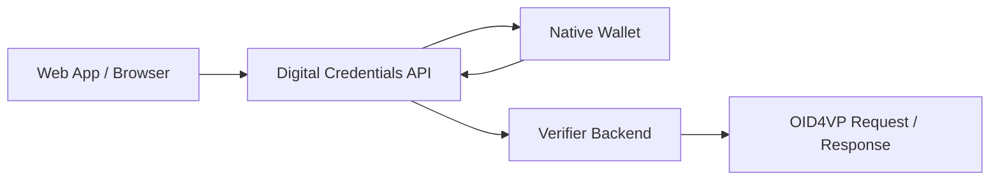

# W3C Digital Credentials API

> **Level:** Intermediate implementation

## Simple explanation

DC API is not a credential format and not a new wallet protocol. It is a browser bridge that lets a website ask a wallet for a credential presentation using OID4VP.

## What you will learn

- How DC API bridges browsers and native wallets
- The browser-to-wallet request flow
- What `SdJwt.Net.Oid4Vp` provides for DC API integration
- Current browser support and specification status

### Where it fits

> **Maturity notice:** The Digital Credentials API is an emerging W3C specification and platform capability. Browser, operating-system, wallet, and credential-format support is evolving. Production verifiers should design fallback paths (QR codes, deep links, app-to-app redirects) and test against current platform capabilities before relying on DC API as the sole presentation channel.



### Fallback patterns when DC API is unavailable

| Approach                  | How it works                                                              | When to use                           |
| ------------------------- | ------------------------------------------------------------------------- | ------------------------------------- |
| QR code                   | Verifier displays QR code encoding an OID4VP request URI; wallet scans it | Cross-device; works with any wallet   |
| Deep link / custom scheme | Verifier redirects to `openid4vp://...` URI                               | Same-device; mobile wallet installed  |
| App-to-app redirect       | OS-level intent/universal link to wallet app                              | Same-device; specific wallet known    |
| DC API                    | Browser mediates `navigator.credentials.get()`                            | Same-device; browser supports the API |

### Frontend vs backend responsibilities

| Responsibility             | Where it runs         | What it does                                                     |
| -------------------------- | --------------------- | ---------------------------------------------------------------- |
| Detect DC API availability | Frontend (JavaScript) | Check `navigator.credentials` for digital credential support     |
| Build OID4VP request       | Backend (.NET)        | Construct authorization request with nonce, query, response mode |
| Invoke wallet              | Frontend (JavaScript) | Call `navigator.credentials.get()` or render fallback QR code    |
| Receive response           | Backend (.NET)        | Validate `vp_token`, nonce, audience, KB-JWT, credential status  |
| Business decision          | Backend (.NET)        | Evaluate disclosed claims against business rules                 |

|                      |                                                                                                                                                                                                                                        |
| -------------------- | -------------------------------------------------------------------------------------------------------------------------------------------------------------------------------------------------------------------------------------- |
| **Audience**         | Frontend developers integrating browser-based credential requests, and backend architects designing web-to-wallet verification flows.                                                                                                  |
| **Purpose**          | Explain the W3C Digital Credentials API (DC API) - how it bridges web applications and native wallets - and show how DC API support in `SdJwt.Net.Oid4Vp` builds server-side request/response handling on top of OID4VP.               |
| **Scope**            | Browser credential API surface, `navigator.credentials.get()` integration, server-side request construction, response validation, same-device and cross-device flows. Out of scope: base OID4VP protocol (see [OID4VP](openid4vp.md)). |
| **Success criteria** | Reader can build a server-side DC API request, invoke the browser credential API from JavaScript, and validate the wallet response end-to-end.                                                                                         |

---

> SD-JWT .NET is a standards-first .NET library ecosystem.
> This document explains DC API support within the `SdJwt.Net.Oid4Vp` package.
> There is no separate `SdJwt.Net.DcApi` package in the current repository.

## Package Role In The Ecosystem

| Field                  | Value                                                                                                                               |
| ---------------------- | ----------------------------------------------------------------------------------------------------------------------------------- |
| Ecosystem area         | Protocol Components                                                                                                                 |
| Package maturity       | Spec-tracking within `SdJwt.Net.Oid4Vp`; OpenID4VP 1.0 is final, but W3C Digital Credentials API browser behavior is still evolving |
| Primary audience       | Web verifier developers and architects                                                                                              |
| What this package does | Provides DC API request/response models, origin validation, and OID4VP integration                                                  |
| What it does not do    | Implement a browser wallet, native wallet app, or standalone `SdJwt.Net.DcApi` package                                              |

## Prerequisites

These foundational concepts will help you get the most from this document:

### What is the Digital Credentials API?

The **W3C Digital Credentials API** is a browser API that enables web applications to request verifiable credentials from native wallet applications. It extends the existing Credential Management API (`navigator.credentials`) to support digital credentials like mobile driving licenses (mDL) and verifiable credentials.

```javascript
// Browser-side JavaScript
const credential = await navigator.credentials.get({
  digital: {
    requests: [
      {
        protocol: "openid4vp-v1-unsigned",
        data: {
          /* OpenID4VP authorization request */
        },
      },
    ],
  },
});
```

### The Problem DC API Solves

Traditional OpenID4VP flows require:

1. **Deep links or QR codes**: User must scan QR or handle custom URL schemes
2. **App switching**: User manually navigates between browser and wallet
3. **Complex state management**: Application must track request/response across contexts

DC API solves these with native browser integration that:

- Presents credentials inline within the browser context (no app switching)
- Provides secure origin binding (wallet knows which site is requesting)
- Enables same-device and cross-device presentation flows

### Where DC API Fits in the Ecosystem

| Layer    | Component                    | Role                             |
| -------- | ---------------------------- | -------------------------------- |
| Browser  | Digital Credentials API      | Transport mechanism              |
| Protocol | OpenID4VP                    | Verification protocol            |
| Format   | SD-JWT VC / mdoc             | Credential formats               |
| Query    | DCQL / Presentation Exchange | Specifies required credentials   |
| Trust    | HAIP / EUDIW                 | Security and compliance profiles |

## Glossary of Key Terms

| Term           | Definition                                                      |
| -------------- | --------------------------------------------------------------- |
| **DC API**     | W3C Digital Credentials API - browser interface for credentials |
| **web-origin** | Client ID scheme binding request to browser origin              |
| **dc_api**     | Response mode for plain VP token responses                      |
| **dc_api.jwt** | Response mode for encrypted (JWE) VP token responses            |
| **Origin**     | Browser origin (scheme + host + port) making the request        |
| **Nonce**      | Random value for replay protection                              |
| **VP Token**   | Verifiable Presentation token containing credentials            |

## Implementation Overview

### Architecture

The DC API integration in `SdJwt.Net.Oid4Vp` provides:

```text
SdJwt.Net.Oid4Vp/
   DcApi/
      DcApiConstants.cs          # Protocol and error constants
      DcApiOriginValidator.cs    # Origin validation logic
      DcApiRequestBuilder.cs     # Fluent builder for requests
      DcApiResponseValidator.cs  # Response validation
      Models/
         DcApiRequest.cs         # Request model
         DcApiResponse.cs        # Response model
         DcApiResponseMode.cs    # Response mode enum
```

### Core Components

#### DcApiRequestBuilder

Creates DC API compatible OpenID4VP requests:

```csharp
using SdJwt.Net.Oid4Vp.DcApi;

var request = new DcApiRequestBuilder()
    .WithNonce(Guid.NewGuid().ToString("N"))
    .WithPresentationDefinition(presentationDefinition)
    .WithResponseMode(DcApiResponseMode.DcApi)
    .Build();
```

Key features:

- Fluent API for readable request construction
- Automatic protocol configuration for `openid4vp-v1-unsigned` and `openid4vp-v1-signed`
- Unsigned DC API requests omit `client_id`
- Signed DC API requests require `client_id` and `expected_origins`

Signed request example:

```csharp
var signedRequest = new DcApiRequestBuilder()
    .AsSignedRequest()
    .WithClientId("web-origin:https://verifier.example.com")
    .WithExpectedOrigins("https://verifier.example.com")
    .WithNonce(Guid.NewGuid().ToString("N"))
    .WithPresentationDefinition(presentationDefinition)
    .WithResponseMode(DcApiResponseMode.DcApiJwt)
    .Build();
```

#### DcApiResponseValidator

Validates responses received from `navigator.credentials.get()`:

```csharp
using SdJwt.Net.Oid4Vp.DcApi;

var validator = new DcApiResponseValidator(vpTokenValidator);

var result = await validator.ValidateAsync(
    response,
    new DcApiValidationOptions
    {
        ExpectedOrigin = "https://verifier.example.com",
        ExpectedNonce = originalNonce,
        ValidateOrigin = true,
        MaxAge = TimeSpan.FromMinutes(5)
    });

if (result.IsValid)
{
    var credentials = result.VerifiedCredentials;
}
```

Validation checks:

- Protocol verification (`openid4vp-v1-unsigned`, `openid4vp-v1-signed`, or `openid4vp-v1-multisigned`)
- Origin matching (prevents CSRF)
- Nonce verification (prevents replay)
- DC API key-binding audience validation against `origin:<web-origin>/`
- Presentation age validation (freshness)
- Optional VP token validation

#### DcApiOriginValidator

Validates browser origins for security:

```csharp
using SdJwt.Net.Oid4Vp.DcApi;

var validator = new DcApiOriginValidator();

// Valid: exact match
bool valid1 = validator.ValidateOrigin(
    "https://verifier.example.com",
    "https://verifier.example.com"); // true

// Invalid: scheme mismatch
bool valid2 = validator.ValidateOrigin(
    "http://verifier.example.com",
    "https://verifier.example.com"); // false

// Invalid: subdomain doesn't match
bool valid3 = validator.ValidateOrigin(
    "https://sub.example.com",
    "https://example.com"); // false
```

## Response Modes

### Plain Response (dc_api)

Use for non-sensitive credentials:

```csharp
.WithResponseMode(DcApiResponseMode.DcApi)
```

The VP token is returned directly in the response. This mode is simpler but the credential content is visible to any intermediary.

### Encrypted Response (dc_api.jwt)

Use for credentials containing sensitive PII:

```csharp
.WithResponseMode(DcApiResponseMode.DcApiJwt)
```

The VP token is wrapped in a JWE (JSON Web Encryption) using the verifier's public key. Only the intended verifier can decrypt the response.

## Security Considerations

### Origin Binding

OpenID4VP over DC API uses browser origin binding:

1. Browser automatically includes the page origin in requests
2. Wallet displays the origin to the user during consent
3. Response includes origin for verifier validation
4. Verifier validates origin matches the expected web origin
5. Key Binding JWT audience is validated as `origin:<web-origin>/`, for example `origin:https://verifier.example.com/`

Unsigned DC API requests omit `client_id`. Signed DC API requests include `client_id` and must include `expected_origins` so the wallet can reject replay from a different verifier origin.

This prevents:

- **Phishing**: User sees which site is requesting credentials
- **CSRF attacks**: Response origin must match request origin

### Nonce Validation

Always generate a unique nonce for each request:

```csharp
var nonce = Convert.ToBase64String(RandomNumberGenerator.GetBytes(32));

var request = new DcApiRequestBuilder()
    .WithNonce(nonce)
    // ...
    .Build();

// Store nonce for validation
// ...

var result = await validator.ValidateAsync(response, new DcApiValidationOptions
{
    ExpectedNonce = nonce
});
```

This prevents replay attacks where an attacker captures and resends a valid response.

### Presentation Freshness

Validate that presentations are recent:

```csharp
var result = await validator.ValidateAsync(response, new DcApiValidationOptions
{
    MaxAge = TimeSpan.FromMinutes(5),
    ClockSkew = TimeSpan.FromSeconds(30)
});
```

This prevents using stale presentations that may have been captured earlier.

## Integration with mdoc

For mdoc credentials, DC API affects the session transcript:

```csharp
using SdJwt.Net.Mdoc.Handover;

// Create session transcript for DC API flow
var sessionTranscript = SessionTranscript.ForOpenId4VpDcApi(
    origin: "https://verifier.example.com",
    nonce: nonce,
    jwkThumbprint: verifierKeyThumbprint
);
```

The DC API handover structure binds the mdoc presentation to:

- The requesting origin
- The session nonce
- The verifier's key

## Error Handling

The validator returns specific error codes:

| Error Code             | Meaning                                  |
| ---------------------- | ---------------------------------------- |
| `origin_mismatch`      | Response origin differs from client_id   |
| `nonce_mismatch`       | Response nonce differs from expected     |
| `presentation_expired` | Presentation age exceeds maximum allowed |
| `invalid_protocol`     | Protocol is not `openid4vp`              |
| `decryption_failed`    | Failed to decrypt dc_api.jwt response    |

Example error handling:

```csharp
var result = await validator.ValidateAsync(response, options);

if (!result.IsValid)
{
    switch (result.ErrorCode)
    {
        case DcApiConstants.ErrorCodes.OriginMismatch:
            // Potential CSRF attack
            logger.LogWarning("Origin mismatch detected");
            break;
        case DcApiConstants.ErrorCodes.NonceMismatch:
            // Potential replay attack
            logger.LogWarning("Nonce mismatch detected");
            break;
        // ...
    }
}
```

## Comparison with Other Transports

| Feature         | DC API   | Deep Link     | QR Code       |
| --------------- | -------- | ------------- | ------------- |
| Same device     | Native   | Supported     | Not ideal     |
| Cross device    | Planned  | Not supported | Native        |
| Origin binding  | Built-in | Manual        | Manual        |
| User experience | Inline   | App switch    | Scan required |
| Browser support | Evolving | Universal     | Universal     |

## Browser Support

> **Note:** The information below is intentionally high level because browser support changes quickly. Check [the W3C Digital Credentials specification](https://www.w3.org/TR/digital-credentials/) and browser vendor documentation for current status.

| Browser | Status                    | Notes                                      |
| ------- | ------------------------- | ------------------------------------------ |
| Chrome  | Evolving implementation   | Check current Chrome platform status       |
| Safari  | Evolving implementation   | Check current WebKit platform status       |
| Firefox | Standards discussion      | Check current Mozilla standards positions  |
| Edge    | Chromium-aligned behavior | Check current Microsoft Edge release notes |

## Complete Example

### Verifier Backend (ASP.NET Core)

```csharp
[ApiController]
[Route("api/verify")]
public class VerificationController : ControllerBase
{
    private readonly DcApiResponseValidator _validator;
    private readonly ILogger<VerificationController> _logger;

    [HttpPost("start")]
    public IActionResult StartVerification()
    {
        var nonce = Convert.ToBase64String(RandomNumberGenerator.GetBytes(32));

        // Store nonce in session
        HttpContext.Session.SetString("dc_api_nonce", nonce);

        var request = new DcApiRequestBuilder()
            .WithNonce(nonce)
            .WithPresentationDefinition(CreatePresentationDefinition())
            .Build();

        return Ok(request);
    }

    [HttpPost("complete")]
    public async Task<IActionResult> CompleteVerification([FromBody] DcApiResponse response)
    {
        var expectedNonce = HttpContext.Session.GetString("dc_api_nonce");

        var result = await _validator.ValidateAsync(response, new DcApiValidationOptions
        {
            ExpectedOrigin = "https://example.com",
            ExpectedNonce = expectedNonce,
            ValidateOrigin = true,
            MaxAge = TimeSpan.FromMinutes(5)
        });

        if (!result.IsValid)
        {
            _logger.LogWarning("DC API validation failed: {Error}", result.Error);
            return BadRequest(new { error = result.ErrorCode });
        }

        // Process verified credentials
        return Ok(new { verified = true, credentials = result.VerifiedCredentials });
    }
}
```

### Frontend (JavaScript)

```javascript
async function requestCredential() {
  // Get request from backend
  const startResponse = await fetch("/api/verify/start", { method: "POST" });
  const dcApiRequest = await startResponse.json();

  // Request credential via DC API
  const credential = await navigator.credentials.get(dcApiRequest);

  // Send response to backend
  const completeResponse = await fetch("/api/verify/complete", {
    method: "POST",
    headers: { "Content-Type": "application/json" },
    body: JSON.stringify(credential),
  });

  return await completeResponse.json();
}
```

## Related concepts

- [OpenID4VP](openid4vp.md) - The underlying verification protocol
- [mdoc](mdoc.md) - Mobile document format support
- [HAIP Profile Validation Guide](haip-compliance.md) - High assurance security requirements
- [Presentation Exchange](presentation-exchange.md) - Credential query language

## References

- W3C Digital Credentials API: <https://www.w3.org/TR/digital-credentials/>
- OpenID4VP Specification: <https://openid.net/specs/openid-4-verifiable-presentations-1_0.html>
- Credential Management API: <https://www.w3.org/TR/credential-management-1/>
