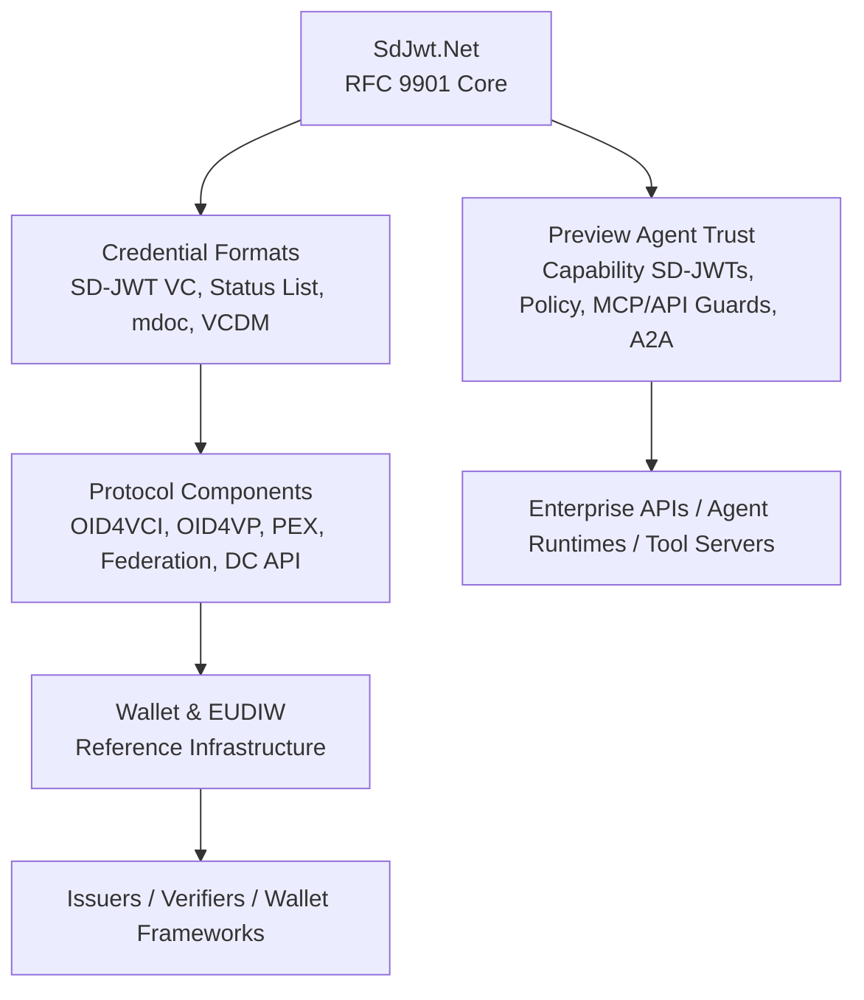
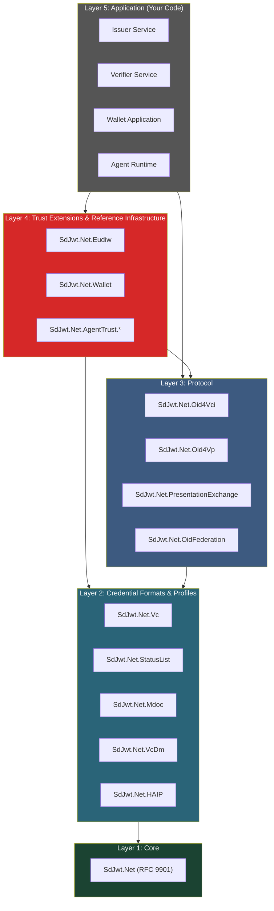
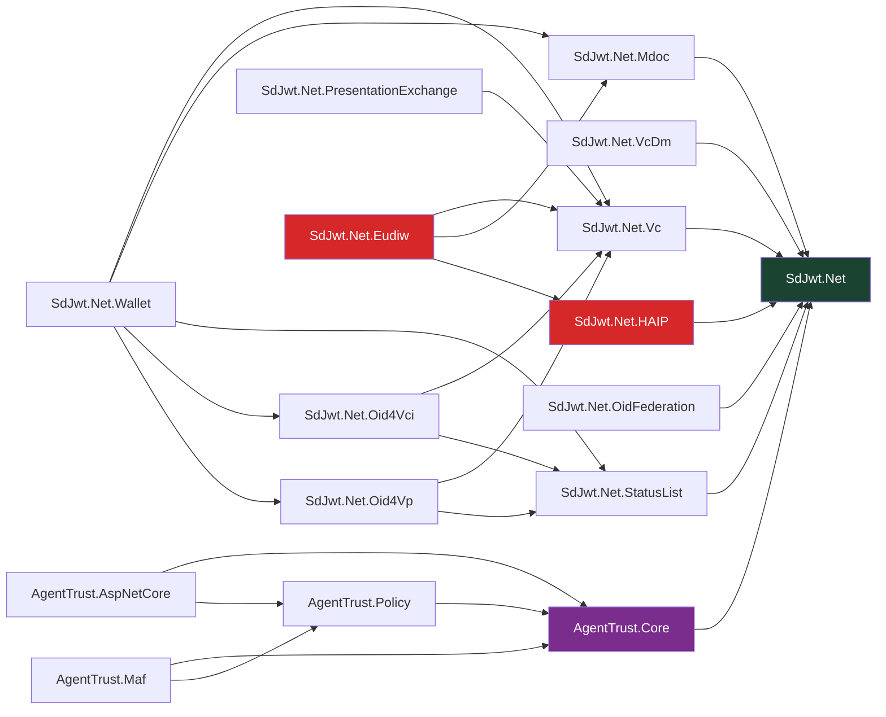
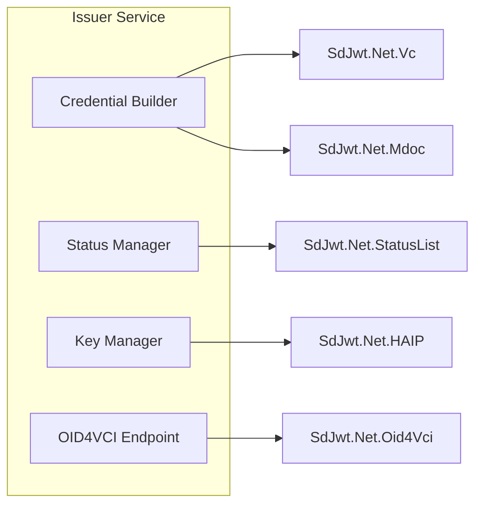
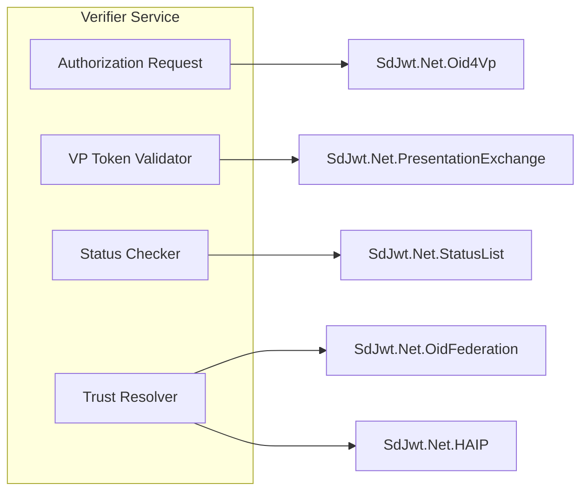
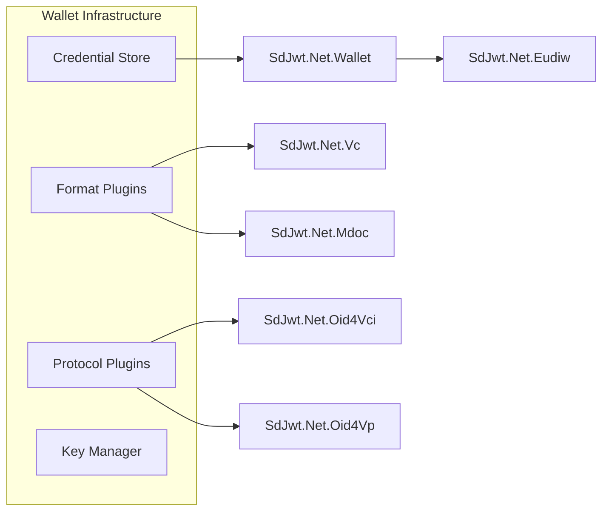
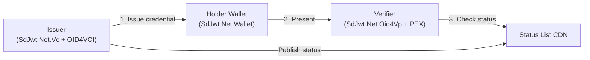
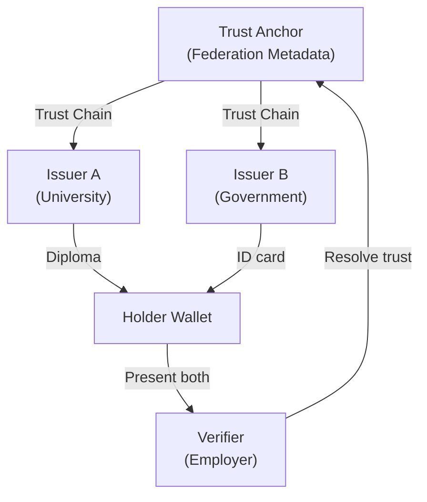

# Ecosystem architecture

> **Level:** Intermediate architecture

## What you will learn

- How the 21 packages relate to each other across five layers
- Which packages to choose for your use case
- How issuer, verifier, wallet, and agent trust components are composed
- What deployment patterns the ecosystem supports

## Audience & purpose

|              |                                                                                                 |
| ------------ | ----------------------------------------------------------------------------------------------- |
| **Audience** | Architects and senior developers designing credential systems with SD-JWT .NET                  |
| **Purpose**  | Make informed decisions about package selection, deployment topology, and integration patterns  |
| **Scope**    | Current source projects, package relationships, and deployment patterns                         |
| **Success**  | Reader can select the right library, protocol, reference, or preview extension for their system |

---

> SD-JWT .NET is a standards-first .NET library ecosystem.
> This document explains how the ecosystem's packages fit together.
> Unless explicitly marked Stable, packages are not certification claims or finished external standards.

## Context

The SD-JWT .NET Ecosystem provides standards-first .NET libraries, protocol components, reference infrastructure, and preview trust extensions for selective disclosure, verifiable credentials, wallet interoperability, and delegated agent trust.

It is not a standalone wallet, identity provider, authorization server, or compliance certification product. It provides reusable implementation building blocks that issuers, verifiers, wallet frameworks, enterprise APIs, and agent systems can build on.

## How to read this ecosystem

Start from the bottom:

- `SdJwt.Net` is the cryptographic foundation. It implements SD-JWT per RFC 9901.
- Credential packages define what kind of credential is being carried (SD-JWT VC, mdoc, W3C VCDM).
- Protocol packages define how credentials move between issuer, wallet, and verifier (OID4VCI, OID4VP, Presentation Exchange, Federation).
- Reference packages show how wallet and EUDIW-style infrastructure can be composed.
- Agent Trust packages are preview extensions for agent/tool authorization.

You do not need every package. Choose the smallest set that matches your use case.

### Choose by use case

| I want to build            | Start with                                  | Add later                            |
| -------------------------- | ------------------------------------------- | ------------------------------------ |
| Basic selective disclosure | `SdJwt.Net`                                 | `SdJwt.Net.Vc`                       |
| Issuer service             | `SdJwt.Net.Vc`, `SdJwt.Net.Oid4Vci`         | `StatusList`, `HAIP`                 |
| Verifier service           | `SdJwt.Net.Oid4Vp`, `PresentationExchange`  | `StatusList`, `Federation`           |
| Wallet framework           | `Wallet`, `Oid4Vci`, `Oid4Vp`, `Vc`, `Mdoc` | `Eudiw`                              |
| Agent tool governance      | `AgentTrust.Core`, `Policy`                 | `AspNetCore`, `Mcp`, `OpenTelemetry` |

## Package Role In The Ecosystem

| Field                   | Value                                                                                     |
| ----------------------- | ----------------------------------------------------------------------------------------- |
| Ecosystem area          | Cross-ecosystem architecture                                                              |
| Package maturity        | Mixed; see [Standards and Maturity Status](../reference/standards-status.md)              |
| Primary audience        | Architects, senior developers, platform engineers                                         |
| What this document does | Maps package roles, adoption tracks, deployment patterns, and trust boundaries            |
| What it does not do     | Certify deployments, replace protocol docs, or define production wallet/compliance claims |

---

## System architecture

### Hub-and-spoke model

The ecosystem has one standards core and two major adoption tracks: digital credential / wallet interoperability and preview delegated agent trust.

### Layer model

The ecosystem is organized into five layers. Each layer depends only on layers below it. This enforces separation of concerns and allows teams to adopt only the layers they need.

### Layer descriptions

| Layer                       | Packages                                                                                             | Responsibility                                                                                            |
| --------------------------- | ---------------------------------------------------------------------------------------------------- | --------------------------------------------------------------------------------------------------------- |
| **L1: Core**                | `SdJwt.Net`                                                                                          | SD-JWT creation, parsing, presentation, and verification per RFC 9901. All other packages depend on this. |
| **L2: Credential**          | `SdJwt.Net.Vc`, `SdJwt.Net.StatusList`, `SdJwt.Net.Mdoc`, `SdJwt.Net.VcDm`, `SdJwt.Net.HAIP`         | Credential formats, status, W3C models, and profile-oriented validation helpers                           |
| **L3: Protocol**            | `SdJwt.Net.Oid4Vci`, `SdJwt.Net.Oid4Vp`, `SdJwt.Net.PresentationExchange`, `SdJwt.Net.OidFederation` | OpenID credential issuance, presentation, query, trust federation, and DC API support                     |
| **L4: Reference / Preview** | `SdJwt.Net.Wallet`, `SdJwt.Net.Eudiw`, `SdJwt.Net.AgentTrust.*`                                      | Wallet/EUDIW reference infrastructure plus preview delegated agent trust extensions                       |
| **L5: Application**         | Your code                                                                                            | Issuer services, verifier endpoints, wallet frameworks, enterprise APIs, and agent integrations           |

---

## Package dependency graph

---

## Component architecture

### Issuer

The issuer creates credentials and manages their lifecycle.

| Component          | Package                            | Responsibility                                                              |
| ------------------ | ---------------------------------- | --------------------------------------------------------------------------- |
| Credential Builder | `SdJwt.Net.Vc` or `SdJwt.Net.Mdoc` | Construct SD-JWT VC or mdoc with selective disclosure claims                |
| Status Manager     | `SdJwt.Net.StatusList`             | Assign status list indices, manage revocation/suspension bitstrings         |
| Key Manager        | `SdJwt.Net.HAIP`                   | Enforce HAIP Final flow/profile requirements and ecosystem algorithm policy |
| OID4VCI Endpoint   | `SdJwt.Net.Oid4Vci`                | Handle pre-auth, auth code, batch, and deferred issuance flows              |

### Verifier

The verifier validates presented credentials.

| Component             | Package                                      | Responsibility                                               |
| --------------------- | -------------------------------------------- | ------------------------------------------------------------ |
| Authorization Request | `SdJwt.Net.Oid4Vp`                           | Create OID4VP / DC API requests, same-device or cross-device |
| VP Token Validator    | `SdJwt.Net.PresentationExchange`             | Match credentials against presentation definitions           |
| Status Checker        | `SdJwt.Net.StatusList`                       | Fetch and evaluate status list for revocation/suspension     |
| Trust Resolver        | `SdJwt.Net.OidFederation` + `SdJwt.Net.HAIP` | Resolve trust chains, validate issuer keys                   |

### Wallet

The wallet stores credentials and creates presentations.

| Component        | Package                                  | Responsibility                                                |
| ---------------- | ---------------------------------------- | ------------------------------------------------------------- |
| Credential Store | `SdJwt.Net.Wallet`                       | Encrypted storage, search, format-agnostic                    |
| Format Plugins   | `SdJwt.Net.Vc` + `SdJwt.Net.Mdoc`        | Parse, render, present SD-JWT VC or mdoc                      |
| Protocol Plugins | `SdJwt.Net.Oid4Vci` + `SdJwt.Net.Oid4Vp` | Handle issuance and presentation protocol flows               |
| Key Manager      | `SdJwt.Net.Wallet`                       | Software or HSM-backed key storage                            |
| EUDIW Reference  | `SdJwt.Net.Eudiw`                        | ARF-oriented helpers, EU trust-list models, PID/QEAA handling |

---

## Deployment patterns

### Pattern 1: single ecosystem

Simplest deployment - one organization issues, verifies, and hosts status lists.

**Packages needed**: `SdJwt.Net`, `SdJwt.Net.Vc`, `SdJwt.Net.StatusList`, `SdJwt.Net.Oid4Vci`, `SdJwt.Net.Oid4Vp`

**Use when**: Enterprise issuing employee badges, membership cards, or internal attestations.

### Pattern 2: multi-issuer federation

Multiple issuers, verified via trust chains.

**Additional packages**: `SdJwt.Net.OidFederation`, `SdJwt.Net.PresentationExchange`

**Use when**: Cross-organization verification where issuers and verifiers don't have direct trust.

### Pattern 3: high assurance (HAIP regulated)

Financial, healthcare, or government systems with strict cryptographic requirements.

**Additional packages**: `SdJwt.Net.HAIP`

**Configuration**: Select the applicable HAIP Final flows (`Oid4VciIssuance`, `Oid4VpRedirectPresentation`, or `Oid4VpDigitalCredentialsApiPresentation`) and credential profiles (`SdJwtVc`, `MsoMdoc`). Validate the declared capabilities with `HaipProfileValidator`, reject weak algorithms, and enforce holder binding where required by the selected profile.

### Pattern 4: EUDIW / ARF reference infrastructure

Reference infrastructure for EU Architecture Reference Framework concepts.

**Additional packages**: `SdJwt.Net.Eudiw`, `SdJwt.Net.Mdoc`, `SdJwt.Net.HAIP`

**Features**: ARF-oriented credential type validation, PID/mDL/QEAA handling, EU trust-list models, RP registration validation, and HAIP Final flow/profile validation.

### Pattern 5: AI agent trust

M2M capability-based authorization for AI agent ecosystems.

**Additional packages**: `SdJwt.Net.AgentTrust.Core`, `SdJwt.Net.AgentTrust.Policy`, `SdJwt.Net.AgentTrust.AspNetCore`, `SdJwt.Net.AgentTrust.Maf`

**Features**: Per-action scoped tokens, policy engine, delegation chains, audit receipts, replay prevention.

---

## Security architecture

### Cryptographic controls

| Control                  | Mechanism                                             | Enforcement                             |
| ------------------------ | ----------------------------------------------------- | --------------------------------------- |
| Algorithm allow-list     | HAIP validator rejects weak algorithms (RS256, HS256) | All issuance and verification paths     |
| Key size minimums        | P-256 (ES256), P-384 (ES384), P-521 (ES512)           | ECDsa key validation                    |
| Constant-time comparison | `CryptographicOperations.FixedTimeEquals`             | Signature verification, hash comparison |
| CSPRNG entropy           | `RandomNumberGenerator`                               | Salts, nonces, keys                     |
| Replay prevention        | Nonce + `iat` freshness + `jti` tracking              | Agent Trust, OID4VP flows               |

### Key management recommendations

| Environment | Key Storage                               | Rotation               |
| ----------- | ----------------------------------------- | ---------------------- |
| Development | In-memory (`InMemoryKeyCustodyProvider`)  | Not required           |
| Staging     | Azure Key Vault / AWS KMS (software keys) | Monthly                |
| Production  | HSM-backed Azure Key Vault / AWS CloudHSM | Per-policy (7-90 days) |

### Threat model summary

| Threat                    | Mitigation                                              | Package                                  |
| ------------------------- | ------------------------------------------------------- | ---------------------------------------- |
| Token forgery             | ECDSA signature verification                            | `SdJwt.Net`                              |
| Over-disclosure           | Selective disclosure per credential                     | `SdJwt.Net`, `SdJwt.Net.Mdoc`            |
| Replay attack             | Nonce, `iat`, `jti` validation                          | `SdJwt.Net`, `SdJwt.Net.AgentTrust.Core` |
| Credential revocation gap | Status List with configurable TTL                       | `SdJwt.Net.StatusList`                   |
| Weak algorithm downgrade  | HAIP Final minimums plus ecosystem algorithm allow-list | `SdJwt.Net.HAIP`                         |
| Issuer impersonation      | OpenID Federation trust chains                          | `SdJwt.Net.OidFederation`                |
| Confused-deputy (agents)  | Audience (`aud`) binding                                | `SdJwt.Net.AgentTrust.Core`              |

---

## Non-goals

The ecosystem intentionally does **not** provide:

- A user-facing wallet app (it provides the library infrastructure)
- An authorization server (use your existing OIDC provider)
- Certificate authority / PKI management (integrate with existing CA)
- Database or storage backends (pluggable interfaces provided)
- HTTP transport / web framework (integrates with ASP.NET Core)

---

## Constraints & assumptions

| Constraint                                 | Rationale                                                              |
| ------------------------------------------ | ---------------------------------------------------------------------- |
| .NET 8.0+ required for production packages | Modern cryptographic APIs, `System.Security.Cryptography` improvements |
| ECDSA only (no RSA for credentials)        | HAIP Final minimum support, ARF alignment, and compact signatures      |
| JSON + CBOR serialization only             | RFC 9901 (JSON) + ISO 18013-5 (CBOR)                                   |
| No PQC credential signing yet              | Waiting for NIST PQC standardization in .NET                           |
| Status Lists are eventually consistent     | CDN caching introduces a freshness window (configurable TTL)           |

---

## Alternatives considered

| Decision           | Chosen                    | Alternative               | Why                                                                           |
| ------------------ | ------------------------- | ------------------------- | ----------------------------------------------------------------------------- |
| Core token format  | SD-JWT (RFC 9901)         | BBS+ / AnonCreds          | RFC 9901 is IETF-ratified, broader tooling support; BBS+ not yet standardized |
| Binary format      | mdoc (ISO 18013-5)        | mDoc-JSON                 | ISO 18013-5 mandates CBOR; aligns with EUDIW ARF                              |
| Trust model        | OpenID Federation         | DID:web + DIDComm         | OpenID Federation aligns with eIDAS 2.0 trust lists                           |
| Policy engine      | Deterministic rule engine | OPA / Rego                | Lower complexity, single-library deployment, no sidecar needed                |
| Agent token format | SD-JWT capability tokens  | OAuth2 Client Credentials | Per-action scoping, selective disclosure, replay prevention                   |

---

## Related concepts

- [What SD-JWT .NET Is - and Is Not](what-this-project-is.md) - Ecosystem boundaries and terminology
- [Standards and Maturity Status](../reference/standards-status.md) - Specification and package maturity status
- [Capability Matrix](../reference/capabilities.md) - Feature coverage
- [Concepts Index](README.md) - Reading order for deep dives
- [Enterprise Roadmap](../ENTERPRISE_ROADMAP.md) - Strategic phases
- [Getting Started](../getting-started/quickstart.md) - 15-minute quickstart
