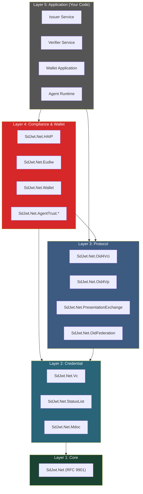
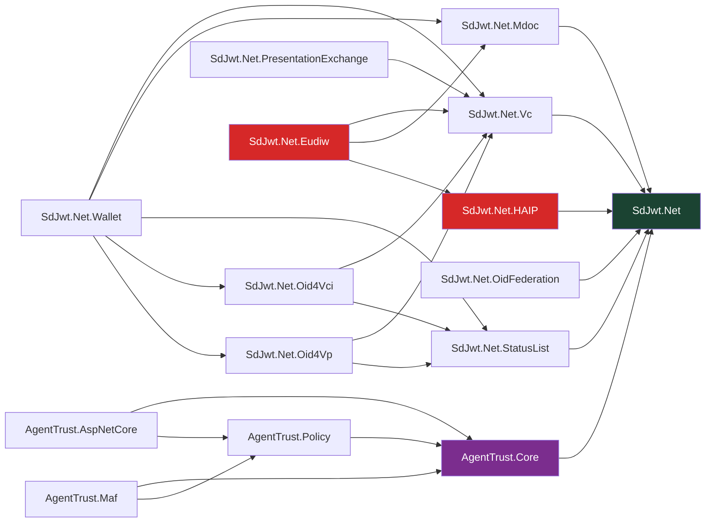
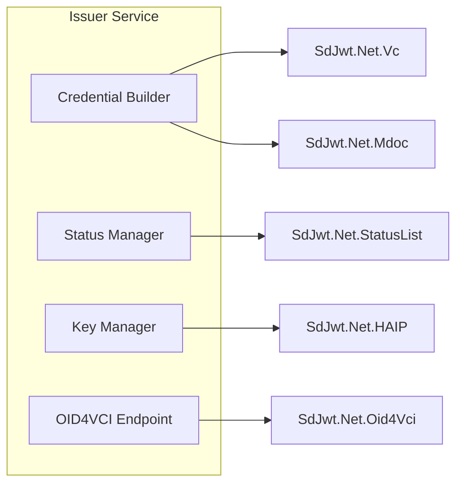
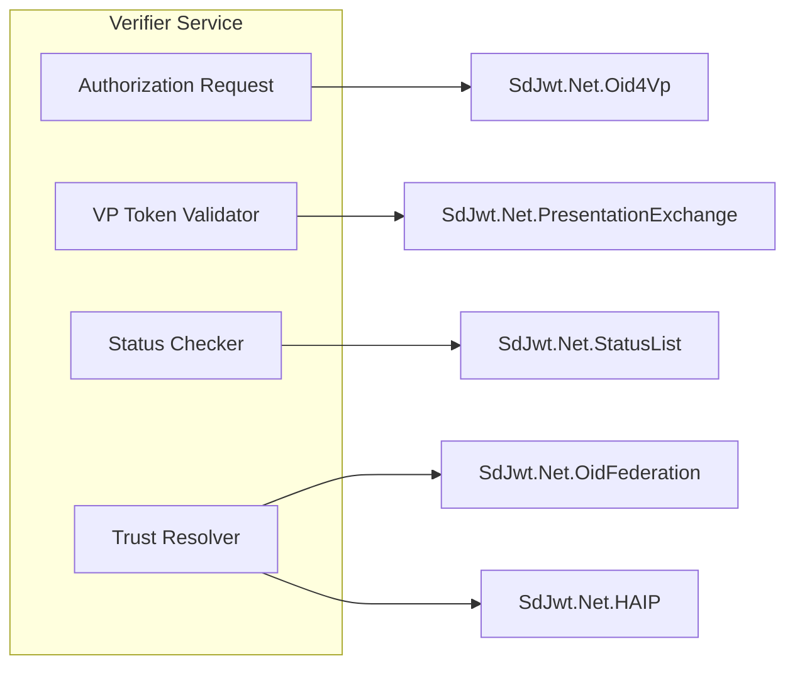
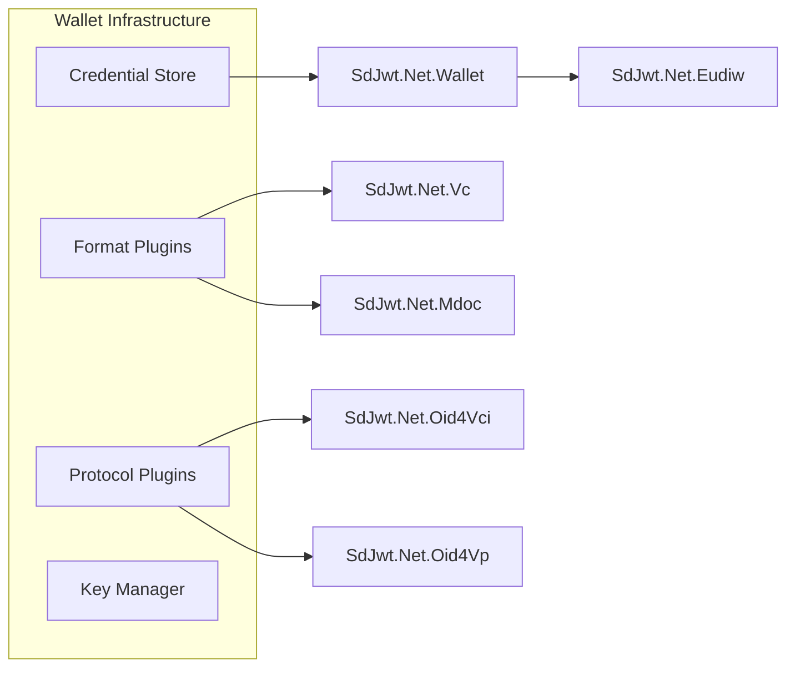
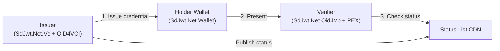
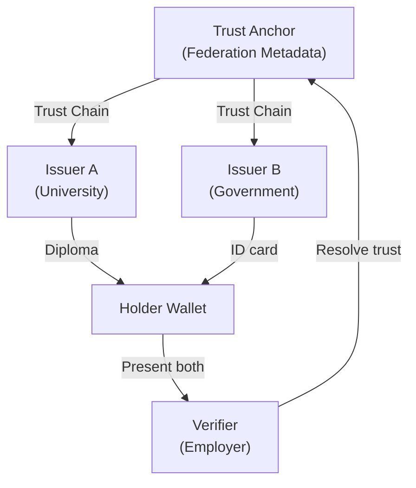

# Ecosystem Architecture

## Audience & Purpose

|              |                                                                                                |
| ------------ | ---------------------------------------------------------------------------------------------- |
| **Audience** | Architects and senior developers designing credential systems with SD-JWT .NET                 |
| **Purpose**  | Make informed decisions about package selection, deployment topology, and integration patterns |
| **Scope**    | All 16 packages, their relationships, and deployment patterns                                  |
| **Success**  | Reader can design a complete issuer-verifier-wallet system tailored to their security profile  |

---

## Context

The SD-JWT .NET ecosystem implements the complete verifiable credentials stack in .NET. It covers credential issuance, selective presentation, status management, trust establishment, and wallet infrastructure across two credential formats (SD-JWT and mdoc) and multiple protocol standards (OpenID4VCI, OpenID4VP, DIF PEX, W3C DC API).

The ecosystem is designed for **regulated industries** where enterprises must comply with eIDAS 2.0, HAIP profiles, or equivalent national frameworks, while remaining flexible enough for general-purpose credential use cases.

---

## System Architecture

### Layer Model

The ecosystem is organized into five layers. Each layer depends only on layers below it. This enforces separation of concerns and allows teams to adopt only the layers they need.

### Layer Descriptions

| Layer               | Packages                                                                                             | Responsibility                                                                          |
| ------------------- | ---------------------------------------------------------------------------------------------------- | --------------------------------------------------------------------------------------- |
| **L1: Core**        | `SdJwt.Net`                                                                                          | SD-JWT creation, parsing, verification per RFC 9901. All other packages depend on this. |
| **L2: Credential**  | `SdJwt.Net.Vc`, `SdJwt.Net.StatusList`, `SdJwt.Net.Mdoc`                                             | Credential profiles (SD-JWT VC, mdoc), status management (revocation, suspension)       |
| **L3: Protocol**    | `SdJwt.Net.Oid4Vci`, `SdJwt.Net.Oid4Vp`, `SdJwt.Net.PresentationExchange`, `SdJwt.Net.OidFederation` | OpenID credential issuance, presentation, query, trust federation                       |
| **L4: Compliance**  | `SdJwt.Net.HAIP`, `SdJwt.Net.Eudiw`, `SdJwt.Net.Wallet`, `SdJwt.Net.AgentTrust.*`                    | Security profiles, regional compliance, wallet infrastructure, M2M trust                |
| **L5: Application** | Your code                                                                                            | Issuer services, verifier endpoints, wallet apps, agent integrations                    |

---

## Package Dependency Graph

---

## Component Architecture

### Issuer

The issuer creates credentials and manages their lifecycle.

| Component          | Package                            | Responsibility                                                      |
| ------------------ | ---------------------------------- | ------------------------------------------------------------------- |
| Credential Builder | `SdJwt.Net.Vc` or `SdJwt.Net.Mdoc` | Construct SD-JWT VC or mdoc with selective disclosure claims        |
| Status Manager     | `SdJwt.Net.StatusList`             | Assign status list indices, manage revocation/suspension bitstrings |
| Key Manager        | `SdJwt.Net.HAIP`                   | Enforce algorithm constraints per HAIP level                        |
| OID4VCI Endpoint   | `SdJwt.Net.Oid4Vci`                | Handle pre-auth, auth code, batch, and deferred issuance flows      |

### Verifier

The verifier validates presented credentials.

| Component             | Package                                      | Responsibility                                               |
| --------------------- | -------------------------------------------- | ------------------------------------------------------------ |
| Authorization Request | `SdJwt.Net.Oid4Vp`                           | Create OID4VP / DC API requests, same-device or cross-device |
| VP Token Validator    | `SdJwt.Net.PresentationExchange`             | Match credentials against presentation definitions           |
| Status Checker        | `SdJwt.Net.StatusList`                       | Fetch and evaluate status list for revocation/suspension     |
| Trust Resolver        | `SdJwt.Net.OidFederation` + `SdJwt.Net.HAIP` | Resolve trust chains, validate issuer keys                   |

### Wallet

The wallet stores credentials and creates presentations.

| Component        | Package                                  | Responsibility                                    |
| ---------------- | ---------------------------------------- | ------------------------------------------------- |
| Credential Store | `SdJwt.Net.Wallet`                       | Encrypted storage, search, format-agnostic        |
| Format Plugins   | `SdJwt.Net.Vc` + `SdJwt.Net.Mdoc`        | Parse, render, present SD-JWT VC or mdoc          |
| Protocol Plugins | `SdJwt.Net.Oid4Vci` + `SdJwt.Net.Oid4Vp` | Handle issuance and presentation protocol flows   |
| Key Manager      | `SdJwt.Net.Wallet`                       | Software or HSM-backed key storage                |
| EUDIW Extension  | `SdJwt.Net.Eudiw`                        | ARF compliance, EU Trust Lists, PID/QEAA handling |

---

## Deployment Patterns

### Pattern 1: Single Ecosystem

Simplest deployment - one organization issues, verifies, and hosts status lists.

**Packages needed**: `SdJwt.Net`, `SdJwt.Net.Vc`, `SdJwt.Net.StatusList`, `SdJwt.Net.Oid4Vci`, `SdJwt.Net.Oid4Vp`

**Use when**: Enterprise issuing employee badges, membership cards, or internal attestations.

### Pattern 2: Multi-Issuer Federation

Multiple issuers, verified via trust chains.

**Additional packages**: `SdJwt.Net.OidFederation`, `SdJwt.Net.PresentationExchange`

**Use when**: Cross-organization verification where issuers and verifiers don't have direct trust.

### Pattern 3: High Assurance (HAIP Regulated)

Financial, healthcare, or government systems with strict cryptographic requirements.

**Additional packages**: `SdJwt.Net.HAIP`

**Configuration**: Set minimum HAIP level on all issuance and verification endpoints. Reject tokens using non-compliant algorithms. Enforce key binding on all credentials.

### Pattern 4: EUDIW Ecosystem

Compliance with EU Architecture Reference Framework.

**Additional packages**: `SdJwt.Net.Eudiw`, `SdJwt.Net.Mdoc`, `SdJwt.Net.HAIP`

**Features**: ARF credential type validation, PID/mDL/QEAA handling, EU Trust List resolution, RP registration validation, HAIP Level 2+ enforcement.

### Pattern 5: AI Agent Trust

M2M capability-based authorization for AI agent ecosystems.

**Additional packages**: `SdJwt.Net.AgentTrust.Core`, `SdJwt.Net.AgentTrust.Policy`, `SdJwt.Net.AgentTrust.AspNetCore`, `SdJwt.Net.AgentTrust.Maf`

**Features**: Per-action scoped tokens, policy engine, delegation chains, audit receipts, replay prevention.

---

## Security Architecture

### Cryptographic Controls

| Control                  | Mechanism                                             | Enforcement                             |
| ------------------------ | ----------------------------------------------------- | --------------------------------------- |
| Algorithm allow-list     | HAIP validator rejects weak algorithms (RS256, HS256) | All issuance and verification paths     |
| Key size minimums        | P-256 (ES256), P-384 (ES384), P-521 (ES512)           | ECDsa key validation                    |
| Constant-time comparison | `CryptographicOperations.FixedTimeEquals`             | Signature verification, hash comparison |
| CSPRNG entropy           | `RandomNumberGenerator`                               | Salts, nonces, keys                     |
| Replay prevention        | Nonce + `iat` freshness + `jti` tracking              | Agent Trust, OID4VP flows               |

### Key Management Recommendations

| Environment | Key Storage                               | Rotation               |
| ----------- | ----------------------------------------- | ---------------------- |
| Development | In-memory (`InMemoryKeyCustodyProvider`)  | Not required           |
| Staging     | Azure Key Vault / AWS KMS (software keys) | Monthly                |
| Production  | HSM-backed Azure Key Vault / AWS CloudHSM | Per-policy (7-90 days) |

### Threat Model Summary

| Threat                    | Mitigation                          | Package                                  |
| ------------------------- | ----------------------------------- | ---------------------------------------- |
| Token forgery             | ECDSA signature verification        | `SdJwt.Net`                              |
| Over-disclosure           | Selective disclosure per credential | `SdJwt.Net`, `SdJwt.Net.Mdoc`            |
| Replay attack             | Nonce, `iat`, `jti` validation      | `SdJwt.Net`, `SdJwt.Net.AgentTrust.Core` |
| Credential revocation gap | Status List with configurable TTL   | `SdJwt.Net.StatusList`                   |
| Weak algorithm downgrade  | HAIP algorithm allow-list           | `SdJwt.Net.HAIP`                         |
| Issuer impersonation      | OpenID Federation trust chains      | `SdJwt.Net.OidFederation`                |
| Confused-deputy (agents)  | Audience (`aud`) binding            | `SdJwt.Net.AgentTrust.Core`              |

---

## Non-Goals

The ecosystem intentionally does **not** provide:

- A user-facing wallet app (it provides the library infrastructure)
- An authorization server (use your existing OIDC provider)
- Certificate authority / PKI management (integrate with existing CA)
- Database or storage backends (pluggable interfaces provided)
- HTTP transport / web framework (integrates with ASP.NET Core)

---

## Constraints & Assumptions

| Constraint                                 | Rationale                                                              |
| ------------------------------------------ | ---------------------------------------------------------------------- |
| .NET 8.0+ required for production packages | Modern cryptographic APIs, `System.Security.Cryptography` improvements |
| ECDSA only (no RSA for credentials)        | HAIP compliance, compact signatures                                    |
| JSON + CBOR serialization only             | RFC 9901 (JSON) + ISO 18013-5 (CBOR)                                   |
| No PQC credential signing yet              | Waiting for NIST PQC standardization in .NET                           |
| Status Lists are eventually consistent     | CDN caching introduces a freshness window (configurable TTL)           |

---

## Alternatives Considered

| Decision           | Chosen                    | Alternative               | Why                                                                           |
| ------------------ | ------------------------- | ------------------------- | ----------------------------------------------------------------------------- |
| Core token format  | SD-JWT (RFC 9901)         | BBS+ / AnonCreds          | RFC 9901 is IETF-ratified, broader tooling support; BBS+ not yet standardized |
| Binary format      | mdoc (ISO 18013-5)        | mDoc-JSON                 | ISO 18013-5 mandates CBOR; aligns with EUDIW ARF                              |
| Trust model        | OpenID Federation         | DID:web + DIDComm         | OpenID Federation aligns with eIDAS 2.0 trust lists                           |
| Policy engine      | Deterministic rule engine | OPA / Rego                | Lower complexity, single-library deployment, no sidecar needed                |
| Agent token format | SD-JWT capability tokens  | OAuth2 Client Credentials | Per-action scoping, selective disclosure, replay prevention                   |

---

## Related Documentation

- [Capability Matrix](../capabilities.md) - Feature coverage
- [Concepts Index](README.md) - Reading order for deep dives
- [Enterprise Roadmap](../ENTERPRISE_ROADMAP.md) - Strategic phases
- [Getting Started](../getting-started/quickstart.md) - 15-minute quickstart
