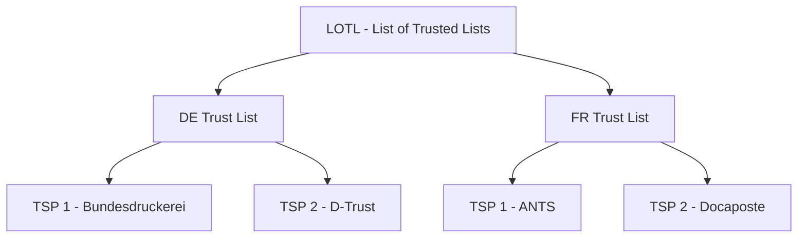

# EUDIW / ARF Reference Infrastructure

> **Level:** Advanced ecosystem context

## A French citizen opens a German bank account

Marie lives in Lyon and wants to open a savings account with a German online bank. Today, she would mail a notarized copy of her French ID card, wait for manual verification, and possibly visit a branch. With EUDIW, the German bank's website requests a Person Identification Data (PID) credential via OID4VP. Marie's wallet app shows which claims the bank needs (name, date of birth, nationality, French national ID number). She approves the disclosure. The bank receives a cryptographically signed, EU-trusted credential in seconds -- no paper, no notary, no delay. The bank checks the credential against the EU Trust List, verifies the French government's issuer signature, and opens the account.

This is the cross-border identity future that eIDAS 2.0 and the EUDIW ecosystem are building toward.

## Simple explanation

The European Union is building a digital identity wallet ecosystem under eIDAS 2.0. Every EU member state will issue citizens a wallet that carries a Person Identification Data (PID) credential and domain-specific attestations (EAA/QEAA) such as driving licenses, diplomas, and health cards.

## What you will learn

- The EUDIW/ARF architecture and key terminology (PID, EAA, Trust List)
- What `SdJwt.Net.Eudiw` provides (reference models, not a certified wallet)
- How ARF-aligned flows map to OID4VCI, OID4VP, and HAIP
- The regulatory boundary: what the library does vs what certification requires

`SdJwt.Net.Eudiw` provides ARF-aligned reference models and validation helpers so that .NET issuers, verifiers, and wallet backends can experiment with EUDIW-style flows. It is not a certified EUDIW wallet or a production eIDAS component.

### Minimum vocabulary

| Term       | Meaning                                                               |
| ---------- | --------------------------------------------------------------------- |
| PID        | Person Identification Data - the core identity credential             |
| EAA / QEAA | (Qualified) Electronic Attestation of Attributes - domain credentials |
| RP         | Relying Party (verifier)                                              |
| Trust List | Issuer registry published by member states or the EU                  |
| ARF        | Architecture and Reference Framework - the EU technical specification |

|                      |                                                                                                                                                                                                                                                                                  |
| -------------------- | -------------------------------------------------------------------------------------------------------------------------------------------------------------------------------------------------------------------------------------------------------------------------------- |
| **Audience**         | Architects and developers evaluating eIDAS 2.0 / ARF-aligned wallet and verifier patterns, and product teams assessing EU market integration requirements.                                                                                                                       |
| **Purpose**          | Explain the EU Digital Identity Wallet ecosystem and show how `SdJwt.Net.Eudiw` provides ARF-aligned reference helpers, models, and validation patterns.                                                                                                                         |
| **Scope**            | eIDAS 2.0 context, ARF concepts, PID and attestation credential types, mdoc and SD-JWT VC dual-format support, HAIP Final flow/profile validation, trust-list models, and Issuer/Verifier/Wallet integration patterns. Out of scope: general SD-JWT mechanics, OID4VP internals. |
| **Success criteria** | Reader can model EUDIW-style credential flows, validate ARF-related credential metadata, understand dual-format mdoc + SD-JWT VC patterns, and identify where certified EUDIW ecosystem components are still required.                                                           |

---

> SD-JWT .NET is a standards-first .NET library ecosystem.
> This document explains the `SdJwt.Net.Eudiw` reference package within that ecosystem.
> Unless explicitly marked Stable, packages are not certification claims or finished external standards.

## Package Role In The Ecosystem

| Field                         | Value                                                                                                                                   |
| ----------------------------- | --------------------------------------------------------------------------------------------------------------------------------------- |
| Ecosystem area                | Reference Infrastructure                                                                                                                |
| Package maturity              | Reference                                                                                                                               |
| Primary audience              | Wallet-framework builders, verifier implementers, architects evaluating EUDIW-style ecosystems                                          |
| What this package does        | Provides ARF/EUDIW-oriented models, validation helpers, trust-list patterns, PID/QEAA handling, and wallet-reference composition        |
| What this package does not do | Provide a certified EU Digital Identity Wallet, conformity assessment, national onboarding, relying-party approval, or trust governance |

## What This Package Is Not

`SdJwt.Net.Eudiw` is not a certified EU Digital Identity Wallet, not a trust service provider, and not a replacement for national onboarding, conformity assessment, relying-party registration, or EU trust-list governance. It provides reference helpers and patterns for .NET implementers.

## Prerequisites

These foundational concepts will help you get the most from this document:

### What is eIDAS 2.0?

**eIDAS 2.0** (Electronic Identification, Authentication and Trust Services) is the EU regulation establishing the EU Digital Identity Wallet ecosystem. It builds on the original eIDAS regulation to enable:

- Cross-border digital identity verification
- Privacy-preserving credential presentation
- Qualified electronic signatures from mobile devices
- Trust interoperability between member states

### What is the Architecture Reference Framework (ARF)?

The **Architecture Reference Framework (ARF)** provides the technical architecture, profiles, and reference patterns that guide EUDIW implementations:

- Credential formats (mdoc for PID/mDL, SD-JWT VC for attestations)
- Cryptographic algorithms aligned with ARF and HAIP Final minimum support
- Trust infrastructure (EU Trust Lists)
- Protocol requirements (OpenID4VCI, OpenID4VP)

### The problem EUDIW solves

Citizens across EU member states currently face:

1. **Fragmented identity**: Different digital IDs per country and service
2. **Privacy concerns**: Over-disclosure of personal data
3. **Cross-border friction**: National IDs not accepted elsewhere
4. **Trust complexity**: No unified way to verify credential issuers

EUDIW provides:

- Single wallet app for all digital credentials
- Selective disclosure (show only what's needed)
- Cross-border acceptance (French wallet works in Germany)
- Unified trust infrastructure (EU Trust Lists)

## Glossary of key terms

| Term             | Definition                                                 |
| ---------------- | ---------------------------------------------------------- |
| **EUDIW**        | EU Digital Identity Wallet - the app citizens use          |
| **ARF**          | Architecture Reference Framework - technical specification |
| **PID**          | Person Identification Data - core identity credential      |
| **mDL**          | Mobile Driving License - per ISO 18013-5                   |
| **QEAA**         | Qualified Electronic Attestation of Attributes             |
| **EAA**          | Electronic Attestation of Attributes (non-qualified)       |
| **RP**           | Relying Party - service requesting credentials             |
| **LOTL**         | List of Trusted Lists - EU trust anchor                    |
| **TSP**          | Trust Service Provider - credential issuers                |
| **Member State** | EU country participating in EUDIW ecosystem                |
| **DocType**      | Credential type identifier for mdoc format                 |
| **vct**          | Verifiable Credential Type for SD-JWT VC format            |

## Implementation overview

### Package structure

The `SdJwt.Net.Eudiw` package provides reference helpers and models:

```text
SdJwt.Net.Eudiw/
   Arf/
      ArfCredentialType.cs       # Credential type enumeration
      ArfProfileValidator.cs     # ARF-oriented validation helpers
      ArfValidationResult.cs     # Validation result model
   Credentials/
      PidCredentialHandler.cs    # PID processing and validation
      QeaaHandler.cs             # Qualified attestation handling
   RelyingParty/
      RpRegistration.cs          # RP registration model
      RpRegistrationValidator.cs # RP validation logic
   TrustFramework/
      EuTrustListResolver.cs     # EU Trust List integration
      TrustedServiceProvider.cs  # TSP model
      TrustServiceType.cs        # TSP type enumeration
      TrustValidationResult.cs   # Trust validation result
   EudiwConstants.cs             # Constants and definitions
```

### Core components

#### ArfProfileValidator

Validates credentials against ARF requirements:

```csharp
using SdJwt.Net.Eudiw.Arf;

var validator = new ArfProfileValidator();

// Validate cryptographic algorithm against ARF-oriented local policy
bool isValidAlg = validator.ValidateAlgorithm("ES256"); // true
bool isInvalidAlg = validator.ValidateAlgorithm("RS256"); // false (not allowed by this ARF-oriented policy)

// Validate credential type
var result = validator.ValidateCredentialType("eu.europa.ec.eudi.pid.1");
if (result.IsValid)
{
    Console.WriteLine($"Credential type: {result.CredentialType}"); // Pid
}

// Validate EU member state
bool isEu = validator.ValidateMemberState("DE"); // true
bool isNotEu = validator.ValidateMemberState("US"); // false
```

Key validations:

- **Algorithm policy**: ARF-oriented algorithm checks, with HAIP Final ES256 and SHA-256 support where OpenID4VC HAIP flows are used
- **Credential types**: PID, mDL, QEAA, EAA
- **Member states**: All 27 EU countries
- **PID claims**: Mandatory and optional fields

#### PidCredentialHandler

Processes Person Identification Data credentials:

```csharp
using SdJwt.Net.Eudiw.Credentials;

var handler = new PidCredentialHandler();

var claims = new Dictionary<string, object>
{
    // Mandatory PID claims
    ["family_name"] = "Mustermann",
    ["given_name"] = "Erika",
    ["birth_date"] = "1964-08-12",
    ["issuance_date"] = "2024-01-01",
    ["expiry_date"] = "2029-01-01",
    ["issuing_authority"] = "Bundesdruckerei",
    ["issuing_country"] = "DE",

    // Optional PID claims
    ["birth_place"] = "Berlin",
    ["nationality"] = "DE",
    ["age_over_18"] = true
};

// Validate claims
var validation = handler.Validate(claims);
if (validation.IsValid)
{
    // Convert to typed model
    var credential = handler.ToPidCredential(claims);
    Console.WriteLine($"{credential.GivenName} {credential.FamilyName}");
    Console.WriteLine($"Issued by: {credential.IssuingAuthority}");
}
else
{
    foreach (var error in validation.Errors)
    {
        Console.WriteLine($"Validation error: {error}");
    }
}
```

Mandatory PID claims per ARF:

| Claim               | Description                   | Example           |
| ------------------- | ----------------------------- | ----------------- |
| `family_name`       | Current family name           | "Mustermann"      |
| `given_name`        | Current first name            | "Erika"           |
| `birth_date`        | Date of birth                 | "1964-08-12"      |
| `issuance_date`     | Credential issuance date      | "2024-01-01"      |
| `expiry_date`       | Credential expiration         | "2029-01-01"      |
| `issuing_authority` | Authority that issued the PID | "Bundesdruckerei" |
| `issuing_country`   | Member state ISO code         | "DE"              |

#### QeaaHandler

Handles Qualified Electronic Attestations of Attributes:

```csharp
using SdJwt.Net.Eudiw.Credentials;

var handler = new QeaaHandler();

// University diploma as QEAA
var diplomaClaims = new Dictionary<string, object>
{
    ["degree_type"] = "Masters",
    ["field_of_study"] = "Computer Science",
    ["issuing_institution"] = "Technical University of Munich",
    ["graduation_date"] = "2023-07-15",
    ["issuing_country"] = "DE"
};

var validation = handler.Validate(diplomaClaims, QeaaType.EducationalCredential);
```

QEAA types supported:

- Educational credentials (diplomas, certificates)
- Professional qualifications (licenses)
- Healthcare credentials (prescriptions)
- Travel documents (visas)
- Financial attestations (creditworthiness)

#### RpRegistrationValidator

Validates Relying Party registrations:

```csharp
using SdJwt.Net.Eudiw.RelyingParty;

var validator = new RpRegistrationValidator();

var registration = new RpRegistration
{
    ClientId = "https://bank.example.de",
    OrganizationName = "Example Bank AG",
    RedirectUris = new[] { "https://bank.example.de/callback" },
    ResponseTypes = new[] { "vp_token" },
    TrustFramework = "eu.eudiw.trust",
    Contacts = new[] { "security@bank.example.de" }
};

var result = validator.Validate(registration);
if (result.IsValid)
{
    Console.WriteLine("RP registration is valid for EUDIW ecosystem");
}
else
{
    foreach (var error in result.Errors)
    {
        Console.WriteLine($"Registration error: {error}");
    }
}
```

#### EuTrustListResolver

Resolves and validates issuers against EU Trust Lists:

```csharp
using SdJwt.Net.Eudiw.TrustFramework;

var resolver = new EuTrustListResolver();

// Resolve Trust Service Provider
var tsp = await resolver.ResolveAsync(
    issuerIdentifier: "https://pid.bundesdruckerei.de",
    memberState: "DE"
);

if (tsp != null)
{
    Console.WriteLine($"TSP: {tsp.Name}");
    Console.WriteLine($"Service Type: {tsp.ServiceType}");
    Console.WriteLine($"Status: {tsp.Status}");

    // Validate trust chain
    var trustResult = await resolver.ValidateTrustChainAsync(tsp);
    if (trustResult.IsValid)
    {
        Console.WriteLine("Issuer is trusted under EU Trust Lists");
    }
}
```

## Credential types

### Person Identification Data (PID)

The PID is the core identity credential in EUDIW:

```csharp
// DocType for mdoc format
const string PidDocType = "eu.europa.ec.eudi.pid.1";

// Namespace for PID claims
const string PidNamespace = "eu.europa.ec.eudi.pid.1";
```

PID supports two formats:

| Format    | Use Case            | Transport        |
| --------- | ------------------- | ---------------- |
| mdoc      | NFC/BLE proximity   | Device proximity |
| SD-JWT VC | Online/cross-device | OpenID4VP        |

### Mobile Driving License (mDL)

Follows ISO 18013-5 with EUDIW extensions:

```csharp
// DocType for mDL
const string MdlDocType = "org.iso.18013.5.1.mDL";

// EUDIW-specific mDL claims
var mDlClaims = new Dictionary<string, object>
{
    ["family_name"] = "Mustermann",
    ["given_name"] = "Erika",
    ["birth_date"] = "1964-08-12",
    ["document_number"] = "D1234567890",
    ["driving_privileges"] = new[] { "B", "C1" },
    ["issue_date"] = "2024-01-01",
    ["expiry_date"] = "2034-01-01",
    ["issuing_country"] = "DE",
    ["issuing_authority"] = "Kraftfahrt-Bundesamt"
};
```

### Qualified attestations (QEAA)

High-trust attestations from qualified TSPs:

```csharp
// VCT prefix for QEAA
const string QeaaVctPrefix = "eu.europa.ec.eudi.qeaa";

// Example: Professional license as QEAA
var lawyerLicense = new Dictionary<string, object>
{
    ["vct"] = "eu.europa.ec.eudi.qeaa.professional.lawyer.de",
    ["bar_association"] = "Rechtsanwaltskammer Berlin",
    ["license_number"] = "RAK-B-12345",
    ["admission_date"] = "2010-05-15",
    ["specializations"] = new[] { "Corporate Law", "M&A" }
};
```

### Non-qualified attestations (EAA)

Lower-trust attestations for general use:

```csharp
// VCT prefix for EAA
const string EaaVctPrefix = "eu.europa.ec.eudi.eaa";

// Example: Gym membership as EAA
var gymMembership = new Dictionary<string, object>
{
    ["vct"] = "eu.europa.ec.eudi.eaa.membership.gym",
    ["membership_id"] = "GYM-2024-001",
    ["valid_from"] = "2024-01-01",
    ["valid_until"] = "2024-12-31",
    ["membership_type"] = "Premium"
};
```

## Algorithm Requirements

The reference helpers enforce an ARF-oriented algorithm policy. HAIP Final requires support for ES256 validation and SHA-256 digest validation for the selected OpenID4VC flows and credential profiles; it does not define Level 1, Level 2, or Level 3 algorithm tiers.

| Algorithm | ARF status  | HAIP Final note                    |
| --------- | ----------- | ---------------------------------- |
| ES256     | Required    | Required minimum JOSE validation   |
| ES384     | Supported   | Ecosystem policy may allow/require |
| ES512     | Supported   | Ecosystem policy may allow/require |
| RS256     | Not allowed | Not used for this ARF profile      |
| RS384     | Not allowed | Not used for this ARF profile      |
| HS256     | Not allowed | Symmetric signing is not allowed   |

```csharp
using SdJwt.Net.Eudiw.Arf;

var validator = new ArfProfileValidator();

// These pass ARF validation
validator.ValidateAlgorithm("ES256"); // true
validator.ValidateAlgorithm("ES384"); // true
validator.ValidateAlgorithm("ES512"); // true

// These fail ARF validation
validator.ValidateAlgorithm("RS256"); // false
validator.ValidateAlgorithm("HS256"); // false
validator.ValidateAlgorithm("EdDSA"); // false (not in ARF yet)
```

## EU member states

All 27 EU member states are supported:

| Code | Country        | Code | Country    |
| ---- | -------------- | ---- | ---------- |
| AT   | Austria        | BE   | Belgium    |
| BG   | Bulgaria       | CY   | Cyprus     |
| CZ   | Czech Republic | DE   | Germany    |
| DK   | Denmark        | EE   | Estonia    |
| ES   | Spain          | FI   | Finland    |
| FR   | France         | GR   | Greece     |
| HR   | Croatia        | HU   | Hungary    |
| IE   | Ireland        | IT   | Italy      |
| LT   | Lithuania      | LU   | Luxembourg |
| LV   | Latvia         | MT   | Malta      |
| NL   | Netherlands    | PL   | Poland     |
| PT   | Portugal       | RO   | Romania    |
| SE   | Sweden         | SI   | Slovenia   |
| SK   | Slovakia       |      |            |

```csharp
using SdJwt.Net.Eudiw;

// Access all member states
var allStates = EudiwConstants.MemberStates.All;
Console.WriteLine($"Supported states: {string.Join(", ", allStates)}");
```

## Trust infrastructure

### EU Trust Lists

The EUDIW trust infrastructure is built on EU Trust Lists:



### Trust validation

```csharp
using SdJwt.Net.Eudiw.TrustFramework;

public class EuTrustService
{
    private readonly EuTrustListResolver _resolver;

    public async Task<TrustValidationResult> ValidateIssuerAsync(
        string issuerIdentifier,
        ArfCredentialType expectedType)
    {
        // Resolve TSP from Trust Lists
        var tsp = await _resolver.ResolveAsync(issuerIdentifier);

        if (tsp == null)
        {
            return TrustValidationResult.Failed("Issuer not found in EU Trust Lists");
        }

        // Validate TSP is authorized for credential type
        var authorizedTypes = GetAuthorizedTypes(tsp.ServiceType);
        if (!authorizedTypes.Contains(expectedType))
        {
            return TrustValidationResult.Failed(
                $"TSP not authorized to issue {expectedType} credentials");
        }

        // Validate TSP status
        if (tsp.Status != TspStatus.Granted)
        {
            return TrustValidationResult.Failed($"TSP status: {tsp.Status}");
        }

        // Validate certificate chain
        return await _resolver.ValidateTrustChainAsync(tsp);
    }
}
```

## Integration with other packages

### With SdJwt.Net.Oid4Vp

```csharp
using SdJwt.Net.Eudiw.Arf;
using SdJwt.Net.Oid4Vp.Verifier;

public class EudiwVerifier
{
    private readonly ArfProfileValidator _arfValidator;
    private readonly VpTokenValidator _vpValidator;

    public async Task<VerificationResult> VerifyEudiwCredential(
        string vpToken,
        string expectedCredentialType)
    {
        // First validate VP token
        var vpResult = await _vpValidator.ValidateAsync(vpToken);
        if (!vpResult.IsValid)
        {
            return VerificationResult.Failed(vpResult.ErrorMessage);
        }

        // Validate algorithm against ARF-oriented local policy
        if (!_arfValidator.ValidateAlgorithm(vpResult.Algorithm))
        {
            return VerificationResult.Failed("Algorithm is not allowed by the configured ARF-oriented policy");
        }

        // Validate credential type
        var typeResult = _arfValidator.ValidateCredentialType(vpResult.CredentialType);
        if (!typeResult.IsValid)
        {
            return VerificationResult.Failed(typeResult.ErrorMessage);
        }

        // Validate issuing country is EU member state
        if (!_arfValidator.ValidateMemberState(vpResult.IssuingCountry))
        {
            return VerificationResult.Failed("Issuer not from EU member state");
        }

        return VerificationResult.Success(vpResult.Credentials);
    }
}
```

### With SdJwt.Net.Mdoc

```csharp
using SdJwt.Net.Eudiw.Arf;
using SdJwt.Net.Mdoc.Verifier;

public class EudiwMdocVerifier
{
    private readonly ArfProfileValidator _arfValidator;
    private readonly MdocVerifier _mdocVerifier;

    public async Task<VerificationResult> VerifyPidAsync(byte[] mdocBytes)
    {
        // Verify mdoc signature
        var mdocResult = await _mdocVerifier.VerifyAsync(mdocBytes);
        if (!mdocResult.IsValid)
        {
            return VerificationResult.Failed(mdocResult.ErrorMessage);
        }

        // Validate DocType is PID
        var typeResult = _arfValidator.ValidateCredentialType(mdocResult.DocType);
        if (!typeResult.IsValid || typeResult.CredentialType != ArfCredentialType.Pid)
        {
            return VerificationResult.Failed("Credential is not a valid PID");
        }

        // Validate PID claims
        var pidResult = _arfValidator.ValidatePidClaims(mdocResult.Claims);
        if (!pidResult.IsValid)
        {
            return VerificationResult.Failed(pidResult.ErrorMessage);
        }

        return VerificationResult.Success(mdocResult.Claims);
    }
}
```

### With SdJwt.Net.HAIP

```csharp
using SdJwt.Net.Eudiw.Arf;
using SdJwt.Net.HAIP;
using SdJwt.Net.HAIP.Validators;

public class EudiwHaipValidator
{
    private readonly ArfProfileValidator _arfValidator;
    private readonly HaipProfileValidator _haipValidator = new();

    public ValidationResult ValidateOpenId4VcProfile(
        string algorithm,
        string credentialType)
    {
        // ARF validation
        if (!_arfValidator.ValidateAlgorithm(algorithm))
        {
            return ValidationResult.Failed("Algorithm is not allowed by the configured ARF-oriented policy");
        }

        var options = new HaipProfileOptions();
        options.Flows.Add(HaipFlow.Oid4VpDigitalCredentialsApiPresentation);
        options.CredentialProfiles.Add(HaipCredentialProfile.SdJwtVc);
        options.SupportedCredentialFormats.Add(HaipConstants.SdJwtVcFormat);
        options.SupportedJoseAlgorithms.Add(algorithm);
        options.SupportedHashAlgorithms.Add(HaipConstants.RequiredHashAlgorithm);
        options.SupportsDigitalCredentialsApi = true;
        options.SupportsDcql = true;
        options.SupportsSdJwtVcCompactSerialization = true;
        options.UsesCnfJwkForSdJwtVcHolderBinding = true;
        options.RequiresKbJwtForHolderBoundSdJwtVc = true;
        options.SupportsStatusListClaim = true;
        options.SupportsSdJwtVcIssuerX5c = true;

        var haipResult = _haipValidator.Validate(options);
        if (!haipResult.IsCompliant)
        {
            return ValidationResult.Failed("Selected OpenID4VC profile does not satisfy the configured HAIP Final profile policy");
        }

        return ValidationResult.Success();
    }
}
```

## EudiWallet class

The `EudiWallet` class is a reference wrapper that demonstrates how generic wallet infrastructure can apply EUDIW / ARF-oriented validation policies:

### Quick start

```csharp
using SdJwt.Net.Eudiw;
using SdJwt.Net.Wallet.Core;
using SdJwt.Net.Wallet.Storage;

// Create EUDI wallet with default settings (ARF enforcement enabled)
var store = new InMemoryCredentialStore();
var keyManager = new SoftwareKeyManager();

var wallet = new EudiWallet(store, keyManager);

// Reference EUDIW configuration enforces ARF-oriented checks by default
Console.WriteLine(wallet.IsArfEnforced); // true
// MinimumHaipLevel is a legacy local policy setting; see HAIP concept page for flow/profile model
```

### Configuration options

```csharp
var options = new EudiWalletOptions
{
    WalletId = "my-eudi-wallet",
    DisplayName = "My EUDI Wallet",
    EnforceArfCompliance = true,
    // MinimumHaipLevel is a legacy local policy setting;
    // HAIP Final validation is flow/profile based - see HAIP concept page
    ValidateIssuerTrust = true,
    SupportedCredentialTypes = new[]
    {
        EudiwConstants.Pid.DocType,
        EudiwConstants.Mdl.DocType,
        "eu.europa.ec.eudi.loyalty.1"
    }
};

var wallet = new EudiWallet(store, keyManager, eudiOptions: options);
```

### Algorithm validation

```csharp
// Validate algorithms against the configured ARF-oriented policy
wallet.ValidateAlgorithm("ES256"); // true - allowed by this policy
wallet.ValidateAlgorithm("ES384"); // true - allowed by this policy
wallet.ValidateAlgorithm("RS256"); // false - not allowed by this policy
```

### Credential type validation

```csharp
// Validate credential types
var pidResult = wallet.ValidateCredentialType(EudiwConstants.Pid.DocType);
pidResult.IsValid; // true
pidResult.CredentialType; // ArfCredentialType.Pid

var mdlResult = wallet.ValidateCredentialType(EudiwConstants.Mdl.DocType);
mdlResult.IsValid; // true
mdlResult.CredentialType; // ArfCredentialType.Mdl
```

### PID claims validation

```csharp
var claims = new Dictionary<string, object>
{
    ["family_name"] = "Mustermann",
    ["given_name"] = "Erika",
    ["birth_date"] = "1964-08-12",
    ["issuance_date"] = "2024-01-01",
    ["expiry_date"] = "2029-01-01",
    ["issuing_authority"] = "Bundesdruckerei",
    ["issuing_country"] = "DE"
};

var result = wallet.ValidatePidClaims(claims);
if (result.IsValid)
{
    var pid = wallet.ExtractPidCredential(claims);
    Console.WriteLine($"{pid.GivenName} {pid.FamilyName}");
}
```

### Issuer trust validation

```csharp
// Validate issuer against EU Trust List
var trustResult = await wallet.ValidateIssuerTrustAsync(
    "https://pid-provider.bundesdruckerei.de");

if (trustResult.IsTrusted)
{
    Console.WriteLine($"Member State: {trustResult.MemberState}"); // "DE"
    Console.WriteLine($"Service Type: {trustResult.ServiceType}");
}
```

### Member state validation

```csharp
// Check EU member states
wallet.ValidateMemberState("DE"); // true
wallet.ValidateMemberState("FR"); // true
wallet.ValidateMemberState("US"); // false

// Get all supported member states
var memberStates = wallet.GetSupportedMemberStates();
// Returns all 27 EU member state codes
```

### Finding credentials

```csharp
// Find PID credentials
var pidCredentials = await wallet.FindPidCredentialsAsync();

// Find mDL credentials
var mdlCredentials = await wallet.FindMdlCredentialsAsync();
```

### Storing credentials with ARF enforcement

```csharp
// Credentials are validated against ARF when stored
try
{
    var stored = await wallet.StoreCredentialAsync(parsedCredential);
}
catch (ArfComplianceException ex)
{
    Console.WriteLine($"ARF violations: {string.Join(", ", ex.Violations)}");
}
catch (EudiTrustException ex)
{
    Console.WriteLine($"Trust validation failed: {ex.Message}");
}
```

## Timeline and adoption

| Date        | Milestone                                                                                                          |
| ----------- | ------------------------------------------------------------------------------------------------------------------ |
| 2024 Q1     | eIDAS 2.0 regulation published                                                                                     |
| 2024-2025   | Large-Scale Pilots (LSPs) testing                                                                                  |
| 2025 Q4     | Member states finalize implementations                                                                             |
| End of 2026 | Member States must provide at least one EU Digital Identity Wallet                                                 |
| 2027+       | Relying-party acceptance obligations and sector-specific rollout mature according to applicable implementing rules |

## Related concepts

- [What SD-JWT .NET Is - and Is Not](what-this-project-is.md) - Ecosystem boundaries and terminology
- [Standards and Maturity Status](../reference/standards-status.md) - Package maturity and standards status
- [HAIP Profile Validation Guide](haip-compliance.md) - HAIP Final flows and credential profiles
- [mdoc](mdoc.md) - Mobile document format
- [OpenID4VP](openid4vp.md) - Presentation protocol
- [OpenID4VCI](openid4vci.md) - Issuance protocol
- [Status List](status-list.md) - Revocation checking

## References

- eIDAS 2.0 Regulation: <https://eur-lex.europa.eu/legal-content/EN/TXT/?uri=CELEX%3A32024R1183>
- Architecture Reference Framework: <https://digital-strategy.ec.europa.eu/en/library/european-digital-identity-wallet-architecture-and-reference-framework>
- EU Trust Lists: <https://eidas.ec.europa.eu/efda/tl-browser/>
- EUDIW Large-Scale Pilots: <https://digital-strategy.ec.europa.eu/en/policies/eudi-wallet-pilots>
