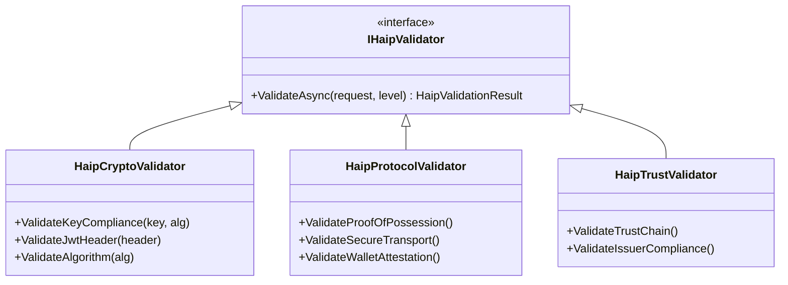

# HAIP Integration Guide

This document provides practical implementation guidance for integrating HAIP validation into your application. For conceptual understanding of HAIP levels and requirements, see [HAIP Deep Dive](haip-deep-dive.md).

## Quick Start

### 1. Add Package Reference

```xml
<PackageReference Include="SdJwt.Net.HAIP" Version="1.*" />
```

### 2. Configure Services

```csharp
using SdJwt.Net.HAIP;
using SdJwt.Net.HAIP.Validators;

services.AddSingleton<IHaipCryptoValidator>(sp =>
    new HaipCryptoValidator(
        requiredLevel: HaipLevel.Level1_High,
        logger: sp.GetRequiredService<ILogger<HaipCryptoValidator>>()
    )
);

services.AddSingleton<IHaipProtocolValidator>(sp =>
    new HaipProtocolValidator(
        requiredLevel: HaipLevel.Level1_High,
        logger: sp.GetRequiredService<ILogger<HaipProtocolValidator>>()
    )
);
```

### 3. Validate Incoming Tokens

```csharp
public class TokenValidationService
{
    private readonly IHaipCryptoValidator _cryptoValidator;
    
    public async Task<ValidationResult> ValidateAsync(string token, SecurityKey issuerKey)
    {
        // 1. Standard JWT validation
        var jwt = ParseAndValidateSignature(token, issuerKey);
        
        // 2. HAIP policy validation
        var haipResult = _cryptoValidator.ValidateKeyCompliance(
            issuerKey, 
            jwt.Header.Alg
        );
        
        if (!haipResult.IsCompliant)
        {
            return ValidationResult.Fail(haipResult.Violations);
        }
        
        return ValidationResult.Success(haipResult.AchievedLevel);
    }
}
```

## Validator Architecture

The HAIP framework uses a pluggable validator pattern:



## Combining Validators in a Policy Engine

For comprehensive validation, combine multiple validators:

```csharp
public class HaipPolicyEngine
{
    private readonly IHaipCryptoValidator _cryptoValidator;
    private readonly IHaipProtocolValidator _protocolValidator;
    private readonly ILogger<HaipPolicyEngine> _logger;
    
    public async Task<HaipComplianceResult> ValidateAsync(
        SecurityKey key,
        string algorithm,
        HaipLevel requiredLevel)
    {
        var aggregateResult = new HaipComplianceResult
        {
            AchievedLevel = requiredLevel
        };
        
        // Run crypto validation
        var cryptoResult = _cryptoValidator.ValidateKeyCompliance(key, algorithm);
        aggregateResult.MergeFrom(cryptoResult);
        
        // Run protocol validation if crypto passes
        if (cryptoResult.IsCompliant)
        {
            var protocolResult = await _protocolValidator.ValidateAsync(requiredLevel);
            aggregateResult.MergeFrom(protocolResult);
        }
        
        // Determine final achieved level
        aggregateResult.AchievedLevel = DetermineAchievedLevel(aggregateResult);
        aggregateResult.IsCompliant = aggregateResult.Violations.Count == 0;
        
        _logger.LogInformation(
            "HAIP validation completed. Compliant: {Compliant}, Level: {Level}",
            aggregateResult.IsCompliant,
            aggregateResult.AchievedLevel
        );
        
        return aggregateResult;
    }
    
    private HaipLevel DetermineAchievedLevel(HaipComplianceResult result)
    {
        // If any critical violations, achieved level is reduced
        var criticalViolations = result.Violations
            .Where(v => v.Severity == HaipSeverity.Critical)
            .ToList();
            
        if (criticalViolations.Any())
        {
            return HaipLevel.Level1_High; // Minimum level
        }
        
        return result.AchievedLevel;
    }
}
```

## ASP.NET Core Integration

### Middleware Approach

```csharp
public class HaipValidationMiddleware
{
    private readonly RequestDelegate _next;
    private readonly IHaipCryptoValidator _validator;
    private readonly HaipMiddlewareOptions _options;
    
    public HaipValidationMiddleware(
        RequestDelegate next,
        IHaipCryptoValidator validator,
        IOptions<HaipMiddlewareOptions> options)
    {
        _next = next;
        _validator = validator;
        _options = options.Value;
    }
    
    public async Task InvokeAsync(HttpContext context)
    {
        // Determine required level for this endpoint
        var requiredLevel = DetermineLevel(context);
        
        // Extract and validate token if present
        if (TryGetToken(context, out var token, out var key))
        {
            var result = _validator.ValidateKeyCompliance(key, token.Header.Alg);
            
            if (!result.IsCompliant)
            {
                await HandleViolationAsync(context, result);
                return;
            }
            
            // Store result for downstream use
            context.Items["HaipResult"] = result;
        }
        
        await _next(context);
    }
    
    private HaipLevel DetermineLevel(HttpContext context)
    {
        // Check endpoint-specific overrides
        var endpoint = context.GetEndpoint();
        var levelAttribute = endpoint?.Metadata.GetMetadata<HaipLevelAttribute>();
        
        if (levelAttribute != null)
            return levelAttribute.Level;
            
        // Check path-based rules
        foreach (var rule in _options.PathRules)
        {
            if (context.Request.Path.StartsWithSegments(rule.Path))
                return rule.Level;
        }
        
        return _options.DefaultLevel;
    }
}

// Usage in Startup/Program.cs
app.UseMiddleware<HaipValidationMiddleware>();
```

### Attribute-Based Approach

```csharp
[AttributeUsage(AttributeTargets.Class | AttributeTargets.Method)]
public class HaipLevelAttribute : Attribute
{
    public HaipLevel Level { get; }
    
    public HaipLevelAttribute(HaipLevel level)
    {
        Level = level;
    }
}

// Usage on controllers
[ApiController]
[Route("api/[controller]")]
public class FinancialController : ControllerBase
{
    [HttpPost("transfer")]
    [HaipLevel(HaipLevel.Level2_VeryHigh)]  // Requires Level 2
    public async Task<IActionResult> Transfer([FromBody] TransferRequest request)
    {
        // HAIP middleware will enforce Level 2 requirements
        // before this method is called
        return Ok();
    }
}
```

## Audit Trail Integration

HAIP generates audit trails that should be persisted for compliance:

```csharp
public class HaipAuditService
{
    private readonly IAuditStore _auditStore;
    
    public async Task RecordValidationAsync(
        string transactionId,
        HaipComplianceResult result,
        string userId)
    {
        var record = new HaipAuditRecord
        {
            TransactionId = transactionId,
            UserId = userId,
            Timestamp = DateTime.UtcNow,
            RequiredLevel = result.AchievedLevel,
            IsCompliant = result.IsCompliant,
            Violations = result.Violations.Select(v => new ViolationRecord
            {
                Type = v.Type.ToString(),
                Message = v.Message,
                Severity = v.Severity.ToString()
            }).ToList(),
            AuditSteps = result.AuditTrail.Steps.Select(s => new AuditStepRecord
            {
                Action = s.Action,
                Success = s.Success,
                Details = s.Details,
                Timestamp = s.Timestamp
            }).ToList()
        };
        
        await _auditStore.SaveAsync(record);
    }
}
```

## Testing HAIP Compliance

### Unit Testing Validators

```csharp
[Fact]
public void Level2_RejectsES256()
{
    // Arrange
    var validator = new HaipCryptoValidator(
        HaipLevel.Level2_VeryHigh,
        NullLogger<HaipCryptoValidator>.Instance
    );
    
    using var ecdsa = ECDsa.Create(ECCurve.NamedCurves.nistP256);
    var key = new ECDsaSecurityKey(ecdsa);
    
    // Act
    var result = validator.ValidateKeyCompliance(key, "ES256");
    
    // Assert
    Assert.False(result.IsCompliant);
    Assert.Contains(result.Violations, v => 
        v.Type == HaipViolationType.WeakCryptography);
}

[Fact]
public void Level2_AcceptsES384()
{
    // Arrange
    var validator = new HaipCryptoValidator(
        HaipLevel.Level2_VeryHigh,
        NullLogger<HaipCryptoValidator>.Instance
    );
    
    using var ecdsa = ECDsa.Create(ECCurve.NamedCurves.nistP384);
    var key = new ECDsaSecurityKey(ecdsa);
    
    // Act
    var result = validator.ValidateKeyCompliance(key, "ES384");
    
    // Assert
    Assert.True(result.IsCompliant);
    Assert.Empty(result.Violations);
}
```

### Integration Testing

```csharp
[Fact]
public async Task FinancialEndpoint_EnforcesLevel2()
{
    // Arrange
    await using var app = new WebApplicationFactory<Program>()
        .WithWebHostBuilder(builder =>
        {
            builder.ConfigureServices(services =>
            {
                services.AddSingleton<IHaipCryptoValidator>(
                    new HaipCryptoValidator(
                        HaipLevel.Level2_VeryHigh,
                        NullLogger<HaipCryptoValidator>.Instance
                    )
                );
            });
        });
    
    var client = app.CreateClient();
    
    // Create token with ES256 (not allowed at Level 2)
    var weakToken = CreateTokenWithAlgorithm("ES256");
    client.DefaultRequestHeaders.Authorization = 
        new AuthenticationHeaderValue("Bearer", weakToken);
    
    // Act
    var response = await client.PostAsync("/api/financial/transfer", null);
    
    // Assert
    Assert.Equal(HttpStatusCode.Forbidden, response.StatusCode);
}
```

## Configuration Reference

```csharp
public class HaipMiddlewareOptions
{
    /// <summary>
    /// Default HAIP level when no specific rule matches
    /// </summary>
    public HaipLevel DefaultLevel { get; set; } = HaipLevel.Level1_High;
    
    /// <summary>
    /// Path-based level overrides
    /// </summary>
    public List<PathLevelRule> PathRules { get; set; } = new();
    
    /// <summary>
    /// Whether to fail closed when HAIP validation fails
    /// </summary>
    public bool FailClosed { get; set; } = true;
    
    /// <summary>
    /// Callback when violations are detected
    /// </summary>
    public Action<HttpContext, HaipComplianceResult>? OnViolation { get; set; }
}

public class PathLevelRule
{
    public string Path { get; set; } = "";
    public HaipLevel Level { get; set; }
}
```

## Related Documentation

- [HAIP Deep Dive](haip-deep-dive.md) - Conceptual overview of HAIP levels and requirements
- [HaipCryptoValidator](../../src/SdJwt.Net.HAIP/Validators/HaipCryptoValidator.cs) - Source code
- [HaipProtocolValidator](../../src/SdJwt.Net.HAIP/Validators/HaipProtocolValidator.cs) - Source code
- [Sample Code](../../samples/SdJwt.Net.Samples/HAIP/) - Working examples
