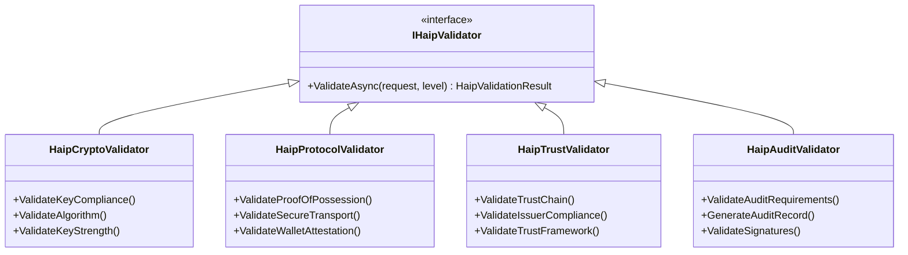

# High Assurance Interoperability Profile (HAIP) Compliance

## Overview

The High Assurance Interoperability Profile (HAIP) acts as a configurable policy and enforcement layer on top of the base SD-JWT and OpenID4VC protocols. It ensures that deployments meet the stringent cryptographic, transport, and trust requirements of highly regulated environments.

Rather than relying on developers to manually check every algorithm, signature, and trust chain in their business logic, HAIP intercepts requests at the protocol boundary and enforces a predefined security posture.

## The HAIP Policy Engine

HAIP implements a pluggable policy engine that validates incoming and outgoing requests against strict compliance requirements.

```csharp
public class HaipPolicyEngine
{
    private readonly IEnumerable<IHaipValidator> _validators;
    
    public async Task<HaipComplianceResult> ValidateAsync(
        object request, 
        HaipLevel requiredLevel)
    {
        var violations = new List<HaipViolation>();
        var auditSteps = new List<AuditStep>();
        
        foreach (var validator in _validators)
        {
            var result = await validator.ValidateAsync(request, requiredLevel);
            violations.AddRange(result.Violations);
            auditSteps.AddRange(result.AuditSteps);
        }
        
        return new HaipComplianceResult
        {
            IsCompliant = violations.Count == 0,
            AchievedLevel = CalculateAchievedLevel(violations),
            Violations = violations,
            AuditTrail = new HaipAuditTrail { Steps = auditSteps }
        };
    }
}
```

## Validator Architecture

The policy engine relies on a suite of specialized validators.



## Progressive Compliance Levels

HAIP defines three progressive levels of security assurance:

```csharp
public enum HaipLevel
{
    Level1_High,        // Education, standard business
    Level2_VeryHigh,    // Financial, healthcare
    Level3_Sovereign    // Government, critical infrastructure
}
```

### Level 1: High (e.g., Education, Standard Business)

* **Allowed Algorithms:** `ES256`, `ES384`, `PS256`, `PS384`, `EdDSA`
* **Minimum Key Size:** EC 256, RSA 2048
* **Requirements:** Proof of Possession, Secure Transport (TLS)

### Level 2: Very High (e.g., Financial, Healthcare)

* **Allowed Algorithms:** `ES384`, `ES512`, `PS384`, `PS512`, `EdDSA`
* **Minimum Key Size:** EC 384, RSA 3072
* **Requirements:** All Level 1, plus Wallet Attestation, DPoP, Pushed Authorization Requests (PAR)

### Level 3: Sovereign (e.g., Government, National ID)

* **Allowed Algorithms (current implementation):** `ES512`, `PS512`, `EdDSA`
* **Minimum Key Size:** EC 521, RSA 4096
* **Requirements:** All Level 2, plus Hardware Security Module (HSM) backing, Qualified Signatures, Enhanced Device Attestation

PQC note: support for post-quantum algorithm policy onboarding is a roadmap topic. It is not enabled as a default HAIP algorithm allow-list in the current implementation.

## Integrating HAIP

HAIP is designed for non-intrusive integration. Once configured in the Dependency Injection container, it enforces policies transparently across OID4VCI and OID4VP operations.

```csharp
// Global Policy Application
services.AddSdJwtEcosystem(config =>
{
    config.UseHaipProfile(HaipLevel.Level2_VeryHigh);
    
    // All OID4VCI / OID4VP operations now enforce Level 2 requirements:
    // - ES384+ algorithms only
    // - Wallet attestation required
    // - DPoP tokens required
    // - Enhanced audit logging
});
```
