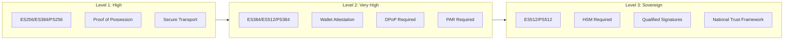
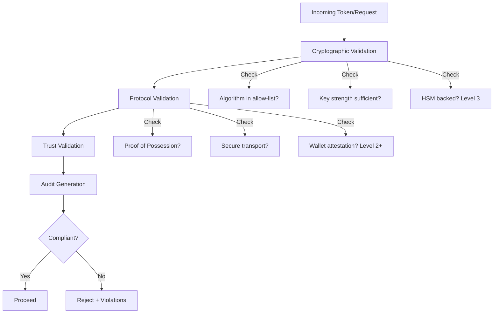

# HAIP Deep Dive

This document explains the High Assurance Interoperability Profile (HAIP): a policy framework that enforces cryptographic and operational security standards on top of SD-JWT and OpenID4VC protocols.

## Prerequisites

Before reading this document, you should understand:

| Prerequisite | Why Needed | Resource |
| --- | --- | --- |
| SD-JWT basics | HAIP validates SD-JWT tokens | [SD-JWT Deep Dive](sd-jwt-deep-dive.md) |
| OID4VCI/OID4VP | HAIP applies to these protocols | [OID4VCI](openid4vci-deep-dive.md), [OID4VP](openid4vp-deep-dive.md) |
| Cryptographic fundamentals | HAIP enforces algorithm policies | Basic understanding of signing algorithms |

## Glossary

| Term | Definition |
| --- | --- |
| **HAIP** | High Assurance Interoperability Profile - security policy framework |
| **Assurance Level** | Degree of confidence in identity verification and cryptographic strength |
| **Policy Gate** | Validation checkpoint that must pass before operation proceeds |
| **HSM** | Hardware Security Module - dedicated cryptographic hardware |
| **DPoP** | Demonstrating Proof of Possession - token binding mechanism |
| **Wallet Attestation** | Proof that wallet software meets security requirements |
| **eIDAS** | EU regulation on electronic identification |

## Why HAIP Exists

**Problem:** Two systems can both implement OID4VP correctly but have vastly different security postures:

| System A | System B |
| --- | --- |
| Uses ES256 with software keys | Uses ES512 with HSM |
| No wallet attestation | Requires wallet attestation |
| Basic TLS | mTLS + certificate pinning |

Both are "valid" implementations, but System B is clearly more secure for high-stakes use cases.

**Solution:** HAIP provides:

- Defined security levels (High, Very High, Sovereign)
- Algorithm allow-lists per level
- Key strength requirements per level
- Protocol security requirements per level
- Audit trail generation

## HAIP Levels Explained



### Level 1: High (Standard Enterprise)

**Use cases:** Education credentials, standard business workflows, corporate identity

| Requirement | Details |
| --- | --- |
| **Algorithms** | ES256, ES384, PS256, PS384, EdDSA |
| **Minimum EC curve** | P-256 (256 bits) |
| **Minimum RSA** | 2048 bits |
| **Proof of Possession** | Required |
| **Secure Transport** | TLS 1.2+ |

### Level 2: Very High (Regulated Sectors)

**Use cases:** Financial services, healthcare records, professional certifications

| Requirement | Details |
| --- | --- |
| **Algorithms** | ES384, ES512, PS384, PS512, EdDSA |
| **Minimum EC curve** | P-384 (384 bits) |
| **Minimum RSA** | 3072 bits |
| **Wallet Attestation** | Required |
| **DPoP** | Required for public clients |
| **PAR** | Pushed Authorization Requests required |

### Level 3: Sovereign (Critical Infrastructure)

**Use cases:** Government identity, national ID systems, critical infrastructure

| Requirement | Details |
| --- | --- |
| **Algorithms** | ES512, PS512, EdDSA |
| **Minimum EC curve** | P-521 (521 bits) |
| **Minimum RSA** | 4096 bits |
| **Hardware Security** | HSM required for key storage |
| **Qualified Signatures** | eIDAS qualified signatures |
| **Trust Framework** | National trust framework integration |

## What HAIP Validates



### 1. Cryptographic Validation

The `HaipCryptoValidator` checks:

- **Algorithm Compliance:** Is the signing algorithm in the allow-list for the required level?
- **Key Strength:** Does the key meet minimum bit requirements?
- **Hardware Security:** (Level 3) Is the key stored in an HSM?

### 2. Protocol Validation

The `HaipProtocolValidator` checks:

- **Proof of Possession:** Is the holder proving key control?
- **Transport Security:** Is communication properly secured?
- **Client Authentication:** Is the method appropriate for the level?
- **Wallet Attestation:** (Level 2+) Does the wallet prove its security properties?

### 3. Trust Validation

- **Issuer Trust Chain:** Is the issuer in a trusted framework?
- **Certificate Validation:** Are certificates valid and not revoked?

## Algorithm Reference

### Forbidden Algorithms (All Levels)

These algorithms are **never** allowed regardless of level:

| Algorithm | Why Forbidden |
| --- | --- |
| `none` | No signature - trivially forgeable |
| `HS256`, `HS384`, `HS512` | Symmetric - requires shared secrets |
| `RS256` | RSA with SHA-256 - deprecated for high assurance |
| `PS256` | Only allowed at Level 1 |

### Algorithm Matrix by Level

| Algorithm | Level 1 | Level 2 | Level 3 |
| --- | --- | --- | --- |
| ES256 | Allowed | Not Allowed | Not Allowed |
| ES384 | Allowed | Allowed | Not Allowed |
| ES512 | Allowed | Allowed | Allowed |
| PS256 | Allowed | Not Allowed | Not Allowed |
| PS384 | Allowed | Allowed | Not Allowed |
| PS512 | Allowed | Allowed | Allowed |
| EdDSA | Allowed | Allowed | Allowed |

## Code Example: Validating Compliance

```csharp
using SdJwt.Net.HAIP;
using SdJwt.Net.HAIP.Validators;
using Microsoft.Extensions.Logging;

// Create validator for Level 2 requirements
var cryptoValidator = new HaipCryptoValidator(
    requiredLevel: HaipLevel.Level2_VeryHigh,
    logger: loggerFactory.CreateLogger<HaipCryptoValidator>()
);

// Validate a signing key and algorithm
var result = cryptoValidator.ValidateKeyCompliance(
    key: signingKey,
    algorithm: "ES384"
);

if (result.IsCompliant)
{
    Console.WriteLine($"Compliant at level: {result.AchievedLevel}");
}
else
{
    Console.WriteLine("Violations found:");
    foreach (var violation in result.Violations)
    {
        Console.WriteLine($"  - [{violation.Severity}] {violation.Message}");
        Console.WriteLine($"    Recommendation: {violation.Recommendation}");
    }
}

// Access audit trail for logging/compliance
foreach (var step in result.AuditTrail.Steps)
{
    Console.WriteLine($"[{step.Timestamp}] {step.Action}: {step.Success}");
}
```

## Code Example: Validating JWT Header

```csharp
using System.IdentityModel.Tokens.Jwt;

// Parse incoming JWT
var handler = new JwtSecurityTokenHandler();
var jwt = handler.ReadJwtToken(incomingToken);

// Validate header against HAIP requirements
var headerResult = cryptoValidator.ValidateJwtHeader(jwt.Header);

if (!headerResult.IsCompliant)
{
    // Log violations and reject
    foreach (var v in headerResult.Violations)
    {
        logger.LogWarning("HAIP violation: {Message}", v.Message);
    }
    throw new SecurityException("Token does not meet HAIP requirements");
}
```

## Code Example: Protocol Validation

```csharp
using SdJwt.Net.HAIP.Validators;

var protocolValidator = new HaipProtocolValidator(
    requiredLevel: HaipLevel.Level2_VeryHigh,
    logger: protocolLogger
);

// Validate OID4VP request
var protocolResult = protocolValidator.ValidateVpRequest(
    request: authorizationRequest,
    options: new HaipProtocolValidationOptions
    {
        RequireSecureTransport = true,
        RequireWalletAttestation = true,
        RequireDPoP = true
    }
);

if (!protocolResult.IsCompliant)
{
    // Handle protocol-level violations
}
```

## Integration Patterns

### Per-Transaction Level Selection

Select HAIP level based on transaction risk:

```csharp
public HaipLevel DetermineRequiredLevel(TransactionContext context)
{
    return context switch
    {
        { Amount: > 10000 } => HaipLevel.Level2_VeryHigh,
        { SensitiveData: true } => HaipLevel.Level2_VeryHigh,
        { GovernmentContext: true } => HaipLevel.Level3_Sovereign,
        _ => HaipLevel.Level1_High
    };
}
```

### Middleware Integration

Apply HAIP as middleware in your pipeline:

```csharp
app.UseHaipValidation(options =>
{
    options.DefaultLevel = HaipLevel.Level1_High;
    options.LevelOverrides = new Dictionary<string, HaipLevel>
    {
        ["/api/financial/*"] = HaipLevel.Level2_VeryHigh,
        ["/api/government/*"] = HaipLevel.Level3_Sovereign
    };
    options.OnViolation = (context, result) =>
    {
        logger.LogWarning("HAIP violation on {Path}: {Violations}",
            context.Request.Path, result.Violations);
    };
});
```

## Implementation References

| Component | File | Description |
| --- | --- | --- |
| HAIP levels | [HaipTypes.cs](../../src/SdJwt.Net.HAIP/Models/HaipTypes.cs) | Level definitions |
| Compliance models | [HaipModels.cs](../../src/SdJwt.Net.HAIP/Models/HaipModels.cs) | Result structures |
| Crypto validator | [HaipCryptoValidator.cs](../../src/SdJwt.Net.HAIP/Validators/HaipCryptoValidator.cs) | Algorithm/key validation |
| Protocol validator | [HaipProtocolValidator.cs](../../src/SdJwt.Net.HAIP/Validators/HaipProtocolValidator.cs) | Protocol validation |
| Extensions | [HaipExtensions.cs](../../src/SdJwt.Net.HAIP/Extensions/HaipExtensions.cs) | Helper methods |
| Package overview | [README.md](../../src/SdJwt.Net.HAIP/README.md) | Quick start |
| Sample code | [HAIP Tutorial](../tutorials/advanced/02-haip-compliance.md) | Working examples |

## Beginner Pitfalls to Avoid

### 1. HAIP Does Not Replace Token Validation

**Wrong:** Using HAIP as the only validation.

**Right:** HAIP is a policy layer on top of standard validation.

```csharp
// WRONG - HAIP alone
var haipResult = haipValidator.Validate(token);
if (haipResult.IsCompliant) { Accept(); }

// RIGHT - standard validation + HAIP
var signatureValid = await VerifySignatureAsync(token);
var haipResult = haipValidator.Validate(token);
if (signatureValid && haipResult.IsCompliant) { Accept(); }
```

### 2. Single Global Level for All Operations

**Wrong:** Setting one HAIP level for entire application.

**Right:** Select level based on operation sensitivity.

```csharp
// WRONG - same level everywhere
services.AddHaip(HaipLevel.Level2_VeryHigh);

// RIGHT - context-aware levels
var level = transaction.IsHighValue
    ? HaipLevel.Level2_VeryHigh
    : HaipLevel.Level1_High;
```

### 3. Ignoring Audit Trail

**Wrong:** Only checking `IsCompliant` boolean.

**Right:** Persist audit trail for compliance evidence.

```csharp
// Always log/store audit trail
await auditStore.SaveAsync(new HaipAuditRecord
{
    TransactionId = context.TransactionId,
    Result = haipResult,
    AuditTrail = haipResult.AuditTrail,
    Timestamp = DateTime.UtcNow
});
```

### 4. Using Weak Algorithms and Expecting HAIP Override

HAIP will reject requests with forbidden algorithms. There is no override for blocked algorithms like `none`, `HS256`, or `RS256`.

## Frequently Asked Questions

### Q: What is the relationship between HAIP and eIDAS?

**A:** HAIP levels roughly correspond to eIDAS assurance levels:

- Level 1 (High) - eIDAS High
- Level 2 (Very High) - eIDAS High with additional requirements
- Level 3 (Sovereign) - Beyond eIDAS, for national systems

### Q: Can I use ES256 for Level 2?

**A:** No. Level 2 requires at least ES384 or equivalent strength. ES256 is only allowed at Level 1.

### Q: How do I prove HSM backing for Level 3?

**A:** The key must be a hardware-backed key with appropriate attestation. The `HaipCryptoValidator` checks for hardware key indicators in the security key metadata.

### Q: Does HAIP support post-quantum algorithms?

**A:** PQC algorithm policy is on the roadmap but not enabled in the current implementation. The framework is designed to accommodate new algorithms as they are standardized.

### Q: Should I always use Level 3?

**A:** No. Level 3 has significant operational overhead (HSM requirements, qualified signatures). Use the level appropriate for your use case risk profile.

## Related Concepts

- [HAIP Compliance](haip-compliance.md) - Implementation and integration details
- [OID4VCI Deep Dive](openid4vci-deep-dive.md) - Issuance with HAIP enforcement
- [OID4VP Deep Dive](openid4vp-deep-dive.md) - Presentation with HAIP enforcement
- [SD-JWT Deep Dive](sd-jwt-deep-dive.md) - Token format that HAIP validates
