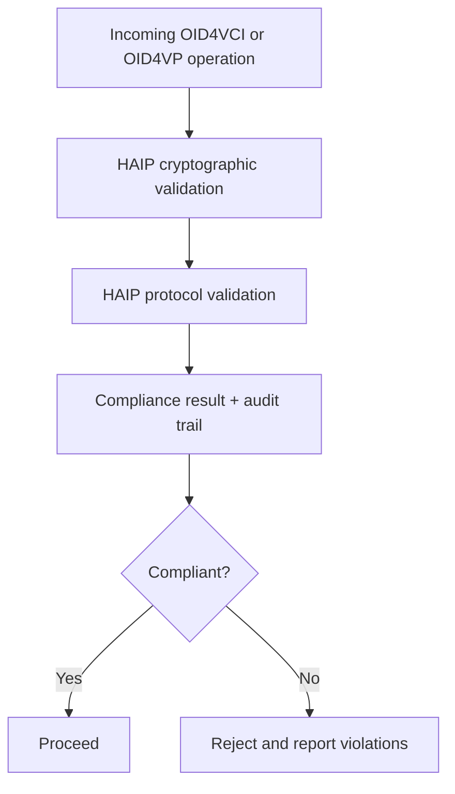

# HAIP Deep Dive

This document explains how HAIP (High Assurance Interoperability Profile) adds enforceable assurance policy on top of SD-JWT and OpenID4VC flows.

## Why HAIP Exists

Protocol conformance alone does not guarantee high assurance. Two systems can both be "valid" but enforce very different cryptographic and operational standards.

HAIP provides policy levels so issuers and verifiers can require stronger controls for sensitive use cases.

## HAIP Levels in This Repository

| Level | Typical use | Example crypto expectations |
| --- | --- | --- |
| `Level1_High` | enterprise or education-grade flows | ES256/ES384/PS256/PS384/EdDSA class |
| `Level2_VeryHigh` | regulated sectors like banking/healthcare | stronger algorithm and key-size profile |
| `Level3_Sovereign` | national or critical infrastructure | highest assurance profile including HSM expectations |

## What HAIP Validators Enforce

### 1. Cryptographic policy

`HaipCryptoValidator` checks:

- algorithm allow-list and forbidden algorithms
- key strength thresholds by level
- additional high-assurance constraints

### 2. Protocol policy

`HaipProtocolValidator` checks:

- transport security expectations
- proof-of-possession controls
- client authentication posture
- additional level-specific requirements

### 3. Compliance result and audit trail

Validation returns a `HaipComplianceResult` with:

- `IsCompliant`
- achieved level
- structured violations
- audit trail steps for diagnostics and reporting

## Integration Guidance for Beginners

- Treat HAIP as a policy gate, not a replacement for base token verification.
- Select required HAIP level per transaction risk, not as a single global default.
- Keep assurance policy and business policy separate, then combine for final decisions.
- Persist compliance outcomes where audit evidence is required.

## Implementation References

- HAIP levels/constants: [`src/SdJwt.Net.HAIP/Models/HaipTypes.cs`](../../src/SdJwt.Net.HAIP/Models/HaipTypes.cs)
- Compliance result models: [`src/SdJwt.Net.HAIP/Models/HaipModels.cs`](../../src/SdJwt.Net.HAIP/Models/HaipModels.cs)
- Crypto validator: [`src/SdJwt.Net.HAIP/Validators/HaipCryptoValidator.cs`](../../src/SdJwt.Net.HAIP/Validators/HaipCryptoValidator.cs)
- Protocol validator: [`src/SdJwt.Net.HAIP/Validators/HaipProtocolValidator.cs`](../../src/SdJwt.Net.HAIP/Validators/HaipProtocolValidator.cs)
- Extension helpers: [`src/SdJwt.Net.HAIP/Extensions/HaipExtensions.cs`](../../src/SdJwt.Net.HAIP/Extensions/HaipExtensions.cs)
- Package overview: [`src/SdJwt.Net.HAIP/README.md`](../../src/SdJwt.Net.HAIP/README.md)
- Samples: [`samples/SdJwt.Net.Samples/HAIP/README.md`](../../samples/SdJwt.Net.Samples/HAIP/README.md)

## Related Concepts

- [HAIP Compliance](haip-compliance.md)
- [OID4VCI Deep Dive](openid4vci-deep-dive.md)
- [OID4VP Deep Dive](openid4vp-deep-dive.md)
- [SD-JWT Deep Dive](sd-jwt-deep-dive.md)
