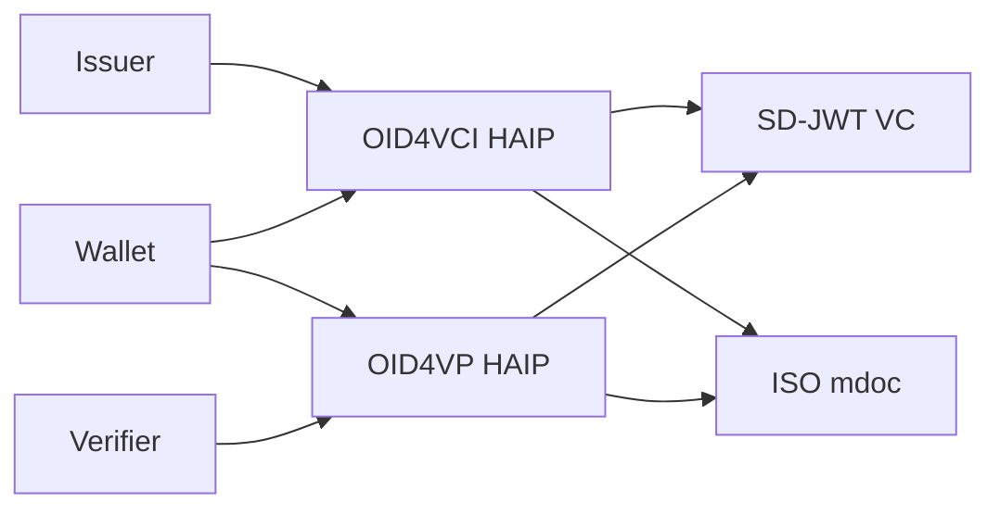

# HAIP

> **Level:** Advanced profile validation

## Simple explanation

HAIP (High Assurance Interoperability Profile) is a constrained profile on top of the OpenID4VC family of protocols. It narrows down the options: which credential formats are allowed, which cryptographic algorithms are required, and which protocol flows must be supported.

If the full OpenID4VC stack is a buffet, HAIP is a fixed menu that ensures high-assurance deployments are interoperable.

`SdJwt.Net.HAIP` validates that your issuance and presentation flows comply with the HAIP Final profile. It does not implement the protocols themselves; those live in `SdJwt.Net.Oid4Vci` and `SdJwt.Net.Oid4Vp`.

|                      |                                                                                                                                                                                                                               |
| -------------------- | ----------------------------------------------------------------------------------------------------------------------------------------------------------------------------------------------------------------------------- |
| **Audience**         | Security architects and developers implementing OpenID4VC high-assurance issuance and presentation flows.                                                                                                                     |
| **Purpose**          | Explain OpenID4VC High Assurance Interoperability Profile 1.0 Final as implemented by `SdJwt.Net.HAIP`: flow selection, credential profiles, cryptographic minimums, and package validation boundaries.                       |
| **Scope**            | OID4VCI, OID4VP redirect, W3C Digital Credentials API, SD-JWT VC, ISO mdoc, Token Status List, x5c, DPoP, attestation, and the package requirement catalog. Out of scope: jurisdiction-specific assurance ranking frameworks. |
| **Success criteria** | Reader can select a HAIP Final flow/profile combination, validate declared capabilities, and understand which parts are package-validated versus ecosystem policy.                                                            |

## Key correction

OpenID4VC HAIP 1.0 Final does **not** define Level 1, Level 2, or Level 3 conformance tiers. Earlier versions of `SdJwt.Net.HAIP` exposed those names as local policy helpers. They remain available for source compatibility, but new HAIP integrations should use the final flow/profile model:

- OID4VCI credential issuance
- OID4VP presentation via redirect
- OID4VP presentation via W3C Digital Credentials API
- SD-JWT VC credential profile using `dc+sd-jwt`
- ISO mdoc credential profile using `mso_mdoc`

## Why HAIP exists

Two products can both implement OpenID4VC and still fail to interoperate in high-assurance deployments if they make different choices for request signing, credential query syntax, holder binding, attestation, or credential formats. HAIP narrows those choices so issuers, wallets, and verifiers can rely on a shared high-assurance baseline.



## Flow requirements tracked by the package

`SdJwt.Net.HAIP` exposes `HaipRequirementCatalog` as a machine-readable list of supported HAIP Final checks.

| Flow/Profile | Representative requirements                                                                                                           |
| ------------ | ------------------------------------------------------------------------------------------------------------------------------------- |
| Common       | JOSE `ES256` validation support, SHA-256 digest support                                                                               |
| OID4VCI      | Authorization Code Flow, PKCE `S256`, PAR where Authorization Endpoint is used, DPoP, DPoP nonce, Wallet Attestation, Key Attestation |
| OID4VP       | DCQL, signed presentation request validation, verifier attestation validation where used                                              |
| DC API       | W3C Digital Credentials API support and DCQL                                                                                          |
| SD-JWT VC    | `dc+sd-jwt`, compact serialization, `cnf.jwk`, KB-JWT, `status.status_list`, x5c issuer key resolution                                |
| ISO mdoc     | `mso_mdoc`, COSE ES256 validation, device signature validation, x5chain trust validation where used                                   |

## Code example

```csharp
using SdJwt.Net.HAIP;
using SdJwt.Net.HAIP.Validators;

var options = new HaipProfileOptions();
options.Flows.Add(HaipFlow.Oid4VciIssuance);
options.Flows.Add(HaipFlow.Oid4VpRedirectPresentation);
options.CredentialProfiles.Add(HaipCredentialProfile.SdJwtVc);

options.SupportedCredentialFormats.Add(HaipConstants.SdJwtVcFormat);
options.SupportedJoseAlgorithms.Add(HaipConstants.RequiredJoseAlgorithm);
options.SupportedHashAlgorithms.Add(HaipConstants.RequiredHashAlgorithm);
options.SupportsAuthorizationCodeFlow = true;
options.EnforcesPkceS256 = true;
options.SupportsPushedAuthorizationRequests = true;
options.SupportsDpop = true;
options.SupportsDpopNonce = true;
options.ValidatesWalletAttestation = true;
options.ValidatesKeyAttestation = true;
options.SupportsDcql = true;
options.SupportsSignedPresentationRequests = true;
options.ValidatesVerifierAttestation = true;
options.SupportsSdJwtVcCompactSerialization = true;
options.UsesCnfJwkForSdJwtVcHolderBinding = true;
options.RequiresKbJwtForHolderBoundSdJwtVc = true;
options.SupportsStatusListClaim = true;
options.SupportsSdJwtVcIssuerX5c = true;

var result = new HaipProfileValidator().Validate(options);

if (!result.IsCompliant)
{
    foreach (var violation in result.Violations)
    {
        Console.WriteLine($"{violation.Description}: {violation.RecommendedAction}");
    }
}
```

## Requirement catalog

```csharp
foreach (var requirement in HaipRequirementCatalog.GetRequirements(options))
{
    Console.WriteLine($"{requirement.Id}: {requirement.Title} ({requirement.Status})");
}
```

The validator also stores applicable requirement IDs in `HaipComplianceResult.Metadata["applicable_requirements"]` so audit logs can show exactly which HAIP Final checks were in scope.

## Package boundaries

`HaipProfileValidator` validates declared capabilities and policy switches. It does not replace lower-level protocol and cryptographic verification:

- OID4VCI endpoints still need OAuth 2.0, PKCE, PAR, DPoP, nonce, and attestation verification in the issuance pipeline.
- OID4VP endpoints still need request-object validation, DCQL evaluation, nonce/audience checks, and VP token validation.
- SD-JWT VC presentations still need signature, disclosure digest, key binding, status, and x5c resolution checks.
- mdoc presentations still need COSE, device signature, doctype, namespace, and certificate-chain validation.

Use HAIP validation as a fail-closed policy gate around those concrete protocol validators.

## Legacy APIs

These APIs are package-local compatibility helpers, not HAIP Final concepts:

- `HaipLevel.Level1_High`
- `HaipLevel.Level2_VeryHigh`
- `HaipLevel.Level3_Sovereign`
- `HaipCryptoValidator` and `HaipProtocolValidator` constructors that take `HaipLevel`
- Level-specific algorithm and key-size constants

Do not use those names in new conformance claims. If your ecosystem needs a risk tier, define it as ecosystem policy and map it to HAIP Final flow/profile requirements explicitly.

## Related concepts

- [HAIP Integration Guide](haip-compliance.md)
- [OID4VCI](openid4vci.md)
- [OID4VP](openid4vp.md)
- [SD-JWT](sd-jwt.md)
- [mdoc](mdoc.md)
