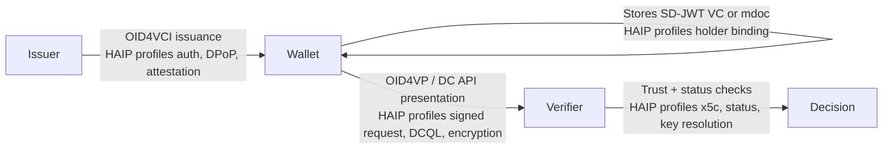

# HAIP: High Assurance Interoperability Profile

> **Level:** Intermediate concept + advanced profile validation

## Simple explanation

OpenID4VCI and OpenID4VP are flexible standards. That flexibility is useful, but it also means two products can both support OpenID4VC and still fail to work together in a high-assurance ecosystem.

HAIP fixes that problem by defining a stricter profile: which flows must be supported, which credential formats are allowed, which cryptographic protections are required, and how issuers, wallets, and verifiers should prove trust.

Think of OpenID4VC as the toolbox. HAIP is the approved configuration for high-assurance ecosystems.

In SD-JWT .NET, `SdJwt.Net.HAIP` does not run the full issuance or presentation protocol. Instead, it validates that your issuer, wallet, or verifier has declared the capabilities required for the HAIP Final flow/profile you selected.

## In one sentence

HAIP tells issuers, wallets, and verifiers which OpenID4VC features, credential formats, cryptographic protections, and trust mechanisms they must support to interoperate securely.

## What you will learn

- Why OpenID4VC alone is too flexible for high-assurance ecosystems
- What HAIP standardizes and what it leaves to ecosystem policy
- The two core security goals HAIP supports
- How `SdJwt.Net.HAIP` validates declared capabilities against HAIP Final flow/profile requirements
- What your application still must implement beyond HAIP profile validation

## Why HAIP exists

Base OpenID4VC specifications allow many valid implementation choices. In high-assurance ecosystems, too many choices create fragmentation and weak security.

Consider this fragmentation example:

- One wallet supports SD-JWT VC only
- Another wallet supports mdoc only
- One issuer requires PAR and DPoP
- Another issuer does not
- One verifier expects signed presentation requests
- Another verifier does not

All of these implementations may be individually valid under the base specifications, but the ecosystem fails because participants cannot interoperate reliably.

HAIP narrows those choices so that issuers, wallets, and verifiers can rely on a shared high-assurance baseline.

## Before and after HAIP

| Without HAIP                                                 | With HAIP                                                           |
| ------------------------------------------------------------ | ------------------------------------------------------------------- |
| Implementations choose different optional OpenID4VC features | Ecosystem agrees on required features                               |
| Credential formats may not match                             | SD-JWT VC and/or ISO mdoc profiles are explicitly selected          |
| Holder binding may be inconsistent                           | Key binding and presentation proof requirements are profiled        |
| Trust establishment is left to local design                  | X.509-based issuer/verifier/wallet trust patterns are profiled      |
| Security features may be optional                            | High-assurance security controls become required for selected flows |

## HAIP's two security goals

### 1. Authenticity of claims

The verifier needs confidence that the credential claims are genuine, were issued by a trusted issuer, have not been tampered with, and are still valid.

### 2. Holder authentication

The verifier needs confidence that the credential is being presented by the legitimate holder, not by someone who copied or replayed the credential.

HAIP supports these goals by profiling issuance security, holder binding, wallet attestation, key attestation, signed requests, response encryption, status checking, and issuer key resolution.

## Where HAIP fits in the credential lifecycle



HAIP does not replace OID4VCI or OID4VP. It constrains how those protocols are used in high-assurance deployments.

## What HAIP covers

HAIP profiles:

- OID4VCI issuance (authorization code flow, PKCE, PAR, DPoP, nonces, wallet attestation, key attestation)
- OID4VP presentation via redirect (signed requests, DCQL, verifier attestation)
- OID4VP presentation via W3C Digital Credentials API (DC API support, DCQL)
- SD-JWT VC credential profile (`dc+sd-jwt`, compact serialization, `cnf.jwk`, KB-JWT, status references, x5c issuer key resolution)
- ISO mdoc credential profile (`mso_mdoc`, COSE ES256, device signature, x5chain trust)
- Cryptographic algorithms (ES256, SHA-256 as minimum required support)
- Status-list usage where applicable

HAIP profiles the presence and handling of status-list references where required by the selected credential profile. Operational status-list lifecycle, caching policy, and failure behavior remain deployment responsibilities.

## What HAIP does not cover

HAIP does not by itself define:

- Your legal trust framework
- National onboarding rules
- Full eIDAS High LoA compliance (HAIP covers some, but not all, technical requirements for eIDAS "High")
- Which issuers are authorized for which credential types
- Root trust anchor distribution
- Offline BLE/NFC presentation
- Business policy or relying-party authorization

Trust management, including authorization of issuers, wallets, and verifiers, remains the responsibility of your ecosystem governance.

## HAIP flow/profile model

HAIP Final organizes its requirements around flow and credential profile combinations:

| Flow                         | What it means                                                 |
| ---------------------------- | ------------------------------------------------------------- |
| OID4VCI issuance             | Credential issuance from issuer to wallet                     |
| OID4VP redirect presentation | Wallet presents to verifier using redirect flow               |
| OID4VP DC API presentation   | Browser-mediated presentation through Digital Credentials API |

| Credential profile | What it means                                      |
| ------------------ | -------------------------------------------------- |
| SD-JWT VC          | JSON/JWT credential profile using `dc+sd-jwt`      |
| ISO mdoc           | CBOR/COSE mobile document profile using `mso_mdoc` |

Your deployment selects one or more flow/profile combinations and validates that all participants support the requirements for those combinations.

## How SD-JWT .NET supports HAIP

The HAIP profile spans multiple parts of the ecosystem. No single package implements everything.

| HAIP area                   | SD-JWT .NET package    | Responsibility                                                               |
| --------------------------- | ---------------------- | ---------------------------------------------------------------------------- |
| SD-JWT VC credential format | `SdJwt.Net.Vc`         | Credential payload, `dc+sd-jwt`, holder binding, status references           |
| ISO mdoc credential format  | `SdJwt.Net.Mdoc`       | CBOR/COSE mdoc structures and verification primitives                        |
| Issuance protocol           | `SdJwt.Net.Oid4Vci`    | OID4VCI request/response models and issuance flow support                    |
| Presentation protocol       | `SdJwt.Net.Oid4Vp`     | OID4VP request/response models, DC API support                               |
| Status checking             | `SdJwt.Net.StatusList` | Token Status List support                                                    |
| Profile validation          | `SdJwt.Net.HAIP`       | Validates selected HAIP flow/profile capability declarations                 |
| Trust governance            | Your ecosystem         | Trust anchors, certificate policies, onboarding, legal and operational rules |

## What `SdJwt.Net.HAIP` validates

`SdJwt.Net.HAIP` validates that your component has declared the capabilities required for a selected HAIP Final flow/profile combination. It exposes `HaipRequirementCatalog` as a machine-readable list of supported HAIP Final checks.

| Flow/Profile | Representative requirements                                                                                                           |
| ------------ | ------------------------------------------------------------------------------------------------------------------------------------- |
| Common       | JOSE `ES256` validation support, SHA-256 digest support                                                                               |
| OID4VCI      | Authorization Code Flow, PKCE `S256`, PAR where Authorization Endpoint is used, DPoP, DPoP nonce, Wallet Attestation, Key Attestation |
| OID4VP       | DCQL, signed presentation request validation, verifier attestation validation where used                                              |
| DC API       | W3C Digital Credentials API support and DCQL                                                                                          |
| SD-JWT VC    | `dc+sd-jwt`, compact serialization, `cnf.jwk`, KB-JWT, `status.status_list`, x5c issuer key resolution                                |
| ISO mdoc     | `mso_mdoc`, COSE ES256 validation, device signature validation, x5chain trust validation where used                                   |

Actual HAIP readiness depends on the concrete OID4VCI/OID4VP, SD-JWT VC, mdoc, trust, attestation, key management, and operational implementation, not only on passing `HaipProfileValidator`.

## What your application still must implement

`HaipProfileValidator` validates declared capabilities and policy switches. It does not replace lower-level protocol and cryptographic verification:

- OID4VCI endpoints still need OAuth 2.0, PKCE, PAR, DPoP, nonce, and attestation verification in the issuance pipeline
- OID4VP endpoints still need request-object validation, DCQL evaluation, nonce/audience checks, and VP token validation
- SD-JWT VC presentations still need signature, disclosure digest, key binding, status, and x5c resolution checks
- mdoc presentations still need COSE, device signature, doctype, namespace, and certificate-chain validation

Use HAIP validation as a fail-closed policy gate around those concrete protocol validators.

## Minimal example

```csharp
var options = new HaipProfileOptions();
options.Flows.Add(HaipFlow.Oid4VciIssuance);
options.CredentialProfiles.Add(HaipCredentialProfile.SdJwtVc);

var result = new HaipProfileValidator().Validate(options);
```

This example is intentionally incomplete. In a real service, you declare the capabilities your issuer, wallet, or verifier supports, then fail closed if the selected HAIP profile is not satisfied. For full configuration including all capability switches, see the [HAIP Integration Guide](haip-compliance.md).

## Common misunderstandings

| Misunderstanding                                        | Correction                                                                                                                               |
| ------------------------------------------------------- | ---------------------------------------------------------------------------------------------------------------------------------------- |
| HAIP replaces OID4VCI / OID4VP                          | HAIP profiles them; it does not implement issuance or presentation                                                                       |
| HAIP equals eIDAS High LoA                              | HAIP covers some technical requirements; full eIDAS High needs additional measures                                                       |
| HAIP defines Level 1 / 2 / 3 conformance tiers          | HAIP Final uses flow/profile combinations, not numbered levels                                                                           |
| `SdJwt.Net.HAIP` proves compliance                      | It validates declared package capabilities, not ecosystem certification                                                                  |
| HAIP handles all trust management                       | Trust governance (issuer authorization, root distribution, legal framework) remains ecosystem-specific                                   |
| Passing `HaipProfileValidator` means you are HAIP-ready | Actual readiness depends on concrete OID4VCI/OID4VP, SD-JWT VC, mdoc, trust, attestation, key management, and operational implementation |

## Legacy APIs

Earlier versions of `SdJwt.Net.HAIP` exposed numbered level names as local policy helpers. These remain available for source compatibility, but new HAIP integrations should use the final flow/profile model:

- `HaipLevel.Level1_High`, `HaipLevel.Level2_VeryHigh`, `HaipLevel.Level3_Sovereign`
- `HaipCryptoValidator` and `HaipProtocolValidator` constructors that take `HaipLevel`
- Level-specific algorithm and key-size constants

The current API name `HaipComplianceResult` is retained for compatibility. In documentation, treat it as a profile validation result, not a certification result.

Do not use level names in new conformance claims. If your ecosystem needs a risk tier, define it as ecosystem policy and map it to HAIP Final flow/profile requirements explicitly.

## Related concepts

- [HAIP Integration Guide](haip-compliance.md) - Full configuration, requirement catalog usage, and startup validation
- [OID4VCI](openid4vci.md) - Issuance protocol profiled by HAIP
- [OID4VP](openid4vp.md) - Presentation protocol profiled by HAIP
- [SD-JWT](sd-jwt.md) - Core token format
- [mdoc](mdoc.md) - Mobile document format profiled by HAIP
- [DC API](dc-api.md) - Browser credential API profiled by HAIP
- [EUDIW](eudiw.md) - Regional reference infrastructure using HAIP
