# Concepts & Architecture

## Audience & Purpose

|              |                                                                                        |
| ------------ | -------------------------------------------------------------------------------------- |
| **Audience** | Developers, architects, and security engineers working with the SD-JWT .NET ecosystem  |
| **Purpose**  | Understand the architecture, design decisions, and technical details of each component |
| **Scope**    | All implemented packages and their interactions                                        |
| **Success**  | Reader understands how components fit together and can make informed design decisions  |

---

## Reading Order

Start with the ecosystem architecture, then dive into the specific area you need.

### 1. Ecosystem Overview

| Document                                                            | Topic                                                 | Read Time |
| ------------------------------------------------------------------- | ----------------------------------------------------- | --------- |
| [What This Project Is](what-this-project-is.md)                     | Ecosystem boundary and terminology                    | 10 min    |
| [Ecosystem Architecture](ecosystem-architecture.md)                 | Master architecture, package map, deployment patterns | 20 min    |
| [Selective Disclosure Mechanics](selective-disclosure-mechanics.md) | How salts, hashes, and key binding work               | 10 min    |

### 2. Core Credential Formats

| Document                                           | Topic                                                       | Read Time |
| -------------------------------------------------- | ----------------------------------------------------------- | --------- |
| [SD-JWT](sd-jwt.md)                                | RFC 9901 token format, issuance, presentation, verification | 25 min    |
| [Verifiable Credential](verifiable-credentials.md) | SD-JWT VC profile, claims, lifecycle                        | 15 min    |
| [W3C VCDM](w3c-vcdm.md)                            | W3C Verifiable Credentials Data Model 2.0                   | 15 min    |
| [mdoc](mdoc.md)                                    | ISO 18013-5 CBOR/COSE structures, mDL                       | 20 min    |

### 3. Protocols

| Document                                          | Topic                        | Read Time |
| ------------------------------------------------- | ---------------------------- | --------- |
| [OpenID4VCI](openid4vci.md)                       | Credential issuance protocol | 20 min    |
| [OpenID4VP](openid4vp.md)                         | Presentation protocol        | 20 min    |
| [Presentation Exchange](presentation-exchange.md) | DIF PEX query language       | 15 min    |
| [DC API](dc-api.md)                               | W3C Digital Credentials API  | 15 min    |

### 4. Trust, Status & Assurance Profiles

| Document                                            | Topic                                   | Read Time |
| --------------------------------------------------- | --------------------------------------- | --------- |
| [Status List](status-list.md)                       | Revocation, suspension, status checking | 15 min    |
| [HAIP](haip.md)                                     | High Assurance Interoperability Profile | 15 min    |
| [HAIP Profile Validation Guide](haip-compliance.md) | Integration guide and policy engine     | 15 min    |

### 5. Reference Infrastructure

| Document            | Topic                                        | Read Time |
| ------------------- | -------------------------------------------- | --------- |
| [Wallet](wallet.md) | Generic wallet architecture and plugin model | 20 min    |
| [EUDIW](eudiw.md)   | EUDIW / ARF reference infrastructure         | 20 min    |

### 6. Preview Trust Extensions (Agent Trust)

| Document                                             | Topic                                     | Read Time |
| ---------------------------------------------------- | ----------------------------------------- | --------- |
| [Agent Trust Profile](agent-trust-profile.md)        | Capability tokens, threat model, concepts | 15 min    |
| [Agent Trust Kits](agent-trust-kits.md)              | Package map and architecture overview     | 15 min    |
| [MCP Trust Interceptor](agent-trust-mcp.md)          | MCP client/server trust guard             | 10 min    |
| [ASP.NET Core Middleware](agent-trust-aspnetcore.md) | Inbound HTTP verification                 | 5 min     |
| [Agent-to-Agent Delegation](agent-trust-a2a.md)      | Delegation chains and bounded authority   | 10 min    |
| [Agent Trust Operations](agent-trust-ops.md)         | Deployment, telemetry, nonce, key custody | 10 min    |
| [Agent Trust Governance](agent-trust-governance.md)  | OWASP, EU AI Act, NIST AI RMF mapping     | 5 min     |

---

## Architecture at a Glance

```mermaid
graph TB
    subgraph Application["Application Layer"]
        Issuer["Issuer Service"]
        Verifier["Verifier Service"]
        WalletApp["Wallet App"]
        AgentRuntime["Agent Runtime"]
    end

    subgraph Protocol["Protocol Layer"]
        OID4VCI["SdJwt.Net.Oid4Vci"]
        OID4VP["SdJwt.Net.Oid4Vp"]
        PEX["SdJwt.Net.PresentationExchange"]
        Fed["SdJwt.Net.OidFederation"]
    end

    subgraph Assurance["Assurance & Regional Layer"]
        HAIP["SdJwt.Net.HAIP"]
        Eudiw["SdJwt.Net.Eudiw"]
    end

    subgraph Core["Core Layer"]
        SdJwt["SdJwt.Net (RFC 9901)"]
        Vc["SdJwt.Net.Vc"]
        Status["SdJwt.Net.StatusList"]
        Mdoc["SdJwt.Net.Mdoc"]
        Wallet["SdJwt.Net.Wallet"]
    end

    subgraph AgentTrust["Agent Trust Layer"]
        ATCore["AgentTrust.Core"]
        ATPolicy["AgentTrust.Policy"]
        ATAsp["AgentTrust.AspNetCore"]
        ATMaf["AgentTrust.Maf"]
        ATOTel["AgentTrust.OpenTelemetry"]
        ATOpa["AgentTrust.Policy.Opa"]
        ATMcp["AgentTrust.Mcp"]
        ATA2A["AgentTrust.A2A"]
    end

    Issuer --> OID4VCI
    Verifier --> OID4VP
    Verifier --> PEX
    WalletApp --> Wallet
    AgentRuntime --> ATMaf

    OID4VCI --> HAIP
    OID4VP --> HAIP
    Fed --> HAIP

    HAIP --> SdJwt
    HAIP --> Vc
    HAIP --> Status
    HAIP --> Mdoc
    Eudiw --> Mdoc
    Eudiw --> Vc
    Wallet --> SdJwt
    Wallet --> Mdoc

    ATCore --> SdJwt
    ATPolicy --> ATCore
    ATAsp --> ATCore
    ATMaf --> ATCore
    ATOTel --> ATCore
    ATOpa --> ATPolicy
    ATMcp --> ATCore
    ATA2A --> ATCore

    style HAIP fill:#d62828,color:#fff
    style SdJwt fill:#1b4332,color:#fff
    style Mdoc fill:#2a6478,color:#fff
    style ATCore fill:#7b2d8e,color:#fff
```

---

## Related concepts

- [Capability Matrix](../project/capabilities.md) - Feature coverage at a glance
- [Tutorials](../tutorials/index.md) - Hands-on learning path
- [How-To Guides](../guides/issuing-credentials.md) - Task-oriented implementation
- [Reference Patterns](../reference-patterns/index.md) - Industry reference patterns
