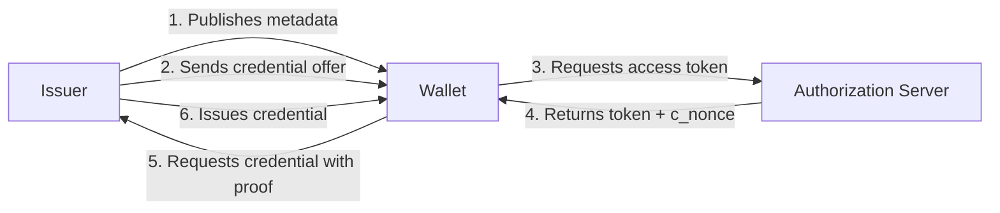
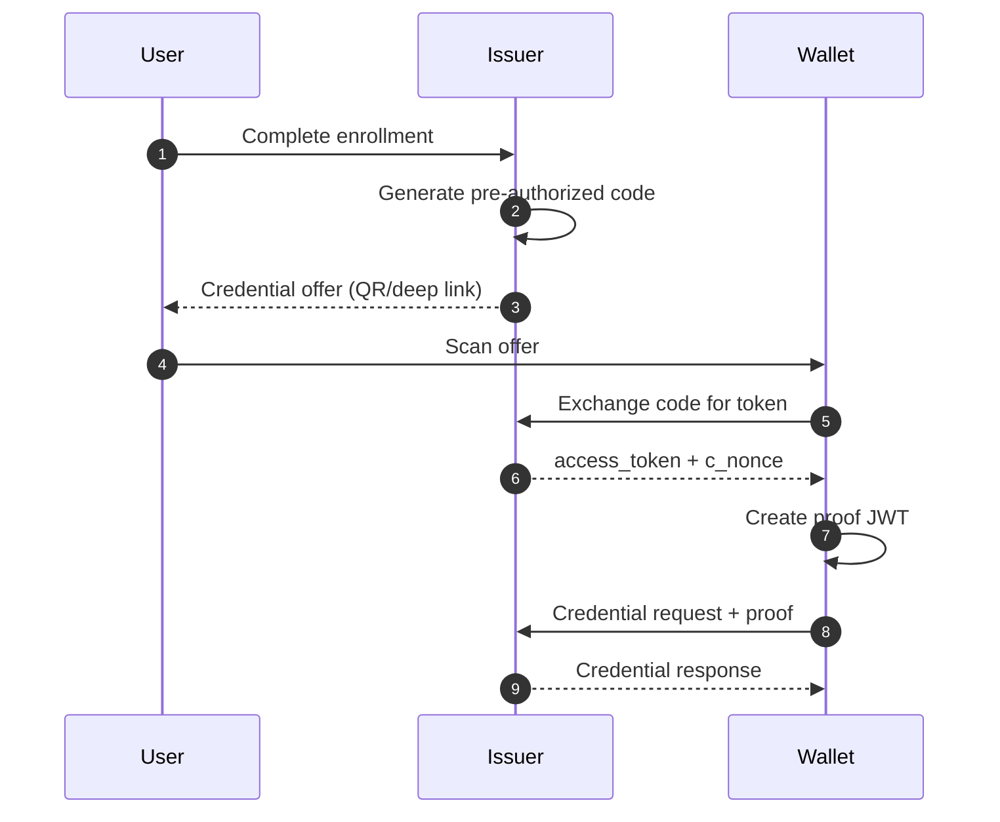
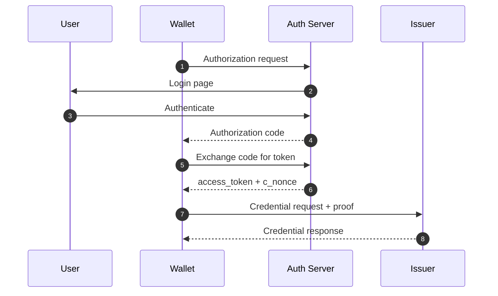

# OID4VCI Deep Dive

This document explains OpenID for Verifiable Credential Issuance (OID4VCI): the protocol that enables wallets to obtain credentials from issuers in a standardized, interoperable way.

## Prerequisites

Before reading this document, you should understand:

| Prerequisite | Why Needed | Resource |
| --- | --- | --- |
| SD-JWT basics | OID4VCI issues SD-JWT credentials | [SD-JWT Deep Dive](sd-jwt-deep-dive.md) |
| Verifiable Credentials | Issued credentials are SD-JWT VCs | [VC Deep Dive](verifiable-credential-deep-dive.md) |

## Glossary

| Term | Definition |
| --- | --- |
| **Credential Issuer** | Entity that creates and signs credentials (university, DMV, employer) |
| **Wallet** | Application that requests and stores credentials for the Holder |
| **Authorization Server** | Issues access tokens that grant permission to request credentials |
| **Credential Offer** | Message from Issuer containing available credentials and grant parameters |
| **c_nonce** | Challenge nonce issued by Issuer for proof of possession |
| **Proof JWT** | JWT signed by Holder's key proving they control the binding key |
| **Pre-authorized Code** | Grant type where Issuer pre-approves credential issuance |
| **Deferred Issuance** | Pattern where credential is issued later via polling |

## Why OID4VCI Exists

**Problem:** A university wants to issue digital diplomas. A bank wants to issue identity credentials. How does a Wallet:

1. Discover what credentials an Issuer offers?
2. Prove they are authorized to receive a credential?
3. Prove they control the key that will be bound to the credential?

**Solution:** OID4VCI provides:

- Standardized issuer metadata discovery
- OAuth 2.0-based authorization flows
- Proof of possession mechanism via proof JWTs
- Support for immediate and deferred issuance

## Roles in the Issuance Flow



| Role | Responsibility |
| --- | --- |
| **Issuer** | Defines credential types, validates proofs, signs credentials |
| **Wallet** | Discovers issuers, requests credentials, stores issued credentials |
| **Authorization Server** | Authenticates users, issues access tokens, provides c_nonce |

## Core Artifacts

| Artifact | Purpose | Example |
| --- | --- | --- |
| `CredentialOffer` | Entry point listing available credentials | QR code or deep link |
| Access Token | Grants permission to request credentials | Bearer token |
| `c_nonce` | Challenge for proof of possession | Random string from token response |
| `CredentialRequest` | Wallet request with format and proof | POST to /credential endpoint |
| Proof JWT | Proves Holder controls binding key | JWT with c_nonce and audience |
| `CredentialResponse` | Issued credential or deferred token | SD-JWT VC or acceptance_token |

## Grant Patterns

### Pre-authorized Code Flow

The Issuer pre-approves credential issuance. Most common for scenarios where the user has already been authenticated elsewhere.



**Credential Offer Example:**

```json
{
  "credential_issuer": "https://university.example.edu",
  "credential_configuration_ids": ["UniversityDegree_SDJWT"],
  "grants": {
    "urn:ietf:params:oauth:grant-type:pre-authorized_code": {
      "pre-authorized_code": "SplxlOBeZQQYbYS6WxSbIA",
      "tx_code": {
        "input_mode": "numeric",
        "length": 6,
        "description": "Enter the PIN sent to your email"
      }
    }
  }
}
```

### Authorization Code Flow

Standard OAuth 2.0 flow where the user authenticates with the Authorization Server.



## Proof of Possession

The Holder must prove they control the key that will be bound to the credential. This is done via a **Proof JWT**.

### Proof JWT Structure

**Header:**

```json
{
  "typ": "openid4vci-proof+jwt",
  "alg": "ES256",
  "jwk": {
    "kty": "EC",
    "crv": "P-256",
    "x": "...",
    "y": "..."
  }
}
```

**Payload:**

```json
{
  "iss": "did:example:holder123",
  "aud": "https://university.example.edu",
  "nonce": "tZignsnFbp",
  "iat": 1701234567
}
```

| Claim | Required | Purpose |
| --- | --- | --- |
| `iss` | Optional | Holder's identifier (DID or client_id) |
| `aud` | Yes | Issuer's credential_issuer URL |
| `nonce` | Yes | c_nonce from token response |
| `iat` | Yes | Token issuance time |

### Proof Validation Rules

1. **Type check:** Header `typ` must be `openid4vci-proof+jwt`
2. **Algorithm check:** `alg` must be supported by Issuer
3. **Nonce check:** `nonce` must match current valid c_nonce
4. **Audience check:** `aud` must match Issuer's credential_issuer URL
5. **Freshness check:** `iat` must be within acceptable window
6. **Signature check:** Signature must be valid for the key in `jwk` or resolved from `kid`

## Code Example: Requesting a Credential

### Wallet Side - Building a Credential Request

```csharp
using SdJwt.Net.Oid4Vci.Models;
using Microsoft.IdentityModel.Tokens;
using System.IdentityModel.Tokens.Jwt;

// 1. Parse the credential offer
var offer = JsonSerializer.Deserialize<CredentialOffer>(offerJson);

// 2. Exchange pre-authorized code for access token
var tokenResponse = await ExchangePreAuthCodeAsync(
    offer.CredentialIssuer,
    preAuthorizedCode: offer.GetPreAuthorizedCodeGrant()?.PreAuthorizedCode,
    txCode: userEnteredPin
);

// 3. Create proof JWT
var proofJwt = CreateProofJwt(
    holderPrivateKey,
    audience: offer.CredentialIssuer,
    nonce: tokenResponse.CNonce
);

// 4. Build credential request
var request = new CredentialRequest
{
    Format = Oid4VciConstants.SdJwtVcFormat,  // "dc+sd-jwt"
    Vct = "https://credentials.university.example.edu/degree",
    Proof = new CredentialProof
    {
        ProofType = Oid4VciConstants.ProofTypes.Jwt,
        Jwt = proofJwt
    }
};

// 5. Send request
var credential = await RequestCredentialAsync(
    credentialEndpoint: $"{offer.CredentialIssuer}/credential",
    accessToken: tokenResponse.AccessToken,
    request: request
);
```

### Creating the Proof JWT

```csharp
private string CreateProofJwt(
    SecurityKey holderKey,
    string audience,
    string nonce)
{
    var holderJwk = JsonWebKeyConverter.ConvertFromSecurityKey(holderKey);
    
    var header = new JwtHeader(
        new SigningCredentials(holderKey, SecurityAlgorithms.EcdsaSha256))
    {
        ["typ"] = "openid4vci-proof+jwt",
        ["jwk"] = new Dictionary<string, object>
        {
            ["kty"] = holderJwk.Kty,
            ["crv"] = holderJwk.Crv,
            ["x"] = holderJwk.X,
            ["y"] = holderJwk.Y
        }
    };
    
    var payload = new JwtPayload
    {
        { "aud", audience },
        { "nonce", nonce },
        { "iat", DateTimeOffset.UtcNow.ToUnixTimeSeconds() }
    };
    
    var token = new JwtSecurityToken(header, payload);
    return new JwtSecurityTokenHandler().WriteToken(token);
}
```

## Code Example: Issuing a Credential

### Issuer Side - Validating Request and Issuing

```csharp
using SdJwt.Net.Oid4Vci.Issuer;
using SdJwt.Net.Vc.Issuer;
using SdJwt.Net.Vc.Models;

// 1. Validate the proof JWT
var proofValidator = new CNonceValidator(
    validNonces: nonceStore,
    expectedAudience: "https://university.example.edu"
);

var proofResult = await proofValidator.ValidateAsync(
    request.Proof.Jwt,
    freshnessWindow: TimeSpan.FromMinutes(5)
);

if (!proofResult.IsValid)
{
    return BadRequest(new { error = "invalid_proof" });
}

// 2. Extract holder's public key from proof
var holderPublicKey = proofResult.HolderKey;

// 3. Build the credential payload
var payload = new SdJwtVcPayload
{
    Issuer = "https://university.example.edu",
    Subject = "did:example:student123",
    IssuedAt = DateTimeOffset.UtcNow.ToUnixTimeSeconds(),
    ExpiresAt = DateTimeOffset.UtcNow.AddYears(10).ToUnixTimeSeconds(),
    AdditionalData = new Dictionary<string, object>
    {
        ["student_name"] = "Alice Smith",
        ["degree"] = "Bachelor of Science",
        ["major"] = "Computer Science",
        ["graduation_date"] = "2024-05-15",
        ["gpa"] = 3.85
    }
};

// 4. Issue with selective disclosure options
var vcIssuer = new SdJwtVcIssuer(issuerSigningKey, SecurityAlgorithms.EcdsaSha256);

var options = new SdIssuanceOptions
{
    DisclosureStructure = new
    {
        student_name = true,    // Selectively disclosable
        degree = false,         // Always visible
        major = true,           // Selectively disclosable
        graduation_date = false,// Always visible  
        gpa = true              // Selectively disclosable
    }
};

var result = vcIssuer.Issue(
    vct: "https://credentials.university.example.edu/degree",
    payload: payload,
    options: options,
    holderPublicKey: holderPublicKey
);

// 5. Return credential response
return Ok(new CredentialResponse
{
    Format = Oid4VciConstants.SdJwtVcFormat,
    Credential = result.Issuance,
    CNonce = GenerateNewNonce(),
    CNonceExpiresIn = 300
});
```

## Deferred Issuance

When credential issuance takes time (e.g., background checks), the Issuer returns an `acceptance_token` instead of the credential.

```json
{
  "acceptance_token": "eyJhbG....",
  "c_nonce": "fGFF7UkhLA"
}
```

The Wallet polls the deferred credential endpoint:

```csharp
// Poll for credential
var deferredResponse = await PollDeferredCredentialAsync(
    deferredEndpoint: $"{issuer}/deferred-credential",
    accessToken: tokenResponse.AccessToken,
    acceptanceToken: initialResponse.AcceptanceToken
);

if (deferredResponse.Credential != null)
{
    // Credential is ready
    await StoreCredential(deferredResponse.Credential);
}
else
{
    // Still processing - retry later
    await Task.Delay(TimeSpan.FromSeconds(deferredResponse.Interval ?? 5));
}
```

## Implementation References

| Component | File | Description |
| --- | --- | --- |
| Constants | [Oid4VciConstants.cs](../../src/SdJwt.Net.Oid4Vci/Models/Oid4VciConstants.cs) | Protocol constants |
| Credential offer | [CredentialOffer.cs](../../src/SdJwt.Net.Oid4Vci/Models/CredentialOffer.cs) | Offer model |
| Credential request | [CredentialRequest.cs](../../src/SdJwt.Net.Oid4Vci/Models/CredentialRequest.cs) | Request model |
| Credential response | [CredentialResponse.cs](../../src/SdJwt.Net.Oid4Vci/Models/CredentialResponse.cs) | Response model |
| Token response | [TokenResponse.cs](../../src/SdJwt.Net.Oid4Vci/Models/TokenResponse.cs) | Token exchange model |
| Nonce validator | [CNonceValidator.cs](../../src/SdJwt.Net.Oid4Vci/Issuer/CNonceValidator.cs) | Proof validation |
| Package overview | [README.md](../../src/SdJwt.Net.Oid4Vci/README.md) | Quick start |
| Sample code | [OpenId4VciExample.cs](../../samples/SdJwt.Net.Samples/Standards/OpenId/OpenId4VciExample.cs) | Working examples |

## Beginner Pitfalls to Avoid

### 1. Reusing c_nonce Values

**Wrong:** Accepting the same c_nonce multiple times.

**Right:** Each c_nonce should be single-use and tracked server-side.

```csharp
// Track nonce usage
if (await nonceStore.IsUsedAsync(proof.Nonce))
{
    return BadRequest(new { error = "invalid_proof", error_description = "nonce already used" });
}
await nonceStore.MarkUsedAsync(proof.Nonce);
```

### 2. Ignoring Proof Audience Validation

**Wrong:** Only checking the nonce in the proof JWT.

**Right:** Validate that `aud` matches your credential_issuer URL.

```csharp
// WRONG
if (proof.Nonce == expectedNonce) { /* proceed */ }

// RIGHT
if (proof.Nonce == expectedNonce && proof.Aud == "https://my-issuer.example.com") { /* proceed */ }
```

### 3. Missing tx_code Validation for Pre-authorized Flow

When `tx_code` is specified in the offer, the Wallet must send the user-entered code.

```csharp
// Validate tx_code if required
var grant = offer.GetPreAuthorizedCodeGrant();
if (grant?.TransactionCode != null)
{
    if (string.IsNullOrEmpty(userProvidedTxCode))
    {
        return BadRequest("Transaction code required");
    }
    if (!ValidateTxCode(userProvidedTxCode, grant.TransactionCode))
    {
        return BadRequest("Invalid transaction code");
    }
}
```

### 4. Mixing credential_definition and credential_identifier

These fields are mutually exclusive in the credential request.

```csharp
// WRONG
var request = new CredentialRequest
{
    CredentialDefinition = new { ... },
    CredentialIdentifier = "UniversityDegree_SDJWT"  // Cannot have both!
};

// RIGHT - use one or the other
var request = new CredentialRequest
{
    CredentialIdentifier = "UniversityDegree_SDJWT"
};
```

## Frequently Asked Questions

### Q: What is the difference between OID4VCI and OID4VP?

**A:** OID4VCI is for credential **issuance** (Issuer to Wallet). OID4VP is for credential **presentation** (Wallet to Verifier). They are complementary protocols in the credential lifecycle.

### Q: When should I use pre-authorized vs authorization code flow?

**A:**

- **Pre-authorized:** User has already been authenticated elsewhere (e.g., completed registration, in-person verification)
- **Authorization code:** User needs to authenticate with the Authorization Server as part of the issuance flow

### Q: Can I issue multiple credentials in one request?

**A:** Yes, use the batch credential endpoint. The Wallet sends multiple proof JWTs and receives multiple credentials.

### Q: Why does the Issuer send a new c_nonce in the credential response?

**A:** This allows the Wallet to immediately request another credential without a new token exchange. The new c_nonce is valid for subsequent requests using the same access token.

### Q: How do I handle credential format compatibility?

**A:** Check the Issuer's metadata for `credential_configurations_supported` to see available formats. Use `dc+sd-jwt` for new implementations; `vc+sd-jwt` is legacy.

## Related Concepts

- [Verifiable Credential Deep Dive](verifiable-credential-deep-dive.md) - Structure of issued credentials
- [OID4VP Deep Dive](openid4vp-deep-dive.md) - Presenting credentials after issuance
- [SD-JWT Deep Dive](sd-jwt-deep-dive.md) - Base selective disclosure format
