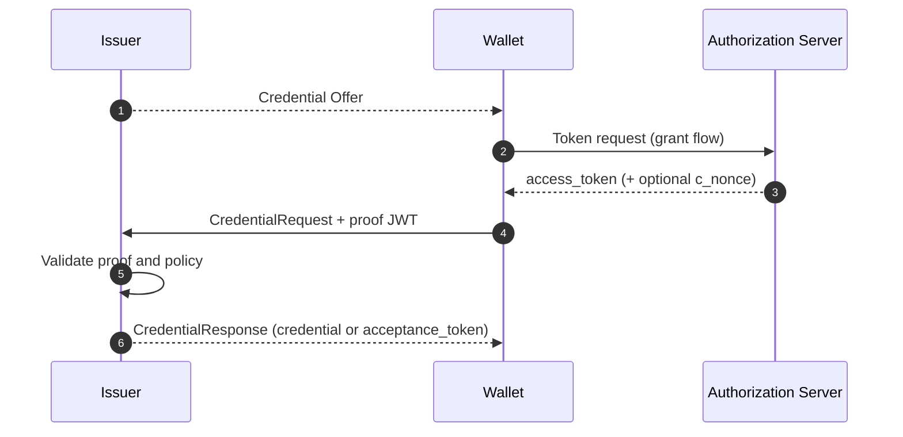

# OID4VCI Deep Dive

This document explains OpenID for Verifiable Credential Issuance (OID4VCI) in beginner terms and links each concept to repository implementations.

## Why OID4VCI Exists

SD-JWT VC defines what a credential looks like. OID4VCI defines how a wallet obtains that credential from an issuer in an interoperable way.

Without this layer, each issuer-wallet pair would need custom issuance APIs.

## Roles in the Issuance Flow

- Issuer: defines credential configurations and issues credentials.
- Wallet: requests credentials and proves key possession.
- Authorization Server: issues access tokens for credential requests (deployment-dependent).

## Core Artifacts

| Artifact | Purpose |
| --- | --- |
| `CredentialOffer` | Entry artifact listing issuer and credential configuration identifiers |
| Token response (`access_token`, `c_nonce`) | Grants wallet access and challenge material |
| `CredentialRequest` | Wallet request specifying format and proof data |
| Proof JWT | Holder key proof bound to issuer audience and `c_nonce` |
| `CredentialResponse` | Issued credential or deferred `acceptance_token` |

## Supported Grant Patterns

This repository models common OID4VCI grant paths:

- Pre-authorized code flow
- Authorization code flow
- Deferred issuance responses

## How the Flow Works

### 1. Offer and discovery

Issuer provides a credential offer (often QR or deep link) with credential configuration IDs.

### 2. Access token and challenge

Wallet obtains an access token and may receive `c_nonce` + expiration.

### 3. Credential request and proof

Wallet sends `CredentialRequest` including format (`dc+sd-jwt`) and proof JWT.

### 4. Issuance response

Issuer validates proof, policy, and authorization, then returns:

- immediate credential, or
- deferred `acceptance_token` for later retrieval

## Security Notes for Beginners

- Proof JWT should use `typ=openid4vci-proof+jwt` and include `aud`, `nonce`, `iat`.
- Bind proof validation to current `c_nonce` and expected issuer audience.
- Reject malformed requests that mix incompatible fields (for example both `credential_definition` and `credential_identifier`).
- Enforce nonce freshness windows to limit replay risk.

## Implementation References

- Constants: [`src/SdJwt.Net.Oid4Vci/Models/Oid4VciConstants.cs`](../../src/SdJwt.Net.Oid4Vci/Models/Oid4VciConstants.cs)
- Credential offer model: [`src/SdJwt.Net.Oid4Vci/Models/CredentialOffer.cs`](../../src/SdJwt.Net.Oid4Vci/Models/CredentialOffer.cs)
- Credential request model: [`src/SdJwt.Net.Oid4Vci/Models/CredentialRequest.cs`](../../src/SdJwt.Net.Oid4Vci/Models/CredentialRequest.cs)
- Credential response model: [`src/SdJwt.Net.Oid4Vci/Models/CredentialResponse.cs`](../../src/SdJwt.Net.Oid4Vci/Models/CredentialResponse.cs)
- Token response model: [`src/SdJwt.Net.Oid4Vci/Models/TokenResponse.cs`](../../src/SdJwt.Net.Oid4Vci/Models/TokenResponse.cs)
- Proof and nonce validation: [`src/SdJwt.Net.Oid4Vci/Issuer/CNonceValidator.cs`](../../src/SdJwt.Net.Oid4Vci/Issuer/CNonceValidator.cs)
- Package overview: [`src/SdJwt.Net.Oid4Vci/README.md`](../../src/SdJwt.Net.Oid4Vci/README.md)
- Issuance sample: [`samples/SdJwt.Net.Samples/Standards/OpenId/OpenId4VciExample.cs`](../../samples/SdJwt.Net.Samples/Standards/OpenId/OpenId4VciExample.cs)
- Guide: [`docs/guides/issuing-credentials.md`](../guides/issuing-credentials.md)

## Related Concepts

- [Verifiable Credential Deep Dive](verifiable-credential-deep-dive.md)
- [OID4VP Deep Dive](openid4vp-deep-dive.md)
- [SD-JWT Deep Dive](sd-jwt-deep-dive.md)
