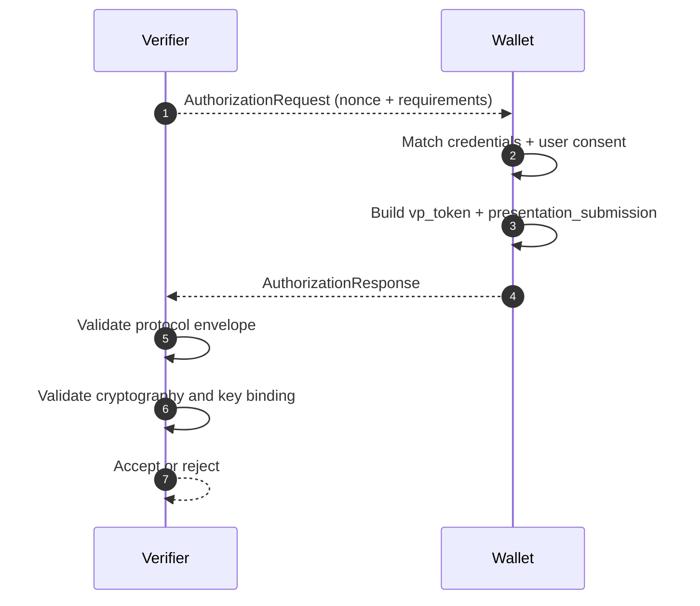

# OID4VP Deep Dive

This document explains OpenID for Verifiable Presentations (OID4VP): how verifiers request proofs and how wallets return verifiable presentation artifacts.

## Why OID4VP Exists

Presentation Exchange describes what data is needed. OID4VP defines the protocol envelope and security bindings used to move that data from wallet to verifier.

## Roles and Artifacts

| Artifact | Purpose |
| --- | --- |
| `AuthorizationRequest` | Verifier request (`client_id`, `response_type=vp_token`, `nonce`, query mechanism) |
| Query mechanism | Either `dcql_query` or `presentation_definition` / `presentation_definition_uri` |
| `AuthorizationResponse` | Wallet response with `vp_token` and `presentation_submission` |
| `vp_token` | One or more presented SD-JWT VC artifacts |
| `presentation_submission` | Mapping between verifier descriptors and presented tokens |

## Request/Response Essentials

### Request side

A valid request includes at least:

- `client_id`
- `response_type=vp_token`
- `nonce`
- exactly one query mechanism (`dcql_query` or PEX definition)

For cross-device direct post mode, `response_uri` must be absolute HTTPS.

### Response side

A successful response includes:

- `vp_token` (single or array)
- `presentation_submission`
- optional `state`

## Validation Model

### 1. Protocol-level checks

- response structure validation
- descriptor map consistency
- request-response binding (`state`, definition ID where applicable)

### 2. Cryptographic checks

- issuer signature validation on SD-JWT/SD-JWT VC
- disclosure digest verification
- key binding JWT verification (`kb+jwt`)

### 3. Binding and freshness checks

- nonce matching
- KB-JWT audience validation against expected verifier/client ID
- KB-JWT `iat` freshness window enforcement

## Implementation References

- Request model: [`src/SdJwt.Net.Oid4Vp/Models/AuthorizationRequest.cs`](../../src/SdJwt.Net.Oid4Vp/Models/AuthorizationRequest.cs)
- Response model: [`src/SdJwt.Net.Oid4Vp/Models/AuthorizationResponse.cs`](../../src/SdJwt.Net.Oid4Vp/Models/AuthorizationResponse.cs)
- Submission model: [`src/SdJwt.Net.Oid4Vp/Models/PresentationSubmission.cs`](../../src/SdJwt.Net.Oid4Vp/Models/PresentationSubmission.cs)
- Constants: [`src/SdJwt.Net.Oid4Vp/Models/Oid4VpConstants.cs`](../../src/SdJwt.Net.Oid4Vp/Models/Oid4VpConstants.cs)
- Request builder: [`src/SdJwt.Net.Oid4Vp/Verifier/PresentationRequestBuilder.cs`](../../src/SdJwt.Net.Oid4Vp/Verifier/PresentationRequestBuilder.cs)
- VP validator: [`src/SdJwt.Net.Oid4Vp/Verifier/VpTokenValidator.cs`](../../src/SdJwt.Net.Oid4Vp/Verifier/VpTokenValidator.cs)
- Package overview: [`src/SdJwt.Net.Oid4Vp/README.md`](../../src/SdJwt.Net.Oid4Vp/README.md)
- Sample: [`samples/SdJwt.Net.Samples/Standards/OpenId/OpenId4VpExample.cs`](../../samples/SdJwt.Net.Samples/Standards/OpenId/OpenId4VpExample.cs)
- Guide: [`docs/guides/verifying-presentations.md`](../guides/verifying-presentations.md)

## Beginner Pitfalls to Avoid

- Do not omit nonce checks; they are central to replay resistance.
- Do not skip key-binding audience/freshness validation in production.
- Do not send both DCQL and presentation definition in the same request.
- Validate descriptor mappings, not just token signatures.

## Related Concepts

- [Presentation Exchange Deep Dive](presentation-exchange-deep-dive.md)
- [SD-JWT Deep Dive](sd-jwt-deep-dive.md)
- [Verifiable Credential Deep Dive](verifiable-credential-deep-dive.md)
