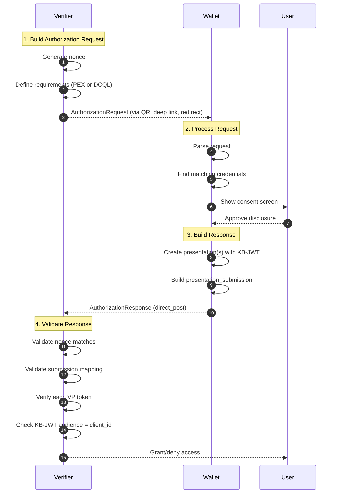
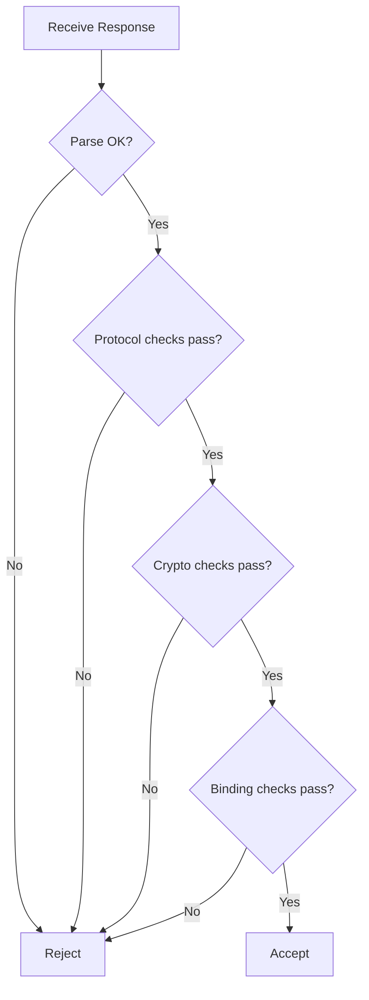

# OID4VP Deep Dive

This document explains OpenID for Verifiable Presentations (OID4VP): the protocol that enables verifiers to request credentials from wallets and receive verifiable presentations in response.

## Prerequisites

Before reading this document, you should understand:

| Prerequisite           | Why Needed                             | Resource                                                            |
| ---------------------- | -------------------------------------- | ------------------------------------------------------------------- |
| SD-JWT basics          | OID4VP transports SD-JWT presentations | [SD-JWT Deep Dive](sd-jwt-deep-dive.md)                             |
| Verifiable Credentials | OID4VP presents SD-JWT VCs             | [VC Deep Dive](verifiable-credential-deep-dive.md)                  |
| Key Binding JWT        | Required for credential holder binding | [Selective Disclosure Mechanics](selective-disclosure-mechanics.md) |

## Glossary

| Term                        | Definition                                                                            |
| --------------------------- | ------------------------------------------------------------------------------------- |
| **Verifier**                | The party requesting credential presentation (service provider, relying party)        |
| **Wallet**                  | Application that holds credentials and creates presentations on behalf of the Holder  |
| **Authorization Request**   | Message from Verifier specifying what credentials/claims are needed                   |
| **Authorization Response**  | Message from Wallet containing the presented credentials                              |
| **vp_token**                | The verifiable presentation payload (SD-JWT with disclosed claims + KB-JWT)           |
| **Presentation Submission** | Mapping that tells the Verifier which credential satisfies which requirement          |
| **Nonce**                   | Random value for replay protection - binds response to specific request               |
| **DCQL**                    | Digital Credentials Query Language - lightweight alternative to Presentation Exchange |
| **Direct Post**             | Response mode where Wallet POSTs response to Verifier's endpoint                      |

## Why OID4VP Exists

**Problem:** A Holder has credentials in their Wallet. How does a Verifier:

1. Tell the Wallet exactly which credentials and claims they need?
2. Receive the presentation securely?
3. Know the response corresponds to their specific request (not a replay)?

**Solution:** OID4VP provides:

- Standardized request format for specifying credential requirements
- Multiple transport modes (same-device, cross-device, QR code)
- Security bindings (nonce, audience) tying response to request
- Support for multiple query languages (Presentation Exchange, DCQL)

## Roles and Artifacts

| Artifact                  | Purpose                                                                            |
| ------------------------- | ---------------------------------------------------------------------------------- |
| `AuthorizationRequest`    | Verifier request (`client_id`, `response_type=vp_token`, `nonce`, query mechanism) |
| Query mechanism           | Either `dcql_query` or `presentation_definition` / `presentation_definition_uri`   |
| `AuthorizationResponse`   | Wallet response with `vp_token` and `presentation_submission`                      |
| `vp_token`                | One or more presented SD-JWT VC artifacts                                          |
| `presentation_submission` | Mapping between verifier descriptors and presented tokens                          |

## The Complete Flow



## Request/Response in Detail

### Authorization Request Example

A Verifier wants to verify employment status. The request looks like:

```json
{
  "client_id": "https://employer-check.example.com",
  "client_id_scheme": "x509_san_uri",
  "response_type": "vp_token",
  "response_mode": "direct_post",
  "response_uri": "https://employer-check.example.com/callback",
  "nonce": "n-0S6_WzA2Mj",
  "state": "af0ifjsldkj",
  "presentation_definition": {
    "id": "employment-verification",
    "name": "Employment Verification",
    "purpose": "Verify current employment status",
    "input_descriptors": [
      {
        "id": "employment_credential",
        "format": {
          "dc+sd-jwt": {}
        },
        "constraints": {
          "fields": [
            {
              "path": ["$.vct"],
              "filter": {
                "type": "string",
                "pattern": ".*employment.*"
              }
            },
            {
              "path": ["$.position"],
              "optional": false
            },
            {
              "path": ["$.department"],
              "optional": true
            }
          ]
        }
      }
    ]
  }
}
```

**Key fields explained:**

| Field                     | Required    | Purpose                                                      |
| ------------------------- | ----------- | ------------------------------------------------------------ |
| `client_id`               | Yes         | Identifies the Verifier; used for KB-JWT audience validation |
| `response_type`           | Yes         | Must be `vp_token` for OID4VP                                |
| `response_mode`           | No          | How response is delivered (`direct_post` for cross-device)   |
| `response_uri`            | Conditional | Where Wallet POSTs response (required for `direct_post`)     |
| `nonce`                   | Yes         | Binds response to this request (replay protection)           |
| `state`                   | No          | Opaque value returned unchanged (session correlation)        |
| `presentation_definition` | Conditional | PEX query (mutually exclusive with `dcql_query`)             |

### Authorization Response Example

The Wallet responds with the matching credentials:

```json
{
  "vp_token": "eyJ0eXAiOiJkYytzZC1qd3QiLC...~WyJzYWx0MSIsInBvc2l0aW9uIiwiU2VuaW9yIEVuZ2luZWVyIl0~WyJzYWx0MiIsImRlcGFydG1lbnQiLCJFbmdpbmVlcmluZyJd~eyJ0eXAiOiJrYitqd3QiLC...",
  "presentation_submission": {
    "id": "submission-1",
    "definition_id": "employment-verification",
    "descriptor_map": [
      {
        "id": "employment_credential",
        "format": "dc+sd-jwt",
        "path": "$"
      }
    ]
  },
  "state": "af0ifjsldkj"
}
```

**Response components:**

| Field                     | Purpose                                                |
| ------------------------- | ------------------------------------------------------ |
| `vp_token`                | The SD-JWT VC with only requested disclosures + KB-JWT |
| `presentation_submission` | Maps which credential satisfies which input descriptor |
| `state`                   | Echoed back from request for session correlation       |

### Multiple Credentials Response

When multiple credentials are requested, `vp_token` becomes an array:

```json
{
  "vp_token": [
    "eyJ0eXAiOiJkYytzZC1qd3QiLC...~disclosure1~kb-jwt1",
    "eyJ0eXAiOiJkYytzZC1qd3QiLC...~disclosure2~kb-jwt2"
  ],
  "presentation_submission": {
    "id": "multi-submission",
    "definition_id": "background-check",
    "descriptor_map": [
      {
        "id": "employment_input",
        "format": "dc+sd-jwt",
        "path": "$[0]"
      },
      {
        "id": "education_input",
        "format": "dc+sd-jwt",
        "path": "$[1]"
      }
    ]
  }
}
```

## DCQL: Lightweight Query Alternative

**DCQL (Digital Credentials Query Language)** is a simpler alternative to Presentation Exchange. Use DCQL for straightforward queries; use PEX for complex matching logic.

### DCQL Request Example

```json
{
  "client_id": "https://age-check.example.com",
  "response_type": "vp_token",
  "nonce": "xyz789",
  "dcql_query": {
    "credentials": [
      {
        "id": "age_credential",
        "format": "dc+sd-jwt",
        "meta": {
          "vct_values": ["https://credentials.example.com/DriverLicense"]
        },
        "claims": [{ "path": ["age_over_21"] }]
      }
    ]
  }
}
```

| Feature                 | DCQL                               | Presentation Exchange               |
| ----------------------- | ---------------------------------- | ----------------------------------- |
| Complexity              | Simple, flat structure             | Rich, nested requirements           |
| Use case                | Single credential, specific claims | Multiple credentials, complex logic |
| Submission requirements | Not supported                      | Supported (pick_n, all, etc.)       |
| Filter expressions      | Limited                            | Full JSONPath + filter objects      |

## Code Example: Verifier Side

### Building a Request

```csharp
using SdJwt.Net.Oid4Vp.Verifier;
using SdJwt.Net.Oid4Vp.Models;

// Create a presentation request using the fluent builder
var request = PresentationRequestBuilder
    .Create(
        clientId: "https://employer-check.example.com",
        responseUri: "https://employer-check.example.com/callback"
    )
    .WithName("Employment Verification")
    .WithPurpose("Verify current employment for background check")
    .WithInputDescriptor(
        id: "employment_credential",
        name: "Employment Credential",
        purpose: "Proof of current employment",
        constraints => constraints
            .AddField("$.vct", filter: FilterBuilder.Pattern(".*employment.*"))
            .AddField("$.position")
            .AddField("$.department", optional: true)
    )
    .Build();

// Serialize to JSON for QR code or deep link
string requestJson = request.ToJson();

// Store nonce server-side for validation
string expectedNonce = request.Nonce;
```

### Validating a Response

```csharp
using SdJwt.Net.Oid4Vp.Verifier;
using SdJwt.Net.Oid4Vp.Models;

// Parse the incoming response
var response = AuthorizationResponse.FromJson(responseJson);

// Create validator with key resolver
var validator = new VpTokenValidator(
    keyProvider: async jwt => await ResolveIssuerKey(jwt),
    useSdJwtVcValidation: true
);

// Validate the response
var result = await validator.ValidateAsync(
    response,
    expectedNonce: storedNonce,
    options: new VpTokenValidationOptions
    {
        ValidateKeyBinding = true,
        ExpectedAudience = "https://employer-check.example.com",
        IatFreshnessWindow = TimeSpan.FromMinutes(5)
    }
);

if (result.IsValid)
{
    // Access validated claims
    foreach (var token in result.ValidatedTokens)
    {
        var position = token.DisclosedClaims["position"];
        Console.WriteLine($"Verified position: {position}");
    }
}
else
{
    Console.WriteLine($"Validation failed: {result.ErrorMessage}");
}
```

## Code Example: Wallet Side

### Processing a Request and Building Response

```csharp
using SdJwt.Net.Holder;
using SdJwt.Net.Oid4Vp.Models;

// Parse the verifier's request
var request = AuthorizationRequest.FromJson(requestJson);

// Find matching credentials in wallet storage
var matchingCredentials = await FindCredentialsMatching(request.PresentationDefinition);

// User approves which claims to disclose
var userApprovedClaims = await ShowConsentScreen(matchingCredentials, request);

// Create presentation for each matched credential
var presentations = new List<string>();
foreach (var (credential, claimsToDisclose) in userApprovedClaims)
{
    var holder = new SdHolder(holderPrivateKey);

    var presentation = holder.CreatePresentation(
        credential.Issuance,
        claimsToDisclose,
        new KeyBindingOptions
        {
            Nonce = request.Nonce,
            Audience = request.ClientId,
            IssuedAt = DateTimeOffset.UtcNow
        }
    );

    presentations.Add(presentation);
}

// Build the response
var response = new AuthorizationResponse
{
    VpToken = presentations.Count == 1 ? presentations[0] : null,
    VpTokenArray = presentations.Count > 1 ? presentations.ToArray() : null,
    PresentationSubmission = BuildSubmission(request.PresentationDefinition, presentations),
    State = request.State
};

// POST to verifier's response_uri
await HttpClient.PostAsync(request.ResponseUri, response.ToJson());
```

## Validation Checklist

A complete OID4VP validation involves three layers:

### Layer 1: Protocol Validation

| Check               | What to Validate                                        | Failure Meaning       |
| ------------------- | ------------------------------------------------------- | --------------------- |
| Response structure  | `vp_token` and `presentation_submission` present        | Malformed response    |
| Definition ID match | `presentation_submission.definition_id` matches request | Wrong submission      |
| Descriptor coverage | All required input descriptors have mappings            | Incomplete submission |
| State match         | `state` in response matches request (if sent)           | Session mismatch      |

### Layer 2: Cryptographic Validation

| Check              | What to Validate                               | Failure Meaning               |
| ------------------ | ---------------------------------------------- | ----------------------------- |
| Issuer signature   | SD-JWT signature valid against issuer key      | Tampered or forged credential |
| Disclosure digests | All disclosed claims have valid digests in JWT | Disclosure tampering          |
| KB-JWT signature   | Key binding JWT signed by holder key           | Holder not proven             |

### Layer 3: Binding and Freshness

| Check     | What to Validate                                    | Failure Meaning                          |
| --------- | --------------------------------------------------- | ---------------------------------------- |
| Nonce     | KB-JWT `nonce` matches request `nonce`              | Replay attack                            |
| Audience  | KB-JWT `aud` matches `client_id`                    | Response intended for different verifier |
| Freshness | KB-JWT `iat` within acceptable window (e.g., 5 min) | Stale presentation                       |



## Implementation References

| Component        | File                                                                                               | Description            |
| ---------------- | -------------------------------------------------------------------------------------------------- | ---------------------- |
| Request model    | [AuthorizationRequest.cs](../../src/SdJwt.Net.Oid4Vp/Models/AuthorizationRequest.cs)               | Request structure      |
| Response model   | [AuthorizationResponse.cs](../../src/SdJwt.Net.Oid4Vp/Models/AuthorizationResponse.cs)             | Response structure     |
| Submission model | [PresentationSubmission.cs](../../src/SdJwt.Net.Oid4Vp/Models/PresentationSubmission.cs)           | Descriptor mapping     |
| Constants        | [Oid4VpConstants.cs](../../src/SdJwt.Net.Oid4Vp/Models/Oid4VpConstants.cs)                         | Protocol constants     |
| Request builder  | [PresentationRequestBuilder.cs](../../src/SdJwt.Net.Oid4Vp/Verifier/PresentationRequestBuilder.cs) | Fluent request builder |
| VP validator     | [VpTokenValidator.cs](../../src/SdJwt.Net.Oid4Vp/Verifier/VpTokenValidator.cs)                     | Full validation logic  |
| DCQL query       | [DcqlQuery.cs](../../src/SdJwt.Net.Oid4Vp/Models/Dcql/DcqlQuery.cs)                                | DCQL query model       |
| Package overview | [README.md](../../src/SdJwt.Net.Oid4Vp/README.md)                                                  | Quick start            |
| Sample code      | [OpenId4VpExample.cs](../../samples/SdJwt.Net.Samples/Standards/OpenId/OpenId4VpExample.cs)        | Working examples       |

## Beginner Pitfalls to Avoid

### 1. Skipping Nonce Validation

**Wrong:**

```csharp
// DANGEROUS - no nonce check
var result = await validator.ValidateAsync(response, expectedNonce: "", options);
```

**Right:**

```csharp
// Store nonce when creating request
var nonce = request.Nonce;
await StoreNonceForSession(sessionId, nonce);

// Validate with stored nonce
var storedNonce = await GetNonceForSession(sessionId);
var result = await validator.ValidateAsync(response, expectedNonce: storedNonce, options);
```

**Why it matters:** Without nonce validation, an attacker can replay a captured response to gain unauthorized access.

### 2. Ignoring Key Binding Audience

**Wrong:**

```csharp
// Missing audience validation
var options = new VpTokenValidationOptions
{
    ValidateKeyBinding = true
    // ExpectedAudience not set!
};
```

**Right:**

```csharp
var options = new VpTokenValidationOptions
{
    ValidateKeyBinding = true,
    ExpectedAudience = "https://my-service.example.com"  // Must match client_id
};
```

**Why it matters:** Without audience validation, a response intended for a different verifier could be replayed to your service.

### 3. Mixing DCQL and Presentation Definition

**Wrong:**

```json
{
  "client_id": "...",
  "nonce": "...",
  "dcql_query": { ... },
  "presentation_definition": { ... }
}
```

**Right:** Use exactly one query mechanism:

```json
{
  "client_id": "...",
  "nonce": "...",
  "dcql_query": { ... }
}
```

### 4. Not Validating Descriptor Mappings

**Wrong:** Only validating the VP tokens exist.

**Right:** Validate that each required input descriptor has a corresponding entry in `descriptor_map` with the correct format and path.

```csharp
// The VpTokenValidator handles this automatically
var result = await validator.ValidateAsync(response, nonce, options);

// Check that all required descriptors were satisfied
if (!result.AllDescriptorsSatisfied)
{
    Console.WriteLine("Missing required credentials");
}
```

### 5. Insufficient Freshness Window

**Wrong:**

```csharp
// Too tight - network latency can cause false rejections
IatFreshnessWindow = TimeSpan.FromSeconds(10)

// Too loose - allows stale presentations
IatFreshnessWindow = TimeSpan.FromHours(24)
```

**Right:**

```csharp
// Balance between security and usability
IatFreshnessWindow = TimeSpan.FromMinutes(5)
```

## Frequently Asked Questions

### Q: What is the difference between `response_uri` and `redirect_uri`?

**A:**

- `response_uri`: Where the Wallet POSTs the response (used with `direct_post` mode)
- `redirect_uri`: Where the user agent redirects after authorization (used with redirect flows)

For cross-device flows (QR code), use `response_uri` with `direct_post` mode.

### Q: When should I use DCQL vs Presentation Exchange?

**A:** Use DCQL for simple, single-credential queries. Use Presentation Exchange when you need:

- Multiple credentials with complex relationships
- Submission requirements (e.g., "any 2 of these 4 credentials")
- Rich filtering with JSONPath expressions

### Q: How do I handle multiple issuers for the same credential type?

**A:** Define the input descriptor with a `filter` on the `$.iss` claim that accepts multiple values:

```json
{
  "path": ["$.iss"],
  "filter": {
    "type": "string",
    "enum": ["https://issuer1.example.com", "https://issuer2.example.com"]
  }
}
```

### Q: Can the Wallet decline to present certain claims?

**A:** Yes. If a field is marked `optional: true` in the input descriptor, the Wallet may omit it. If required fields are missing, the Verifier should reject the presentation.

### Q: How do I test OID4VP flows during development?

**A:** Use the sample code in [OpenId4VpExample.cs](../../samples/SdJwt.Net.Samples/Standards/OpenId/OpenId4VpExample.cs) which demonstrates complete verifier and wallet interactions with test credentials.

## Related Concepts

- [Presentation Exchange Deep Dive](presentation-exchange-deep-dive.md) - Query language for credential requirements
- [SD-JWT Deep Dive](sd-jwt-deep-dive.md) - Base selective disclosure format
- [Verifiable Credential Deep Dive](verifiable-credential-deep-dive.md) - VC semantics transported by OID4VP
- [OID4VCI Deep Dive](openid4vci-deep-dive.md) - Credential issuance (complements OID4VP)
