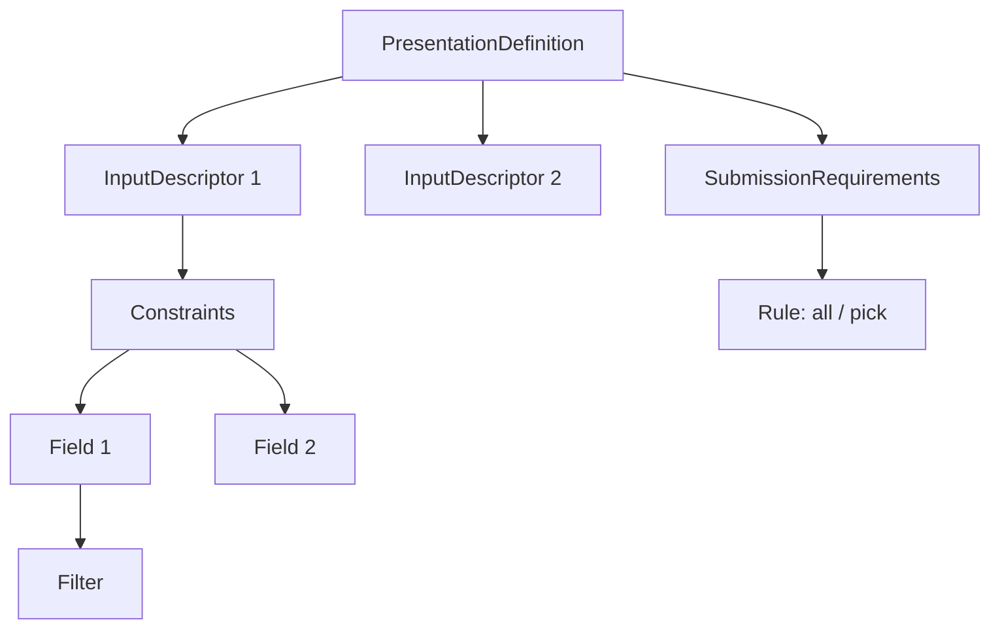

# Presentation Exchange Deep Dive (DIF PE)

This document explains Presentation Exchange (PE): the query language that enables verifiers to express credential requirements and wallets to respond with matching credentials.

## Prerequisites

Before reading this document, you should understand:

| Prerequisite | Why Needed | Resource |
| --- | --- | --- |
| SD-JWT basics | PE queries SD-JWT credentials | [SD-JWT Deep Dive](sd-jwt-deep-dive.md) |
| Verifiable Credentials | PE selects from VCs | [VC Deep Dive](verifiable-credential-deep-dive.md) |
| OID4VP basics | PE is used within OID4VP | [OID4VP Deep Dive](openid4vp-deep-dive.md) |

## Glossary

| Term | Definition |
| --- | --- |
| **Presentation Definition** | Complete specification of what credentials/claims a Verifier needs |
| **Input Descriptor** | Single credential requirement within a definition |
| **Constraints** | Rules a credential must satisfy (fields, formats) |
| **Field** | Single claim requirement with JSONPath and optional filter |
| **Submission Requirement** | Grouping logic for multiple descriptors (all, pick, count) |
| **Presentation Submission** | Wallet's response mapping credentials to descriptors |
| **Descriptor Map** | Maps each input descriptor ID to presented credential |
| **JSONPath** | Query syntax for locating claims within credential JSON |

## Why Presentation Exchange Matters

**Problem:** Without a standard query language:

- Verifiers invent custom request formats
- Wallets need custom code for each verifier
- Users cannot understand what is being requested

**Solution:** PEX provides:

- Declarative requirement specification
- Deterministic wallet-side matching
- Clear mapping of what satisfies each requirement
- User-friendly metadata for consent screens

## Core Structures



| Structure | Purpose | Required |
| --- | --- | --- |
| `PresentationDefinition` | Container for all requirements | Yes |
| `InputDescriptor` | One credential pattern requirement | At least one |
| `Constraints` | Claims the credential must contain | No (but usually present) |
| `Field` | Single claim path + optional filter | No |
| `SubmissionRequirement` | How to combine descriptors | No |
| `PresentationSubmission` | Response mapping from wallet | Response only |

## Presentation Definition Examples

### Simple: Single Credential, Specific Claims

Verify employment status with position and department:

```json
{
  "id": "employment_verification",
  "name": "Employment Verification",
  "purpose": "Verify your current employment status",
  "input_descriptors": [
    {
      "id": "employment_credential",
      "name": "Employment Credential",
      "purpose": "Proof of current employment",
      "format": {
        "dc+sd-jwt": {}
      },
      "constraints": {
        "fields": [
          {
            "path": ["$.vct"],
            "filter": {
              "type": "string",
              "pattern": ".*employment.*"
            }
          },
          {
            "path": ["$.position"]
          },
          {
            "path": ["$.department"],
            "optional": true
          }
        ]
      }
    }
  ]
}
```

**Breakdown:**

| Component | Value | Meaning |
| --- | --- | --- |
| `format` | `dc+sd-jwt` | Only accepts SD-JWT VC format |
| `path: ["$.vct"]` | JSONPath | Credential type must match pattern |
| `path: ["$.position"]` | JSONPath | `position` claim is required |
| `optional: true` | Field flag | `department` is nice-to-have |

### Multiple Credentials: Background Check

Verify both employment and education:

```json
{
  "id": "background_check",
  "name": "Background Check",
  "purpose": "Complete background verification for employment",
  "input_descriptors": [
    {
      "id": "employment_input",
      "name": "Employment History",
      "group": ["verification"],
      "constraints": {
        "fields": [
          { "path": ["$.vct"], "filter": { "pattern": ".*employment.*" } },
          { "path": ["$.employer"] },
          { "path": ["$.start_date"] }
        ]
      }
    },
    {
      "id": "education_input",
      "name": "Education Record",
      "group": ["verification"],
      "constraints": {
        "fields": [
          { "path": ["$.vct"], "filter": { "pattern": ".*degree.*" } },
          { "path": ["$.degree"] },
          { "path": ["$.institution"] }
        ]
      }
    }
  ],
  "submission_requirements": [
    {
      "name": "Background Verification",
      "rule": "all",
      "from": "verification"
    }
  ]
}
```

### Alternative Credentials: Age Verification

Accept either government ID OR driver's license:

```json
{
  "id": "age_verification",
  "input_descriptors": [
    {
      "id": "govt_id",
      "group": ["age_proof"],
      "constraints": {
        "fields": [
          { "path": ["$.vct"], "filter": { "pattern": ".*government_id.*" } },
          { "path": ["$.age_over_21"] }
        ]
      }
    },
    {
      "id": "drivers_license",
      "group": ["age_proof"],
      "constraints": {
        "fields": [
          { "path": ["$.vct"], "filter": { "pattern": ".*drivers_license.*" } },
          { "path": ["$.age_over_21"] }
        ]
      }
    }
  ],
  "submission_requirements": [
    {
      "rule": "pick",
      "count": 1,
      "from": "age_proof"
    }
  ]
}
```

## Submission Requirements Rules

| Rule | Meaning | Example |
| --- | --- | --- |
| `all` | All descriptors in group required | "Need both employment AND education" |
| `pick` + `count` | Exactly N from group | "Any 1 of these 3 ID types" |
| `pick` + `min` | At least N from group | "At least 2 references" |
| `pick` + `max` | At most N from group | "Up to 3 supporting documents" |
| `pick` + `min` + `max` | Between N and M | "2 to 4 credentials" |

## Presentation Submission Response

When the wallet finds matching credentials:

```json
{
  "id": "submission-abc123",
  "definition_id": "background_check",
  "descriptor_map": [
    {
      "id": "employment_input",
      "format": "dc+sd-jwt",
      "path": "$[0]"
    },
    {
      "id": "education_input",
      "format": "dc+sd-jwt",
      "path": "$[1]"
    }
  ]
}
```

| Field | Purpose |
| --- | --- |
| `definition_id` | Links to original request |
| `descriptor_map` | Array mapping each satisfied descriptor to credential |
| `format` | Format of the presented credential |
| `path` | JSONPath to credential in `vp_token` (array or single) |

## Code Example: Verifier Creating Definition

```csharp
using SdJwt.Net.PresentationExchange.Models;

// Build presentation definition programmatically
var definition = new PresentationDefinition
{
    Id = "employment_verification",
    Name = "Employment Verification",
    Purpose = "Verify current employment for loan application",
    InputDescriptors = new[]
    {
        new InputDescriptor
        {
            Id = "employment_credential",
            Name = "Employment Credential",
            Purpose = "Proof of stable employment",
            Format = new FormatConstraints
            {
                DcSdJwt = new FormatOptions()  // Accept dc+sd-jwt format
            },
            Constraints = new Constraints
            {
                Fields = new[]
                {
                    new Field
                    {
                        Path = new[] { "$.vct" },
                        Filter = new Filter
                        {
                            Type = "string",
                            Pattern = ".*employment.*"
                        }
                    },
                    new Field
                    {
                        Path = new[] { "$.employer" }
                    },
                    new Field
                    {
                        Path = new[] { "$.position" }
                    },
                    new Field
                    {
                        Path = new[] { "$.salary_range" },
                        Optional = true
                    }
                }
            }
        }
    }
};

// Validate before sending
definition.Validate();

// Serialize for transport
string json = JsonSerializer.Serialize(definition);
```

## Code Example: Wallet Selecting Credentials

```csharp
using SdJwt.Net.PresentationExchange.Engine;
using SdJwt.Net.PresentationExchange.Models;
using SdJwt.Net.PresentationExchange.Services;
using Microsoft.Extensions.Logging;

// Setup the engine (typically via DI)
var engine = new PresentationExchangeEngine(
    logger: loggerFactory.CreateLogger<PresentationExchangeEngine>(),
    constraintEvaluator: new ConstraintEvaluator(constraintLogger),
    submissionRequirementEvaluator: new SubmissionRequirementEvaluator(reqLogger),
    formatDetector: new CredentialFormatDetector()
);

// Parse incoming definition
var definition = JsonSerializer.Deserialize<PresentationDefinition>(definitionJson);

// Select from wallet credentials
var result = await engine.SelectCredentialsAsync(
    presentationDefinition: definition,
    credentialWallet: walletCredentials,
    options: new CredentialSelectionOptions
    {
        MaxCredentialsToEvaluate = 100,
        PreferNewerCredentials = true
    }
);

if (result.IsSuccessful)
{
    // Show user which credentials match
    foreach (var selected in result.SelectedCredentials)
    {
        Console.WriteLine($"Matched: {selected.DescriptorId} -> {selected.CredentialId}");
    }
    
    // Get the presentation submission for response
    var submission = result.PresentationSubmission;
}
else
{
    Console.WriteLine($"No match: {result.ErrorCode} - {result.ErrorMessage}");
}
```

## JSONPath Quick Reference

| Pattern | Meaning | Example |
| --- | --- | --- |
| `$.claim` | Root-level claim | `$.position` |
| `$.nested.claim` | Nested claim | `$.address.city` |
| `$['claim']` | Bracket notation | `$['given_name']` |
| `$.array[0]` | Array index | `$.degrees[0]` |
| `$.array[*]` | All array elements | `$.employers[*]` |

## Filter Expressions

Filters constrain the values that satisfy a field:

```json
{
  "path": ["$.vct"],
  "filter": {
    "type": "string",
    "pattern": ".*UniversityDegree.*"
  }
}
```

| Filter Property | Purpose | Example |
| --- | --- | --- |
| `type` | JSON Schema type | `"string"`, `"number"`, `"boolean"` |
| `pattern` | Regex for strings | `".*employment.*"` |
| `enum` | Allowed values | `["BachelorDegree", "MasterDegree"]` |
| `minimum` | Numeric minimum | `18` (for age) |
| `maximum` | Numeric maximum | `65` |
| `const` | Exact value | `true` |

## Implementation References

| Component | File | Description |
| --- | --- | --- |
| Engine | [PresentationExchangeEngine.cs](../../src/SdJwt.Net.PresentationExchange/Engine/PresentationExchangeEngine.cs) | Main credential selection |
| Definition model | [PresentationDefinition.cs](../../src/SdJwt.Net.PresentationExchange/Models/PresentationDefinition.cs) | Definition structure |
| Descriptor model | [InputDescriptor.cs](../../src/SdJwt.Net.PresentationExchange/Models/InputDescriptor.cs) | Descriptor structure |
| Requirement model | [SubmissionRequirement.cs](../../src/SdJwt.Net.PresentationExchange/Models/SubmissionRequirement.cs) | Submission requirements |
| Constraint evaluator | [ConstraintEvaluator.cs](../../src/SdJwt.Net.PresentationExchange/Services/ConstraintEvaluator.cs) | Field matching |
| Submission evaluator | [SubmissionRequirementEvaluator.cs](../../src/SdJwt.Net.PresentationExchange/Services/SubmissionRequirementEvaluator.cs) | Rule application |
| Package overview | [README.md](../../src/SdJwt.Net.PresentationExchange/README.md) | Quick start |
| Sample code | [PresentationExchangeExample.cs](../../samples/SdJwt.Net.Samples/Standards/PresentationExchange/PresentationExchangeExample.cs) | Working examples |

## Beginner Pitfalls to Avoid

### 1. Requesting More Than Needed

**Wrong:** Requesting all available claims "just in case."

**Right:** Request only what you need for your use case.

```json
// WRONG - over-requesting
{
  "fields": [
    { "path": ["$.given_name"] },
    { "path": ["$.family_name"] },
    { "path": ["$.birth_date"] },
    { "path": ["$.social_security_number"] },
    { "path": ["$.address"] },
    { "path": ["$.phone"] }
  ]
}

// RIGHT - minimal disclosure for age check
{
  "fields": [
    { "path": ["$.age_over_21"] }
  ]
}
```

### 2. Forgetting Format Constraints

**Wrong:** Not specifying format, accepting any credential format.

**Right:** Specify the format you can process.

```json
{
  "id": "my_descriptor",
  "format": {
    "dc+sd-jwt": {}
  },
  "constraints": { ... }
}
```

### 3. Ignoring Submission Mapping Validation

**Wrong:** Only validating the credentials themselves.

**Right:** Validate that `descriptor_map` correctly maps to the definition.

```csharp
// Verify submission matches definition
if (submission.DefinitionId != definition.Id)
{
    throw new ValidationException("Submission does not match definition");
}

foreach (var mapping in submission.DescriptorMap)
{
    if (!definition.InputDescriptors.Any(d => d.Id == mapping.Id))
    {
        throw new ValidationException($"Unknown descriptor: {mapping.Id}");
    }
}
```

### 4. Conflicting Submission Requirements

**Wrong:** Creating requirements that cannot be satisfied.

```json
{
  "submission_requirements": [
    { "rule": "all", "from": "group_a" },
    { "rule": "pick", "count": 1, "from": "group_a" }
  ]
}
```

**Right:** Requirements should be logically consistent.

## Frequently Asked Questions

### Q: What is the difference between PE and DCQL?

**A:** PE (Presentation Exchange) is feature-rich with groups, submission requirements, and complex filters. DCQL (Digital Credentials Query Language) is simpler for basic single-credential queries. Use PE when you need complex logic; use DCQL for straightforward requests.

### Q: How do I request a claim that might be at different paths?

**A:** Use array syntax in the `path` field:

```json
{
  "path": ["$.given_name", "$.first_name", "$.name.given"]
}
```

The wallet will try each path and use the first match.

### Q: Can I require a specific issuer?

**A:** Yes, add a field constraint on `$.iss`:

```json
{
  "path": ["$.iss"],
  "filter": {
    "type": "string",
    "enum": [
      "https://trusted-issuer.example.com",
      "https://another-issuer.example.com"
    ]
  }
}
```

### Q: How does the wallet handle multiple matching credentials?

**A:** The engine can be configured to prefer certain credentials (newest, specific issuers). By default, it returns the first match for each descriptor.

### Q: What happens if a required field is missing from a credential?

**A:** The credential does not match that input descriptor. If no credentials match, the selection fails with an error indicating which descriptors could not be satisfied.

## Related Concepts

- [OID4VP Deep Dive](openid4vp-deep-dive.md) - Protocol that transports PE definitions
- [Verifiable Credential Deep Dive](verifiable-credential-deep-dive.md) - Structure of credentials being queried
- [SD-JWT Deep Dive](sd-jwt-deep-dive.md) - Selective disclosure mechanics
