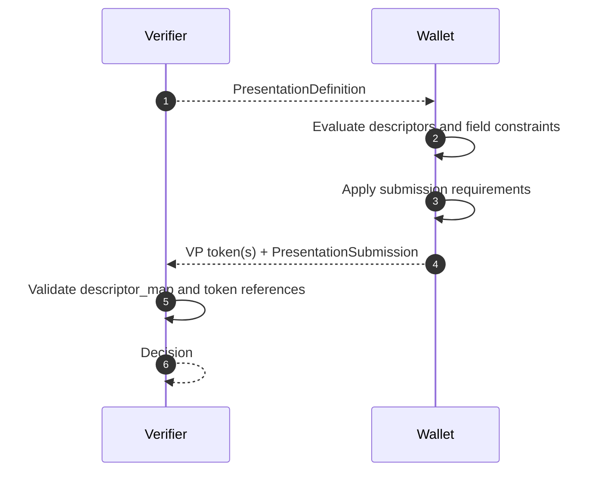

# Presentation Exchange Deep Dive (DIF PE)

This document explains Presentation Exchange (PE): the request language verifiers use to express required credential evidence.

## Why PE Matters

Without a standard request language, each verifier invents custom fields and wallet-side matching rules.

PE replaces custom contracts with a deterministic structure:

- verifier defines requirements once
- wallet evaluates local credentials against those requirements
- wallet returns a mapping of what satisfied each requirement

## Core Structures

| Structure | Purpose |
| --- | --- |
| `PresentationDefinition` | Top-level requirement object |
| `InputDescriptor` | One required credential pattern |
| `Constraints` + `Field` | JSONPath-based claim requirements and filters |
| `SubmissionRequirement` | Grouping and cardinality logic (`all`, `pick`) |
| `PresentationSubmission` | Mapping from descriptor IDs to provided credentials |

## Minimal Example Shape

### Presentation definition

```json
{
  "id": "employment_verification",
  "input_descriptors": [
    {
      "id": "employment_credential",
      "constraints": {
        "fields": [
          { "path": ["$.position"] },
          { "path": ["$.employment_type"] }
        ]
      }
    }
  ]
}
```

### Presentation submission

```json
{
  "id": "submission-1",
  "definition_id": "employment_verification",
  "descriptor_map": [
    { "id": "employment_credential", "format": "dc+sd-jwt", "path": "$" }
  ]
}
```

## Wallet-Side Matching Lifecycle

1. Verifier sends `PresentationDefinition`.
2. Wallet evaluates each stored credential against descriptor constraints.
3. Wallet applies `submission_requirements` logic (for example all, pick, ranges).
4. Wallet returns credential(s) plus `PresentationSubmission` mapping.
5. Verifier validates mapping integrity and then validates credential cryptography.



## Practical Guidance for Beginners

- Keep definitions minimal to reduce over-disclosure and UX friction.
- Use `submission_requirements` when users can satisfy request with alternatives.
- Treat PE matching and SD-JWT verification as complementary checks.
- Validate `descriptor_map` paths carefully when multiple tokens are returned.

## Implementation References

- Engine: [`src/SdJwt.Net.PresentationExchange/Engine/PresentationExchangeEngine.cs`](../../src/SdJwt.Net.PresentationExchange/Engine/PresentationExchangeEngine.cs)
- Definition model: [`src/SdJwt.Net.PresentationExchange/Models/PresentationDefinition.cs`](../../src/SdJwt.Net.PresentationExchange/Models/PresentationDefinition.cs)
- Descriptor model: [`src/SdJwt.Net.PresentationExchange/Models/InputDescriptor.cs`](../../src/SdJwt.Net.PresentationExchange/Models/InputDescriptor.cs)
- Requirement model: [`src/SdJwt.Net.PresentationExchange/Models/SubmissionRequirement.cs`](../../src/SdJwt.Net.PresentationExchange/Models/SubmissionRequirement.cs)
- Constraint evaluator: [`src/SdJwt.Net.PresentationExchange/Services/ConstraintEvaluator.cs`](../../src/SdJwt.Net.PresentationExchange/Services/ConstraintEvaluator.cs)
- Submission evaluator: [`src/SdJwt.Net.PresentationExchange/Services/SubmissionRequirementEvaluator.cs`](../../src/SdJwt.Net.PresentationExchange/Services/SubmissionRequirementEvaluator.cs)
- Package overview: [`src/SdJwt.Net.PresentationExchange/README.md`](../../src/SdJwt.Net.PresentationExchange/README.md)
- Sample: [`samples/SdJwt.Net.Samples/Standards/PresentationExchange/PresentationExchangeExample.cs`](../../samples/SdJwt.Net.Samples/Standards/PresentationExchange/PresentationExchangeExample.cs)

## Related Concepts

- [OID4VP Deep Dive](openid4vp-deep-dive.md)
- [Verifiable Credential Deep Dive](verifiable-credential-deep-dive.md)
- [SD-JWT Deep Dive](sd-jwt-deep-dive.md)
