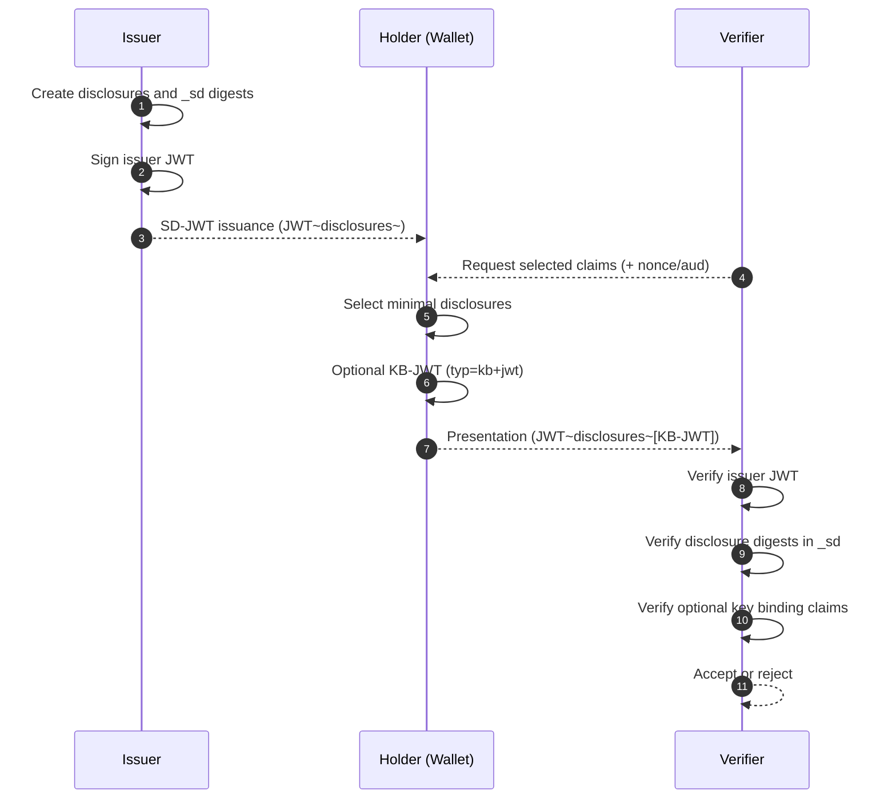

# SD-JWT Deep Dive (RFC 9901)

This document explains SD-JWT fundamentals in beginner-friendly terms and maps each concept to the implementation in this repository.

## Prerequisites

Before diving into SD-JWT, you should understand these foundational concepts:

### What is a JWT?

A **JSON Web Token (JWT)** is a compact, URL-safe way to represent claims between two parties. It consists of three base64url-encoded parts separated by dots:

```text
eyJhbGciOiJFUzI1NiJ9.eyJuYW1lIjoiSm9obiJ9.signature
        Header              Payload            Signature
```

The **Header** specifies the signing algorithm. The **Payload** contains claims (data). The **Signature** proves the data was not tampered with.

### The Privacy Problem with Regular JWTs

When you sign a JWT, you sign everything together. If you change or remove even one character from the payload, the signature becomes invalid.

**Example scenario:**

```json
// Original JWT payload
{
  "name": "Alice Johnson",
  "email": "alice@example.com",
  "birthdate": "1990-05-15",
  "blood_type": "O+",
  "ssn": "123-45-6789"
}
```

If a job application website only needs to verify your name and that you are over 18, with a traditional JWT, you must reveal **everything** including your blood type and social security number.

## Why SD-JWT Exists

A classic JWT is signed as a whole object. If a holder removes one claim before presentation, the signature no longer verifies.

That creates an all-or-nothing disclosure model:

- Verifier needs one fact (for example, age over 18)
- Holder still has to present the full payload
- Unnecessary data is exposed

SD-JWT solves this by signing **hashes (digests)** of disclosable claims instead of the actual values, while sending real claim values as separate disclosures that can be selectively included or omitted.

## Glossary of Key Terms

| Term             | Definition                                                                                  |
| ---------------- | ------------------------------------------------------------------------------------------- |
| **Issuer**       | The entity that creates and signs the SD-JWT (e.g., a university, government, bank)         |
| **Holder**       | The entity that receives the SD-JWT and later presents it (e.g., the user's wallet app)     |
| **Verifier**     | The entity that requests and validates the SD-JWT presentation (e.g., an employer, website) |
| **Disclosure**   | A base64url-encoded JSON array containing a salt, claim name, and claim value               |
| **Digest**       | A cryptographic hash of a disclosure, stored in the `_sd` array                             |
| **Salt**         | A random string added to each disclosure to prevent attackers from guessing claim values    |
| **Key Binding**  | A mechanism that proves the presenter is the legitimate owner of the SD-JWT                 |
| **KB-JWT**       | Key Binding JWT - a short-lived token proving holder ownership                              |
| **Base64url**    | A URL-safe encoding format (like base64 but uses `-` and `_` instead of `+` and `/`)        |
| **Compact Form** | The tilde-separated string format of an SD-JWT                                              |

## SD-JWT Artifact Structure

### Visual Overview

An SD-JWT in compact form looks like this:

```text
<Issuer-JWT>~<Disclosure-1>~<Disclosure-2>~...<Disclosure-N>~[KB-JWT]
```

**Concrete Example:**

```text
eyJhbGciOiJFUzI1NiIsInR5cCI6InNkK2p3dCJ9.eyJpc3MiOiJodHRwczovL2lzc3Vlci5leGFtcGxlLmNvbSIsIl9zZCI6WyJWOHgxcTJxMkEuLi4iLCJ4RjliWjhjLi4uIl19.sig~WyJhYmJhLi4uIiwiZW1haWwiLCJhbGljZUBleGFtcGxlLmNvbSJd~WyJiYWFiLi4uIiwiYWdlIiwyNV0~
                                                                                                                                            ^                                            ^                                   ^
                                                                                                                                            |                                            |                                   |
                                                                                                                                      JWT (signed)                             Disclosure 1 (email)                 Disclosure 2 (age)
```

### The Three Artifact Types

| Artifact Type              | Format                           | Example Use Case                          |
| -------------------------- | -------------------------------- | ----------------------------------------- |
| **Issuance**               | `JWT~Disclosure1~Disclosure2~`   | Issuer gives credential to holder         |
| **Presentation (no KB)**   | `JWT~SelectedDisclosure1~`       | Holder presents without proving ownership |
| **Presentation (with KB)** | `JWT~SelectedDisclosure1~KB-JWT` | Holder presents and proves ownership      |

Important behavior in this codebase:

- Issuance strings include a trailing `~`.
- When key binding is used, the final component is a `kb+jwt` token (no trailing `~`).

## Core Claims and Headers

### Header Example

```json
{
  "alg": "ES256",
  "typ": "sd+jwt"
}
```

### Payload Example (Issuer JWT)

```json
{
  "iss": "https://university.example.edu",
  "sub": "student_12345",
  "name": "Alice Johnson",
  "_sd": [
    "V8x1q2KI6sBAceg_hash_for_email",
    "xF9bZ8c_hash_for_birthdate",
    "Qm7r3Yd_hash_for_ssn"
  ],
  "_sd_alg": "sha-256",
  "cnf": {
    "jwk": {
      "kty": "EC",
      "crv": "P-256",
      "x": "TCAER19Zvu...",
      "y": "ZxjiWWb..."
    }
  }
}
```

Notice that `email`, `birthdate`, and `ssn` are NOT in the payload. Instead, their cryptographic hashes are in the `_sd` array. The actual values are sent separately as disclosures.

### Claim and Header Reference

| Claim/Header     | Location           | Purpose                                                 |
| ---------------- | ------------------ | ------------------------------------------------------- |
| `typ` = `sd+jwt` | Issuer JWT header  | Identifies this as an SD-JWT                            |
| `_sd`            | Issuer JWT payload | Array of disclosure digests (hashes)                    |
| `_sd_alg`        | Issuer JWT payload | Hash algorithm used (`sha-256` by default)              |
| `cnf`            | Issuer JWT payload | Holder's public key for key binding                     |
| `typ` = `kb+jwt` | KB-JWT header      | Identifies the Key Binding JWT                          |
| `sd_hash`        | KB-JWT payload     | Hash of the presented SD-JWT (binds KB to presentation) |
| `aud`            | KB-JWT payload     | Intended verifier audience                              |
| `nonce`          | KB-JWT payload     | One-time value to prevent replay attacks                |
| `iat`            | KB-JWT payload     | Issuance timestamp for freshness validation             |

## How Selective Disclosure Works

### Step-by-Step Example

Let us walk through creating an SD-JWT for a university student credential.

#### Original Claims (What the Issuer Knows)

```json
{
  "iss": "https://university.example.edu",
  "sub": "student_12345",
  "name": "Alice Johnson",
  "email": "alice@student.example.edu",
  "gpa": 3.8,
  "graduation_year": 2025
}
```

The issuer decides that `email`, `gpa`, and `graduation_year` should be **selectively disclosable**, while `name` should always be visible.

### 1. Disclosure Creation

For each selectively disclosable claim, the issuer creates a **disclosure** - a JSON array with three elements:

```text
[random_salt, claim_name, claim_value]
```

**Concrete Examples:**

```json
// Disclosure for email
["_26bc4LT-ac6q2KI6cBAceg", "email", "alice@student.example.edu"]

// Disclosure for GPA
["6Ij7tM-a5iVPGboS5tmvVA", "gpa", 3.8]

// Disclosure for graduation_year
["eluV5Og3gSNII8EYnsxA_A", "graduation_year", 2025]
```

Each disclosure is then **Base64url-encoded**:

```text
WyJfMjZiYzRMVC1hYzZxMktJNmNCQWNlZyIsImVtYWlsIiwiYWxpY2VAc3R1ZGVudC5leGFtcGxlLmVkdSJd
```

### 2. Digest Creation

The issuer computes a cryptographic hash (digest) of each encoded disclosure:

```text
digest = BASE64URL( SHA-256( ASCII(encoded_disclosure) ) )
```

**Example:**

```text
Input (encoded disclosure): WyJfMjZiYzRMVC1hYzZxMktJNmNCQWNlZyIsImVtYWlsIiwiYWxpY2VAc3R1ZGVudC5leGFtcGxlLmVkdSJd

SHA-256 hash → Base64url encode → "JnPBS7TpL8ncxL-6mymWKgzZPk4J98xU..."
```

This library allows secure SHA-2 options (SHA-256, SHA-384, SHA-512) and rejects weak hashes like MD5 and SHA-1.

### 3. Building the JWT Payload

The issuer creates a JWT payload where:

- Non-disclosable claims appear normally
- Disclosable claims are **replaced by their digest** in the `_sd` array

```json
{
  "iss": "https://university.example.edu",
  "sub": "student_12345",
  "name": "Alice Johnson",
  "_sd": [
    "JnPBS7TpL8ncxL-6mymWKg...",
    "xF9bZ8cQ2Ym3rYd7...",
    "Qm7r3Yd4Kp8sLmNq..."
  ],
  "_sd_alg": "sha-256",
  "cnf": { "jwk": { ... holder's public key ... } }
}
```

### 4. Signature Binding

The issuer signs this JWT. Now the signature protects:

- The visible claims (`name`)
- The **digests** of the hidden claims (not the values themselves)

The final SD-JWT issued to the holder:

```text
<signed-JWT>~<email-disclosure>~<gpa-disclosure>~<graduation-disclosure>~
```

### 5. Why This Works for Selective Disclosure

When the holder wants to present only their email:

1. Holder sends: `<signed-JWT>~<email-disclosure>~[KB-JWT]`
2. Holder **omits** the GPA and graduation_year disclosures
3. Verifier can:
   - Verify the JWT signature is valid
   - Hash the email disclosure and find matching digest in `_sd`
   - Confirm the issuer attested to this email value
4. Verifier **cannot**:
   - Determine GPA (disclosure not provided)
   - Determine graduation_year (disclosure not provided)
   - Reverse-engineer the hashes (cryptographically infeasible)

## End-to-End Lifecycle

### Phase 1: Issuance

The issuer (e.g., a university) creates an SD-JWT credential:

```csharp
using SdJwt.Net.Issuer;
using Microsoft.IdentityModel.Tokens;
using System.IdentityModel.Tokens.Jwt;

// Issuer creates the credential
var issuer = new SdIssuer(issuerSigningKey, SecurityAlgorithms.EcdsaSha256);

var claims = new JwtPayload
{
    ["iss"] = "https://university.example.edu",
    ["sub"] = "student_12345",
    ["name"] = "Alice Johnson",
    ["email"] = "alice@student.example.edu",
    ["gpa"] = 3.8,
    ["graduation_year"] = 2025
};

// Mark which claims are selectively disclosable
var options = new SdIssuanceOptions
{
    DisclosureStructure = new
    {
        email = true,           // Can be hidden in presentations
        gpa = true,             // Can be hidden in presentations
        graduation_year = true  // Can be hidden in presentations
        // 'name' is NOT listed, so it always appears in the JWT
    }
};

// Issue the SD-JWT with holder's public key for key binding
var result = issuer.Issue(claims, options, holderPublicJwk);

// result.Issuance contains: <JWT>~<disclosure1>~<disclosure2>~<disclosure3>~
// result.Disclosures contains the 3 Disclosure objects
```

**What the holder receives:**

```text
eyJhbGciOiJFUzI1NiIsInR5cCI6InNkK2p3dCJ9.eyJpc3MiOiJodHRwczovL3VuaXZlcnNpdHkuZXhhbXBsZS5lZHUiLCJuYW1lIjoiQWxpY2UgSm9obnNvbiIsIl9zZCI6Wy4uLl19.sig~WyJzYWx0MSIsImVtYWlsIiwiYWxpY2VAc3R1ZGVudC5leGFtcGxlLmVkdSJd~WyJzYWx0MiIsImdwYSIsMy44XQ~WyJzYWx0MyIsImdyYWR1YXRpb25feWVhciIsMjAyNV0~
```

### Phase 2: Holder Presentation

A job application website asks for proof of university enrollment. They only need the email, not GPA:

```csharp
using SdJwt.Net.Holder;

// Holder (wallet app) creates a selective presentation
var holder = new SdJwtHolder(result.Issuance);

// Key binding JWT payload (proves holder owns this credential)
var kbPayload = new JwtPayload
{
    ["aud"] = "https://employer.example.com",  // Who is this for
    ["nonce"] = "job-application-2024-xyz",    // One-time challenge from verifier
    ["iat"] = DateTimeOffset.UtcNow.ToUnixTimeSeconds()
};

// Create presentation disclosing ONLY email (not GPA)
var presentation = holder.CreatePresentation(
    disclosure => disclosure.ClaimName == "email",  // Filter: only email
    kbPayload,
    holderPrivateKey,
    SecurityAlgorithms.EcdsaSha256
);

// presentation contains: <JWT>~<email-disclosure>~<KB-JWT>
// GPA and graduation_year disclosures are NOT included
```

**What the verifier receives:**

```text
eyJhbGciOiJFUzI1NiIsInR5cCI6InNkK2p3dCJ9.eyJpc3MiOiJodHRwczovL3VuaXZlcnNpdHkuZXhhbXBsZS5lZHUiLCJuYW1lIjoiQWxpY2UgSm9obnNvbiIsIl9zZCI6Wy4uLl19.sig~WyJzYWx0MSIsImVtYWlsIiwiYWxpY2VAc3R1ZGVudC5leGFtcGxlLmVkdSJd~eyJhbGciOiJFUzI1NiIsInR5cCI6ImtiK2p3dCJ9.eyJhdWQiOiJodHRwczovL2VtcGxveWVyLmV4YW1wbGUuY29tIiwibm9uY2UiOiJqb2ItYXBwbGljYXRpb24tMjAyNC14eXoifQ.kbsig
                                                                                                                                               ^                                                            ^
                                                                                                                                               |                                                            |
                                                                                                                                    Only email disclosure sent                                     Key Binding JWT
```

### Phase 3: Verifier Validation

```csharp
using SdJwt.Net.Verifier;

var verifier = new SdVerifier(async issuerClaim =>
{
    // Resolve issuer's public key (e.g., from JWKS endpoint)
    return await FetchIssuerKey(issuerClaim);
});

var sdJwtValidation = new TokenValidationParameters
{
    ValidateIssuer = true,
    ValidIssuer = "https://university.example.edu",
    ValidateLifetime = true
};

var kbValidation = new TokenValidationParameters
{
    ValidateAudience = true,
    ValidAudience = "https://employer.example.com",
    IssuerSigningKey = holderPublicKey  // From cnf claim
};

var result = await verifier.VerifyAsync(
    presentation,
    sdJwtValidation,
    kbValidation,
    expectedNonce: "job-application-2024-xyz"
);

// result.ClaimsPrincipal contains:
//   - name: "Alice Johnson" (always visible)
//   - email: "alice@student.example.edu" (disclosed)
//   - NO gpa (not disclosed)
//   - NO graduation_year (not disclosed)
```

### Verification Steps (What Happens Internally)

1. **Verify issuer signature** - Proves the JWT was not tampered with
2. **Recompute digest for each disclosure** - `SHA256(email-disclosure)` must exist in `_sd`
3. **Validate key binding** (if present):
   - Verify KB-JWT signature using holder's public key from `cnf`
   - Check `sd_hash` matches presented SD-JWT
   - Validate `nonce` matches expected value (prevents replay)
   - Validate `aud` matches verifier URL (prevents forwarding)
   - Check `iat` for freshness (prevents old presentations)



## Traditional JWT vs SD-JWT Comparison

### Side-by-Side Example

**Traditional JWT Payload:**

```json
{
  "iss": "https://university.example.edu",
  "sub": "student_12345",
  "name": "Alice Johnson",
  "email": "alice@student.example.edu",
  "gpa": 3.8,
  "ssn": "123-45-6789"
}
```

Verifier receives: **ALL data, always**

---

**SD-JWT Payload:**

```json
{
  "iss": "https://university.example.edu",
  "sub": "student_12345",
  "name": "Alice Johnson",
  "_sd": ["JnPBS7TpL8ncxL...", "xF9bZ8cQ2Ym3r...", "Qm7r3Yd4Kp8sL..."],
  "_sd_alg": "sha-256"
}
```

Verifier receives: Only `name` + whichever disclosures the holder chooses to send

### Feature Comparison

| Feature                                 | Traditional JWT  | SD-JWT                      |
| --------------------------------------- | ---------------- | --------------------------- |
| Selective claim disclosure              | Not possible     | Yes                         |
| Privacy preservation                    | Poor             | Excellent                   |
| Holder control over data                | None             | Full                        |
| Signature validity after partial reveal | Invalid          | Valid                       |
| Implementation complexity               | Simple           | Moderate                    |
| Verifier trust model                    | Trust all claims | Trust disclosed claims only |

## Implementation References

| Component           | File                                                        | Description                          |
| ------------------- | ----------------------------------------------------------- | ------------------------------------ |
| Core constants      | [SdJwtConstants.cs](../../src/SdJwt.Net/SdJwtConstants.cs)  | All SD-JWT standard constants        |
| Issuance flow       | [SdIssuer.cs](../../src/SdJwt.Net/Issuer/SdIssuer.cs)       | Create SD-JWTs with selective claims |
| Disclosure model    | [Disclosure.cs](../../src/SdJwt.Net/Models/Disclosure.cs)   | Represents a single disclosure       |
| Holder presentation | [SdJwtHolder.cs](../../src/SdJwt.Net/Holder/SdJwtHolder.cs) | Create selective presentations       |
| Verifier flow       | [SdVerifier.cs](../../src/SdJwt.Net/Verifier/SdVerifier.cs) | Validate presentations               |
| Parser rules        | [SdJwtParser.cs](../../src/SdJwt.Net/Utils/SdJwtParser.cs)  | Parse SD-JWT strings                 |
| Package overview    | [README.md](../../src/SdJwt.Net/README.md)                  | Quick start and API reference        |

## Beginner Pitfalls to Avoid

### 1. Treating Missing Disclosures as False

**Wrong assumption:** "The SD-JWT did not include an `is_admin` disclosure, so the user is not an admin."

**Reality:** Missing disclosures mean **unknown**, not false. The holder chose not to reveal that information. It could be true, false, or never issued.

```csharp
// WRONG
if (!claims.Contains("is_admin"))
{
    // Assuming user is not admin - UNSAFE
}

// CORRECT
if (claims.Contains("is_admin") && claims["is_admin"] == true)
{
    // Only grant admin if explicitly disclosed as true
}
```

### 2. Skipping Key Binding Verification

**Problem:** Without key binding, a stolen SD-JWT can be presented by anyone.

**Rule:** If your verifier policy requires holder binding (and it usually should for sensitive credentials), always:

1. Require a KB-JWT in the presentation
2. Verify the KB-JWT signature against the `cnf` claim's public key
3. Validate the nonce to ensure freshness

```csharp
// Always validate key binding for sensitive operations
var result = await verifier.VerifyAsync(presentation, sdJwtParams, kbParams, expectedNonce);

if (!result.KeyBindingVerified)
{
    throw new SecurityException("Credential must include key binding proof");
}
```

### 3. Accepting Stale Presentations (Replay Attacks)

**Attack scenario:** An attacker intercepts a valid presentation and replays it later.

**Defense:** Always use a fresh, one-time nonce for each verification request:

```csharp
// Verifier generates a unique nonce for each request
var nonce = Guid.NewGuid().ToString();

// Send nonce in verification request to holder
// ...

// Validate the exact nonce was used
var result = await verifier.VerifyAsync(presentation, sdJwtParams, kbParams, nonce);
```

### 4. Ignoring Audience Validation (Forwarding Attacks)

**Attack scenario:** Holder presents a credential to Verifier A, who forwards it to Verifier B pretending to be the holder.

**Defense:** Always validate the `aud` claim in KB-JWT matches YOUR verifier URL:

```csharp
var kbParams = new TokenValidationParameters
{
    ValidateAudience = true,
    ValidAudience = "https://YOUR-verifier.example.com" // Must match exactly
};
```

### 5. Not Using Decoy Digests (Information Leakage)

**Problem:** If an SD-JWT has 3 hashes in `_sd`, a verifier knows the holder has exactly 3 hideable claims, even if none are revealed.

**Solution:** Use decoy (fake) digests to obscure the real claim count. The `SdJwt.Net` library can add these automatically.

### 6. Using Weak Hash Algorithms

**Never use:** MD5, SHA-1 - these are cryptographically broken.

**Always use:** SHA-256, SHA-384, or SHA-512 (SHA-256 is the default and recommended).

```csharp
// The library enforces this - these will fail:
// DisclosureHashAlgorithm = "md5"     // REJECTED
// DisclosureHashAlgorithm = "sha-1"   // REJECTED

// Use approved algorithms only
// DisclosureHashAlgorithm = "sha-256" // Default, recommended
```

## Frequently Asked Questions

### Q: Can the verifier see which claims I chose NOT to disclose?

**A:** No. The verifier sees hashes in the `_sd` array but cannot reverse-engineer them to discover the claim names or values. They only know "there are N undisclosed claims" (unless decoy digests are used to hide even that).

### Q: What happens if the holder modifies a disclosure before presenting?

**A:** The hash will not match any entry in the `_sd` array, and verification will fail. The issuer's signature protects the integrity of the hashes.

### Q: Can I use SD-JWT without key binding?

**A:** Yes, but it is less secure. Without key binding, anyone who obtains the SD-JWT string can present it. Key binding proves the presenter is the legitimate owner.

### Q: How is SD-JWT different from Zero-Knowledge Proofs?

**A:** SD-JWT uses selective disclosure (reveal or hide entire claims), while ZKPs can prove properties without revealing values (e.g., "age > 18" without revealing birth date). SD-JWT is simpler and more widely supported.

### Q: Can I have nested selective disclosure?

**A:** Yes. You can make individual properties within nested objects selectively disclosable:

```csharp
var options = new SdIssuanceOptions
{
    DisclosureStructure = new
    {
        address = new
        {
            city = true,    // Disclosable
            state = true,   // Disclosable
            // street is NOT listed - always visible if address is shown
        }
    }
};
```

### Q: What is the maximum number of disclosures allowed?

**A:** There is no protocol limit, but practical considerations (URL length limits, processing time) suggest keeping it reasonable. Most credentials have fewer than 50 disclosable claims.

## Related Concepts

Once you understand SD-JWT basics, explore these related topics:

| Topic                  | Document                                                            | What You Will Learn                  |
| ---------------------- | ------------------------------------------------------------------- | ------------------------------------ |
| Disclosure mechanics   | [Selective Disclosure Mechanics](selective-disclosure-mechanics.md) | Deep dive into disclosure algorithms |
| Verifiable Credentials | [VC Deep Dive](verifiable-credential-deep-dive.md)                  | Using SD-JWT for W3C VCs             |
| Presentation Protocol  | [OID4VP Deep Dive](openid4vp-deep-dive.md)                          | How verifiers request credentials    |
| Presentation Exchange  | [PEX Deep Dive](presentation-exchange-deep-dive.md)                 | DIF standard for credential queries  |

## What To Learn Next

**Beginner Path:**

1. Run the [samples](../../samples/SdJwt.Net.Samples) - see SD-JWT in action
2. Read [Selective Disclosure Mechanics](selective-disclosure-mechanics.md) - understand the crypto
3. Try the [CoreSdJwtExample](../../samples/SdJwt.Net.Samples/Core/CoreSdJwtExample.cs) - hands-on code

**Intermediate Path:**

1. Explore [Verifiable Credentials](verifiable-credential-deep-dive.md) - real-world identity use cases
2. Learn [OID4VP](openid4vp-deep-dive.md) - how presentations work in OpenID
3. Understand [Status Lists](status-list-deep-dive.md) - credential revocation

**Advanced Path:**

1. Study [HAIP Compliance](haip-compliance.md) - high-assurance security requirements
2. Implement [OpenID Federation](../../src/SdJwt.Net.OidFederation/README.md) - trust chains
3. Review the [RFC 9901 specification](../../specs/rfc9901.txt) - authoritative reference
