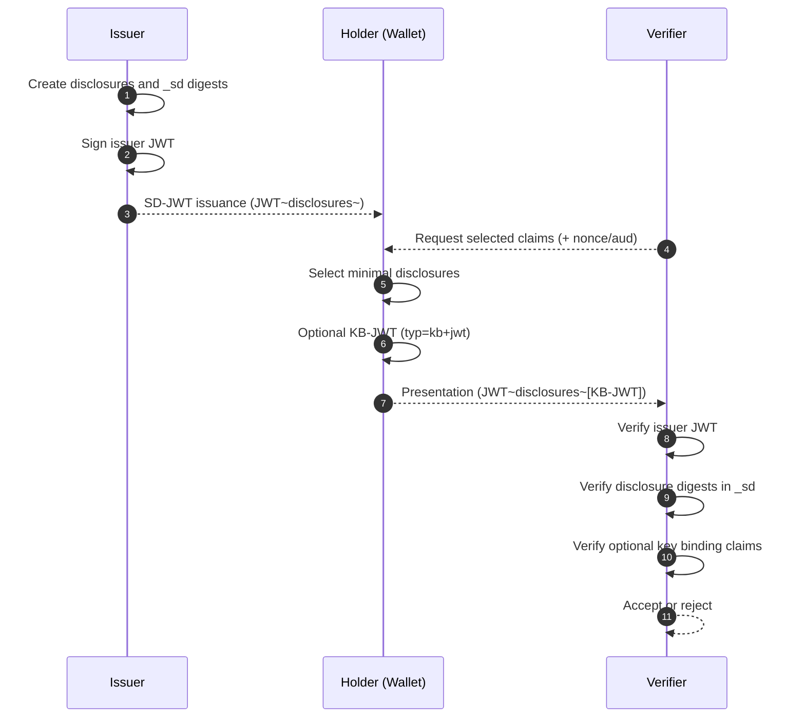

# SD-JWT Deep Dive (RFC 9901)

This document explains SD-JWT fundamentals in beginner-friendly terms and maps each concept to the implementation in this repository.

## Why SD-JWT Exists

A classic JWT is signed as a whole object. If a holder removes one claim before presentation, the signature no longer verifies.

That creates an all-or-nothing disclosure model:

- Verifier needs one fact (for example, age over 18)
- Holder still has to present the full payload
- Unnecessary data is exposed

SD-JWT solves this by signing digests for disclosable claims and sending real claim values as separate disclosures.

## SD-JWT Artifact Structure

In compact form, SD-JWT uses `~`-separated components:

- Issuance artifact: `<Issuer-Signed-JWT>~<Disclosure-1>~...~`
- Presentation artifact with key binding: `<Issuer-Signed-JWT>~<Disclosure-1>~...~<KB-JWT>`

Important behavior in this codebase:

- Issuance strings include a trailing `~`.
- When key binding is used, the final component is a `kb+jwt` token.

## Core Claims and Headers

| Claim/Header | Purpose |
| --- | --- |
| `typ` (issuer JWT header) | `sd+jwt` token type |
| `_sd` | Digest list for disclosable claims |
| `_sd_alg` | Hash algorithm for disclosure digests (`sha-256` by default) |
| `cnf` | Holder key binding material (typically `jwk`) |
| `typ` (KB-JWT header) | `kb+jwt` |
| `sd_hash` (KB-JWT claim) | Binds KB-JWT to the presented SD-JWT artifact |

## How Selective Disclosure Works

### 1. Disclosure creation

A disclosure is a Base64url-encoded JSON array:

- Object claim disclosure: `[salt, claim_name, claim_value]`
- Array element disclosure: `[salt, claim_value]`

### 2. Digest creation

Issuer and verifier compute digests over the encoded disclosure string:

`digest = BASE64URL(HASH(ASCII(encoded_disclosure)))`

This library allows secure SHA-2 options (SHA-256, SHA-384, SHA-512) and rejects weak hashes.

### 3. Signature binding

The issuer inserts disclosure digests into `_sd` and signs the issuer JWT. Later, a verifier can confirm each presented disclosure by recomputing and matching digest values.

## End-to-End Lifecycle

### Phase 1: Issuance

1. Issuer marks claims as selectively disclosable.
2. Library creates disclosures and digest entries in `_sd`.
3. Issuer signs JWT and returns `JWT~disclosures~`.

### Phase 2: Holder presentation

1. Holder selects only required disclosures.
2. Holder optionally creates KB-JWT including `sd_hash`, `nonce`, `aud`, `iat`.
3. Holder sends compact presentation artifact.

### Phase 3: Verifier validation

1. Verify issuer signature.
2. Recompute digest for every presented disclosure and match against `_sd`.
3. If KB-JWT is present, validate holder key (`cnf.jwk`) and binding claims (`sd_hash`, nonce, audience, freshness).

## Implementation References

- Core constants: [`src/SdJwt.Net/SdJwtConstants.cs`](../../src/SdJwt.Net/SdJwtConstants.cs)
- Issuance flow: [`src/SdJwt.Net/Issuer/SdIssuer.cs`](../../src/SdJwt.Net/Issuer/SdIssuer.cs)
- Disclosure model: [`src/SdJwt.Net/Models/Disclosure.cs`](../../src/SdJwt.Net/Models/Disclosure.cs)
- Holder presentation: [`src/SdJwt.Net/Holder/SdJwtHolder.cs`](../../src/SdJwt.Net/Holder/SdJwtHolder.cs)
- Verifier flow: [`src/SdJwt.Net/Verifier/SdVerifier.cs`](../../src/SdJwt.Net/Verifier/SdVerifier.cs)
- Parser rules: [`src/SdJwt.Net/Utils/SdJwtParser.cs`](../../src/SdJwt.Net/Utils/SdJwtParser.cs)
- Package overview: [`src/SdJwt.Net/README.md`](../../src/SdJwt.Net/README.md)

## Beginner Pitfalls to Avoid

- Do not treat missing disclosures as false values. They are unknown values.
- Do not skip KB-JWT verification when verifier policy requires holder binding.
- Keep nonce and audience checks strict to prevent replay and forwarding.
- Use decoy digests where privacy policy requires claim-count obfuscation.

## Related Concepts

- [Selective Disclosure Mechanics](selective-disclosure-mechanics.md)
- [Verifiable Credential Deep Dive](verifiable-credential-deep-dive.md)
- [OID4VP Deep Dive](openid4vp-deep-dive.md)
- [Presentation Exchange Deep Dive](presentation-exchange-deep-dive.md)
