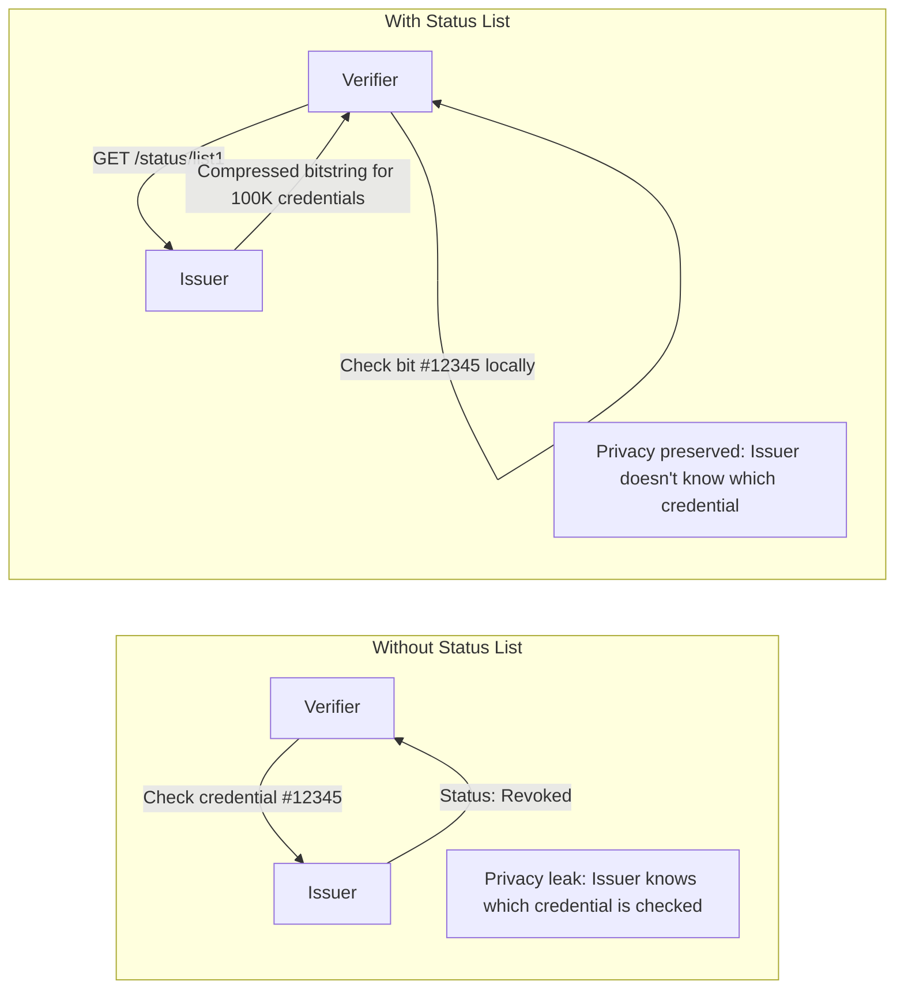
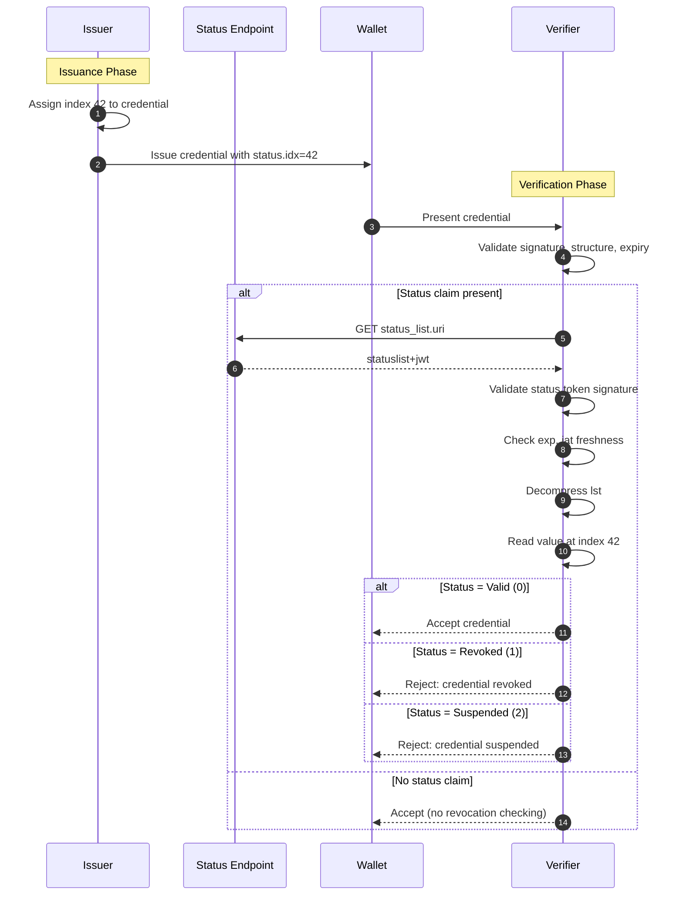

# Status List Deep Dive

This document explains Status Lists for managing credential lifecycle: revocation, suspension, and high-scale status checks without privacy leakage.

## Prerequisites

Before reading this document, you should understand:

| Prerequisite     | Why Needed                   | Resource                                           |
| ---------------- | ---------------------------- | -------------------------------------------------- |
| SD-JWT VC basics | Status lists apply to VCs    | [VC Deep Dive](verifiable-credential-deep-dive.md) |
| JWT structure    | Status lists are signed JWTs | [SD-JWT Deep Dive](sd-jwt-deep-dive.md)            |

## Glossary

| Term                  | Definition                                                   |
| --------------------- | ------------------------------------------------------------ |
| **Status List**       | Compressed bitstring representing status of many credentials |
| **Status List Token** | Signed JWT containing the status list data                   |
| **Referenced Token**  | A credential that points to a status list                    |
| **Index**             | Position of a credential's status within the status list     |
| **Bits**              | Number of bits per status entry (1, 2, 4, or 8)              |
| **Revocation**        | Permanent invalidation of a credential                       |
| **Suspension**        | Temporary invalidation (can be lifted)                       |
| **TTL**               | Time-to-live for caching the status list                     |

## Why Status Lists Matter

**Problem:** A credential is valid when issued but may become invalid later:

- Employee leaves company (revoke employment credential)
- Driver's license suspended (suspend, don't revoke)
- University discovers fraud (revoke degree)

**Without Status Lists:**

- Verifier must call Issuer for each credential check (privacy leak)
- Issuer learns who is verifying which credentials
- High load on issuer infrastructure

**With Status Lists:**

- Single signed token represents status of thousands of credentials
- Verifier fetches anonymously and caches
- Issuer does not know which specific credential is being checked



## How It Works: The Data Model

### 1. Credential Points to Status List

When issuing a credential, include a `status` claim:

```json
{
  "iss": "https://university.example.edu",
  "vct": "https://credentials.example.edu/degree",
  "sub": "did:example:student123",
  "given_name": "Alice",
  "degree": "Bachelor of Science",
  "status": {
    "status_list": {
      "idx": 42,
      "uri": "https://university.example.edu/status/degrees-2024"
    }
  }
}
```

| Field                    | Purpose                                       |
| ------------------------ | --------------------------------------------- |
| `status.status_list.idx` | This credential's position in the status list |
| `status.status_list.uri` | Where to fetch the status list token          |

### 2. Status List Token Structure

The status endpoint returns a signed JWT (`statuslist+jwt`):

**Header:**

```json
{
  "typ": "statuslist+jwt",
  "alg": "ES256",
  "kid": "status-key-2024"
}
```

**Payload:**

```json
{
  "sub": "https://university.example.edu/status/degrees-2024",
  "iat": 1701234567,
  "exp": 1701238167,
  "ttl": 3600,
  "status_list": {
    "bits": 2,
    "lst": "eNrbuRgAAhcBXQ",
    "aggregation_uri": "https://university.example.edu/status/aggregation"
  }
}
```

| Field              | Required | Purpose                                        |
| ------------------ | -------- | ---------------------------------------------- |
| `sub`              | Yes      | Must match the `uri` in referenced credentials |
| `iat`              | Yes      | When the status list was created               |
| `exp`              | No       | When the status list expires                   |
| `ttl`              | No       | How long verifiers may cache (seconds)         |
| `status_list.bits` | Yes      | Bits per entry: 1, 2, 4, or 8                  |
| `status_list.lst`  | Yes      | Base64url-encoded compressed bitstring         |
| `aggregation_uri`  | No       | For discovering multiple status lists          |

### 3. Decoding the Status Value

The `lst` field is a compressed bitstring. To check credential at index 42:

```
1. Base64url decode -> compressed bytes
2. DEFLATE decompress -> raw bitstring
3. Extract bits at position (idx * bits_per_entry)
4. Interpret value according to status semantics
```

## Status Value Semantics

The number of bits determines how many distinct statuses you can represent:

| Bits | Max Statuses | Use Case                               |
| ---- | ------------ | -------------------------------------- |
| 1    | 2            | Valid (0) / Revoked (1)                |
| 2    | 4            | Valid / Revoked / Suspended / Reserved |
| 4    | 16           | Application-specific needs             |
| 8    | 256          | Rich status taxonomy                   |

**Standard values (this implementation):**

| Value | Hex    | Meaning              |
| ----- | ------ | -------------------- |
| 0     | `0x00` | Valid                |
| 1     | `0x01` | Invalid (Revoked)    |
| 2     | `0x02` | Suspended            |
| 3     | `0x03` | Application-specific |

## Complete Verification Flow



## Code Example: Issuer Creating Status List

```csharp
using SdJwt.Net.StatusList.Issuer;
using SdJwt.Net.StatusList.Models;
using Microsoft.IdentityModel.Tokens;
using System.Security.Cryptography;

// Setup signing key (use separate key from credential signing)
using var ecdsa = ECDsa.Create(ECCurve.NamedCurves.nistP256);
var statusSigningKey = new ECDsaSecurityKey(ecdsa) { KeyId = "status-key-2024" };

// Create status list manager
var manager = new StatusListManager(statusSigningKey, SecurityAlgorithms.EcdsaSha256);

// Initialize status values for 10,000 credentials
// All start as Valid (0)
var statusValues = new byte[10000];

// Revoke credential at index 42
statusValues[42] = (byte)StatusType.Invalid;

// Suspend credential at index 100
statusValues[100] = (byte)StatusType.Suspended;

// Create the status list token
string statusListToken = await manager.CreateStatusListTokenAsync(
    subject: "https://university.example.edu/status/degrees-2024",
    statusValues: statusValues,
    bits: 2,  // 2 bits = 4 possible states
    validUntil: DateTime.UtcNow.AddHours(24),
    timeToLive: 3600  // Cache for 1 hour
);

// Publish at the status endpoint
await PublishStatusListAsync(
    uri: "https://university.example.edu/status/degrees-2024",
    token: statusListToken
);
```

## Code Example: Updating Status (Revocation)

```csharp
// Revoke a credential
var updates = new Dictionary<int, StatusType>
{
    [42] = StatusType.Invalid,  // Revoke credential at index 42
    [99] = StatusType.Suspended  // Suspend credential at index 99
};

string updatedToken = await manager.UpdateStatusAsync(
    existingToken: currentStatusListToken,
    updates: updates
);

// Publish the updated status list
await PublishStatusListAsync(uri, updatedToken);
```

## Code Example: Verifier Checking Status

```csharp
using SdJwt.Net.StatusList.Verifier;
using SdJwt.Net.StatusList.Models;

// Create verifier (with caching)
var verifier = new StatusListVerifier(
    httpClient: httpClient,
    memoryCache: cache,
    logger: logger
);

// Extract status claim from credential
var statusClaim = new StatusClaim
{
    StatusList = new StatusListReference
    {
        Index = 42,
        Uri = "https://university.example.edu/status/degrees-2024"
    }
};

// Check status
var result = await verifier.CheckStatusAsync(
    statusClaim: statusClaim,
    issuerKeyProvider: async uri => await GetStatusSigningKey(uri),
    options: new StatusListOptions
    {
        EnableStatusChecking = true,
        CacheDuration = TimeSpan.FromMinutes(15),
        FailOnStatusCheckError = true  // Fail-closed behavior
    }
);

switch (result.Status)
{
    case StatusType.Valid:
        Console.WriteLine("Credential is valid");
        break;
    case StatusType.Invalid:
        Console.WriteLine($"Credential REVOKED at index {statusClaim.StatusList.Index}");
        break;
    case StatusType.Suspended:
        Console.WriteLine("Credential is SUSPENDED");
        break;
}
```

## Operational Considerations

### Key Separation

Use separate keys for credential signing and status list signing:

```csharp
// Credential signing key (long-term, high security)
var credentialKey = LoadFromHsm("credential-signing-key");

// Status list signing key (can be rotated more frequently)
var statusKey = LoadFromHsm("status-signing-key");
```

### Caching Strategy

| Scenario               | TTL          | Rationale                        |
| ---------------------- | ------------ | -------------------------------- |
| High-value credentials | 5-15 minutes | Near real-time revocation needed |
| Standard credentials   | 1-4 hours    | Balance freshness and load       |
| Low-risk scenarios     | 24 hours     | Reduce issuer load               |

### Fail-Open vs Fail-Closed

| Behavior    | When to Use                        | Risk                                     |
| ----------- | ---------------------------------- | ---------------------------------------- |
| Fail-closed | High-security: financial, medical  | Service disruption if status unavailable |
| Fail-open   | Low-risk: newsletters, preferences | May accept revoked credentials           |

```csharp
// Fail-closed (reject if status check fails)
options.FailOnStatusCheckError = true;

// Fail-open (accept if status check fails)
options.FailOnStatusCheckError = false;
```

## Implementation References

| Component             | File                                                                                                         | Description                 |
| --------------------- | ------------------------------------------------------------------------------------------------------------ | --------------------------- |
| Status claim model    | [StatusClaim.cs](../../src/SdJwt.Net.StatusList/Models/StatusClaim.cs)                                       | Credential status reference |
| Status list reference | [StatusListReference.cs](../../src/SdJwt.Net.StatusList/Models/StatusListReference.cs)                       | idx + uri structure         |
| Token payload         | [StatusListTokenPayload.cs](../../src/SdJwt.Net.StatusList/Models/StatusListTokenPayload.cs)                 | JWT payload model           |
| Status list data      | [StatusListData.cs](../../src/SdJwt.Net.StatusList/Models/StatusListData.cs)                                 | Bits + lst structure        |
| Status type enum      | [StatusType.cs](../../src/SdJwt.Net.StatusList/Models/StatusType.cs)                                         | Valid/Invalid/Suspended     |
| Issuer manager        | [StatusListManager.cs](../../src/SdJwt.Net.StatusList/Issuer/StatusListManager.cs)                           | Create/update status lists  |
| Verifier              | [StatusListVerifier.cs](../../src/SdJwt.Net.StatusList/Verifier/StatusListVerifier.cs)                       | Check credential status     |
| Package overview      | [README.md](../../src/SdJwt.Net.StatusList/README.md)                                                        | Quick start                 |
| Sample code           | [StatusListExample.cs](../../samples/SdJwt.Net.Samples/Standards/VerifiableCredentials/StatusListExample.cs) | Working examples            |

## Beginner Pitfalls to Avoid

### 1. Not Validating Credential Before Status Check

**Wrong:** Check status first, then validate credential signature.

**Right:** Always validate the credential (signature, structure, expiry) before checking status.

```csharp
// WRONG order
var statusResult = await CheckStatusAsync(credential);
var signatureValid = await ValidateSignatureAsync(credential);

// RIGHT order
var signatureValid = await ValidateSignatureAsync(credential);
if (signatureValid)
{
    var statusResult = await CheckStatusAsync(credential);
}
```

### 2. Ignoring TTL and Expiry

**Wrong:** Caching status lists indefinitely.

**Right:** Honor `ttl` for cache duration and `exp` for validity.

```csharp
// Check if status list has expired
if (statusListPayload.ExpiresAt.HasValue)
{
    var expiry = DateTimeOffset.FromUnixTimeSeconds(statusListPayload.ExpiresAt.Value);
    if (DateTimeOffset.UtcNow > expiry)
    {
        // Must fetch fresh status list
        await RefreshStatusListAsync(uri);
    }
}
```

### 3. Using Same Key for Credentials and Status Lists

**Wrong:** Sharing keys between credential issuance and status list signing.

**Right:** Use separate keys with potentially different rotation schedules.

### 4. Not Handling Status Check Failures

**Wrong:** Crashing or hanging when status endpoint is unavailable.

**Right:** Define explicit fail-open or fail-closed behavior.

## Frequently Asked Questions

### Q: What happens if the status endpoint is down?

**A:** Depends on your configuration:

- `FailOnStatusCheckError = true`: Verification fails (fail-closed)
- `FailOnStatusCheckError = false`: Status check skipped (fail-open)

Choose based on your security requirements.

### Q: How do I undo a revocation?

**A:** Use suspension instead of revocation if you might need to restore validity. Update the status value back to `Valid (0)`.

### Q: Can I have multiple status lists per issuer?

**A:** Yes. Each credential points to a specific `uri`. You might have separate status lists for:

- Different credential types
- Different time periods (degrees-2024, degrees-2025)
- Different geographic regions

### Q: How large can a status list be?

**A:** With DEFLATE compression, a status list for 1 million credentials with 2-bit entries is approximately 250KB. The compressed format is very efficient.

### Q: Should I include status in every credential?

**A:** Include status if:

- The credential can be revoked (employment, certifications)
- The credential can be suspended (licenses)

Do not include status for immutable credentials where revocation is not meaningful.

## Related Concepts

- [Verifiable Credential Deep Dive](verifiable-credential-deep-dive.md) - VCs that reference status lists
- [OID4VP Deep Dive](openid4vp-deep-dive.md) - Presenting credentials with status checks
- [SD-JWT Deep Dive](sd-jwt-deep-dive.md) - Base format for credentials
