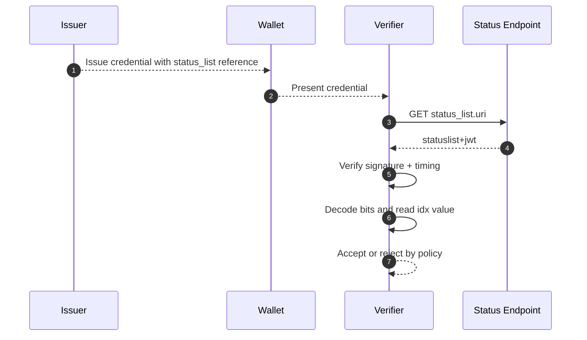

# Status List Deep Dive

This document explains Status Lists for SD-JWT VC lifecycle control: revocation, suspension, and high-scale status checks.

## Why Status Lists Matter

A credential can be valid at issuance time and invalid later. Signature validity alone does not capture this lifecycle.

Status Lists provide a scalable mechanism where one signed token can represent status for many credentials.

## Core Data Model

### 1. `status` claim in credential

Each credential can include a pointer to status data:

```json
{
  "status": {
    "status_list": {
      "idx": 42,
      "uri": "https://issuer.example.com/status/1"
    }
  }
}
```

- `idx`: position of this credential in the status list
- `uri`: endpoint where the status list token is retrieved

### 2. Status List Token payload

The status endpoint returns a signed `statuslist+jwt` whose payload includes:

| Field | Purpose |
| --- | --- |
| `sub` | Status list token URI/identifier |
| `iat` | Issued-at time |
| `exp` | Optional expiry |
| `ttl` | Optional cache guidance |
| `status_list.bits` | Bits per credential status entry (1, 2, 4, or 8) |
| `status_list.lst` | Compressed Base64url status bitstring |
| `status_list.aggregation_uri` | Optional aggregation endpoint |

## Status Value Semantics

Common values used in this implementation:

- `0x00`: Valid
- `0x01`: Invalid (revoked)
- `0x02`: Suspended
- `0x03`: Application-specific or under investigation

## Verification Flow

1. Verifier receives credential containing `status.status_list`.
2. Verifier fetches status list token from `uri` (with caching policy).
3. Verifier validates status token signature and timing constraints.
4. Verifier decompresses `lst`, resolves value at `idx`, and applies policy.



## Operational Notes

- Separate status-signing and credential-signing keys where possible.
- Honor `ttl` and `exp` to avoid stale status decisions.
- Decide fail-closed vs fail-open behavior explicitly per risk profile.
- Use bounded caching and retry policy to protect availability.

## Implementation References

- Status claim model: [`src/SdJwt.Net.StatusList/Models/StatusClaim.cs`](../../src/SdJwt.Net.StatusList/Models/StatusClaim.cs)
- Status list reference model: [`src/SdJwt.Net.StatusList/Models/StatusListReference.cs`](../../src/SdJwt.Net.StatusList/Models/StatusListReference.cs)
- Token payload model: [`src/SdJwt.Net.StatusList/Models/StatusListTokenPayload.cs`](../../src/SdJwt.Net.StatusList/Models/StatusListTokenPayload.cs)
- Status list data model: [`src/SdJwt.Net.StatusList/Models/StatusListData.cs`](../../src/SdJwt.Net.StatusList/Models/StatusListData.cs)
- Status type enum: [`src/SdJwt.Net.StatusList/Models/StatusType.cs`](../../src/SdJwt.Net.StatusList/Models/StatusType.cs)
- Issuer manager: [`src/SdJwt.Net.StatusList/Issuer/StatusListManager.cs`](../../src/SdJwt.Net.StatusList/Issuer/StatusListManager.cs)
- Verifier: [`src/SdJwt.Net.StatusList/Verifier/StatusListVerifier.cs`](../../src/SdJwt.Net.StatusList/Verifier/StatusListVerifier.cs)
- Package overview: [`src/SdJwt.Net.StatusList/README.md`](../../src/SdJwt.Net.StatusList/README.md)
- Sample: [`samples/SdJwt.Net.Samples/Standards/VerifiableCredentials/StatusListExample.cs`](../../samples/SdJwt.Net.Samples/Standards/VerifiableCredentials/StatusListExample.cs)
- Guide: [`docs/guides/managing-revocation.md`](../guides/managing-revocation.md)

## Related Concepts

- [Verifiable Credential Deep Dive](verifiable-credential-deep-dive.md)
- [OID4VP Deep Dive](openid4vp-deep-dive.md)
- [SD-JWT Deep Dive](sd-jwt-deep-dive.md)
