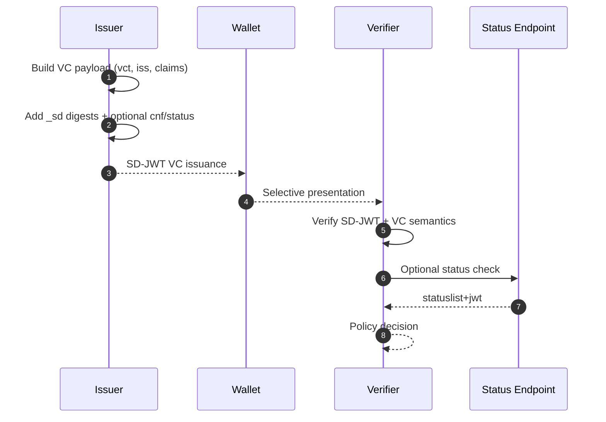

# SD-JWT VC Deep Dive

This document explains SD-JWT Verifiable Credentials (SD-JWT VC): what they add beyond raw SD-JWT, and how they are issued, presented, and verified in this repository.

## Why SD-JWT VC Exists

SD-JWT handles selective disclosure, but by itself it does not define credential semantics. A verifier still needs standard meaning for claims such as type, issuer, and lifecycle status.

SD-JWT VC adds that semantic layer so verifiers can make deterministic policy decisions.

## SD-JWT VC Core Structure

An SD-JWT VC is still an SD-JWT artifact, but its signed payload carries VC-specific semantics.

| Claim/Header | Meaning |
| --- | --- |
| `typ` header | `dc+sd-jwt` (legacy `vc+sd-jwt` accepted for compatibility) |
| `vct` | Verifiable Credential Type identifier |
| `vct#integrity` | Optional integrity binding for external type metadata |
| `iss` | Credential issuer identifier |
| `sub` | Subject identifier (policy-dependent) |
| `status` | Status list reference for revocation/suspension checks |
| `cnf` | Holder binding key material |
| `_sd`, `_sd_alg` | Selective disclosure digest structures |

## Lifecycle

### 1. Issuance

1. Issuer creates a VC payload with `vct`, issuer context, and domain claims.
2. Sensitive claims are marked selectively disclosable.
3. Issuer can include `status` and `cnf` for lifecycle and holder binding.
4. Underlying SD-JWT issuance produces signed JWT + disclosures.

### 2. Holder presentation

1. Holder receives verifier requirements (usually via OID4VP).
2. Holder discloses only requested claims.
3. Holder may include KB-JWT for proof-of-possession.

### 3. Verifier validation

1. Verify SD-JWT signature and disclosure digests.
2. Enforce VC semantics (`typ`, `vct`, issuer trust, optional `vct#integrity`).
3. If `status` exists, resolve and validate status token.
4. Apply relying-party policy (trust framework, HAIP, business policy).

## Implementation References

- VC issuer: [`src/SdJwt.Net.Vc/Issuer/SdJwtVcIssuer.cs`](../../src/SdJwt.Net.Vc/Issuer/SdJwtVcIssuer.cs)
- VC payload model: [`src/SdJwt.Net.Vc/Models/VerifiableCredentialPayload.cs`](../../src/SdJwt.Net.Vc/Models/VerifiableCredentialPayload.cs)
- VC verifier: [`src/SdJwt.Net.Vc/Verifier/SdJwtVcVerifier.cs`](../../src/SdJwt.Net.Vc/Verifier/SdJwtVcVerifier.cs)
- Status integration validator: [`src/SdJwt.Net.Vc/Verifier/StatusListSdJwtVcStatusValidator.cs`](../../src/SdJwt.Net.Vc/Verifier/StatusListSdJwtVcStatusValidator.cs)
- Type metadata resolver: [`src/SdJwt.Net.Vc/Metadata/TypeMetadataResolver.cs`](../../src/SdJwt.Net.Vc/Metadata/TypeMetadataResolver.cs)
- Package overview: [`src/SdJwt.Net.Vc/README.md`](../../src/SdJwt.Net.Vc/README.md)
- VC sample: [`samples/SdJwt.Net.Samples/Standards/VerifiableCredentials/VerifiableCredentialsExample.cs`](../../samples/SdJwt.Net.Samples/Standards/VerifiableCredentials/VerifiableCredentialsExample.cs)

## Beginner Pitfalls to Avoid

- Signature validation alone is not enough; enforce VC semantics and trust policy.
- If `status` is present, status checking should be part of verification policy.
- Treat legacy `vc+sd-jwt` as compatibility behavior, not new profile direction.
- Keep high-sensitivity claims disclosable by default instead of always plaintext.

## Related Concepts

- [SD-JWT Deep Dive](sd-jwt-deep-dive.md)
- [Status List Deep Dive](status-list-deep-dive.md)
- [OID4VCI Deep Dive](openid4vci-deep-dive.md)
- [OID4VP Deep Dive](openid4vp-deep-dive.md)
