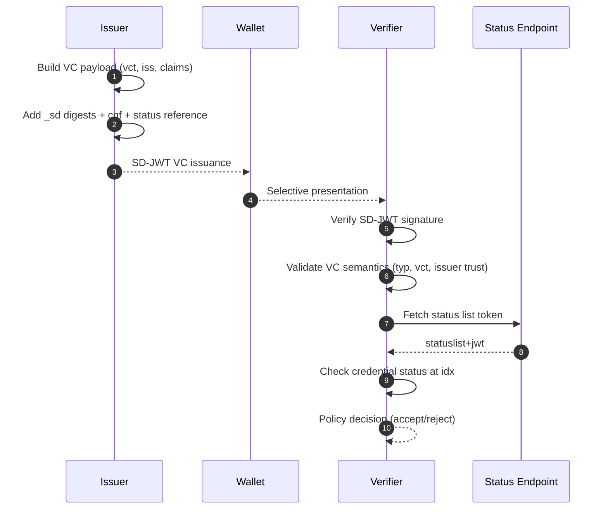

# SD-JWT Verifiable Credentials Deep Dive

This document explains SD-JWT Verifiable Credentials (SD-JWT VC): what they add beyond raw SD-JWT, and how they are issued, presented, and verified.

## Prerequisites

Before reading this document, you should understand:

- SD-JWT fundamentals from [SD-JWT Deep Dive](sd-jwt-deep-dive.md)
- Basic concepts of digital credentials and identity verification
- JSON Web Tokens (JWT) structure

## Why SD-JWT VC Exists

SD-JWT handles selective disclosure, but by itself it does not define credential semantics. A verifier still needs standard meanings for claims such as type, issuer, and lifecycle status.

**Problem with raw SD-JWT:**

```json
{
  "iss": "https://example.com",
  "given_name": "Alice",
  "family_name": "Smith"
}
```

Questions the verifier cannot answer:

- What type of credential is this?
- Is this a driver's license, university degree, or employment record?
- Has this credential been revoked?
- Can I trust this issuer for this credential type?

**SD-JWT VC adds semantic layer:**

```json
{
  "iss": "https://university.example.edu",
  "vct": "https://credentials.example.com/UniversityDegree",
  "status": {
    "status_list": {
      "idx": 42,
      "uri": "https://university.example.edu/status/1"
    }
  },
  "given_name": "Alice",
  "degree": "Bachelor of Science"
}
```

Now the verifier knows: credential type, status check endpoint, and can apply type-specific trust policies.

## Glossary

| Term | Definition |
| --- | --- |
| **Verifiable Credential (VC)** | A tamper-evident credential with cryptographically verifiable authorship |
| **vct** | Verifiable Credential Type - unique identifier for the credential schema |
| **Status List** | Compact mechanism to check if credential is valid, revoked, or suspended |
| **Issuer** | Entity that creates and signs the credential |
| **Holder** | Entity that stores and presents the credential |
| **Verifier** | Entity that validates the credential and makes trust decisions |
| **cnf** | Confirmation claim containing holder's public key for binding |

## SD-JWT VC Structure

An SD-JWT VC is still an SD-JWT artifact, but its signed payload carries VC-specific semantics.

### Header Example

```json
{
  "alg": "ES256",
  "typ": "dc+sd-jwt"
}
```

The `typ` header value `dc+sd-jwt` identifies this as a Digital Credential using SD-JWT format.

### Payload Example

```json
{
  "iss": "https://university.example.edu",
  "iat": 1704067200,
  "exp": 1735689600,
  "vct": "https://credentials.example.com/UniversityDegree",
  "vct#integrity": "sha256-WZO1qV8aVgE8H0wc8c5VpVqQjYK...",
  "sub": "did:key:z6MkhaXgBZDvotDkL5257faiztiGiC2QtKLGpbnnEGta2doK",
  "cnf": {
    "jwk": {
      "kty": "EC",
      "crv": "P-256",
      "x": "TCAER19Zvu3OHF4j4W4vfSVoHIP1ILilDls7vCeGemc",
      "y": "ZxjiWWbZMQGHVWKVQ4hbSIirsVfuecCE6t4jT9F2HZQ"
    }
  },
  "status": {
    "status_list": {
      "idx": 42,
      "uri": "https://university.example.edu/status/degrees"
    }
  },
  "given_name": "Alice",
  "family_name": "Smith",
  "degree": "Bachelor of Science",
  "graduation_year": 2024,
  "_sd": ["JnPBS7TpL8...", "xF9bZ8cQ2Y..."],
  "_sd_alg": "sha-256"
}
```

### Claim Reference

| Claim/Header | Location | Purpose |
| --- | --- | --- |
| `typ` = `dc+sd-jwt` | Header | Identifies SD-JWT VC format (legacy: `vc+sd-jwt`) |
| `vct` | Payload | Verifiable Credential Type identifier |
| `vct#integrity` | Payload | Optional hash binding for external type metadata |
| `iss` | Payload | Credential issuer identifier (URL or DID) |
| `sub` | Payload | Subject identifier (policy-dependent) |
| `status` | Payload | Status list reference for revocation/suspension |
| `cnf` | Payload | Holder binding key material |
| `iat` | Payload | Issuance timestamp |
| `exp` | Payload | Expiration timestamp |
| `_sd`, `_sd_alg` | Payload | Selective disclosure digest structures |

## Lifecycle

### Phase 1: Issuance

The issuer creates a Verifiable Credential with proper semantics:

```csharp
using SdJwt.Net.Vc.Issuer;
using SdJwt.Net.Vc.Models;
using Microsoft.IdentityModel.Tokens;

// Create VC issuer
var issuer = new SdJwtVcIssuer(issuerSigningKey, SecurityAlgorithms.EcdsaSha256);

// Build VC payload with required claims
var vcPayload = new VerifiableCredentialPayload
{
    Issuer = "https://university.example.edu",
    Subject = "did:key:z6MkhaXgBZDvotDkL5257faiztiGiC2QtKLGpbnnEGta2doK",
    VerifiableCredentialType = "https://credentials.example.com/UniversityDegree",
    IssuedAt = DateTimeOffset.UtcNow,
    ExpirationTime = DateTimeOffset.UtcNow.AddYears(4),
    
    // Domain-specific claims
    Claims = new Dictionary<string, object>
    {
        ["given_name"] = "Alice",
        ["family_name"] = "Smith",
        ["degree"] = "Bachelor of Science",
        ["graduation_year"] = 2024,
        ["gpa"] = 3.85
    }
};

// Configure selective disclosure
var options = new VcIssuanceOptions
{
    DisclosureStructure = new
    {
        given_name = true,
        family_name = true,
        gpa = true  // GPA can be hidden
        // degree and graduation_year always visible
    },
    
    // Add status reference for revocation support
    Status = new StatusReference
    {
        StatusListUri = "https://university.example.edu/status/degrees",
        StatusListIndex = 42
    }
};

// Issue the credential
var result = issuer.Issue(vcPayload, options, holderPublicJwk);
```

**What the holder receives:**

```text
eyJhbGciOiJFUzI1NiIsInR5cCI6ImRjK3NkLWp3dCJ9.eyJpc3MiOiJodHRwczovL3VuaXZlcnNpdHkuZXhhbXBsZS5lZHUiLCJ2Y3QiOiJodHRwczovL2NyZWRlbnRpYWxzLmV4YW1wbGUuY29tL1VuaXZlcnNpdHlEZWdyZWUiLCJkZWdyZWUiOiJCYWNoZWxvciBvZiBTY2llbmNlIiwiX3NkIjpbLi4uXX0.sig~disclosure1~disclosure2~disclosure3~
```

### Phase 2: Holder Presentation

When a verifier requests proof, the holder selects which claims to disclose:

```csharp
using SdJwt.Net.Holder;

// Holder creates selective presentation
var holder = new SdJwtHolder(result.Issuance);

// Employer only needs name and degree - NOT GPA
var presentation = holder.CreatePresentation(
    disclosure => disclosure.ClaimName == "given_name" ||
                  disclosure.ClaimName == "family_name",
    new JwtPayload
    {
        ["aud"] = "https://employer.example.com",
        ["nonce"] = "employer-hiring-2024-abc123",
        ["iat"] = DateTimeOffset.UtcNow.ToUnixTimeSeconds()
    },
    holderPrivateKey,
    SecurityAlgorithms.EcdsaSha256
);
```

### Phase 3: Verification

The verifier validates the credential with full VC semantics:

```csharp
using SdJwt.Net.Vc.Verifier;

var verifier = new SdJwtVcVerifier(
    issuerKeyResolver: async iss => await FetchIssuerKey(iss),
    statusValidator: new StatusListSdJwtVcStatusValidator(httpClient)
);

var result = await verifier.VerifyAsync(
    presentation,
    new VcValidationParameters
    {
        ValidateIssuer = true,
        TrustedIssuers = new[] { "https://university.example.edu" },
        
        ValidateCredentialType = true,
        AcceptedCredentialTypes = new[] { "https://credentials.example.com/UniversityDegree" },
        
        ValidateStatus = true,  // Check revocation status
        ValidateKeyBinding = true,
        ExpectedAudience = "https://employer.example.com",
        ExpectedNonce = "employer-hiring-2024-abc123"
    }
);

if (result.IsValid)
{
    // Access verified claims
    var givenName = result.DisclosedClaims["given_name"];
    var degree = result.DisclosedClaims["degree"];
}
```

### Verification Flow Diagram



## Common Use Cases

### University Degree Credential

```json
{
  "vct": "https://credentials.example.com/UniversityDegree",
  "given_name": "Alice",
  "family_name": "Smith",
  "degree": "Bachelor of Science",
  "major": "Computer Science",
  "graduation_year": 2024,
  "gpa": 3.85
}
```

**Selective disclosure scenarios:**

- Job application: disclose name, degree, major (hide GPA)
- Graduate school: disclose all including GPA
- Professional network: disclose degree type only

### Driver's License Credential

```json
{
  "vct": "https://credentials.example.com/DriverLicense",
  "given_name": "Bob",
  "family_name": "Jones",
  "birth_date": "1990-05-15",
  "license_class": "C",
  "address": {
    "street": "123 Main St",
    "city": "Springfield",
    "state": "CA"
  }
}
```

**Selective disclosure scenarios:**

- Age verification: derive "over 21" without revealing birth_date
- Car rental: disclose license_class only
- Address verification: disclose city/state only (hide street)

### Employment Credential

```json
{
  "vct": "https://credentials.example.com/Employment",
  "given_name": "Carol",
  "family_name": "Davis",
  "employer": "Acme Corp",
  "title": "Senior Engineer",
  "start_date": "2020-03-01",
  "salary": 150000
}
```

**Selective disclosure scenarios:**

- Background check: disclose employer, title, dates (hide salary)
- Mortgage application: disclose salary verification
- Professional network: disclose title only

## Implementation References

| Component | File | Description |
| --- | --- | --- |
| VC issuer | [SdJwtVcIssuer.cs](../../src/SdJwt.Net.Vc/Issuer/SdJwtVcIssuer.cs) | Create SD-JWT VCs |
| VC payload model | [VerifiableCredentialPayload.cs](../../src/SdJwt.Net.Vc/Models/VerifiableCredentialPayload.cs) | Payload structure |
| VC verifier | [SdJwtVcVerifier.cs](../../src/SdJwt.Net.Vc/Verifier/SdJwtVcVerifier.cs) | Validate VCs |
| Status validator | [StatusListSdJwtVcStatusValidator.cs](../../src/SdJwt.Net.Vc/Verifier/StatusListSdJwtVcStatusValidator.cs) | Status list integration |
| Type metadata | [TypeMetadataResolver.cs](../../src/SdJwt.Net.Vc/Metadata/TypeMetadataResolver.cs) | Resolve vct metadata |
| Package overview | [README.md](../../src/SdJwt.Net.Vc/README.md) | Quick start guide |
| Sample code | [VerifiableCredentialsExample.cs](../../samples/SdJwt.Net.Samples/Standards/VerifiableCredentials/VerifiableCredentialsExample.cs) | Working examples |

## Beginner Pitfalls to Avoid

### 1. Signature Validation Alone is Not Enough

**Wrong:** "The signature is valid, so I trust the credential."

**Right:** You must also validate:

- `vct` matches an accepted credential type for your use case
- `iss` is a trusted issuer for this credential type
- Status check passes (if `status` claim present)
- Key binding is valid (if required by policy)

```csharp
// WRONG - signature only
if (jwt.SignatureValid) { Accept(); }

// RIGHT - full VC validation
var result = await vcVerifier.VerifyAsync(presentation, new VcValidationParameters
{
    ValidateIssuer = true,
    ValidateCredentialType = true,
    ValidateStatus = true,
    ValidateKeyBinding = true
});
```

### 2. Ignoring Status Checks

If a credential has a `status` claim, status checking should be part of your verification policy. A revoked credential may still have a valid signature.

### 3. Treating Legacy Type Header as New Standard

The type header changed from `vc+sd-jwt` to `dc+sd-jwt`. Accept both for compatibility but use `dc+sd-jwt` for new credentials.

### 4. Exposing High-Sensitivity Claims by Default

Keep sensitive claims (SSN, medical data, financial info) selectively disclosable by default, not always visible in the base JWT payload.

## Frequently Asked Questions

### Q: What is the difference between SD-JWT and SD-JWT VC?

**A:** SD-JWT is the base format for selective disclosure. SD-JWT VC adds credential semantics on top - type identification (`vct`), status checking, and standardized claim names that allow verifiers to understand what the credential represents.

### Q: Can I issue a credential without a status list?

**A:** Yes, the `status` claim is optional. However, without it you cannot revoke or suspend the credential after issuance. Consider your credential lifecycle requirements.

### Q: How do I choose what to make selectively disclosable?

**A:**

- **Always visible:** Credential type, issuer, expiration (verifiers need these)
- **Selectively disclosable:** Personal data, sensitive information
- **Rule of thumb:** If a verifier might need it but not always, make it disclosable

### Q: What happens if the verifier does not support my credential type?

**A:** The verifier should reject credentials with unknown `vct` values. This prevents accepting credentials outside the trust framework.

### Q: Can I have multiple credential types in one SD-JWT VC?

**A:** No, each SD-JWT VC has exactly one `vct` value. For multiple credential types, issue separate credentials.

## Related Concepts

- [SD-JWT Deep Dive](sd-jwt-deep-dive.md) - Base SD-JWT format
- [Status List Deep Dive](status-list-deep-dive.md) - Revocation and suspension
- [OID4VCI Deep Dive](openid4vci-deep-dive.md) - Credential issuance protocol
- [OID4VP Deep Dive](openid4vp-deep-dive.md) - Presentation protocol
