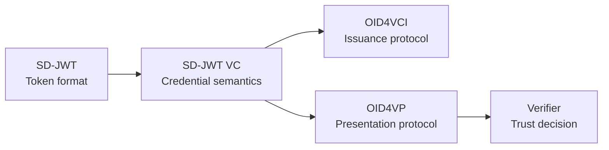
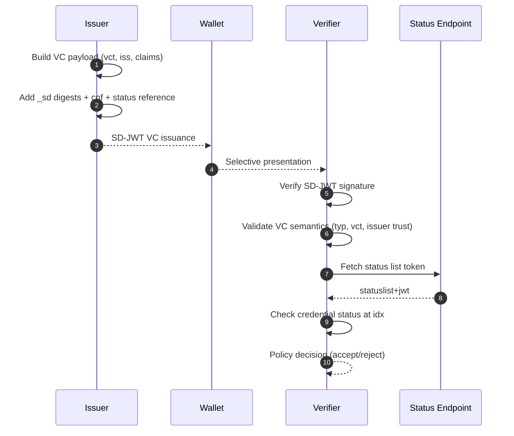

# SD-JWT Verifiable Credentials

> **Level:** Beginner concept + implementation

## Simple explanation

Raw SD-JWT gives you selective disclosure. SD-JWT VC adds credential meaning: what type of credential it is, who issued it, when it is valid, how to check status, and what trust policy a verifier should apply.

## What you will learn

- What SD-JWT VC adds on top of raw SD-JWT
- How `vct`, `iss`, `status`, and `cnf` claims work together
- How to issue, present, and verify credentials with `SdJwt.Net.Vc`
- How SD-JWT VC relates to OID4VCI and OID4VP

```text
SD-JWT   = privacy-preserving token format
SD-JWT VC = credential profile using that token format
OID4VCI  = how it is issued
OID4VP   = how it is presented
```

|                      |                                                                                                                                                                                                                                                                           |
| -------------------- | ------------------------------------------------------------------------------------------------------------------------------------------------------------------------------------------------------------------------------------------------------------------------- |
| **Audience**         | Developers building credential issuance or verification services, and architects designing trust frameworks.                                                                                                                                                              |
| **Purpose**          | Explain the semantic layer SD-JWT VC adds on top of raw SD-JWT - credential typing (`vct`), status references, and trust policies - and show how to issue, present, and verify credentials using `SdJwt.Net.Vc`.                                                          |
| **Scope**            | VC payload structure, `vct` and `status` claims, issuance/presentation/verification lifecycle with code, and common use cases. Out of scope: base SD-JWT mechanics (see [SD-JWT](sd-jwt.md)), protocol transport (see [OID4VCI](openid4vci.md) / [OID4VP](openid4vp.md)). |
| **Success criteria** | Reader can issue an SD-JWT VC with type metadata and status reference, create a selective presentation, and verify it with VC-layer checks including revocation checking.                                                                                                 |

## Prerequisites

Before reading this document, you should be familiar with:

- SD-JWT fundamentals from [SD-JWT](sd-jwt.md)
- Basic concepts of digital credentials and identity verification
- JSON Web Tokens (JWT) structure

## SD-JWT VC vs W3C VCDM 2.0 — two parallel specs

**SD-JWT VC is NOT the same as W3C Verifiable Credentials Data Model 2.0.** The two specifications come from different standards bodies (IETF vs W3C), target different securing mechanisms, and have incompatible data models.

| Aspect               | SD-JWT VC (IETF)                              | W3C VCDM 2.0                                |
| -------------------- | --------------------------------------------- | ------------------------------------------- |
| Spec body            | IETF (`draft-ietf-oauth-sd-jwt-vc`)           | W3C Recommendation                          |
| OID4VCI format       | `dc+sd-jwt`                                   | `jwt_vc_json`, `ldp_vc`                     |
| Type system          | `vct` claim (collision-resistant URI)         | `@context` + `type[]` (JSON-LD)             |
| Issuer claim         | `iss` (string URL)                            | `issuer` (string or object)                 |
| Dates                | `iat`/`exp`/`nbf` (Unix seconds)              | `validFrom`/`validUntil` (ISO 8601)         |
| Selective disclosure | `_sd` arrays (SD-JWT native)                  | `ecdsa-sd-2023` or `bbs-2023` suites        |
| Revocation           | `status.status_list` (IETF Token Status List) | `credentialStatus.BitstringStatusListEntry` |
| Package              | `SdJwt.Net.Vc`                                | `SdJwt.Net.VcDm`                            |

The IETF spec renamed `vc+sd-jwt` → `dc+sd-jwt` in late 2024 specifically to avoid confusion with W3C's `vc` media type namespace. The `dc` prefix stands for "Digital Credential", not "Data Model Compliant."

`SdJwt.Net.Vc` (this document) implements the IETF SD-JWT VC spec.  
For W3C VCDM 2.0 (`jwt_vc_json` / `ldp_vc` formats), see [W3C VCDM 2.0](w3c-vcdm.md) and the `SdJwt.Net.VcDm` package.

---

## Why SD-JWT VC exists

SD-JWT handles selective disclosure, but by itself it does not define credential semantics. A verifier still needs standard meanings for claims such as type, issuer, and lifecycle status.

**Problem with raw SD-JWT:**

```json
{
  "iss": "https://example.com",
  "given_name": "Alice",
  "family_name": "Smith"
}
```

Questions the verifier cannot answer:

- What type of credential is this?
- Is this a driver's license, university degree, or employment record?
- Has this credential been revoked?
- Can I trust this issuer for this credential type?

**SD-JWT VC adds semantic layer:**

```json
{
  "iss": "https://university.example.edu",
  "vct": "https://credentials.example.com/UniversityDegree",
  "status": {
    "status_list": {
      "idx": 42,
      "uri": "https://university.example.edu/status/1"
    }
  },
  "given_name": "Alice",
  "degree": "Bachelor of Science"
}
```

Now the verifier knows the credential type, where to check status, and can apply type-specific trust policies.

## Glossary

| Term                           | Definition                                                               |
| ------------------------------ | ------------------------------------------------------------------------ |
| **Verifiable Credential (VC)** | A tamper-evident credential with cryptographically verifiable authorship |
| **vct**                        | Verifiable Credential Type - unique identifier for the credential schema |
| **Status List**                | Compact mechanism to check if credential is valid, revoked, or suspended |
| **Issuer**                     | Entity that creates and signs the credential                             |
| **Holder**                     | Entity that stores and presents the credential                           |
| **Verifier**                   | Entity that validates the credential and makes trust decisions           |
| **cnf**                        | Confirmation claim containing holder's public key for binding            |

## The credential lifecycle at a glance



Each layer adds something:

| Layer     | What it adds                                    | SD-JWT .NET package |
| --------- | ----------------------------------------------- | ------------------- |
| SD-JWT    | Selective disclosure, hashes, key binding       | `SdJwt.Net`         |
| SD-JWT VC | Credential type, issuer, status, holder binding | `SdJwt.Net.Vc`      |
| OID4VCI   | Standard issuance protocol and metadata         | `SdJwt.Net.Oid4Vci` |
| OID4VP    | Standard presentation protocol and trust        | `SdJwt.Net.Oid4Vp`  |

### What a verifier can decide from an SD-JWT VC

| Claim            | Verifier question it answers                             |
| ---------------- | -------------------------------------------------------- |
| `vct`            | What type of credential is this?                         |
| `iss`            | Who issued it, and do I trust that issuer for this type? |
| `status`         | Has this credential been revoked or suspended?           |
| `cnf`            | Is the presenter the legitimate holder?                  |
| `exp` / `nbf`    | Is this credential within its validity period?           |
| Disclosed claims | Do the specific facts meet my business requirements?     |

## SD-JWT VC structure

An SD-JWT VC is still an SD-JWT artifact, but its signed payload carries VC-specific semantics.

### Header example

```json
{
  "alg": "ES256",
  "typ": "dc+sd-jwt"
}
```

The `typ` header value `dc+sd-jwt` identifies this as a Digital Credential using SD-JWT format.

### Payload example

```json
{
  "iss": "https://university.example.edu",
  "iat": 1704067200,
  "exp": 1735689600,
  "vct": "https://credentials.example.com/UniversityDegree",
  "vct#integrity": "sha256-WZO1qV8aVgE8H0wc8c5VpVqQjYK...",
  "sub": "did:key:z6MkhaXgBZDvotDkL5257faiztiGiC2QtKLGpbnnEGta2doK",
  "cnf": {
    "jwk": {
      "kty": "EC",
      "crv": "P-256",
      "x": "TCAER19Zvu3OHF4j4W4vfSVoHIP1ILilDls7vCeGemc",
      "y": "ZxjiWWbZMQGHVWKVQ4hbSIirsVfuecCE6t4jT9F2HZQ"
    }
  },
  "status": {
    "status_list": {
      "idx": 42,
      "uri": "https://university.example.edu/status/degrees"
    }
  },
  "given_name": "Alice",
  "family_name": "Smith",
  "degree": "Bachelor of Science",
  "graduation_year": 2024,
  "_sd": ["JnPBS7TpL8...", "xF9bZ8cQ2Y..."],
  "_sd_alg": "sha-256"
}
```

### Claim reference

| Claim/Header        | Location | Purpose                                           |
| ------------------- | -------- | ------------------------------------------------- |
| `typ` = `dc+sd-jwt` | Header   | Identifies SD-JWT VC format (legacy: `vc+sd-jwt`) |
| `vct`               | Payload  | Verifiable Credential Type identifier             |
| `vct#integrity`     | Payload  | Optional hash binding for external type metadata  |
| `iss`               | Payload  | Credential issuer identifier (URL or DID)         |
| `sub`               | Payload  | Subject identifier (policy-dependent)             |
| `status`            | Payload  | Status list reference for revocation/suspension   |
| `cnf`               | Payload  | Holder binding key material                       |
| `iat`               | Payload  | Issuance timestamp                                |
| `exp`               | Payload  | Expiration timestamp                              |
| `_sd`, `_sd_alg`    | Payload  | Selective disclosure digest structures            |

## Lifecycle

### Phase 1: Issuance

The issuer creates a Verifiable Credential with proper semantics:

```csharp
using SdJwt.Net.Vc.Issuer;
using SdJwt.Net.Vc.Models;
using SdJwt.Net.Issuer;
using Microsoft.IdentityModel.Tokens;

// Create VC issuer
var issuer = new SdJwtVcIssuer(issuerSigningKey, SecurityAlgorithms.EcdsaSha256);

// Build VC payload with required claims
var vcPayload = new SdJwtVcPayload
{
    Issuer = "https://university.example.edu",
    Subject = "did:key:z6MkhaXgBZDvotDkL5257faiztiGiC2QtKLGpbnnEGta2doK",
    IssuedAt = DateTimeOffset.UtcNow.ToUnixTimeSeconds(),
    ExpiresAt = DateTimeOffset.UtcNow.AddYears(4).ToUnixTimeSeconds(),

    // Domain-specific claims via AdditionalData
    AdditionalData = new Dictionary<string, object>
    {
        ["given_name"] = "Alice",
        ["family_name"] = "Smith",
        ["degree"] = "Bachelor of Science",
        ["graduation_year"] = 2024,
        ["gpa"] = 3.85
    }
};

// Configure selective disclosure
var options = new SdIssuanceOptions
{
    DisclosureStructure = new
    {
        given_name = true,
        family_name = true,
        gpa = true  // GPA can be hidden
        // degree and graduation_year always visible
    }
};

// Issue the credential (vctIdentifier is the first parameter)
var result = issuer.Issue(
    "https://credentials.example.com/UniversityDegree",
    vcPayload,
    options,
    holderPublicJwk);
```

**What the holder receives:**

```text
eyJhbGciOiJFUzI1NiIsInR5cCI6ImRjK3NkLWp3dCJ9.eyJpc3MiOiJodHRwczovL3VuaXZlcnNpdHkuZXhhbXBsZS5lZHUiLCJ2Y3QiOiJodHRwczovL2NyZWRlbnRpYWxzLmV4YW1wbGUuY29tL1VuaXZlcnNpdHlEZWdyZWUiLCJkZWdyZWUiOiJCYWNoZWxvciBvZiBTY2llbmNlIiwiX3NkIjpbLi4uXX0.sig~disclosure1~disclosure2~disclosure3~
```

### Phase 2: Holder Presentation

When a verifier requests proof, the holder selects which claims to disclose:

```csharp
using SdJwt.Net.Holder;

// Holder creates selective presentation
var holder = new SdJwtHolder(result.Issuance);

// Employer only needs name and degree - NOT GPA
var presentation = holder.CreatePresentation(
    disclosure => disclosure.ClaimName == "given_name" ||
                  disclosure.ClaimName == "family_name",
    new JwtPayload
    {
        ["aud"] = "https://employer.example.com",
        ["nonce"] = "employer-hiring-2024-abc123",
        ["iat"] = DateTimeOffset.UtcNow.ToUnixTimeSeconds()
    },
    holderPrivateKey,
    SecurityAlgorithms.EcdsaSha256
);
```

### Phase 3: Verification

The verifier validates the credential with VC-layer checks (type, status, issuer, expiry) on top of base SD-JWT signature and disclosure verification:

```csharp
using SdJwt.Net.Vc.Verifier;
using Microsoft.IdentityModel.Tokens;

var verifier = new SdJwtVcVerifier(
    issuerKeyProvider: async jwt => await FetchIssuerKey(jwt));

var policy = new SdJwtVcVerificationPolicy
{
    ExpectedVctType = "https://credentials.example.com/UniversityDegree",
    RequireStatusCheck = true,
    StatusValidator = new StatusListSdJwtVcStatusValidator(httpClient)
};

var validationParams = new TokenValidationParameters
{
    ValidateIssuer = true,
    ValidIssuers = new[] { "https://university.example.edu" },
    ValidateLifetime = true,
    ClockSkew = TimeSpan.FromMinutes(5)
};

var kbJwtParams = new TokenValidationParameters
{
    ValidateAudience = true,
    ValidAudiences = new[] { "https://employer.example.com" }
};

var result = await verifier.VerifyAsync(
    presentation,
    validationParams,
    kbJwtValidationParameters: kbJwtParams,
    expectedKbJwtNonce: "employer-hiring-2024-abc123",
    expectedVctType: "https://credentials.example.com/UniversityDegree",
    verificationPolicy: policy);

// Result is a record: SdJwtVcVerificationResult
// Properties: ClaimsPrincipal, KeyBindingVerified, VerifiableCredentialType, SdJwtVcPayload
var givenName = result.ClaimsPrincipal.FindFirst("given_name")?.Value;
var vcType = result.VerifiableCredentialType;
```

### Verification flow diagram



## Common use cases

### University degree credential

```json
{
  "vct": "https://credentials.example.com/UniversityDegree",
  "given_name": "Alice",
  "family_name": "Smith",
  "degree": "Bachelor of Science",
  "major": "Computer Science",
  "graduation_year": 2024,
  "gpa": 3.85
}
```

**Selective disclosure scenarios:**

- Job application: disclose name, degree, major (hide GPA)
- Graduate school: disclose all including GPA
- Professional network: disclose degree type only

### Driver's license credential

```json
{
  "vct": "https://credentials.example.com/DriverLicense",
  "given_name": "Bob",
  "family_name": "Jones",
  "birth_date": "1990-05-15",
  "license_class": "C",
  "address": {
    "street": "123 Main St",
    "city": "Springfield",
    "state": "CA"
  }
}
```

**Selective disclosure scenarios:**

- Age verification: derive "over 21" without revealing birth_date
- Car rental: disclose license_class only
- Address verification: disclose city/state only (hide street)

### Employment credential

```json
{
  "vct": "https://credentials.example.com/Employment",
  "given_name": "Carol",
  "family_name": "Davis",
  "employer": "Acme Corp",
  "title": "Senior Engineer",
  "start_date": "2020-03-01",
  "salary": 150000
}
```

**Selective disclosure scenarios:**

- Background check: disclose employer, title, dates (hide salary)
- Mortgage application: disclose salary verification
- Professional network: disclose title only

## Implementation references

| Component        | File                                                                                                                               | Description             |
| ---------------- | ---------------------------------------------------------------------------------------------------------------------------------- | ----------------------- |
| VC issuer        | [SdJwtVcIssuer.cs](../../src/SdJwt.Net.Vc/Issuer/SdJwtVcIssuer.cs)                                                                 | Create SD-JWT VCs       |
| VC payload model | [VerifiableCredentialPayload.cs](../../src/SdJwt.Net.Vc/Models/VerifiableCredentialPayload.cs)                                     | Payload structure       |
| VC verifier      | [SdJwtVcVerifier.cs](../../src/SdJwt.Net.Vc/Verifier/SdJwtVcVerifier.cs)                                                           | Validate VCs            |
| Status validator | [StatusListSdJwtVcStatusValidator.cs](../../src/SdJwt.Net.Vc/Verifier/StatusListSdJwtVcStatusValidator.cs)                         | Status list integration |
| Type metadata    | [TypeMetadataResolver.cs](../../src/SdJwt.Net.Vc/Metadata/TypeMetadataResolver.cs)                                                 | Resolve vct metadata    |
| Package overview | [README.md](../../src/SdJwt.Net.Vc/README.md)                                                                                      | Quick start guide       |
| Sample code      | [VerifiableCredentialsExample.cs](../../samples/SdJwt.Net.Samples/Standards/VerifiableCredentials/VerifiableCredentialsExample.cs) | Working examples        |

## Beginner pitfalls to avoid

### 1. Signature validation alone is not enough

A valid signature does not mean you should trust the credential. You must also validate:

- `vct` matches an accepted credential type for your use case
- `iss` is a trusted issuer for this credential type
- Status check passes (if `status` claim present)
- Key binding is valid (if required by policy)

```csharp
// WRONG - signature only
if (jwt.SignatureValid) { Accept(); }

// RIGHT - full VC validation with policy and TokenValidationParameters
var result = await vcVerifier.VerifyAsync(
    presentation,
    validationParameters,
    verificationPolicy: new SdJwtVcVerificationPolicy
    {
        RequireStatusCheck = true,
        StatusValidator = statusValidator
    });
```

### 2. Ignoring status checks

If a credential has a `status` claim, status checking should be part of your verification policy. A revoked credential may still have a valid signature.

### 3. Treating legacy type header as new standard

The type header changed from `vc+sd-jwt` to `dc+sd-jwt`. Accept both for compatibility but use `dc+sd-jwt` for new credentials.

### 4. Exposing high-sensitivity claims by default

Keep sensitive claims (SSN, medical data, financial info) selectively disclosable by default, not always visible in the base JWT payload.

## Frequently asked questions

### Q: What is the difference between SD-JWT VC and W3C VCDM 2.0?

**A:** They are parallel, independent specifications from different standards bodies. SD-JWT VC (IETF) uses `vct` and `_sd` arrays and has no JSON-LD dependency. W3C VCDM 2.0 uses `@context`, `type[]`, and `issuer`/`credentialSubject` properties with JSON-LD semantics. In OID4VCI, `dc+sd-jwt` maps to SD-JWT VC (`SdJwt.Net.Vc`), while `jwt_vc_json` and `ldp_vc` map to VCDM 2.0 (`SdJwt.Net.VcDm`). See the [W3C VCDM 2.0](w3c-vcdm.md) for full details.

### Q: What is the difference between SD-JWT and SD-JWT VC?

**A:** SD-JWT is the base format for selective disclosure. SD-JWT VC adds credential semantics on top - type identification (`vct`), status checking, and standardized claim names that allow verifiers to understand what the credential represents.

### Q: Can I issue a credential without a status list?

**A:** Yes, the `status` claim is optional. However, without it you cannot revoke or suspend the credential after issuance. Consider your credential lifecycle requirements.

### Q: How do I choose what to make selectively disclosable?

**A:** Credential type, issuer, and expiration should always be visible since verifiers need them. Personal data and sensitive information should be selectively disclosable. If a verifier might need a claim but not always, make it disclosable.

### Q: What happens if the verifier does not support my credential type?

**A:** The verifier should reject credentials with unknown `vct` values. This prevents accepting credentials outside the trust framework.

### Q: Can I have multiple credential types in one SD-JWT VC?

**A:** No, each SD-JWT VC has exactly one `vct` value. For multiple credential types, issue separate credentials.

## What SD-JWT VC does not do

SD-JWT VC defines credential semantics on top of SD-JWT. It does not by itself define:

- How the credential is delivered to a wallet (see [OID4VCI](openid4vci.md))
- How a verifier requests a presentation (see [OID4VP](openid4vp.md))
- Which issuers are trusted (application-level trust policy)
- Which claims are required for a business decision (application policy)
- How status endpoints are operated (deployment responsibility; see [Status List](status-list.md))
- How user consent is captured or displayed (wallet UX responsibility)

## Related concepts

- [SD-JWT](sd-jwt.md) - Base SD-JWT format
- [Status List](status-list.md) - Revocation and suspension
- [OID4VCI](openid4vci.md) - Credential issuance protocol
- [OID4VP](openid4vp.md) - Presentation protocol
- [W3C VCDM 2.0](w3c-vcdm.md) - `jwt_vc_json` / `ldp_vc` credential model (`SdJwt.Net.VcDm`)
