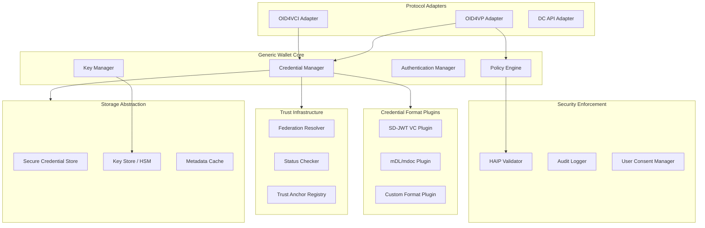

# Generic Wallet Architecture for SD-JWT .NET Ecosystem

This document describes the architecture for building a generic, extensible digital wallet using the SD-JWT .NET ecosystem. The design supports extension to EUDI Wallet requirements while remaining protocol-agnostic for wider adoption.

The architecture is informed by analysis of:
- [EUDI Wallet Core for Android](https://github.com/eu-digital-identity-wallet/eudi-lib-android-wallet-core)
- [EUDI Wallet Kit for iOS](https://github.com/eu-digital-identity-wallet/eudi-lib-ios-wallet-kit)
- [OWF Wallet Framework .NET](https://github.com/openwallet-foundation-labs/wallet-framework-dotnet)

---

## Design Principles

| Principle | Description |
|-----------|-------------|
| **Protocol-First** | Core wallet logic is format-agnostic; credential handling delegated to format plugins |
| **Composable** | Each capability (storage, presentation, issuance) is independently configurable |
| **EUDI-Ready** | Architecture accommodates ARF requirements without mandating them |
| **Testable** | All components are interface-based for unit testing and mocking |
| **Extensible SecureArea** | Custom key management implementations (HSM, Secure Enclave, Cloud KMS) |
| **Multi-Protocol** | Support OID4VC, ISO-18013-5, and optionally Aries/DIDComm |

---

## Feature Matrix (Reference Implementations)

| Feature | Android EUDI | iOS EUDI | OWF .NET | This Design |
|---------|--------------|----------|----------|-------------|
| **Credential Formats** |
| SD-JWT VC | Yes | Yes | In Progress | Yes (via SdJwt.Net) |
| mso_mdoc (ISO mDL) | Yes | Yes | No | Planned |
| AnonCreds | No | No | Yes | Optional Plugin |
| **Issuance (OID4VCI)** |
| Authorization Code Flow | Yes | Yes | In Progress | Yes |
| Pre-Authorized Code Flow | Yes | Yes | Yes | Yes |
| DPoP JWT | Yes | Yes | In Progress | Yes |
| Batch Credential Issuance | Yes | Yes | No | Yes |
| Deferred Issuance | Yes | Yes | No | Yes |
| Wallet Attestation (WIA/WUA) | Yes | Yes | In Progress | Yes |
| **Presentation** |
| OpenID4VP (Remote) | Yes | Yes | Yes | Yes |
| ISO-18013-5 Proximity | Yes (QR/NFC/BLE) | Yes (QR/BLE) | No | Planned |
| DCQL Query Support | Partial | Yes | No | Planned |
| Aries Present Proof | No | No | Yes | Optional Plugin |
| **Key Management** |
| Secure Enclave/Keystore | Yes | Yes | Via libindy | Yes |
| Custom SecureArea Plugins | Yes | Yes | No | Yes |
| Credential Policies (OneTimeUse/RotateUse) | Yes | Yes | No | Yes |
| **Trust & Status** |
| Status List Verification | Yes | Yes | No | Yes (via StatusList) |
| OpenID Federation | No | No | No | Yes (via OidFederation) |
| HAIP Compliance | Implicit | Implicit | No | Yes (via HAIP) |
| **Operations** |
| Transaction Logging | Yes | No | No | Yes |
| Multi-Issuer Configuration | Yes | Yes | No | Yes |

---

## Architecture Overview



---

## Core Components

### 1. Credential Manager

Handles credential lifecycle: receive, store, select, present.

```csharp
namespace SdJwt.Net.Wallet.Core;

/// <summary>
/// Core credential management interface.
/// </summary>
public interface ICredentialManager
{
    /// <summary>
    /// Stores a newly received credential.
    /// </summary>
    Task<CredentialHandle> StoreCredentialAsync(
        string credential,
        CredentialFormat format,
        CredentialMetadata metadata,
        CancellationToken cancellationToken = default);

    /// <summary>
    /// Retrieves credentials matching the given presentation definition.
    /// </summary>
    Task<IReadOnlyList<CredentialMatch>> FindMatchingCredentialsAsync(
        PresentationDefinition definition,
        CancellationToken cancellationToken = default);

    /// <summary>
    /// Creates a presentation from selected credentials with selective disclosure.
    /// </summary>
    Task<PresentationResult> CreatePresentationAsync(
        IReadOnlyList<CredentialSelection> selections,
        PresentationContext context,
        CancellationToken cancellationToken = default);

    /// <summary>
    /// Lists all stored credentials.
    /// </summary>
    Task<IReadOnlyList<CredentialSummary>> ListCredentialsAsync(
        CredentialFilter? filter = null,
        CancellationToken cancellationToken = default);

    /// <summary>
    /// Deletes a credential from storage.
    /// </summary>
    Task<bool> DeleteCredentialAsync(
        string credentialId,
        CancellationToken cancellationToken = default);
}
```

### 2. Key Manager

Manages holder keys for key binding and authentication.

```csharp
namespace SdJwt.Net.Wallet.Core;

/// <summary>
/// Manages cryptographic keys for the wallet.
/// </summary>
public interface IKeyManager
{
    /// <summary>
    /// Generates a new key pair for credential binding.
    /// </summary>
    Task<KeyHandle> GenerateKeyAsync(
        KeyGenerationOptions options,
        CancellationToken cancellationToken = default);

    /// <summary>
    /// Signs data using the specified key.
    /// </summary>
    Task<byte[]> SignAsync(
        string keyId,
        byte[] data,
        string algorithm,
        CancellationToken cancellationToken = default);

    /// <summary>
    /// Retrieves the public key in JWK format.
    /// </summary>
    Task<JsonWebKey> GetPublicKeyAsync(
        string keyId,
        CancellationToken cancellationToken = default);

    /// <summary>
    /// Lists available keys.
    /// </summary>
    Task<IReadOnlyList<KeyInfo>> ListKeysAsync(
        CancellationToken cancellationToken = default);
}

/// <summary>
/// Key generation options supporting HAIP compliance levels.
/// </summary>
public record KeyGenerationOptions
{
    public required string Algorithm { get; init; }
    public HaipLevel? RequiredHaipLevel { get; init; }
    public bool RequireHsmBacking { get; init; }
    public string? KeyId { get; init; }
    public IDictionary<string, object>? Metadata { get; init; }
}
```

### 3. Format Plugin Interface

Extensible credential format handling.

```csharp
namespace SdJwt.Net.Wallet.Formats;

/// <summary>
/// Plugin interface for credential format handling.
/// </summary>
public interface ICredentialFormatPlugin
{
    /// <summary>
    /// Format identifier (e.g., "vc+sd-jwt", "mso_mdoc").
    /// </summary>
    string FormatId { get; }

    /// <summary>
    /// Parses and validates a credential in this format.
    /// </summary>
    Task<ParsedCredential> ParseAsync(
        string credential,
        ParseOptions options,
        CancellationToken cancellationToken = default);

    /// <summary>
    /// Creates a presentation with selective disclosure.
    /// </summary>
    Task<string> CreatePresentationAsync(
        ParsedCredential credential,
        IReadOnlyList<string> disclosurePaths,
        PresentationContext context,
        IKeyManager keyManager,
        CancellationToken cancellationToken = default);

    /// <summary>
    /// Extracts claims for matching against presentation definitions.
    /// </summary>
    Task<JsonDocument> ExtractClaimsAsync(
        ParsedCredential credential,
        CancellationToken cancellationToken = default);

    /// <summary>
    /// Validates the credential signature and structure.
    /// </summary>
    Task<ValidationResult> ValidateAsync(
        ParsedCredential credential,
        ValidationContext context,
        CancellationToken cancellationToken = default);
}
```

### 4. SD-JWT VC Format Plugin (Built-in)

```csharp
namespace SdJwt.Net.Wallet.Formats;

/// <summary>
/// SD-JWT VC format plugin using the core SdJwt.Net packages.
/// </summary>
public class SdJwtVcFormatPlugin : ICredentialFormatPlugin
{
    private readonly SdVerifier _verifier;
    private readonly ILogger<SdJwtVcFormatPlugin> _logger;

    public string FormatId => "vc+sd-jwt";

    public SdJwtVcFormatPlugin(
        Func<string, Task<SecurityKey>> keyResolver,
        ILogger<SdJwtVcFormatPlugin> logger)
    {
        _verifier = new SdVerifier(keyResolver);
        _logger = logger;
    }

    public async Task<ParsedCredential> ParseAsync(
        string credential,
        ParseOptions options,
        CancellationToken cancellationToken = default)
    {
        // Use SdJwt.Net core parsing
        var parsed = SdJwtParser.Parse(credential);
        
        return new ParsedCredential
        {
            Format = FormatId,
            RawCredential = credential,
            Issuer = parsed.Payload["iss"]?.ToString(),
            Subject = parsed.Payload["sub"]?.ToString(),
            CredentialType = parsed.Payload["vct"]?.ToString(),
            IssuedAt = DateTimeOffset.FromUnixTimeSeconds(
                (long)(parsed.Payload["iat"] ?? 0)),
            ExpiresAt = parsed.Payload["exp"] is long exp 
                ? DateTimeOffset.FromUnixTimeSeconds(exp) 
                : null,
            Disclosures = parsed.Disclosures
                .Select(d => new DisclosureInfo
                {
                    Path = d.ClaimName,
                    Value = d.ClaimValue,
                    Digest = d.Digest
                })
                .ToList(),
            Metadata = new Dictionary<string, object>
            {
                ["sd_alg"] = parsed.Payload["_sd_alg"]?.ToString() ?? "sha-256",
                ["cnf"] = parsed.Payload["cnf"]
            }
        };
    }

    public async Task<string> CreatePresentationAsync(
        ParsedCredential credential,
        IReadOnlyList<string> disclosurePaths,
        PresentationContext context,
        IKeyManager keyManager,
        CancellationToken cancellationToken = default)
    {
        var holder = new SdJwtHolder(credential.RawCredential);
        
        // Get holder's private key for key binding
        var keyHandle = await keyManager.GetPublicKeyAsync(
            context.KeyId, cancellationToken);
        
        // Create key binding JWT payload
        var kbPayload = new JwtPayload
        {
            ["aud"] = context.Audience,
            ["nonce"] = context.Nonce,
            ["iat"] = DateTimeOffset.UtcNow.ToUnixTimeSeconds()
        };

        // Create presentation with selected disclosures
        var presentation = holder.CreatePresentation(
            disclosure => disclosurePaths.Contains(disclosure.ClaimName),
            kbPayload,
            await ResolveSigningKeyAsync(context.KeyId, keyManager),
            context.SigningAlgorithm);

        return presentation;
    }

    // Additional methods...
}
```

---

## Protocol Adapters

### OID4VCI Adapter (Credential Issuance)

```csharp
namespace SdJwt.Net.Wallet.Protocols;

/// <summary>
/// Handles OpenID4VCI credential issuance flows.
/// </summary>
public interface IOid4VciAdapter
{
    /// <summary>
    /// Processes a credential offer (QR code or deep link).
    /// </summary>
    Task<CredentialOfferDetails> ProcessOfferAsync(
        string offerUri,
        CancellationToken cancellationToken = default);

    /// <summary>
    /// Requests credentials using pre-authorized code flow.
    /// </summary>
    Task<IssuanceResult> RequestCredentialsPreAuthAsync(
        CredentialOfferDetails offer,
        string? userPin,
        IKeyManager keyManager,
        CancellationToken cancellationToken = default);

    /// <summary>
    /// Requests credentials using authorization code flow.
    /// </summary>
    Task<IssuanceResult> RequestCredentialsAuthCodeAsync(
        CredentialOfferDetails offer,
        AuthorizationResponse authResponse,
        IKeyManager keyManager,
        CancellationToken cancellationToken = default);
}
```

---

## Advanced Features (From Reference Implementations)

### 1. Batch Credentials and Credential Policies

Based on EUDI Android/iOS implementations, support batch credential issuance with usage policies:

```csharp
namespace SdJwt.Net.Wallet.Core;

/// <summary>
/// Credential usage policy (from EUDI Android/iOS).
/// </summary>
public enum CredentialPolicy
{
    /// <summary>
    /// Credential is deleted after single use. Batch issuance provides multiple copies.
    /// </summary>
    OneTimeUse,
    
    /// <summary>
    /// Credential usage is tracked; selects least-used credential first.
    /// </summary>
    RotateUse
}

/// <summary>
/// Options for credential creation during issuance.
/// </summary>
public record CreateCredentialSettings
{
    /// <summary>
    /// Number of credentials to request in batch (EUDI feature).
    /// </summary>
    public int BatchSize { get; init; } = 1;
    
    /// <summary>
    /// Credential usage policy.
    /// </summary>
    public CredentialPolicy Policy { get; init; } = CredentialPolicy.RotateUse;
    
    /// <summary>
    /// Key generation options for this credential.
    /// </summary>
    public KeyGenerationOptions? KeyOptions { get; init; }
}

/// <summary>
/// Extended credential manager supporting batch credentials.
/// </summary>
public interface IBatchCredentialManager : ICredentialManager
{
    /// <summary>
    /// Gets number of valid credentials for a document.
    /// </summary>
    Task<int> GetCredentialsCountAsync(string documentId, CancellationToken ct = default);
    
    /// <summary>
    /// Finds an available credential based on policy (EUDI feature).
    /// </summary>
    Task<CredentialHandle?> FindAvailableCredentialAsync(
        string documentId,
        CancellationToken ct = default);
    
    /// <summary>
    /// Consumes a credential and applies the policy (delete if OneTimeUse, track if RotateUse).
    /// </summary>
    Task ConsumeCredentialAsync(
        string credentialId,
        Func<CredentialHandle, Task> useAction,
        CancellationToken ct = default);
}
```

### 2. Wallet Attestation Provider (WIA/WUA)

OAuth 2.0 Attestation-Based Client Authentication from EUDI implementations:

```csharp
namespace SdJwt.Net.Wallet.Attestation;

/// <summary>
/// Wallet attestation provider interface (from EUDI Android/iOS).
/// Bridges wallet-specific attestation services to the core.
/// </summary>
public interface IWalletAttestationsProvider
{
    /// <summary>
    /// Gets Wallet Instance Attestation (WIA) for OAuth 2.0 client authentication.
    /// </summary>
    /// <param name="publicKey">The public key (PoP key) to bind the attestation to.</param>
    /// <returns>Client Attestation JWT signed by the Wallet Provider.</returns>
    Task<string> GetWalletAttestationAsync(JsonWebKey publicKey);
    
    /// <summary>
    /// Gets Wallet Unit Attestation (WUA) / Key Attestation for credential issuance.
    /// Certifies that specific keys are hardware-bound and trusted.
    /// </summary>
    /// <param name="keys">Public keys intended for the new credential.</param>
    /// <param name="nonce">Optional nonce from the issuer.</param>
    /// <returns>Key Attestation JWT.</returns>
    Task<string> GetKeyAttestationAsync(IReadOnlyList<JsonWebKey> keys, string? nonce);
}

/// <summary>
/// Configuration for attestation-based client authentication.
/// </summary>
public record WalletAttestationOptions
{
    /// <summary>
    /// Provider implementation for obtaining attestations.
    /// </summary>
    public IWalletAttestationsProvider? Provider { get; init; }
    
    /// <summary>
    /// Key options for Proof-of-Possession keys.
    /// </summary>
    public KeyGenerationOptions? PopKeyOptions { get; init; }
    
    /// <summary>
    /// PoP JWT validity duration in seconds (default: 300).
    /// </summary>
    public int PopKeyDurationSeconds { get; init; } = 300;
}
```

### 3. DPoP (Demonstrating Proof of Possession)

```csharp
namespace SdJwt.Net.Wallet.Protocols;

/// <summary>
/// DPoP configuration for OID4VCI (from EUDI implementations).
/// </summary>
public record DPoPOptions
{
    /// <summary>
    /// Whether to use DPoP when the issuer supports it.
    /// </summary>
    public bool UseDPoPIfSupported { get; init; } = true;
    
    /// <summary>
    /// Algorithm for DPoP proof signing.
    /// </summary>
    public string Algorithm { get; init; } = "ES256";
    
    /// <summary>
    /// Key options for DPoP key generation.
    /// </summary>
    public KeyGenerationOptions? KeyOptions { get; init; }
}

/// <summary>
/// DPoP proof generator.
/// </summary>
public interface IDPoPProofGenerator
{
    /// <summary>
    /// Generates a DPoP proof JWT for the given HTTP request.
    /// </summary>
    Task<string> GenerateProofAsync(
        string httpMethod,
        string httpUri,
        string? accessToken = null,
        string? nonce = null,
        CancellationToken ct = default);
}
```

### 4. Proximity Presentation (ISO-18013-5)

```csharp
namespace SdJwt.Net.Wallet.Proximity;

/// <summary>
/// Device engagement types for proximity presentation.
/// </summary>
public enum DeviceEngagement
{
    /// <summary>
    /// QR code displayed by the wallet.
    /// </summary>
    QrCode,
    
    /// <summary>
    /// NFC tap engagement.
    /// </summary>
    Nfc
}

/// <summary>
/// Data transfer methods for proximity presentation.
/// </summary>
public enum ProximityTransfer
{
    /// <summary>
    /// Bluetooth Low Energy.
    /// </summary>
    Ble,
    
    /// <summary>
    /// WiFi Aware (not yet widely supported).
    /// </summary>
    WifiAware
}

/// <summary>
/// Proximity presentation service interface (ISO-18013-5).
/// </summary>
public interface IProximityPresentationService
{
    /// <summary>
    /// Starts QR code engagement and returns the QR code data.
    /// </summary>
    Task<QrEngagementResult> StartQrEngagementAsync(CancellationToken ct = default);
    
    /// <summary>
    /// Enables NFC engagement (platform-specific).
    /// </summary>
    Task EnableNfcEngagementAsync(CancellationToken ct = default);
    
    /// <summary>
    /// Receives and processes a proximity presentation request.
    /// </summary>
    Task<ProximityRequest> ReceiveRequestAsync(CancellationToken ct = default);
    
    /// <summary>
    /// Generates and sends the response with disclosed documents.
    /// </summary>
    Task SendResponseAsync(
        ProximityRequest request,
        IReadOnlyList<DisclosedDocument> disclosedDocuments,
        string signatureAlgorithm,
        CancellationToken ct = default);
    
    /// <summary>
    /// Stops the proximity presentation session.
    /// </summary>
    Task StopAsync();
}

/// <summary>
/// Transfer event types for proximity presentation.
/// </summary>
public enum TransferEventType
{
    QrEngagementReady,
    Connecting,
    Connected,
    RequestReceived,
    ResponseSent,
    Disconnected,
    Error,
    Redirect  // For OpenID4VP
}
```

### 5. Transaction Logging

Audit and analytics support from EUDI Android:

```csharp
namespace SdJwt.Net.Wallet.Audit;

/// <summary>
/// Transaction log entry for audit purposes.
/// </summary>
public record TransactionLog
{
    public required string TransactionId { get; init; }
    public required DateTimeOffset Timestamp { get; init; }
    public required TransactionType Type { get; init; }
    public required TransactionStatus Status { get; init; }
    
    /// <summary>
    /// Relying party / verifier information.
    /// </summary>
    public RelyingPartyInfo? RelyingParty { get; init; }
    
    /// <summary>
    /// Documents involved in the transaction.
    /// </summary>
    public IReadOnlyList<TransactionDocument>? Documents { get; init; }
    
    /// <summary>
    /// Raw request data (for debugging, not stored in production).
    /// </summary>
    public string? RawRequest { get; init; }
    
    /// <summary>
    /// Data format (CBOR, JSON).
    /// </summary>
    public string? DataFormat { get; init; }
}

public enum TransactionType
{
    Presentation,
    Issuance  // Future support
}

public enum TransactionStatus
{
    Completed,
    Error,
    Incomplete,
    UserCancelled
}

/// <summary>
/// Transaction logger interface.
/// </summary>
public interface ITransactionLogger
{
    /// <summary>
    /// Logs a transaction for audit purposes.
    /// </summary>
    Task LogAsync(TransactionLog transaction, CancellationToken ct = default);
    
    /// <summary>
    /// Retrieves transaction history.
    /// </summary>
    Task<IReadOnlyList<TransactionLog>> GetHistoryAsync(
        TransactionFilter? filter = null,
        CancellationToken ct = default);
}
```

### 6. Document Status Resolver

Real-time credential status checking:

```csharp
namespace SdJwt.Net.Wallet.Status;

/// <summary>
/// Document status values.
/// </summary>
public enum DocumentStatus
{
    Valid,
    Invalid,
    Suspended,
    ApplicationSpecific,
    Reserved
}

/// <summary>
/// Document status resolver interface (from EUDI Android).
/// </summary>
public interface IDocumentStatusResolver
{
    /// <summary>
    /// Resolves the current status of a document.
    /// </summary>
    Task<DocumentStatusResult> ResolveStatusAsync(
        string documentId,
        CancellationToken ct = default);
    
    /// <summary>
    /// Resolves status for an issued document directly.
    /// </summary>
    Task<DocumentStatusResult> ResolveStatusAsync(
        ParsedCredential credential,
        CancellationToken ct = default);
}

/// <summary>
/// Configuration for document status resolution.
/// </summary>
public record DocumentStatusResolverOptions
{
    /// <summary>
    /// Clock skew allowance for token verification.
    /// </summary>
    public TimeSpan ClockSkewTolerance { get; init; } = TimeSpan.FromMinutes(5);
    
    /// <summary>
    /// Signature verification method.
    /// </summary>
    public SignatureVerificationMethod VerifySignature { get; init; } 
        = SignatureVerificationMethod.X5c;
    
    /// <summary>
    /// Custom HTTP client factory for status resolution.
    /// </summary>
    public Func<HttpClient>? HttpClientFactory { get; init; }
}
```

### 7. Multi-Issuer Configuration

Per-issuer settings from EUDI iOS:

```csharp
namespace SdJwt.Net.Wallet.Issuance;

/// <summary>
/// Per-issuer configuration (from EUDI iOS).
/// </summary>
public record IssuerConfiguration
{
    /// <summary>
    /// Issuer identifier / name.
    /// </summary>
    public required string IssuerName { get; init; }
    
    /// <summary>
    /// Credential issuer URL.
    /// </summary>
    public required string CredentialIssuerUrl { get; init; }
    
    /// <summary>
    /// OAuth 2.0 client ID for this issuer.
    /// </summary>
    public string? ClientId { get; init; }
    
    /// <summary>
    /// DPoP configuration for this issuer.
    /// </summary>
    public DPoPOptions? DPoPOptions { get; init; }
    
    /// <summary>
    /// Key attestation configuration for this issuer.
    /// </summary>
    public WalletAttestationOptions? AttestationOptions { get; init; }
    
    /// <summary>
    /// Authorization redirect URI for this issuer.
    /// </summary>
    public string? AuthFlowRedirectUri { get; init; }
    
    /// <summary>
    /// Whether to use PAR (Pushed Authorization Request).
    /// </summary>
    public ParUsage ParUsage { get; init; } = ParUsage.IfSupported;
}

public enum ParUsage
{
    Never,
    IfSupported,
    Required
}

/// <summary>
/// Issuer registry for multi-issuer support.
/// </summary>
public interface IIssuerRegistry
{
    /// <summary>
    /// Registers an issuer configuration.
    /// </summary>
    Task RegisterIssuerAsync(IssuerConfiguration config, CancellationToken ct = default);
    
    /// <summary>
    /// Gets configuration for a specific issuer.
    /// </summary>
    Task<IssuerConfiguration?> GetIssuerAsync(string issuerName, CancellationToken ct = default);
    
    /// <summary>
    /// Lists all registered issuers.
    /// </summary>
    Task<IReadOnlyList<IssuerConfiguration>> ListIssuersAsync(CancellationToken ct = default);
    
    /// <summary>
    /// Gets issuer metadata from the credential issuer endpoint.
    /// </summary>
    Task<IssuerMetadata> GetIssuerMetadataAsync(
        string issuerName, 
        CancellationToken ct = default);
}
```

### 8. Deferred Issuance

```csharp
namespace SdJwt.Net.Wallet.Issuance;

/// <summary>
/// Deferred document status.
/// </summary>
public enum DeferredDocumentState
{
    Pending,
    Ready,
    Expired,
    Failed
}

/// <summary>
/// Extended issuance adapter with deferred support (from EUDI implementations).
/// </summary>
public interface IDeferredIssuanceAdapter
{
    /// <summary>
    /// Checks if a deferred document is ready for retrieval.
    /// </summary>
    Task<DeferredDocumentState> CheckDeferredStatusAsync(
        string deferredDocumentId,
        CancellationToken ct = default);
    
    /// <summary>
    /// Retrieves a deferred credential when ready.
    /// </summary>
    Task<IssuanceResult> IssueDeferredDocumentAsync(
        string deferredDocumentId,
        CreateCredentialSettings settings,
        CancellationToken ct = default);
}
```

---

## OID4VP Adapter (Presentation)

```csharp
namespace SdJwt.Net.Wallet.Protocols;

/// <summary>
/// Handles OpenID4VP presentation flows.
/// </summary>
public interface IOid4VpAdapter
{
    /// <summary>
    /// Parses an authorization request (from QR, deep link, or request_uri).
    /// </summary>
    Task<AuthorizationRequestDetails> ParseRequestAsync(
        string requestInput,
        CancellationToken cancellationToken = default);

    /// <summary>
    /// Validates the verifier and request against trust requirements.
    /// </summary>
    Task<TrustValidationResult> ValidateVerifierTrustAsync(
        AuthorizationRequestDetails request,
        TrustRequirements requirements,
        CancellationToken cancellationToken = default);

    /// <summary>
    /// Builds and submits the presentation response.
    /// </summary>
    Task<PresentationResponseResult> SubmitPresentationAsync(
        AuthorizationRequestDetails request,
        PresentationResult presentation,
        CancellationToken cancellationToken = default);
    
    /// <summary>
    /// Creates a self-signed authorization response for direct_post.
    /// </summary>
    Task<AuthorizationResponse> CreateAuthorizationResponseAsync(
        AuthorizationRequestDetails request,
        PresentationResult presentation,
        CancellationToken cancellationToken = default);
}

/// <summary>
/// Authorization request details parsed from OpenID4VP request.
/// </summary>
public record AuthorizationRequestDetails
{
    public required string RequestId { get; init; }
    public required string ResponseUri { get; init; }
    public required string ResponseType { get; init; }
    public required string ResponseMode { get; init; }
    public string? Nonce { get; init; }
    public string? State { get; init; }
    public string? ClientId { get; init; }
    public string? ClientIdScheme { get; init; }
    
    /// <summary>
    /// Presentation definition from the request.
    /// </summary>
    public PresentationDefinition? PresentationDefinition { get; init; }
    
    /// <summary>
    /// DCQL query (Digital Credentials Query Language) - future support.
    /// </summary>
    public string? DcqlQuery { get; init; }
    
    /// <summary>
    /// Verifier metadata (name, logo, etc.).
    /// </summary>
    public VerifierMetadata? VerifierMetadata { get; init; }
}
```

---

## SecureArea Abstraction

Custom key management implementations (from EUDI Android):

```csharp
namespace SdJwt.Net.Wallet.Security;

/// <summary>
/// Secure area abstraction for custom key management (from EUDI Android).
/// </summary>
public interface ISecureArea
{
    /// <summary>
    /// Secure area identifier (e.g., "SecureEnclave", "AndroidKeystore", "CloudKms").
    /// </summary>
    string Name { get; }
    
    /// <summary>
    /// Creates a new key in this secure area.
    /// </summary>
    Task<KeyInfo> CreateKeyAsync(
        string keyAlias,
        KeyGenerationOptions options,
        CancellationToken ct = default);
    
    /// <summary>
    /// Signs data using a key in this secure area.
    /// </summary>
    Task<byte[]> SignAsync(
        string keyAlias,
        byte[] data,
        string algorithm,
        KeyUnlockData? unlockData = null,
        CancellationToken ct = default);
    
    /// <summary>
    /// Gets key unlock data for user authentication (biometrics).
    /// </summary>
    Task<KeyUnlockData> GetKeyUnlockDataAsync(
        string keyAlias,
        CancellationToken ct = default);
    
    /// <summary>
    /// Deletes a key from this secure area.
    /// </summary>
    Task<bool> DeleteKeyAsync(string keyAlias, CancellationToken ct = default);
}

/// <summary>
/// Key unlock data for user authentication.
/// </summary>
public record KeyUnlockData
{
    public required string KeyAlias { get; init; }
    public required string SecureAreaName { get; init; }
    
    /// <summary>
    /// Platform-specific crypto object for biometric authentication.
    /// </summary>
    public object? CryptoObject { get; init; }
}
```

---

The generic wallet can be extended for EUDI compliance:

```csharp
namespace SdJwt.Net.Wallet.Eudiw;

/// <summary>
/// EUDI Wallet extension configuration.
/// </summary>
public class EudiWalletOptions
{
    /// <summary>
    /// EU Trust List endpoints for trust anchor resolution.
    /// </summary>
    public IReadOnlyList<string> TrustListEndpoints { get; init; } = Array.Empty<string>();

    /// <summary>
    /// Required HAIP compliance level (Level 2 minimum for EUDI).
    /// </summary>
    public HaipLevel MinimumHaipLevel { get; init; } = HaipLevel.Level2_VeryHigh;

    /// <summary>
    /// Supported credential types for EUDI ecosystem.
    /// </summary>
    public IReadOnlyList<string> SupportedCredentialTypes { get; init; } = new[]
    {
        "eu.europa.ec.eudi.pid.1",      // Person Identification Data
        "eu.europa.ec.eudi.mdl.1",      // Mobile Driving License
        "eu.europa.ec.eudi.loyalty.1",  // Loyalty credentials
        "eu.europa.ec.eudi.health.1"    // Health credentials
    };

    /// <summary>
    /// Enforce ARF (Architecture Reference Framework) requirements.
    /// </summary>
    public bool EnforceArfCompliance { get; init; } = true;

    /// <summary>
    /// Wallet attestation configuration.
    /// </summary>
    public WalletAttestationOptions? WalletAttestation { get; init; }
}

/// <summary>
/// EUDI-specific wallet extending the generic implementation.
/// </summary>
public class EudiWallet : GenericWallet
{
    private readonly EudiWalletOptions _eudiOptions;
    private readonly IEuTrustListService _trustListService;
    private readonly IArfValidator _arfValidator;

    public EudiWallet(
        EudiWalletOptions eudiOptions,
        WalletOptions baseOptions,
        ICredentialManager credentialManager,
        IKeyManager keyManager,
        IOid4VciAdapter oid4Vci,
        IOid4VpAdapter oid4Vp,
        IEuTrustListService trustListService,
        IArfValidator arfValidator)
        : base(baseOptions, credentialManager, keyManager, oid4Vci, oid4Vp)
    {
        _eudiOptions = eudiOptions;
        _trustListService = trustListService;
        _arfValidator = arfValidator;
    }

    /// <summary>
    /// Requests PID (Person Identification Data) credential.
    /// </summary>
    public async Task<IssuanceResult> RequestPidCredentialAsync(
        string issuerUrl,
        PidRequestOptions options,
        CancellationToken cancellationToken = default)
    {
        // Validate issuer is in EU Trust List
        var trustResult = await _trustListService.ValidateIssuerAsync(
            issuerUrl, cancellationToken);
        
        if (!trustResult.IsTrusted)
        {
            throw new EudiTrustException(
                $"Issuer {issuerUrl} not found in EU Trust List");
        }

        // Ensure HAIP Level 2 compliance
        var haipValidator = new HaipCryptoValidator(
            _eudiOptions.MinimumHaipLevel, Logger);
        
        // Proceed with issuance using base implementation
        return await RequestCredentialAsync(
            issuerUrl,
            "eu.europa.ec.eudi.pid.1",
            options,
            cancellationToken);
    }

    /// <summary>
    /// Creates EUDI-compliant presentation with ARF validation.
    /// </summary>
    public override async Task<PresentationResult> CreatePresentationAsync(
        AuthorizationRequestDetails request,
        IReadOnlyList<CredentialSelection> selections,
        CancellationToken cancellationToken = default)
    {
        // Validate ARF compliance if enabled
        if (_eudiOptions.EnforceArfCompliance)
        {
            var arfResult = await _arfValidator.ValidateRequestAsync(
                request, cancellationToken);
            
            if (!arfResult.IsCompliant)
            {
                throw new ArfComplianceException(arfResult.Violations);
            }
        }

        return await base.CreatePresentationAsync(
            request, selections, cancellationToken);
    }
}
```

---

## Storage Abstraction

```csharp
namespace SdJwt.Net.Wallet.Storage;

/// <summary>
/// Secure credential storage interface.
/// </summary>
public interface ICredentialStore
{
    Task<string> StoreAsync(
        string credentialId,
        EncryptedCredential credential,
        CancellationToken cancellationToken = default);

    Task<EncryptedCredential?> RetrieveAsync(
        string credentialId,
        CancellationToken cancellationToken = default);

    Task<IReadOnlyList<CredentialMetadata>> ListAsync(
        CredentialFilter? filter = null,
        CancellationToken cancellationToken = default);

    Task<bool> DeleteAsync(
        string credentialId,
        CancellationToken cancellationToken = default);
}

/// <summary>
/// Platform-specific implementations.
/// </summary>
public class SecureEnclaveStore : ICredentialStore { /* iOS Secure Enclave */ }
public class AndroidKeystoreStore : ICredentialStore { /* Android Keystore */ }
public class WindowsDataProtectionStore : ICredentialStore { /* Windows DPAPI */ }
public class SqliteEncryptedStore : ICredentialStore { /* Cross-platform SQLite */ }
```

---

## Package Structure Recommendation

```
src/
  SdJwt.Net.Wallet/              # Core wallet abstractions
    Core/
      ICredentialManager.cs
      IKeyManager.cs
      IWallet.cs
    Formats/
      ICredentialFormatPlugin.cs
      SdJwtVcFormatPlugin.cs
    Protocols/
      IOid4VciAdapter.cs
      IOid4VpAdapter.cs
    Storage/
      ICredentialStore.cs
    GenericWallet.cs
    
  SdJwt.Net.Wallet.Eudiw/        # EUDI-specific extensions
    EudiWallet.cs
    EudiWalletOptions.cs
    Services/
      IEuTrustListService.cs
      IArfValidator.cs
    CredentialTypes/
      PidCredential.cs
      MdlCredential.cs
```

---

## Integration Example

```csharp
// Generic wallet usage (any ecosystem)
var wallet = new GenericWallet(options, credentialManager, keyManager, oid4Vci, oid4Vp);

// Receive credential via OID4VCI
var offer = await wallet.ProcessCredentialOfferAsync("openid-credential-offer://...");
var credential = await wallet.AcceptCredentialOfferAsync(offer);

// Present credential via OID4VP  
var request = await wallet.ProcessPresentationRequestAsync("openid4vp://...");
var result = await wallet.CreateAndSubmitPresentationAsync(request);

// EUDI wallet usage (EU ecosystem)
var eudiWallet = new EudiWallet(eudiOptions, baseOptions, ...);

// Request PID with EU Trust List validation
var pid = await eudiWallet.RequestPidCredentialAsync(
    "https://pid-provider.eu",
    new PidRequestOptions { AuthMethod = AuthMethod.Eidas });

// Present with ARF compliance enforcement
var eudiPresentation = await eudiWallet.CreatePresentationAsync(request, selections);
```

---

## Related Documentation

- [Architecture Overview](architecture.md)
- [HAIP Deep Dive](haip-deep-dive.md)
- [OID4VCI Deep Dive](openid4vci-deep-dive.md)
- [OID4VP Deep Dive](openid4vp-deep-dive.md)
- [Enterprise Roadmap](../ENTERPRISE_ROADMAP.md)
- [Cross-Border Government Use Case](../use-cases/crossborder.md)

---

## Summary

This wallet architecture provides a **generic, extensible foundation** for building identity wallets on the SD-JWT .NET ecosystem, with comprehensive features derived from production EUDI implementations:

### Core Capabilities (Today)

| Capability | SD-JWT .NET Support |
|------------|---------------------|
| SD-JWT VC issuance/verification | Full (RFC 9901) |
| OpenID4VCI (auth code + pre-auth) | Full (1.0 Final) |
| OpenID4VP presentation | Full (1.0) |
| DIF Presentation Exchange | Full (v2.1.1) |
| OpenID Federation trust | Full (1.0) |
| HAIP compliance validation | Full (Level 1-3) |
| Token Status List | Full (draft-18) |

### Features from Reference Implementations

| Feature | Source | Status |
|---------|--------|--------|
| Batch credential issuance | EUDI Android/iOS | Interface defined |
| Credential policies (OneTimeUse/RotateUse) | EUDI Android/iOS | Interface defined |
| Wallet Instance Attestation (WIA) | EUDI Android/iOS | Interface defined |
| Wallet Unit/Key Attestation (WUA) | EUDI Android/iOS | Interface defined |
| DPoP (Demonstrating PoP) | EUDI Android/iOS | Interface defined |
| Proximity presentation (ISO-18013-5) | EUDI Android/iOS | Interface defined |
| Transaction logging/audit | EUDI Android | Interface defined |
| Document status resolution | EUDI Android | Interface defined |
| Multi-issuer configuration | EUDI iOS | Interface defined |
| Deferred credential issuance | EUDI Android/iOS | Interface defined |
| SecureArea abstraction | EUDI Android | Interface defined |

### Planned Enhancements (Enterprise Roadmap)

| Feature | Timeline |
|---------|----------|
| ISO mDL/mdoc format support | Q2-Q3 2026 |
| W3C Digital Credentials API | Q3 2026 |
| EUDIW Profile certification | Q3-Q4 2026 |

### Recommendation

Use this architecture as the **blueprint for implementing wallet applications** targeting:

1. **Generic wallets**: Build on core interfaces for multi-ecosystem support
2. **EUDI wallets**: Extend with `EudiWallet` class for EU compliance
3. **Enterprise wallets**: Leverage transaction logging, batch credentials, and multi-issuer support
4. **High-assurance scenarios**: Utilize HAIP validators and hardware-backed key management
