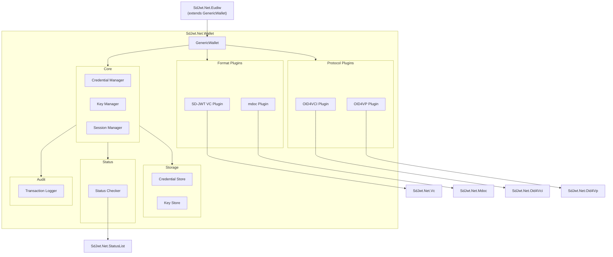
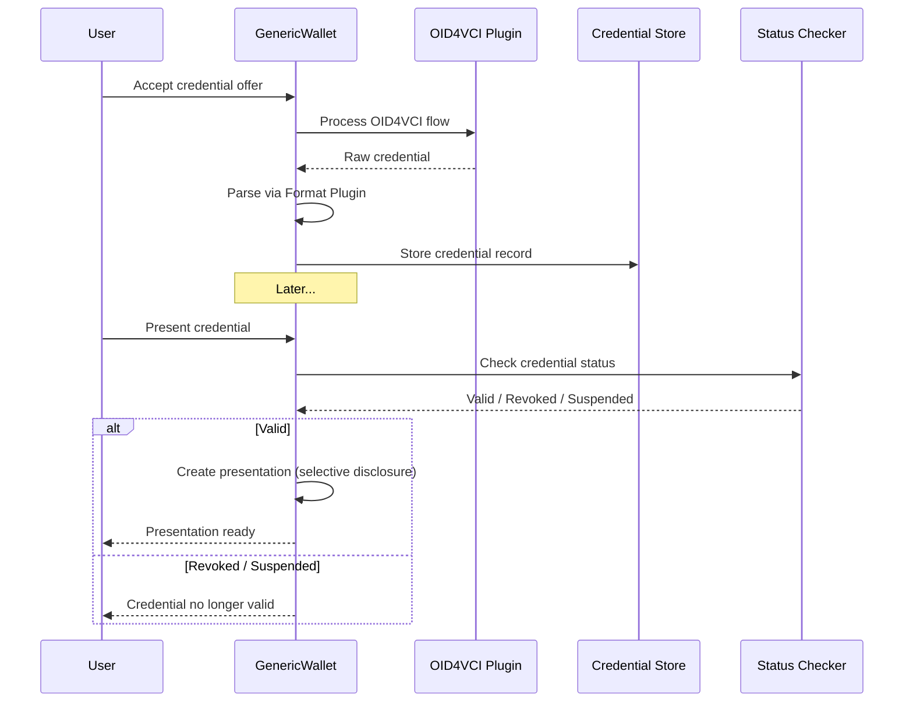

# Wallet Architecture Deep Dive

## Audience & Purpose

|              |                                                                                                             |
| ------------ | ----------------------------------------------------------------------------------------------------------- |
| **Audience** | Developers building wallet applications and architects designing credential storage systems                 |
| **Purpose**  | Understand the generic wallet architecture, plugin model, and extension points                              |
| **Scope**    | `SdJwt.Net.Wallet` package design, format plugins, protocol integration, and EUDIW extension                |
| **Success**  | Reader can integrate the wallet into their application and extend it with custom format or protocol plugins |

---

## The Problem

Building a wallet that handles multiple credential formats and protocols is complex:

1. **Format diversity**: SD-JWT VC and mdoc have fundamentally different serialization (JSON vs CBOR), signature (JWS vs COSE), and selective disclosure models
2. **Protocol flexibility**: Issuance may use OID4VCI or proprietary APIs; presentation may use OID4VP, DC API, or proximity (BLE/NFC)
3. **Key management**: Credentials bind to device keys; keys must be stored securely across platforms
4. **Compliance variation**: EUDIW mandates ARF compliance; other regions have different requirements
5. **Status checking**: Wallet must periodically validate whether stored credentials are still valid

---

## Architecture

### Component Diagram



### Package Structure

```text
SdJwt.Net.Wallet/
  GenericWallet.cs              # Main wallet implementation
  WalletOptions.cs              # Configuration
  Core/
    ICredentialManager.cs        # Credential CRUD interface
    IKeyManager.cs               # Key generation and storage
    IFormatPlugin.cs             # Format plugin contract
    IProtocolPlugin.cs           # Protocol plugin contract
    CredentialRecord.cs          # Unified credential model
    SoftwareKeyManager.cs        # Software key store
    ...
  Formats/
    SdJwtVcFormatPlugin.cs       # SD-JWT VC format handler
    MdocFormatPlugin.cs          # mdoc format handler
    ...
  Protocols/
    Oid4VciProtocolPlugin.cs     # OID4VCI issuance protocol
    Oid4VpProtocolPlugin.cs      # OID4VP presentation protocol
    ...
  Storage/
    ICredentialStore.cs          # Storage abstraction
    InMemoryCredentialStore.cs   # Development store
    EncryptedFileStore.cs        # File-based encrypted store
  Sessions/
    SessionManager.cs            # Protocol session tracking
    ...
  Status/
    CredentialStatusChecker.cs   # Status list validation
    ...
  Audit/
    ITransactionLogger.cs        # Audit logging interface
    ...
```

---

## Core Design: Plugin Architecture

The wallet uses a **plugin architecture** so that credential formats and protocols can be added without modifying the core.

### Format Plugin Contract

Every credential format implements `IFormatPlugin`:

```csharp
public interface IFormatPlugin
{
    string FormatId { get; }
    bool CanHandle(string credentialType);
    CredentialRecord Parse(byte[] rawCredential);
    byte[] CreatePresentation(CredentialRecord credential, string[] disclosedClaims);
    bool Verify(byte[] presentation, VerificationOptions options);
}
```

**Built-in plugins**:

| Plugin                | Format ID   | Handles                       |
| --------------------- | ----------- | ----------------------------- |
| `SdJwtVcFormatPlugin` | `vc+sd-jwt` | SD-JWT Verifiable Credentials |
| `MdocFormatPlugin`    | `mso_mdoc`  | ISO 18013-5 mobile documents  |

### Protocol Plugin Contract

Every issuance/presentation protocol implements `IProtocolPlugin`:

```csharp
public interface IProtocolPlugin
{
    string ProtocolId { get; }
    Task<CredentialRecord> AcceptCredentialAsync(ProtocolContext context);
    Task<byte[]> CreatePresentationAsync(CredentialRecord credential, PresentationContext context);
}
```

---

## Key Manager

The `IKeyManager` abstraction supports different key storage backends:

| Implementation         | Use Case                | Security                         |
| ---------------------- | ----------------------- | -------------------------------- |
| `SoftwareKeyManager`   | Development and testing | Keys in memory, no persistence   |
| Custom HSM integration | Production              | Keys in hardware security module |
| Platform keychain      | Mobile apps             | iOS Keychain / Android Keystore  |

```csharp
public interface IKeyManager
{
    Task<KeyRecord> GenerateKeyAsync(string algorithm);
    Task<byte[]> SignAsync(string keyId, byte[] data);
    Task<bool> VerifyAsync(string keyId, byte[] data, byte[] signature);
    Task<byte[]> GetPublicKeyAsync(string keyId);
}
```

---

## Credential Lifecycle



---

## Configuration

```csharp
var options = new WalletOptions
{
    WalletId = "my-enterprise-wallet",
    DisplayName = "Enterprise Credential Wallet",
    SupportedFormats = new[] { "vc+sd-jwt", "mso_mdoc" },
    EnableStatusChecking = true,
    StatusCheckInterval = TimeSpan.FromHours(1),
    EnableAuditLogging = true
};

var store = new InMemoryCredentialStore();
var keyManager = new SoftwareKeyManager();

var wallet = new GenericWallet(store, keyManager, options);
```

---

## EUDIW Extension

The `EudiWallet` class extends `GenericWallet` with ARF compliance:

```csharp
var eudiWallet = new EudiWallet(store, keyManager, eudiOptions: new EudiWalletOptions
{
    EnforceArfCompliance = true,
    MinimumHaipLevel = 2,
    ValidateIssuerTrust = true,
    SupportedCredentialTypes = new[]
    {
        EudiwConstants.Pid.DocType,
        EudiwConstants.Mdl.DocType
    }
});
```

EUDIW-specific features:

| Feature                    | Description                                     |
| -------------------------- | ----------------------------------------------- |
| ARF profile validation     | Only HAIP-compliant algorithms accepted         |
| EU Trust List resolution   | Issuers validated against national trust lists  |
| PID credential handling    | Typed PID model with mandatory claim validation |
| QEAA handling              | Qualified attestation type enforcement          |
| RP registration validation | Relying party legitimacy checks                 |
| Member state validation    | 27 EU member state codes                        |

See [EUDIW Deep Dive](eudiw-deep-dive.md) for full details.

---

## Integration Points

| Integration             | Package                | Wallet Component          |
| ----------------------- | ---------------------- | ------------------------- |
| Credential issuance     | `SdJwt.Net.Oid4Vci`    | `Oid4VciProtocolPlugin`   |
| Credential presentation | `SdJwt.Net.Oid4Vp`     | `Oid4VpProtocolPlugin`    |
| Status checking         | `SdJwt.Net.StatusList` | `CredentialStatusChecker` |
| SD-JWT VC format        | `SdJwt.Net.Vc`         | `SdJwtVcFormatPlugin`     |
| mdoc format             | `SdJwt.Net.Mdoc`       | `MdocFormatPlugin`        |
| EUDIW compliance        | `SdJwt.Net.Eudiw`      | `EudiWallet` extension    |
| HAIP enforcement        | `SdJwt.Net.HAIP`       | Algorithm validation      |

---

## Security Considerations

| Concern                   | Mitigation                                          |
| ------------------------- | --------------------------------------------------- |
| Credential theft          | Encrypted credential store with key-based access    |
| Key compromise            | HSM/platform keychain integration for production    |
| Status freshness          | Configurable check interval with fail-closed option |
| Unauthorized presentation | User consent required before disclosure             |
| Audit gaps                | Transaction logger records all wallet operations    |

---

## Related Documentation

- [EUDIW Deep Dive](eudiw-deep-dive.md) - EU-specific wallet compliance
- [Ecosystem Architecture](ecosystem-architecture.md) - Package relationships
- [Wallet Integration Guide](../guides/wallet-integration.md) - Step-by-step setup
- [SD-JWT Deep Dive](sd-jwt-deep-dive.md) - Core token format
- [mdoc Deep Dive](mdoc-deep-dive.md) - Mobile document format
