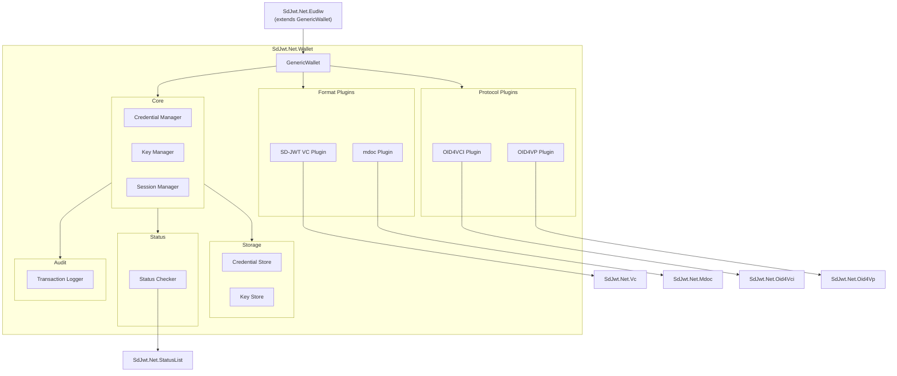
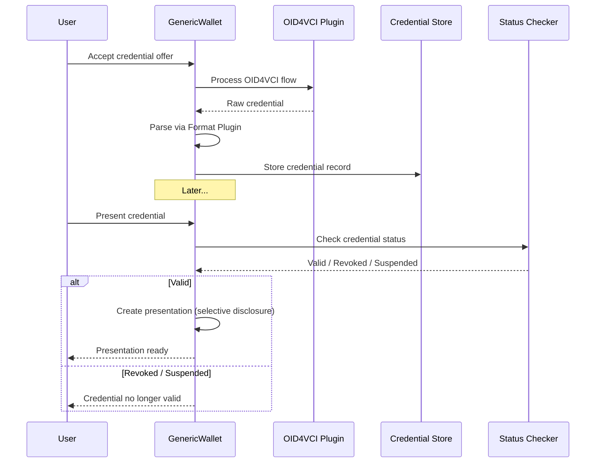

# Wallet architecture

> **Level:** Intermediate architecture

> **This is reference infrastructure, not a production wallet.** `SdJwt.Net.Wallet` provides the building blocks (storage, protocol orchestration, plugin model) that a real wallet product builds on. It is not certified, not audited, and not a mobile app. Treat it as a starting point for your wallet backend, not a deployable product.

### Wallet app vs wallet infrastructure

| Layer                 | What it is                                                                  | Who provides it                        |
| --------------------- | --------------------------------------------------------------------------- | -------------------------------------- |
| Wallet app            | Mobile or desktop application with UI, biometrics, platform integration     | Your team or a wallet vendor           |
| Wallet SDK            | Certified, audited SDK meeting regulatory requirements (e.g., EUDIW ARF)    | Wallet vendor or government program    |
| Wallet infrastructure | Credential storage, protocol orchestration, format resolution, plugin model | `SdJwt.Net.Wallet` (this package)      |
| Credential libraries  | SD-JWT VC issuance/verification, mdoc parsing, status checking              | `SdJwt.Net.Vc`, `SdJwt.Net.Mdoc`, etc. |

`SdJwt.Net.Wallet` sits at the infrastructure layer. Everything above it is your responsibility.

## Simple explanation

`SdJwt.Net.Wallet` is reference holder-side infrastructure. It provides the building blocks for a wallet backend: credential storage, protocol orchestration (OID4VCI to receive, OID4VP to present), and a plugin model for custom storage, key management, and trust resolution.

## What you will learn

- The wallet plugin architecture and extension points
- How credential storage, format resolution, and protocol orchestration work
- How to extend the wallet with custom plugins
- How `SdJwt.Net.Eudiw` extends the generic wallet for EUDIW flows

It is not a mobile wallet app, a certified wallet SDK, or a production wallet. It is the framework layer that wallet products build on.

## Audience & purpose

|              |                                                                                                             |
| ------------ | ----------------------------------------------------------------------------------------------------------- |
| **Audience** | Developers building wallet applications and architects designing credential storage systems                 |
| **Purpose**  | Understand the generic wallet architecture, plugin model, and extension points                              |
| **Scope**    | `SdJwt.Net.Wallet` package design, format plugins, protocol integration, and EUDIW extension                |
| **Success**  | Reader can integrate the wallet into their application and extend it with custom format or protocol plugins |

---

## The problem

Building a wallet that handles multiple credential formats and protocols is complex:

1. **Format diversity**: SD-JWT VC and mdoc have fundamentally different serialization (JSON vs CBOR), signature (JWS vs COSE), and selective disclosure models
2. **Protocol flexibility**: Issuance may use OID4VCI or proprietary APIs; presentation may use OID4VP, DC API, or proximity (BLE/NFC)
3. **Key management**: Credentials bind to device keys; keys must be stored securely across platforms
4. **Regional variation**: EUDIW requires ARF-oriented validation; other regions have different requirements
5. **Status checking**: Wallet must periodically validate whether stored credentials are still valid

---

## Architecture

### Component diagram



### Package structure

```text
SdJwt.Net.Wallet/
  GenericWallet.cs              # Main wallet implementation
  WalletOptions.cs              # Configuration
  Core/
    ICredentialManager.cs        # Credential CRUD interface
    IBatchCredentialManager.cs   # Batch credential operations
    IKeyManager.cs               # Key generation and storage
    ...
  Formats/
    ICredentialFormatPlugin.cs   # Format plugin contract
    SdJwtVcFormatPlugin.cs       # SD-JWT VC format handler
    ParsedCredential.cs          # Parsed credential model
    ...
  Protocols/
    IOid4VciAdapter.cs           # OID4VCI issuance protocol adapter
    IOid4VpAdapter.cs            # OID4VP presentation protocol adapter
    ...
  Storage/
    ICredentialStore.cs          # Storage abstraction
    ICredentialInventory.cs      # Extended storage with query support
    InMemoryCredentialStore.cs   # Development store
    StoredCredential.cs          # Stored credential model
  Sessions/
    SessionManager.cs            # Protocol session tracking
    ...
  Status/
    IDocumentStatusResolver.cs   # Status resolution abstraction
    ...
  Audit/
    ITransactionLogger.cs        # Audit logging interface
    ...
```

---

## Core design: plugin architecture

The wallet uses a **plugin architecture** so that credential formats and protocols can be added without modifying the core.

### Format plugin contract

Every credential format implements `ICredentialFormatPlugin`:

```csharp
public interface ICredentialFormatPlugin
{
    string FormatId { get; }
    string DisplayName { get; }
    bool CanHandle(string credential);
    Task<ParsedCredential> ParseAsync(string credential, ParseOptions? options = null,
        CancellationToken cancellationToken = default);
    Task<string> CreatePresentationAsync(ParsedCredential credential,
        IReadOnlyList<string> disclosurePaths, PresentationContext context,
        IKeyManager keyManager, CancellationToken cancellationToken = default);
    Task<ValidationResult> ValidateAsync(ParsedCredential credential,
        ValidationContext context, CancellationToken cancellationToken = default);
}
```

**Built-in plugins**:

| Plugin                | Format ID   | Handles                                                                       |
| --------------------- | ----------- | ----------------------------------------------------------------------------- |
| `SdJwtVcFormatPlugin` | `dc+sd-jwt` | SD-JWT Verifiable Credentials (legacy format ID `vc+sd-jwt` is also accepted) |

### Protocol adapters

The wallet supports issuance and presentation protocols through adapter interfaces configured via `WalletOptions`:

**Issuance adapter** (`IOid4VciAdapter`):

```csharp
public interface IOid4VciAdapter
{
    Task<CredentialOfferInfo> ParseOfferAsync(string offer, CancellationToken cancellationToken = default);
    Task<IDictionary<string, object>> ResolveIssuerMetadataAsync(string issuer,
        CancellationToken cancellationToken = default);
    Task<TokenResult> ExchangeTokenAsync(string tokenEndpoint, TokenExchangeOptions options,
        CancellationToken cancellationToken = default);
    Task<IssuanceResult> RequestCredentialAsync(string credentialEndpoint,
        CredentialRequestOptions options, IKeyManager keyManager,
        CancellationToken cancellationToken = default);
    // + PollDeferredCredentialAsync, BuildAuthorizationUrlAsync
}
```

**Presentation adapter** (`IOid4VpAdapter`):

```csharp
public interface IOid4VpAdapter
{
    Task<PresentationRequestInfo> ParseRequestAsync(string request,
        CancellationToken cancellationToken = default);
    Task<IReadOnlyList<CredentialMatch>> FindMatchingCredentialsAsync(
        PresentationRequestInfo request, IReadOnlyList<StoredCredential> availableCredentials,
        CancellationToken cancellationToken = default);
    Task<PresentationSubmissionResult> SubmitPresentationAsync(
        PresentationRequestInfo request, PresentationSubmissionOptions options,
        CancellationToken cancellationToken = default);
    // + ResolveRequestUriAsync, SendErrorResponseAsync, ValidateClientAsync
}
```

---

## Key manager

The `IKeyManager` abstraction supports different key storage backends:

| Implementation                | Use Case                | Security                         |
| ----------------------------- | ----------------------- | -------------------------------- |
| Custom in-memory key manager  | Development and testing | Keys in memory, no persistence   |
| Custom HSM integration        | Production              | Keys in hardware security module |
| Platform keychain integration | Mobile apps             | iOS Keychain / Android Keystore  |

```csharp
public interface IKeyManager
{
    Task<KeyInfo> GenerateKeyAsync(KeyGenerationOptions options,
        CancellationToken cancellationToken = default);
    Task<byte[]> SignAsync(string keyId, byte[] data, string algorithm,
        CancellationToken cancellationToken = default);
    Task<JsonWebKey> GetPublicKeyAsync(string keyId,
        CancellationToken cancellationToken = default);
    Task<SecurityKey> GetSecurityKeyAsync(string keyId,
        CancellationToken cancellationToken = default);
    Task<IReadOnlyList<KeyInfo>> ListKeysAsync(
        CancellationToken cancellationToken = default);
    Task<bool> DeleteKeyAsync(string keyId,
        CancellationToken cancellationToken = default);
    Task<bool> KeyExistsAsync(string keyId,
        CancellationToken cancellationToken = default);
}
```

---

## Credential lifecycle



---

## Configuration

```csharp
var options = new WalletOptions
{
    WalletId = "my-enterprise-wallet",
    DisplayName = "Enterprise Credential Wallet",
    ValidateOnAdd = true,
    AutoCheckStatus = true,
    Oid4VciAdapter = oid4VciAdapter,  // IOid4VciAdapter implementation
    Oid4VpAdapter = oid4VpAdapter     // IOid4VpAdapter implementation
};

var store = new InMemoryCredentialStore();  // implements ICredentialInventory : ICredentialStore

var wallet = new GenericWallet(
    store,
    keyManager,        // IKeyManager implementation
    formatPlugins: new ICredentialFormatPlugin[] { new SdJwtVcFormatPlugin() },
    options: options);
```

---

## EUDIW extension

The `EudiWallet` class extends `GenericWallet` with ARF-oriented validation:

```csharp
var eudiWallet = new EudiWallet(store, keyManager, eudiOptions: new EudiWalletOptions
{
    EnforceArfCompliance = true,
    // MinimumHaipLevel is a legacy local policy setting;
    // HAIP Final validation is flow/profile based - see HAIP concept page
    ValidateIssuerTrust = true,
    SupportedCredentialTypes = new[]
    {
        EudiwConstants.Pid.DocType,
        EudiwConstants.Mdl.DocType
    }
});
```

EUDIW-specific features:

| Feature                    | Description                                     |
| -------------------------- | ----------------------------------------------- |
| ARF-oriented validation    | HAIP-profiled algorithms enforced               |
| EU Trust List resolution   | Issuers validated against national trust lists  |
| PID credential handling    | Typed PID model with mandatory claim validation |
| QEAA handling              | Qualified attestation type enforcement          |
| RP registration validation | Relying party legitimacy checks                 |
| Member state validation    | 27 EU member state codes                        |

See [EUDIW](eudiw.md) for full details.

---

## Integration points

| Integration             | Package                | Wallet Component          |
| ----------------------- | ---------------------- | ------------------------- |
| Credential issuance     | `SdJwt.Net.Oid4Vci`    | `IOid4VciAdapter`         |
| Credential presentation | `SdJwt.Net.Oid4Vp`     | `IOid4VpAdapter`          |
| Status checking         | `SdJwt.Net.StatusList` | `IDocumentStatusResolver` |
| SD-JWT VC format        | `SdJwt.Net.Vc`         | `SdJwtVcFormatPlugin`     |
| EUDIW / ARF reference   | `SdJwt.Net.Eudiw`      | `EudiWallet` extension    |
| HAIP enforcement        | `SdJwt.Net.HAIP`       | Algorithm validation      |

---

## Security considerations

| Concern                   | Library mitigation                                  | Production responsibility                           |
| ------------------------- | --------------------------------------------------- | --------------------------------------------------- |
| Credential theft          | Encrypted credential store with key-based access    | Use platform keychain or HSM; enforce device lock   |
| Key compromise            | HSM/platform keychain integration for production    | Rotate keys; monitor key access audit logs          |
| Status freshness          | Configurable check interval with fail-closed option | Set check interval appropriate to your risk profile |
| Unauthorized presentation | User consent required before disclosure             | Implement UI consent flow appropriate to your UX    |
| Audit gaps                | Transaction logger records all wallet operations    | Route logs to durable, append-only storage          |

---

## Related concepts

- [EUDIW](eudiw.md) - EUDIW / ARF reference infrastructure
- [Ecosystem Architecture](ecosystem-architecture.md) - Package relationships
- [Wallet Integration Guide](../guides/wallet-integration.md) - Step-by-step setup
- [SD-JWT](sd-jwt.md) - Core token format
- [mdoc](mdoc.md) - Mobile document format
